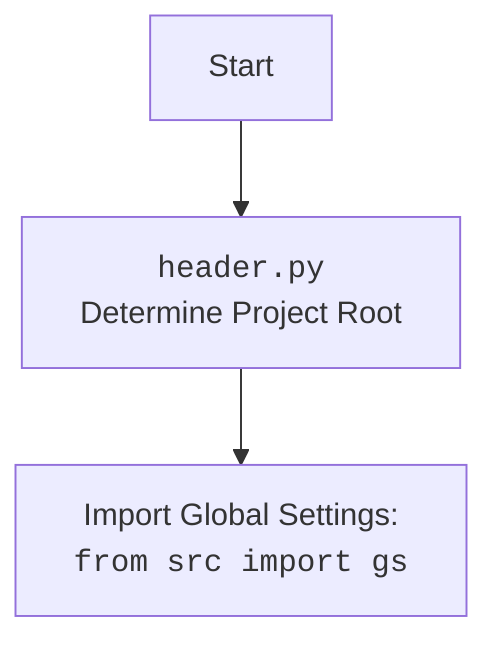

## АНАЛИЗ КОДА: `hypotez/src/goog/drive/drive.py`

### 1. <алгоритм>

**Блок-схема работы `GoogleDriveHandler` и примера его использования:**

```mermaid
flowchart TD
    A[Start] --> B{Создание экземпляра `GoogleDriveHandler`};
    B --> C{Инициализация:<br> `__init__(folder_name)`};
    C --> D{Вызов:<br> `_create_credentials()`};
    D --> E{Проверка:<br> Существует ли `token.pickle`?};
    E -- Да --> F{Загрузка `creds` из `token.pickle`};
    F --> G{Проверка:<br> `creds` валидны?};
    E -- Нет --> H{Создание нового `flow`};
    H --> I{Запуск локального сервера для аутентификации};
    I --> J{Сохранение `creds` в `token.pickle`};    
    G -- Да --> K{Возврат `creds`};
    G -- Нет --> H
    J --> K
    K --> L{Присвоение `self.creds`};
    L --> M{Вызов:<br> `upload_file(file_path)`};    
    M --> N{Имплементация загрузки файла на Google Drive};
    N --> O[End]

    style A fill:#f9f,stroke:#333,stroke-width:2px
    style O fill:#f9f,stroke:#333,stroke-width:2px
```

**Пример работы функции `main`:**

```mermaid
flowchart TD
    A[Start `main()`] --> B{Создание экземпляра `GoogleDriveHandler`};
     B --> C{Вызов:<br> `_create_credentials()`};
    C --> D{Проверка:<br> Существует ли `token.pickle`?};
    D -- Да --> E{Загрузка `creds` из `token.pickle`};
    E --> F{Проверка:<br> `creds` валидны?};
    D -- Нет --> G{Создание нового `flow`};
     G --> H{Запуск локального сервера для аутентификации};
    H --> I{Сохранение `creds` в `token.pickle`};
    F -- Да --> J{Возврат `creds`};
     F -- Нет --> G
    I --> J
    J --> K{Создание экземпляра `service` с помощью `build`};
    K --> L{Вызов:<br> `service.files().list()`};
    L --> M{Получение списка файлов};
    M --> N{Проверка:<br> `items` пуст?};
    N -- Да --> O{Вывод "No files found"};
    N -- Нет --> P{Вывод списка файлов};
    P --> Q[End `main()`]
    O --> Q
    
    style A fill:#f9f,stroke:#333,stroke-width:2px
    style Q fill:#f9f,stroke:#333,stroke-width:2px
```

### 2. <mermaid>

```mermaid
flowchart TD
    Start --> GoogleDriveHandlerInit[<code>GoogleDriveHandler</code><br>__init__(folder_name)];
    GoogleDriveHandlerInit --> CreateCredentials[<code>_create_credentials()</code>];
    CreateCredentials --> CheckTokenFile{Check for<br> <code>token.pickle</code>};
    CheckTokenFile -- Exists --> LoadCreds[Load <code>creds</code> from<br><code>token.pickle</code>];
    LoadCreds --> ValidateCreds{Validate<br><code>creds</code>};
    CheckTokenFile -- Not Exists --> CreateAuthFlow[Create<br><code>InstalledAppFlow</code>];
    ValidateCreds -- Valid --> ReturnCreds[Return<br><code>creds</code>];
    ValidateCreds -- Invalid --> RefreshCreds{Refresh<br><code>creds</code> or<br>Create new};
    RefreshCreds --> CreateAuthFlow
    CreateAuthFlow --> RunLocalServer[<code>run_local_server()</code><br>Auth flow];
     RunLocalServer --> SaveCreds[Save<br><code>creds</code> to<br><code>token.pickle</code>];
     SaveCreds --> ReturnCreds
     ReturnCreds --> AssignCreds[Assign <code>creds</code> to<br><code>self.creds</code>];

    AssignCreds --> UploadFileCall[Call <code>upload_file(file_path)</code>];
     UploadFileCall --> ImplementUpload[Implement file upload<br>logic to Google Drive API];

     StartMain --> CreateGoogleDriveHandler[<code>GoogleDriveHandler()</code> Instance];
    CreateGoogleDriveHandler --> CreateCredentialsFromMain[Call <code>_create_credentials()</code>];
    CreateCredentialsFromMain --> CheckTokenFileMain{Check for<br> <code>token.pickle</code>};
    CheckTokenFileMain -- Exists --> LoadCredsMain[Load <code>creds</code> from<br><code>token.pickle</code>];
    LoadCredsMain --> ValidateCredsMain{Validate<br><code>creds</code>};
    CheckTokenFileMain -- Not Exists --> CreateAuthFlowMain[Create<br><code>InstalledAppFlow</code>];
    ValidateCredsMain -- Valid --> ReturnCredsMain[Return<br><code>creds</code>];
    ValidateCredsMain -- Invalid --> RefreshCredsMain{Refresh<br><code>creds</code> or<br>Create new};
    RefreshCredsMain --> CreateAuthFlowMain
    CreateAuthFlowMain --> RunLocalServerMain[<code>run_local_server()</code><br>Auth flow];
     RunLocalServerMain --> SaveCredsMain[Save<br><code>creds</code> to<br><code>token.pickle</code>];
     SaveCredsMain --> ReturnCredsMain
      ReturnCredsMain --> BuildService[Create Google Drive <br><code>service</code> using <code>build()</code>];
     BuildService --> ListFilesCall[Call <code>service.files().list()</code>];
     ListFilesCall --> GetFileList[Get List of Files];
     GetFileList --> CheckFilesList{Check if List of Files <br> is empty};
     CheckFilesList -- True --> PrintNoFiles[Print "No Files found."];
     CheckFilesList -- False --> PrintFilesList[Print List of Files];

style Start fill:#f9f,stroke:#333,stroke-width:2px
style StartMain fill:#f9f,stroke:#333,stroke-width:2px
```



**Объяснение `mermaid` диаграммы:**

1.  **`GoogleDriveHandler` Flowchart:**
    *   `Start` - Начало процесса создания и использования `GoogleDriveHandler`.
    *   `GoogleDriveHandlerInit` - Инициализация класса `GoogleDriveHandler` через метод `__init__`, который принимает имя папки Google Drive (`folder_name`).
    *   `CreateCredentials` - Вызов метода `_create_credentials()`, который отвечает за получение или создание учетных данных Google Drive API.
    *   `CheckTokenFile` - Проверка наличия файла `token.pickle` для повторного использования учетных данных.
    *   `LoadCreds` - Загрузка учетных данных из файла `token.pickle`, если он существует.
    *   `ValidateCreds` - Проверка валидности загруженных учетных данных.
    *   `CreateAuthFlow` - Создание нового экземпляра `InstalledAppFlow` для аутентификации, если `token.pickle` не найден или учетные данные недействительны.
    *    `RefreshCreds` - Обновление учетных данных, если они истекли.
    *    `RunLocalServer` - Запуск локального сервера для проведения аутентификации пользователя через браузер.
    *    `SaveCreds` - Сохранение полученных учетных данных в файл `token.pickle` для будущего использования.
    *   `ReturnCreds` - Возврат объекта `creds` с валидными учетными данными.
    *    `AssignCreds` - Присвоение объекта `creds` к атрибуту `self.creds`.
    *   `UploadFileCall` - Вызов метода `upload_file(file_path)` для загрузки файла на Google Drive.
    *    `ImplementUpload` - Логика загрузки файла на Google Drive через API.

2. **`main` Flowchart:**
     *   `StartMain` - Начало выполнения функции `main()`.
    *   `CreateGoogleDriveHandler` - Создание экземпляра класса `GoogleDriveHandler`.
    *   `CreateCredentialsFromMain` - Вызов метода `_create_credentials()`.
     *   `CheckTokenFileMain` - Проверка наличия файла `token.pickle` для повторного использования учетных данных.
    *    `LoadCredsMain` - Загрузка учетных данных из файла `token.pickle`, если он существует.
    *    `ValidateCredsMain` - Проверка валидности загруженных учетных данных.
    *   `CreateAuthFlowMain` - Создание нового экземпляра `InstalledAppFlow` для аутентификации, если `token.pickle` не найден или учетные данные недействительны.
    *    `RefreshCredsMain` - Обновление учетных данных, если они истекли.
    *    `RunLocalServerMain` - Запуск локального сервера для проведения аутентификации пользователя через браузер.
    *    `SaveCredsMain` - Сохранение полученных учетных данных в файл `token.pickle` для будущего использования.
    *    `ReturnCredsMain` - Возврат объекта `creds` с валидными учетными данными.
   *    `BuildService` - Создание объекта `service` Google Drive API с помощью метода `build()` библиотеки `googleapiclient`.
    *   `ListFilesCall` - Вызов метода `service.files().list()` для получения списка файлов на Google Drive.
   *     `GetFileList` - Получение списка файлов.
   *     `CheckFilesList` - Проверка, является ли список файлов пустым.
   *     `PrintNoFiles` - Вывод сообщения "No files found." ,если список файлов пустой.
   *     `PrintFilesList` - Вывод списка файлов, если он не пустой.

3.  **`header.py` Flowchart:**
    *   `Start` - Начало выполнения `header.py`.
    *    `Header` - Определение корневой директории проекта.
    *  `import` - Импорт глобальных настроек проекта из модуля `src.gs`.

### 3. <объяснение>

**Импорты:**

*   `pickle`: Используется для сериализации и десериализации объектов Python (в данном случае, для сохранения и загрузки учетных данных Google API в файл `token.pickle`).
*   `os`: Предоставляет функции для взаимодействия с операционной системой (например, `os.path.exists` для проверки наличия файла).
*   `pathlib.Path`: Используется для представления путей к файлам и каталогам в виде объектов, что делает работу с ними более интуитивной.
*   `googleapiclient.discovery.build`: Используется для создания сервисного объекта Google Drive API.
*   `google_auth_httplib2.AuthorizedHttpTransport`: Предоставляет авторизованный HTTP-транспорт для API Google.
*   `google.auth.transport.requests.Request`: Используется для создания запроса для обновления токена доступа.
*   `google.oauth2.credentials.Credentials`: Используется для хранения учетных данных, полученных при аутентификации Google.
*   `google_auth_oauthlib.flow.InstalledAppFlow`: Используется для создания потока аутентификации для настольных приложений.
*   `header`: Локальный модуль, который, судя по всему, отвечает за определение корневой директории проекта.
*   `src.gs`: Глобальные настройки проекта, вероятно, содержащие важные пути и параметры.
*   `src.utils.printer.pprint`: Функция для форматированного вывода, используемая для отладки.
*   `src.logger.logger.logger`: Объект для логирования.

**Класс `GoogleDriveHandler`:**

*   **Роль:** Класс предназначен для инкапсуляции логики взаимодействия с Google Drive API. Он предоставляет методы для загрузки файлов на Google Drive.
*   **Атрибуты:**
    *   `folder_name`: Имя папки на Google Drive, в которую будут загружаться файлы.
    *   `creds`: Объект `Credentials`, содержащий учетные данные для доступа к Google Drive API.
*   **Методы:**
    *   `__init__(self, folder_name: str)`: Конструктор класса. Принимает имя папки Google Drive и инициализирует атрибуты, включая получение учетных данных через `_create_credentials()`.
    *   `_create_credentials(self)`: Приватный метод, отвечающий за получение или создание учетных данных. Он проверяет наличие файла `token.pickle`, загружает учетные данные из него, если файл существует, или создает новый поток аутентификации через `InstalledAppFlow`, если учетные данные отсутствуют или недействительны.
    *   `upload_file(self, file_path: Path)`: Метод для загрузки файла по указанному пути (`file_path`) в папку на Google Drive, указанную в `folder_name`. В текущей реализации логика загрузки файла не реализована (стоит заглушка `# Implement logic to upload...`).

**Функция `main`:**

*   **Роль:** Функция демонстрирует базовое использование Google Drive API.
*   **Логика:**
    1.  Создаёт экземпляр `GoogleDriveHandler`.
    2.  Вызывает метод `_create_credentials()` для получения учетных данных.
    3.  Создаёт объект `service` для взаимодействия с Drive API.
    4.  Вызывает метод `files().list()` для получения списка файлов.
    5.  Выводит список файлов на экран.

**Переменные:**

*   `creds`: Объект `Credentials`, хранящий учетные данные пользователя.
*   `service`: Объект для взаимодействия с Google Drive API.
*   `results`: Результат вызова `service.files().list()`, содержит список файлов на Google Drive.
*   `items`: Список файлов, полученных из результатов.
*   `file_path`: Объект `Path`, представляющий путь к файлу, который нужно загрузить.
*    `folder_name`: Имя папки на Google Drive.
*    `SCOPES`: Список областей доступа, которые запрашиваются у пользователя.

**Потенциальные ошибки и области для улучшения:**

1.  **Обработка ошибок:** В коде не реализована обработка ошибок, что может привести к неожиданному завершению программы при сбое (например, проблемы с сетью, неверные учетные данные, проблемы с API).
2.  **Логика `upload_file`:** Метод `upload_file` не имеет фактической реализации, что делает класс `GoogleDriveHandler` неполноценным. Необходимо добавить код для загрузки файла на Google Drive.
3.  **Переменная `creds_file`:** Путь к файлу с учетными данными прописан хардкодом (`gs.path.secrets  / 'hypo69-c32c8736ca62.json'`). Лучше перенести это значение в глобальные настройки или сделать его настраиваемым.
4.  **Безопасность:** Сохранение токена доступа в файле `token.pickle` не является наиболее безопасным методом, особенно если код используется в среде, где может быть несанкционированный доступ.
5. **Использование `pprint` и `logger`:** `pprint` используется для вывода списка файлов, а `logger` не используется. Следует применять `logger` для отладки и выводить список файлов через `logger.info()`.
6. **Устаревший код:** В начале кода есть несколько закомментированных строк, которые можно удалить.

**Взаимосвязи с другими частями проекта:**

*   `src.gs`: Используется для получения глобальных настроек, включая путь к файлу с учетными данными (`creds_file`).
*   `header`: Используется для определения корневой директории проекта.
*   `src.utils.printer`: Используется для вывода отладочной информации.
*  `src.logger.logger`: Используется для логирования.

**Рекомендации по улучшению:**

*   Добавить обработку ошибок.
*   Реализовать логику загрузки файла в методе `upload_file`.
*   Использовать более безопасные методы хранения учетных данных.
*   Использовать `logger` для вывода информации.
*   Перенести хардкод в настройки.
*   Удалить ненужные закомментированные строки.