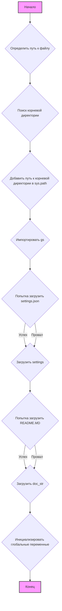

## Анализ кода `hypotez/src/goog/drive/header.py`

### <алгоритм>

1.  **Инициализация**:
    *   Устанавливается режим работы ``.
    *   Импортируются необходимые модули: `sys`, `json`, `Version` из `packaging.version`, и `Path` из `pathlib`.
2.  **`set_project_root`**:
    *   Функция `set_project_root` принимает на вход кортеж `marker_files` (по умолчанию `('pyproject.toml', 'requirements.txt', '.git')`).
    *   Определяется текущий путь к файлу и присваивается переменной `current_path`.
    *   Инициализируется переменная `__root__` значением `current_path`.
    *   Цикл проходит по текущему пути и его родительским каталогам.
        *   На каждом шаге проверяется, существует ли в текущем каталоге какой-либо из файлов-маркеров.
        *   Если хотя бы один файл-маркер найден, текущий каталог становится корневым (`__root__`) и цикл прерывается.
    *   Если корневой каталог `__root__` еще не добавлен в `sys.path`, он добавляется.
    *   Функция возвращает путь к корневому каталогу `__root__`.
    *   **Пример**: если `header.py` находится в `/home/user/project/src/goog/drive`, а файл `pyproject.toml` находится в `/home/user/project`, то функция вернет `/home/user/project`.
3.  **Определение корневого каталога**:
    *   Вызывается функция `set_project_root`, результат присваивается переменной `__root__`.
    *   Это обеспечивает доступ к корневой директории проекта, далее `__root__` используется как точка отсчета для других файлов проекта.
4.  **Импорт модуля `gs`**:
    *   Импортируется модуль `gs` из пакета `src`, используя корневой путь.
5.  **Чтение настроек из `settings.json`**:
    *   Пытаемся открыть файл `settings.json` (который, как предполагается, лежит в `src/settings.json`).
    *   Если открытие файла или загрузка JSON проходит успешно, данные загружаются в переменную `settings`.
    *   В случае возникновения исключения `FileNotFoundError` или `json.JSONDecodeError` выполнение программы продолжается (обрабатывается многоточием `...`).
6.  **Чтение документации из `README.MD`**:
    *   Пытаемся открыть файл `README.MD` (который, как предполагается, лежит в `src/README.MD`).
    *   Если открытие файла и чтение проходят успешно, содержимое файла загружается в переменную `doc_str`.
    *   В случае возникновения исключения `FileNotFoundError` или `json.JSONDecodeError` выполнение программы продолжается (обрабатывается многоточием `...`).
7.  **Инициализация переменных**:
    *   Инициализируются глобальные переменные проекта (если `settings` загружен) с значениями из `settings.json`: `__project_name__`, `__version__`, `__doc__`, `__details__`, `__author__`, `__copyright__` и `__cofee__` .
    *   Если `settings` не был загружен, используются значения по умолчанию.

### <mermaid>

**Разбор зависимостей в `mermaid` диаграмме:**

*   **`graph TD`**: Объявляет диаграмму как направленный граф.
*   **`A[Начало]`**: Начало процесса, инициализирует старт выполнения программы.
*   **`B{Определить путь к файлу}`**: Определяет абсолютный путь к текущему файлу `header.py`, используя `__file__` и `Path`.
*   **`C{Поиск корневой директории}`**: Ищет корневую директорию проекта, начиная с директории текущего файла, проверяя наличие файлов-маркеров `pyproject.toml`, `requirements.txt`, `.git`.
*   **`D{Добавить путь к корневой директории в sys.path}`**: Добавляет путь к корневой директории в `sys.path`, чтобы обеспечить возможность импорта модулей из этой директории.
*   **`E{Импортировать gs}`**: Импортирует модуль `gs` из пакета `src`.
*   **`F{Попытка загрузить settings.json}`**: Попытка загрузить настройки из файла `settings.json`. Если загрузка проходит успешно, данные сохраняются в переменной `settings`.
*   **`G{Загрузить settings}`**: Сохраняет загруженные настройки в переменную settings.
*   **`H{Попытка загрузить README.MD}`**: Попытка загрузить содержимое файла `README.MD` в переменную `doc_str`.
*   **`I{Загрузить doc_str}`**: Сохраняет загруженное содержимое в переменную `doc_str`.
*   **`J{Инициализировать глобальные переменные}`**: Инициализирует глобальные переменные проекта `__project_name__`, `__version__`, `__doc__`, `__details__`, `__author__`, `__copyright__` и `__cofee__` либо из файла `settings.json` либо со значениями по умолчанию, если файл не был найден или не был прочитан.
*   **`K[Конец]`**: Конец процесса, завершает выполнение программы.
*   **`style A fill:#f9f,stroke:#333,stroke-width:2px`**: Стиль для узла A (Начало) в диаграмме.
*    **`style K fill:#f9f,stroke:#333,stroke-width:2px`**: Стиль для узла K (Конец) в диаграмме.

### <объяснение>

**Импорты:**

*   `sys`: Используется для доступа к переменным и функциям, связанным с интерпретатором Python, в частности, для модификации `sys.path`.
*   `json`: Используется для работы с данными в формате JSON, в частности, для загрузки настроек из `settings.json`.
*   `packaging.version.Version`:  Используется для сравнения версий.
*   `pathlib.Path`: Используется для представления путей к файлам и каталогам в объектно-ориентированном стиле, упрощая манипуляции с файловой системой.
*   `src.gs`: Импортируется внутренний модуль `gs`, который вероятно содержит константы и пути, используемые в проекте.

**Функции:**

*   `set_project_root(marker_files: tuple = ('pyproject.toml', 'requirements.txt', '.git')) -> Path`:
    *   **Аргументы**:
        *   `marker_files` (tuple, optional): Кортеж с именами файлов или каталогов, которые используются для идентификации корневой директории. По умолчанию это `('pyproject.toml', 'requirements.txt', '.git')`.
    *   **Возвращаемое значение**:
        *   `Path`: Объект `Path`, представляющий путь к корневой директории проекта. Если корневая директория не найдена, возвращается директория, в которой находится скрипт.
    *   **Назначение**: Функция находит корневую директорию проекта, начиная с директории, в которой находится текущий файл. Она ищет каталоги, которые содержат один из файлов-маркеров. Это позволяет скрипту быть запущенным из любого подкаталога проекта, и при этом корректно находить файлы и модули проекта.
    *   **Примеры**:
        *   Если `header.py` находится в `/home/user/project/src/goog/drive`, а файл `pyproject.toml` находится в `/home/user/project`, то функция вернет `/home/user/project`.
        *   Если ни один из файлов-маркеров не найден, то функция вернет каталог где находится скрипт  `/home/user/project/src/goog/drive`

**Переменные:**

*   `MODE`: Глобальная переменная, определяющая режим работы скрипта (по умолчанию `dev`).
*   `__root__`: Переменная типа `Path`, содержащая путь к корневой директории проекта.
*   `settings`: Словарь (`dict`), содержащий загруженные настройки из файла `settings.json`.
*   `doc_str`: Строка (`str`), содержащая документацию проекта, загруженную из файла `README.MD`.
*   `__project_name__`, `__version__`, `__doc__`, `__details__`, `__author__`, `__copyright__`, `__cofee__`: Глобальные переменные проекта, которые получают значения из `settings.json`, либо значения по умолчанию, если `settings.json` не был загружен.

**Цепочка взаимосвязей:**

1.  **Определение корневой директории**: Функция `set_project_root` является отправной точкой для определения места расположения проекта на файловой системе. Она использует `pathlib` для работы с путями и `sys.path` для возможности импорта модулей из проекта.
2.  **Загрузка конфигурации**:  После определения корня проекта, из `settings.json` (который находится в папке `src` относительно корня) загружается конфигурация проекта. Эта конфигурация используется для установки переменных `__project_name__`, `__version__` и других параметров проекта.
3.  **Загрузка документации**: Загрузка содержимого файла `README.MD` в переменную `doc_str`.
4.  **Инициализация глобальных переменных**:  На основе загруженной конфигурации или значений по умолчанию происходит инициализация глобальных переменных. Эти переменные используются для настройки проекта и могут быть импортированы другими модулями проекта.
5.  **Импорт `src.gs`**:  Модуль `gs` из `src`, вероятно, содержит константы или функции, общие для проекта. Он импортируется с использованием корректно определенного корневого пути.

**Потенциальные ошибки и улучшения:**

*   **Обработка ошибок**: Обработка исключений `FileNotFoundError` и `json.JSONDecodeError` ограничивается `...`. Возможно, стоит добавить более информативное логирование или вывод сообщения об ошибке.
*   **Зависимость от файловой системы**: Функция `set_project_root` может не работать, если структура файлов проекта отличается от ожидаемой, например если отсутствуют маркеры (`pyproject.toml`, `requirements.txt`, `.git`). Это может быть улучшено, если добавить больше возможных вариантов маркеров или сделать их настраиваемыми.
*   **Отсутствие валидации `settings.json`**: Код не проверяет структуру загруженного из `settings.json` словаря. Это может привести к ошибкам, если структура файла не соответствует ожиданиям. Можно добавить валидацию данных.
*   **Отсутствие `__details__` в `settings.json`**: Переменная `__details__` инициализируется пустой строкой и не считывается из файла `settings.json`.
*   **Опечатка в `__copyright__`**: Возможно, в переменной `__copyright__` опечатка в имени (copyrihgnt вместо copyright).

**Общее**:

Этот файл `header.py` выполняет важную роль в проекте, предоставляя основные настройки, общую точку входа и гарантируя, что другие модули могут корректно работать, независимо от текущей рабочей директории. Он обеспечивает гибкость и упрощает настройку проекта.