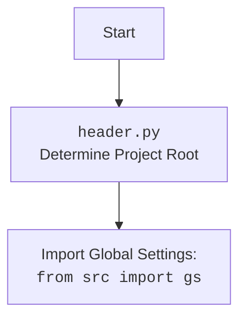

# Анализ кода `hypotez/src/goog/drive/header.py`

## 1. <алгоритм>

**Функция `set_project_root(marker_files)`:**

1.  **Начало**:
    *   Начинает выполнение с определения текущего пути к файлу `__file__`.
    *   Создается объект `Path` для текущей директории.
    *   Присваивает текущий путь к переменной `__root__`.
    *   Пример: Если скрипт находится в `/home/user/projects/hypotez/src/goog/drive/header.py`, то `__file__` будет `/home/user/projects/hypotez/src/goog/drive/header.py` и `current_path` станет `/home/user/projects/hypotez/src/goog/drive/`.

2.  **Цикл по родительским директориям**:
    *   Итерирует по текущей директории и её родительским директориям, используя `current_path.parents` для получения списка родительских директорий.
    *   Пример: Для `current_path = /home/user/projects/hypotez/src/goog/drive/` цикл пройдет по директориям `/home/user/projects/hypotez/src/goog/drive/`, `/home/user/projects/hypotez/src/goog/`, `/home/user/projects/hypotez/src/`, `/home/user/projects/hypotez/`, `/home/user/projects/` и `/home/user/`.

3.  **Проверка маркерных файлов**:
    *   Внутри цикла, для каждой директории (`parent`), проверяет наличие любого из `marker_files`.
    *   Использует `(parent / marker).exists()` для проверки существования файла или директории.
    *   Пример: Если `marker_files = ('__root__', '.git')`, то проверяется наличие файлов или директорий `/home/user/projects/hypotez/src/goog/drive/__root__`, `/home/user/projects/hypotez/src/goog/drive/.git` и так далее для каждой родительской директории.

4.  **Обновление `__root__`**:
    *   Если маркерный файл найден, переменная `__root__` обновляется на текущую родительскую директорию и цикл прерывается.
    *   Пример: Если `/home/user/projects/hypotez/.git` найден, то `__root__` станет `/home/user/projects/hypotez/`.

5.  **Добавление `__root__` в `sys.path`**:
    *   Проверяет, есть ли `__root__` в `sys.path`.
    *   Если нет, добавляет `__root__` в начало `sys.path` для импорта модулей из корневой директории.

6.  **Возврат `__root__`**:
    *   Возвращает `__root__` (объект `Path`).

**Загрузка настроек:**

1.  **Вызов `set_project_root()`**:
    *   Вызывается функция `set_project_root()` и результат присваивается переменной `__root__`.

2.  **Импорт `gs`**:
    *   Импортируется модуль `gs` из пакета `src`, используя `__root__` из предыдущего шага.
    *   Пример: Если `__root__` - `/home/user/projects/hypotez/`, то импорт будет работать из директории `/home/user/projects/hypotez/src`.

3.  **Чтение `settings.json`**:
    *   Открывается файл `settings.json` из директории `src` относительно корня проекта.
    *   Пытается загрузить JSON данные из файла в словарь `settings`.
    *   Обрабатывается исключение `FileNotFoundError` и `json.JSONDecodeError`, если файл не найден или неверный формат JSON.

4.  **Чтение `README.MD`**:
    *   Открывается файл `README.MD` из директории `src` относительно корня проекта.
    *   Пытается прочитать содержимое файла в строку `doc_str`.
    *   Обрабатывается исключение `FileNotFoundError` и `json.JSONDecodeError`, если файл не найден.

5.  **Определение переменных**:
    *   Из словаря `settings` (если он был загружен) устанавливаются значения для переменных `__project_name__`, `__version__`, `__author__`, `__copyright__`, `__cofee__`.
    *   `__doc__` устанавливается из `doc_str`, если `doc_str` не пусто.
    *   Если `settings` не был загружен, используются значения по умолчанию.

## 2. <mermaid>

```mermaid
flowchart TD
    Start[Начало] --> FindRoot[<code>set_project_root()</code><br>Поиск корня проекта];
    FindRoot --> CheckMarkerFiles{Проверка маркерных файлов: <br><code>__root__</code>, <code>.git</code>};
    CheckMarkerFiles -- Найдено --> SetRoot[Установка <code>__root__</code>];
    CheckMarkerFiles -- Не найдено --> NextParent[Переход к родительской директории];
    NextParent -- Есть родители --> CheckMarkerFiles;
    NextParent -- Нет родителей --> UseCurrentPath[Установка текущей директории как <code>__root__</code>];
    SetRoot --> AddToPath[Добавление <code>__root__</code> в <code>sys.path</code>];
    UseCurrentPath --> AddToPath;
    AddToPath --> ImportGS[Импорт настроек: <br><code>from src import gs</code>];
     ImportGS --> LoadSettings[Загрузка настроек из <code>settings.json</code>];
     LoadSettings -- Успешно --> LoadReadme[Загрузка документации из <code>README.MD</code>];
     LoadSettings -- Ошибка --> LoadReadme;
     LoadReadme --> DefineVars[Определение глобальных переменных: <br> <code>__project_name__</code>, <br><code>__version__</code>, <br><code>__doc__</code> ...];
     DefineVars --> End[Конец];
     
```



**Анализ зависимостей `mermaid`:**

1.  **`Start`**: Начало процесса.
2.  **`FindRoot`**: Вызывает функцию `set_project_root` для определения корня проекта.
3.  **`CheckMarkerFiles`**: Проверяет наличие маркерных файлов (`__root__`, `.git`) в текущей директории и ее родительских директориях.
4.  **`SetRoot`**: Устанавливает переменную `__root__` на найденную директорию с маркерными файлами.
5.  **`NextParent`**: Переход к следующей родительской директории для поиска.
6.  **`UseCurrentPath`**: Если маркерные файлы не найдены, устанавливает текущую директорию как корень проекта (`__root__`).
7.  **`AddToPath`**: Добавляет путь к корню проекта (`__root__`) в `sys.path`.
8.  **`ImportGS`**: Импортирует модуль `gs` из пакета `src`, используя `__root__`.
9. **`LoadSettings`**: Пытается загрузить настройки из файла `settings.json`.
10. **`LoadReadme`**: Пытается загрузить документацию из файла `README.MD`.
11. **`DefineVars`**: Определяет глобальные переменные, такие как `__project_name__`, `__version__`, `__doc__` и т.д.
12. **`End`**: Конец процесса.

**Объяснение `mermaid` flowchart:**

*   Диаграмма показывает процесс определения корня проекта, загрузки настроек и определения глобальных переменных.
*   Поток данных идет от `Start` к `End` через различные блоки, представляющие этапы процесса.
*   Зависимости показаны в виде стрелок, указывающих направление потока данных между блоками.
*   Каждый блок представляет собой определенный шаг в процессе и имеет описание.

## 3. <объяснение>

**Импорты:**

*   `sys`: Используется для доступа к системным переменным и функциям, в частности, для работы с `sys.path`.
*   `json`: Используется для работы с JSON данными, для загрузки данных из файла `settings.json`.
*   `packaging.version`: Используется для работы с версиями. В данном коде не используется.
*   `pathlib.Path`: Используется для работы с путями к файлам и директориям.

**Функция `set_project_root(marker_files)`:**

*   **Аргументы:**
    *   `marker_files`: Кортеж (tuple) с названиями файлов или директорий, которые идентифицируют корень проекта (по умолчанию `('__root__', '.git')`).
*   **Возвращает:**
    *   `Path`: Объект `Path`, представляющий путь к корню проекта. Если маркеры не найдены, возвращает путь, где расположен скрипт.
*   **Назначение:**
    *   Определяет корневую директорию проекта, перебирая родительские директории текущего файла в поиске маркерных файлов.
    *   Добавляет корневую директорию в `sys.path`, что позволяет импортировать модули из пакета `src`.
*   **Примеры:**
    *   Если `marker_files = ('__root__', '.git')` и файл `.git` находится в директории `/home/user/projects/hypotez/`, то функция вернет объект `Path('/home/user/projects/hypotez/')`.
    *   Если маркеры не найдены, и скрипт запущен в директории `/home/user/projects/hypotez/src/goog/drive/`, то функция вернет объект `Path('/home/user/projects/hypotez/src/goog/drive/')`.

**Переменные:**

*   `__root__`: Объект `Path`, хранящий путь к корневой директории проекта. Глобальная переменная, используемая для других частей кода.
*   `settings`: Словарь (dict), содержащий настройки проекта, загруженные из `settings.json`.
*   `doc_str`: Строка (str), содержащая документацию из файла `README.MD`.
*   `__project_name__`: Строка (str), содержащая имя проекта. По умолчанию `hypotez`.
*   `__version__`: Строка (str), содержащая версию проекта. По умолчанию пустая строка.
*   `__doc__`: Строка (str), содержащая документацию проекта.
*   `__details__`: Строка (str), не используется, пустая строка.
*   `__author__`: Строка (str), содержащая имя автора проекта. По умолчанию пустая строка.
*   `__copyright__`: Строка (str), содержащая информацию об авторских правах проекта. По умолчанию пустая строка.
*   `__cofee__`: Строка (str), содержащая призыв к поддержке разработчиков. По умолчанию ссылка на boosty.to.

**Взаимосвязи с другими частями проекта:**

*   **Использование `__root__`:** Переменная `__root__` используется для определения пути к корневой директории проекта и является основой для работы других модулей и пакетов. Она добавляется в `sys.path`, что позволяет импортировать модули из пакета `src`, как `from src import gs`.
*   **`gs`:** Модуль `gs` предположительно содержит общие настройки и пути к различным ресурсам проекта. Его импорт осуществляется через путь, сформированный `__root__`.
*   **`settings.json` и `README.MD`**: Эти файлы используются для загрузки конфигурации и документации проекта.

**Потенциальные ошибки или области для улучшения:**

*   **Обработка ошибок JSON**: Исключения при загрузке `settings.json` обрабатываются через `...`, что делает их невидимыми. Желательно использовать более подробную обработку ошибок с выводом информации в лог.
*   **Отсутствие проверки типа `settings`**:  Код предполагает, что если файл `settings.json` не найден или не является корректным JSON, то переменная `settings` останется `None`. В последующем коде могут возникнуть ошибки из-за попыток вызвать `get` у `None`.
*   **Неиспользуемый импорт:** Импорт `packaging.version` не используется в коде. Желательно удалить неиспользуемые импорты.
*   **Неиспользуемая переменная:** Переменная `__details__` не используется в коде, ее лучше удалить.
*   **Жестко заданные пути:** Пути к `settings.json` и `README.MD` жестко заданы, что может быть неудобным при изменении структуры проекта. Возможно, стоит использовать переменные из `gs`.

Этот подробный анализ предоставляет всестороннее понимание кода, его функциональности, зависимостей и потенциальных областей для улучшения.