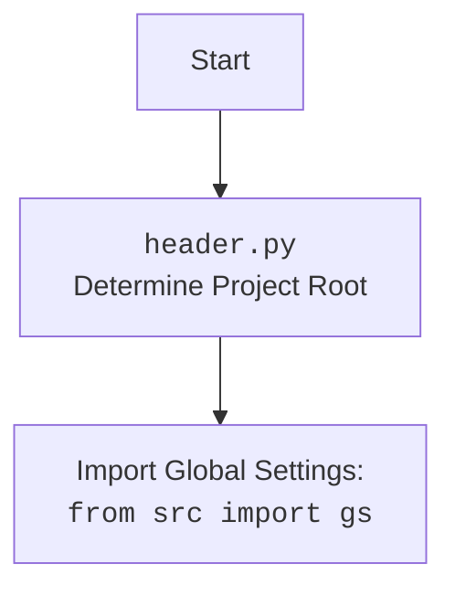

# Анализ кода `hypotez/src/goog/drive/header.py`

## <алгоритм>

1.  **`set_project_root(marker_files)`**:
    *   Начало: Функция принимает `marker_files` (кортеж строк - маркерных файлов) как аргумент.
    *   Инициализация: Определяем `current_path` как родительский каталог текущего файла.
    *   Объявляем переменную `__root__`, инициализируем её текущим каталогом.
    *   Поиск корня проекта:
        *   Проходим по текущему каталогу и его родительским каталогам.
        *   Проверяем, существует ли какой-либо маркерный файл в текущем каталоге.
        *   Если маркерный файл найден, устанавливаем `__root__` в родительский каталог и останавливаем поиск.
    *   Добавление в `sys.path`: Проверяем, находится ли `__root__` в `sys.path`. Если нет, добавляем его в начало списка путей поиска.
    *   Возврат: Возвращаем найденный `__root__` в виде объекта `Path`
2.  **Установка `__root__`**:
    *   Вызываем `set_project_root()` для определения корневого каталога проекта.
    *   Результат сохраняем в глобальную переменную `__root__`.
3.  **Загрузка настроек**:
    *   Инициализация `settings` как `None`.
    *   Пытаемся открыть `settings.json` из каталога `src`.
        *   Если файл существует, загружаем JSON в переменную `settings`.
        *   В случае ошибки `FileNotFoundError` или `json.JSONDecodeError`, оставляем `settings` как `None`.
4.  **Чтение документации**:
    *    Инициализация `doc_str` как `None`.
     *    Пытаемся открыть `README.MD` из каталога `src`.
         *   Если файл существует, читаем его содержимое в переменную `doc_str`.
          *  В случае ошибки `FileNotFoundError` или `json.JSONDecodeError`, оставляем `doc_str` как `None`.
5.  **Инициализация глобальных переменных**:
    *   Если `settings` не `None`, то берем значения из `settings`, иначе - значения по умолчанию.
    *   Инициализируем переменные проекта `__project_name__`, `__version__`, `__doc__`, `__details__`, `__author__`, `__copyright__`, и `__cofee__`.

## <mermaid>

```mermaid
flowchart TD
    Start(Начало) --> FindProjectRoot[set_project_root(): <br>Find Project Root];
    FindProjectRoot --> CheckMarkerFiles[Проверка маркерных файлов <br>(e.g. '__root__')];
    CheckMarkerFiles -- Marker Found --> SetRoot[Установить __root__];
    CheckMarkerFiles -- Marker Not Found --> MoveUp[Перейти к родительскому каталогу];
     MoveUp --> CheckMarkerFiles;
    SetRoot --> AddToSysPath[Добавить __root__ в sys.path];
    AddToSysPath --> ReturnRoot[Возврат __root__];
    ReturnRoot --> LoadSettings[Загрузить настройки из settings.json];
    LoadSettings -- File Exists --> ParseSettings[JSON.load()];
    LoadSettings -- File Not Found or JSON Error --> SetSettingsNone[settings = None];
    ParseSettings --> SetVariables[Инициализация глобальных переменных проекта];
    SetSettingsNone --> SetVariables;
    SetVariables --> LoadDoc[Чтение README.MD];
     LoadDoc -- File Exists --> ParseDoc[doc_str = settings_file.read()];
    LoadDoc -- File Not Found or JSON Error --> SetDocNone[doc_str = None];
    ParseDoc --> SetGlobalVariables[Инициализация глобальных переменных проекта];
    SetDocNone --> SetGlobalVariables;
    SetGlobalVariables --> End(Конец);
   
    classDef common fill:#f9f,stroke:#333,stroke-width:2px;
    class Start,End common;
    class FindProjectRoot,CheckMarkerFiles,SetRoot,MoveUp,AddToSysPath,ReturnRoot,LoadSettings,ParseSettings,SetSettingsNone,SetVariables common;
     class LoadDoc,ParseDoc,SetDocNone,SetGlobalVariables common;

```



### Анализ `mermaid` диаграммы

*   **`flowchart TD`**: Объявляет диаграмму как блок-схему с направлением сверху вниз.
*   **`Start`**, **`End`**: Начало и конец процесса.
*   **`FindProjectRoot`**: Функция `set_project_root`  для определения корневого каталога проекта.
*   **`CheckMarkerFiles`**: Проверка наличия маркерных файлов в текущем каталоге.
*   **`SetRoot`**: Установка корневой директории.
*    **`MoveUp`**: Переход к родительскому каталогу.
*   **`AddToSysPath`**: Добавление корневого каталога в `sys.path`.
*   **`ReturnRoot`**: Возвращение корневого каталога.
*   **`LoadSettings`**: Загрузка настроек из `settings.json`.
*   **`ParseSettings`**: Парсинг `settings.json` в словарь.
*   **`SetSettingsNone`**: Установка `settings` в `None`, в случае ошибки.
*    **`SetVariables`**: Инициализация глобальных переменных проекта.
*   **`LoadDoc`**: Загрузка документации из `README.MD`.
*   **`ParseDoc`**: Чтение файла `README.MD`.
*   **`SetDocNone`**: Установка `doc_str` в `None`, в случае ошибки.
*  **`SetGlobalVariables`**: Установка глобальных переменных
*   **`classDef common`**: Определяет общий стиль для блоков диаграммы.
*   **Зависимости**: `header.py` не зависит от других модулей, кроме стандартных библиотек и  `src.gs` для определения путей.

## <объяснение>

### Импорты

*   **`import sys`**: Используется для работы с системными параметрами, включая `sys.path` для добавления пути к проекту.
*   **`import json`**: Используется для работы с JSON-файлами, в частности, для загрузки настроек из `settings.json`.
*   **`from packaging.version import Version`**: Импортирует класс `Version` из пакета `packaging` для работы с версиями (не используется в данном коде).
*   **`from pathlib import Path`**: Используется для работы с файловыми путями в объектно-ориентированном стиле.
*   **`from src import gs`**: Импортирует модуль `gs` из пакета `src`, который содержит глобальные настройки и пути проекта.

### Классы

В данном коде классы не используются.

### Функции

*   **`set_project_root(marker_files: tuple = ('__root__')) -> Path`**:
    *   **Аргументы**: `marker_files` (кортеж строк) – маркерные файлы или каталоги для определения корня проекта, по умолчанию `('__root__')`.
    *   **Возвращаемое значение**: `Path` - путь к корневому каталогу проекта или текущий каталог.
    *   **Назначение**: Определяет корневой каталог проекта, и добавляет его в `sys.path`.
    *   **Примеры**:
        *   Если в текущей или родительской директории есть файл с именем `__root__`, то возвращается эта директория.
        *   Если файла `__root__` нет нигде, возвращается директория, где находится файл `header.py`.

### Переменные

*   **`__root__` (Path)**: Глобальная переменная, содержащая путь к корню проекта.
*   **`settings` (dict)**: Содержит настройки, загруженные из файла `settings.json`.
*   **`doc_str` (str)**: Содержит текст, загруженный из `README.MD`.
*   **`__project_name__` (str)**: Название проекта (из `settings.json` или по умолчанию `hypotez`).
*   **`__version__` (str)**: Версия проекта (из `settings.json` или пустая строка).
*   **`__doc__` (str)**: Документация проекта (из `README.MD` или пустая строка).
*   **`__details__` (str)**: Не используется.
*    **`__author__` (str)**: Автор проекта (из `settings.json` или пустая строка).
*    **`__copyright__` (str)**: Авторские права (из `settings.json` или пустая строка).
*    **`__cofee__` (str)**: Ссылка на boosty (из `settings.json` или по умолчанию).

### Потенциальные ошибки и улучшения

*   **Обработка ошибок**: Обработка `FileNotFoundError` и `json.JSONDecodeError` минимальна. Можно добавить логирование или вывод предупреждений.
*   **Поиск `README.MD`**: Код предполагает наличие `README.MD` в `src`, что может быть не всегда верно. Можно сделать поиск более гибким.
*   **`__details__`**: Глобальная переменная `__details__` объявлена, но не используется. Можно ее удалить.
*   **Использование `packaging.version`**: Импорт `Version` из `packaging.version` отсутствует в коде. Можно его удалить.

### Взаимосвязи с другими частями проекта

*   **`src.gs`**: Используется для доступа к путям проекта, что указывает на наличие модуля `gs` в пакете `src`, определяющего глобальные настройки.
*   **`settings.json`**: Предполагает наличие файла с настройками проекта в `src/settings.json`.
*  **`README.MD`**: Предполагает наличие файла с документацией проекта в `src/README.MD`.

Этот код представляет собой важную часть проекта, устанавливая корневой каталог, загружая настройки и документацию, и предоставляя глобальные переменные, необходимые для работы других модулей.