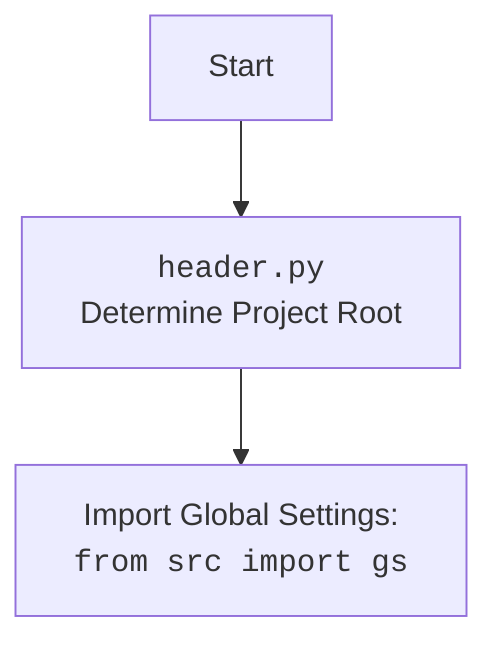

## Анализ кода `header.py`

### 1. <алгоритм>

**Блок-схема:**

1.  **`set_project_root(marker_files)`:**
    *   Начало: Получает путь к директории, в которой находится скрипт (`__file__`).
        *   Пример: Если скрипт находится в `/home/user/project/src/goog/drive/header.py`, то начальный путь будет `/home/user/project/src/goog/drive`.
    *   Инициализация: Устанавливает `__root__` равным текущему пути.
    *   Цикл:
        *   Перебирает текущую директорию и все ее родительские директории.
            *   Пример: Если текущий путь `/home/user/project/src/goog/drive`, то будут рассмотрены `/home/user/project/src/goog/drive`, `/home/user/project/src/goog`, `/home/user/project/src`, `/home/user/project`, `/home/user`, `/home`, `/`.
        *   Проверяет, существует ли в текущей директории какой-либо из файлов/директорий, указанных в `marker_files`.
            *   Пример: Если `marker_files = ('__root__', '.git')` и в директории `/home/user/project` есть файл `.git`, то условие выполнится.
        *   Если маркер найден:
            *   `__root__` устанавливается в эту директорию.
            *   Цикл прерывается.
    *   Проверка: Если `__root__` нет в `sys.path`, то добавляем его.
    *   Возврат: Возвращает путь к корневой директории проекта (`__root__`).
2.  **`__root__ = set_project_root()`:**
    *   Вызов: Вызывает `set_project_root()`, сохраняя результат (корневой путь проекта) в глобальной переменной `__root__`.
3.  **Импорт `from src import gs`:**
    *   Импортирует модуль `gs` из пакета `src`, предполагая, что `__root__` уже добавлен в `sys.path`.
4.  **Чтение `settings.json`:**
    *   Попытка: Читает файл `settings.json` из `src` директории, используя `gs.path.root`.
        *   Пример: Если `__root__` это `/home/user/project`, то путь будет `/home/user/project/src/settings.json`.
    *   Обработка: Загружает JSON данные в словарь `settings`.
    *   Исключение: Обрабатывает `FileNotFoundError` и `json.JSONDecodeError` (если файл не найден или JSON не валиден) и присваивает `settings=None`.
5. **Чтение `README.MD`**
     * Попытка: Читает файл `README.MD` из `src` директории, используя `gs.path.root`.
        *  Пример: Если `__root__` это `/home/user/project`, то путь будет `/home/user/project/src/README.MD`.
    *  Обработка: Читает содержимое файла в строку `doc_str`.
    * Исключение: Обрабатывает `FileNotFoundError` и `json.JSONDecodeError` (если файл не найден или ошибка чтения) и присваивает `doc_str = None`.
6.  **Инициализация глобальных переменных:**
    *   `__project_name__`: Получает имя проекта из `settings` или устанавливает значение по умолчанию 'hypotez'.
    *   `__version__`: Получает версию проекта из `settings` или устанавливает пустую строку.
    *    `__doc__`: Получает описание проекта из `doc_str` или устанавливает пустую строку.
    *   `__details__`: Инициализирует пустую строку.
    *   `__author__`: Получает автора проекта из `settings` или устанавливает пустую строку.
    *   `__copyright__`: Получает информацию об авторских правах из `settings` или устанавливает пустую строку.
    *   `__cofee__`: Получает ссылку на поддержку разработчика из `settings` или устанавливает значение по умолчанию.

### 2. <mermaid>

```mermaid
flowchart TD
    Start[Start] --> FindRoot[set_project_root(marker_files)]
    FindRoot --> CheckMarkers{Any marker file exists?}
    CheckMarkers -- Yes --> SetRoot[__root__ = parent]
    SetRoot --> BreakLoop[Break loop]
    CheckMarkers -- No --> NextParent[Check next parent dir]
    NextParent --> CheckMarkers
    BreakLoop --> AddToSysPath{if __root__ not in sys.path}
    AddToSysPath -- Yes --> InsertPath[sys.path.insert(0,str(__root__))]
    InsertPath --> ReturnRoot[return __root__]
    AddToSysPath -- No --> ReturnRoot
    ReturnRoot --> ImportGS[import gs]
    ImportGS --> ReadSettings{Read settings.json}
    ReadSettings --> LoadSettings{Load settings into dict}
    LoadSettings --> ReadDoc{Read README.MD}
    ReadDoc --> LoadDoc{Load doc into str}
    LoadDoc --> GetProjectName[Get project_name]
    GetProjectName --> GetVersion[Get version]
    GetVersion --> GetDoc[Get doc]
    GetDoc --> GetDetails[Init details]
    GetDetails --> GetAuthor[Get author]
    GetAuthor --> GetCopyright[Get copyright]
     GetCopyright --> GetCofee[Get cofee]
    
    
    
    classDef mainClass fill:#f9f,stroke:#333,stroke-width:2px
    class Start,FindRoot,ReturnRoot,ImportGS,ReadSettings,LoadSettings,ReadDoc,LoadDoc,GetProjectName,GetVersion,GetDoc,GetDetails,GetAuthor,GetCopyright,GetCofee mainClass
    classDef condition fill:#ccf,stroke:#333,stroke-width:2px
     class CheckMarkers, AddToSysPath condition
     classDef loop fill:#afa,stroke:#333,stroke-width:2px
    class NextParent loop
    classDef action fill:#ffc,stroke:#333,stroke-width:2px
    class SetRoot, BreakLoop, InsertPath action


```

**Объяснение `mermaid`:**

1.  **`Start`**: Начало выполнения скрипта.
2.  **`FindRoot[set_project_root(marker_files)]`**: Вызов функции `set_project_root` для определения корневой директории проекта.
3.  **`CheckMarkers{Any marker file exists?}`**: Проверка наличия маркерных файлов в текущей директории.
4.  **`SetRoot[__root__ = parent]`**: Установка корневой директории, если маркерный файл найден.
5.  **`BreakLoop[Break loop]`**: Прерывание цикла поиска корневой директории.
6.  **`NextParent[Check next parent dir]`**: Переход к следующей родительской директории для проверки.
7. **`AddToSysPath{if __root__ not in sys.path}`**: Проверка, добавлена ли корневая директория в `sys.path`.
8.  **`InsertPath[sys.path.insert(0,str(__root__))]`**: Добавление корневой директории в `sys.path`.
9.  **`ReturnRoot[return __root__]`**: Возврат корневой директории.
10. **`ImportGS[import gs]`**: Импорт модуля `gs` из пакета `src`.
11. **`ReadSettings{Read settings.json}`**: Чтение файла `settings.json`.
12. **`LoadSettings{Load settings into dict}`**: Загрузка данных из `settings.json` в словарь.
13. **`ReadDoc{Read README.MD}`**: Чтение файла `README.MD`.
14. **`LoadDoc{Load doc into str}`**: Загрузка данных из `README.MD` в строку.
15. **`GetProjectName[Get project_name]`**: Получение имени проекта.
16. **`GetVersion[Get version]`**: Получение версии проекта.
17.  **`GetDoc[Get doc]`**: Получение описания проекта.
18. **`GetDetails[Init details]`**: Инициализация детализации проекта.
19. **`GetAuthor[Get author]`**: Получение автора проекта.
20. **`GetCopyright[Get copyright]`**: Получение информации об авторских правах.
21. **`GetCofee[Get cofee]`**: Получение ссылки на поддержку разработчика.

**Импортируемые зависимости:**

*   `sys`: Используется для доступа к переменным и функциям, связанным с интерпретатором Python, включая `sys.path` для работы с путями поиска модулей.
*   `json`: Используется для работы с JSON-данными, в частности, для загрузки данных из файла `settings.json`.
*   `packaging.version.Version`: Используется для работы с версиями пакетов, но в данном коде напрямую не используется. Однако, вероятно, импортируется для возможного использования в дальнейшем, хотя сейчас не применяется.
*   `pathlib.Path`: Используется для удобной работы с файловыми путями в объектно-ориентированном стиле.

**Диаграмма для `header.py`:**



### 3. <объяснение>

**Импорты:**

*   `sys`: Этот модуль предоставляет доступ к некоторым переменным и функциям, взаимодействующим с интерпретатором Python. В данном коде `sys.path` используется для изменения путей поиска модулей, чтобы можно было импортировать модули из корневой директории проекта.
*   `json`: Модуль для работы с данными в формате JSON. Он используется для загрузки конфигурационных данных из файла `settings.json`.
*   `packaging.version.Version`: Модуль для работы с версиями пакетов. В коде импортируется, но явно не используется. Возможно, задел на будущее.
*   `pathlib.Path`: Модуль для работы с файловыми путями в объектно-ориентированном стиле. Позволяет создавать, перемещать, проверять существование путей.

**Классы:**

В данном коде нет определения классов.

**Функции:**

*   `set_project_root(marker_files: tuple = ('__root__', '.git')) -> Path`:
    *   **Аргументы:**
        *   `marker_files`: Кортеж строк, представляющих имена файлов или директорий, которые указывают на корневую директорию проекта. По умолчанию `('__root__', '.git')`.
    *   **Возвращаемое значение:**
        *   Объект `Path`, представляющий путь к корневой директории проекта. Если корневая директория не найдена, то возвращается директория, где находится файл `header.py`.
    *   **Назначение:**
        *   Функция определяет корневую директорию проекта, начиная с текущей директории и поднимаясь вверх по дереву каталогов. Она ищет файлы или папки, указанные в `marker_files`. После нахождения первого соответствия функция прекращает поиск. Если маркер не найден, то корневой директорией устанавливается директория, где находится `header.py`.

**Переменные:**

*   `__root__`:
    *   Тип: `Path`
    *   Использование: Глобальная переменная, хранящая путь к корневой директории проекта. Инициализируется путем вызова `set_project_root()`.
*   `settings`:
    *   Тип: `dict` или `None`
    *   Использование: Глобальная переменная, хранящая настройки проекта, загруженные из файла `settings.json`. Если файл не найден или не является валидным JSON, то значение будет `None`.
*   `doc_str`:
    *    Тип: `str` или `None`
    *   Использование: Глобальная переменная, хранит данные из файла `README.MD`. Если файл не найден, то значение будет `None`.
*  `__project_name__`:
    *   Тип: `str`
    *   Использование: Глобальная переменная, хранит имя проекта. Получает значение из `settings` или устанавливается значение по умолчанию 'hypotez'.
*   `__version__`:
    *   Тип: `str`
    *   Использование: Глобальная переменная, хранит версию проекта. Получает значение из `settings` или устанавливается пустую строку.
*    `__doc__`:
    *   Тип: `str`
    *   Использование: Глобальная переменная, хранит описание проекта. Получает значение из `doc_str` или устанавливается пустую строку.
*   `__details__`:
    *    Тип: `str`
    *    Использование: Глобальная переменная, хранит детали проекта. Инициализируется пустой строкой.
*   `__author__`:
     *   Тип: `str`
     *   Использование: Глобальная переменная, хранит автора проекта. Получает значение из `settings` или устанавливается пустую строку.
*   `__copyright__`:
    *   Тип: `str`
    *   Использование: Глобальная переменная, хранит информацию об авторских правах. Получает значение из `settings` или устанавливается пустую строку.
*   `__cofee__`:
    *   Тип: `str`
    *   Использование: Глобальная переменная, хранит ссылку на поддержку разработчика. Получает значение из `settings` или устанавливается значение по умолчанию.

**Потенциальные ошибки и области для улучшения:**

*   **Отсутствие обработки исключений при чтении настроек:**
    Хотя код обрабатывает `FileNotFoundError` и `json.JSONDecodeError`, при возникновении других исключений во время открытия или чтения файла, скрипт может упасть. Желательно добавить более общую обработку исключений (например, `except Exception as e:`) и логировать ошибки.
*   **Жестко заданный путь к файлам:** Пути к `settings.json` и `README.MD` жестко заданы в коде. Было бы лучше использовать `pathlib.Path` для построения путей, что сделает код более гибким.
*   **Отсутствие валидации данных из `settings.json`:** Код не проверяет типы и наличие необходимых полей в файле настроек. Это может привести к ошибкам, если файл будет некорректным. Необходимо добавить валидацию.
*   **Обработка ошибки загрузки настроек:** Если `settings.json` не удается загрузить, то многие глобальные переменные будут иметь значения по умолчанию. Следует предусмотреть логику для этого случая, возможно, предупреждение или использование значений по умолчанию.
*   **Зависимость от `src.gs`:** Скрипт зависит от модуля `gs` из пакета `src`. Необходимо обеспечить его наличие и правильную настройку путей.

**Цепочка взаимосвязей:**

1.  `header.py` определяет корневую директорию проекта (`__root__`) и добавляет ее в `sys.path`.
2.  `header.py` загружает настройки из файла `settings.json` и  данные из `README.MD`, используя `__root__` для построения пути.
3.  `header.py` импортирует `gs` из пакета `src`, который, вероятно, использует `__root__` и `settings`.
4.  Глобальные переменные (`__project_name__`, `__version__`, `__author__`, и др.) используются в других частях проекта для получения метаинформации.
5.  Другие модули проекта импортируют `header` или его переменные, используя `__root__` для доступа к ресурсам проекта и получая метаданные.