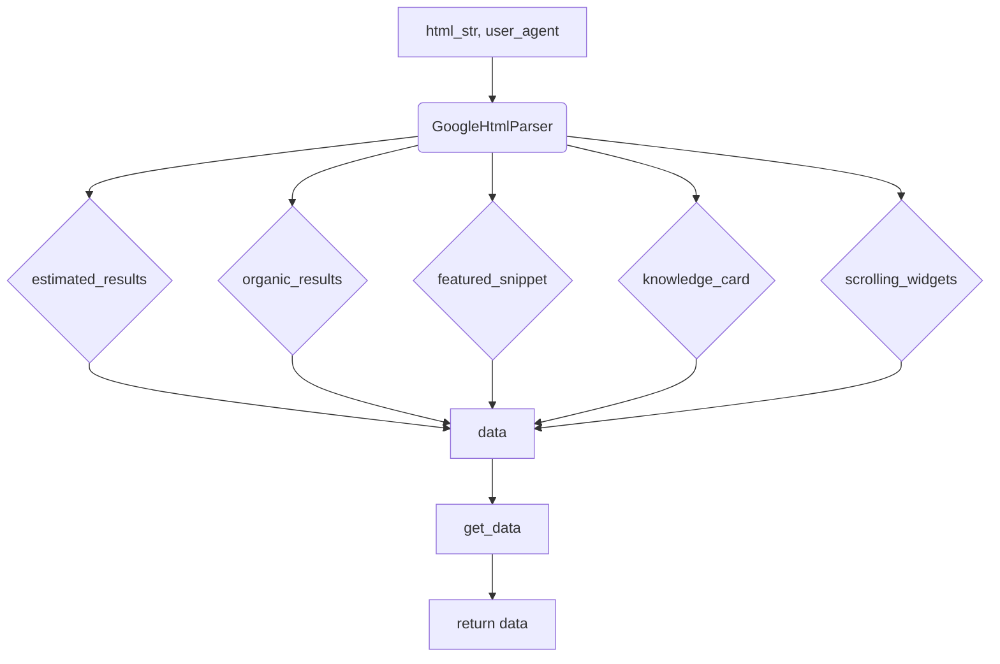

# <input code>

```python
## \file hypotez/src/goog/google_search.py
# -*- coding: utf-8 -*-
#! venv/Scripts/python.exe
#! venv/bin/python/python3.12

"""
.. module: src.goog 
	:platform: Windows, Unix
	:synopsis:

"""
MODE = 'dev'


from lxml import html


class GoogleHtmlParser:
    """Класс для парсинга HTML с Google Search.

    Парсит HTML страницы поисковой выдачи Google и преобразует её в словарь.
    Работает как с мобильной, так и с десктопной версией HTML.

    Атрибуты:
        tree (html.Element): Дерево документа, полученное через html.fromstring().
        user_agent (str): User agent, использованный для получения HTML Google Search.
    """

    def __init__(self, html_str: str, user_agent: str = 'desktop') -> None:
        """Инициализация парсера.

        Создает дерево документа из строки HTML.

        Args:
            html_str (str): HTML Google Search в виде строки.
            user_agent (str): User agent для получения HTML. Может быть 'mobile' или 'desktop'.

        Returns:
            None
        """
        self.tree = html.fromstring(html_str)
        if user_agent in ['mobile', 'desktop']:
            self.user_agent = user_agent
        else:
            self.user_agent = 'desktop'

    # ... (остальной код)
```

# <algorithm>

**Шаг 1:** Инициализация `GoogleHtmlParser`.
  - Вход: `html_str` (HTML код страницы), `user_agent` (строка, 'mobile' или 'desktop')
  - Выход: Экземпляр класса `GoogleHtmlParser` с атрибутами `tree` (дерево HTML) и `user_agent`.
  - Пример:  `parser = GoogleHtmlParser("<html>...</html>", "desktop")`

**Шаг 2:** Получение количества результатов.
  - Вход: `self` (экземпляр `GoogleHtmlParser`)
  - Выход: `int` (количество результатов поиска).
  - Пример: `estimated_results = parser._get_estimated_results()`

**Шаг 3:** Получение органических результатов.
  - Вход: `self` (экземпляр `GoogleHtmlParser`)
  - Выход: `list` (список словарей с результатами).
  - Пример: `organic_results = parser._get_organic()`

**Шаг 4:** Получение featured snippet.
  - Вход: `self` (экземпляр `GoogleHtmlParser`)
  - Выход: `dict` (словарь с данными featured snippet) или `None`.
  - Пример: `featured_snippet = parser._get_featured_snippet()`

**Шаг 5:** Получение карточки знаний.
  - Вход: `self` (экземпляр `GoogleHtmlParser`)
  - Выход: `dict` (словарь с данными карточки знаний) или `None`.
  - Пример: `knowledge_card = parser._get_knowledge_card()`


**Шаг 6:** Получение данных из скроллируемых виджетов.
  - Вход: `self` (экземпляр `GoogleHtmlParser`)
  - Выход: `list` (список словарей с данными из виджетов).
  - Пример: `scrolling_widgets = parser._get_scrolling_sections()`

**Шаг 7:** Составление итогового словаря данных.
  - Вход:  `self` (экземпляр `GoogleHtmlParser`), `user_agent`
  - Выход: `dict` (словарь данных).
  - Пример: `data = parser.get_data()`.


# <mermaid>



**Объяснение диаграммы:**

- `html_str` и `user_agent` - входные данные.
- `GoogleHtmlParser` - инициализирует парсер и содержит методы для извлечения данных.
- `estimated_results`, `organic_results`, `featured_snippet`, `knowledge_card`, `scrolling_widgets` - методы для извлечения соответствующих данных из HTML.
- `data` - итоговый словарь, собранный из результатов извлечения.
- `get_data` - собирает данные и формирует словарь.
- `return data` - возвращает готовый словарь с данными.


# <explanation>

**Импорты:**

- `from lxml import html`: Импортирует модуль `html` из библиотеки `lxml`, который используется для парсинга HTML.  `lxml` - это специализированная библиотека для работы с XML и HTML, она обеспечивает более быструю и мощную обработку, чем стандартный модуль `html.parser`. Связь с `src` - это импорт из внешнего пакета.

**Классы:**

- `GoogleHtmlParser`: Этот класс предназначен для парсинга HTML кода полученного с Google поиска и извлечения необходимой информации. Атрибуты (`tree`, `user_agent`) хранят дерево HTML и тип пользовательского агента (для десктопной или мобильной версии). Методы (`__init__`, `_clean`, `_normalize_dict_key`, `_get_estimated_results`, `_get_organic`, `_get_featured_snippet`, `_get_knowledge_card`, `_get_scrolling_sections`, `get_data`) реализуют разные функциональности по извлечению информации.

**Функции:**

- `__init__`: Инициализирует класс, принимая HTML-код и тип user-agent.
- `_clean`: Очищает строку от лишних пробелов и символов.
- `_normalize_dict_key`: Нормализует строку для использования в качестве ключа словаря (замена пробелов на подчеркивания, убирает двоеточия, приводит к нижнему регистру).
- `_get_estimated_results`: Получает число результатов поиска из HTML страницы.
- `_get_organic`: Получает список органических результатов поиска.
- `_get_featured_snippet`: Получает данные о featured snippet.
- `_get_knowledge_card`: Получает данные о карточке знаний.
- `_get_scrolling_sections`: Извлекает данные из скроллируемых виджетов (например, список новостей).
- `get_data`: Объединяет результаты работы всех других методов и возвращает итоговый словарь.

**Переменные:**

- `MODE`:  Переменная, скорее всего, определяет режим работы (например, 'dev' - для разработки, 'prod' - для производства).
- `self.tree`: Хранит дерево HTML.
- `self.user_agent`: Хранит информацию о типе user-agent (например, 'desktop' или 'mobile').

**Возможные ошибки и улучшения:**

- **Обработка ошибок:** Код может не обрабатывать ситуации, когда данных на странице нет (например, пустой `estimated_el`).  Добавление проверок на длину списков и возможных исключений повысило бы надежность.
- **Универсальность:** Методы `_get_...`  могут быть улучшены, чтобы обрабатывать различные вариации структуры HTML.  В современных структурах могут быть разные вариации HTML.
- **Прозрачность:** Код мог бы быть более понятным и удобочитаемым.

**Связь с другими частями проекта:**

Код извлекает информацию из Google Search.  Для использования этих данных, необходим код, который будет вызывать `GoogleHtmlParser` и обрабатывать полученные результаты.

**Общие замечания:**

Код хорошо структурирован, с использованием `lxml` для парсинга.  Добавление обработки ошибок и более гибких методов для работы с различными структурами HTML  повысило бы эффективность и надежность кода.