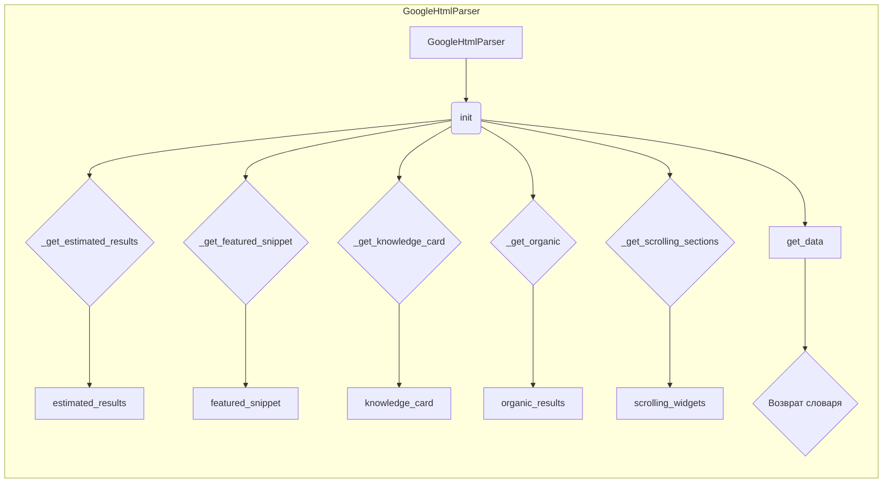

```MD
# Анализ кода GoogleSearchParser

## <input code>

```python
# -*- coding: utf-8 -*-
#! venv/Scripts/python.exe
#! venv/bin/python/python3.12

"""
.. module: src.goog
	:platform: Windows, Unix
	:synopsis:
"""
MODE = 'dev'


from lxml import html


class GoogleHtmlParser:
    """Класс для парсинга HTML с Google Search.

    Парсит HTML страницы поисковой выдачи Google и преобразует её в словарь.
    Работает как с мобильной, так и с десктопной версией HTML.

    Атрибуты:
        tree (html.Element): Дерево документа, полученное через html.fromstring().
        user_agent (str): User agent, использованный для получения HTML Google Search.
    """

    def __init__(self, html_str: str, user_agent: str = 'desktop') -> None:
        """Инициализация парсера.

        Создает дерево документа из строки HTML.

        Args:
            html_str (str): HTML Google Search в виде строки.
            user_agent (str): User agent для получения HTML. Может быть 'mobile' или 'desktop'.

        Returns:
            None
        """
        self.tree = html.fromstring(html_str)
        if user_agent in ['mobile', 'desktop']:
            self.user_agent = user_agent
        else:
            self.user_agent = 'desktop'

    # ... (остальной код)
```

## <algorithm>

**Блок-схема:**

```mermaid
graph TD
    A[Инициализация GoogleHtmlParser(html_str, user_agent)] --> B{Проверка user_agent};
    B -- 'mobile' or 'desktop' --> C[Создание дерева html.fromstring()];
    B -- иначе --> C;
    C --> D[Установка self.tree и self.user_agent];
    D --> E[Получение данных];
    E --> F[Возврат словаря data];
    subgraph Получение данных
        F1[estimated_results] --> F1';
        F2[featured_snippet] --> F2';
        F3[knowledge_card] --> F3';
        F4[organic_results] --> F4';
        F5[scrolling_widgets] --> F5';
        F1' --> F;
        F2' --> F;
        F3' --> F;
        F4' --> F;
        F5' --> F;
    end
```

**Пример:**

Пользователь предоставляет HTML-код страницы Google Search и указывает `user_agent = 'desktop'`.
1. Создается объект `GoogleHtmlParser`.
2. Проверяется корректность `user_agent`.
3. Создается дерево `html` из переданной строки `html_str`.
4. Получаются все необходимые данные (estimated_results, featured_snippet, knowledge_card, organic_results, scrolling_widgets).
5. Данные собираются в словарь `data`
6. Возвращается `data`


## <mermaid>




## <explanation>

**Импорты:**

- `from lxml import html`:  Импортирует модуль `html` из библиотеки `lxml`.  `lxml` - это мощная библиотека для обработки XML и HTML. Она используется для парсинга HTML-кода страницы Google.

**Классы:**

- `GoogleHtmlParser`:  Представляет класс для парсинга HTML-страниц Google.  Он содержит методы для извлечения различных элементов данных с страницы, таких как количество результатов, featured snippet, карточки знаний, органические результаты и результаты из скроллируемых виджетов.


**Функции:**

- `__init__(self, html_str: str, user_agent: str = 'desktop')`:  Конструктор класса. Принимает HTML-код страницы и необязательный `user_agent` ('desktop' или 'mobile') и создает дерево элемента `lxml` из переданного `html_str`.  `user_agent` определяет, какая часть страницы будет обработана.  
- `_clean(self, content: str) -> str`: Очищает строку от лишних пробелов и символов.
- `_normalize_dict_key(self, content: str) -> str`: Приводит строку к виду, подходящему для ключа словаря (замена пробелов на подчеркивания, удаление двоеточий, нижний регистр).
- `_get_estimated_results(self) -> int`: Возвращает количество результатов поиска с Google.
- `_get_organic(self) -> list`: Возвращает список словарей с органическими результатами.  В каждом словаре содержатся `url`, `title`, `snippet` и `rich_snippet` для каждого результата.
- `_get_featured_snippet(self) -> dict | None`: Возвращает словарь с `featured snippet` или `None`, если он отсутствует.
- `_get_knowledge_card(self) -> dict | None`: Возвращает словарь с данными о карточке знаний или `None`.
- `_get_scrolling_sections(self) -> list`: Возвращает данные из скроллируемых виджетов.
- `get_data(self) -> dict`:  Основной метод для получения данных со страницы поиска.  Собирает данные из других методов и возвращает словарь, содержащий все извлечённые данные.

**Переменные:**

- `MODE`:  Переменная, которая вероятно используется для настройки режима работы программы. В данном примере используется 'dev'.
- `self.tree`:  Дерево HTML-документа, полученное из `html_str`.
- `self.user_agent`:  Устанавливает тип пользователя (может быть 'mobile' или 'desktop').

**Возможные ошибки и улучшения:**

- Отсутствие проверки корректности входных данных (html_str).  Нужно убедиться, что `html_str` является валидным HTML-кодом.
- Отсутствие обработки исключений. Если `xpath` не найдет элемент, может произойти исключение. Необходимо добавить обработку исключений.
- Потенциальная нестабильность: Структура HTML-страниц Google может меняться.  В этом случае код может потребовать модификаций для корректной работы.  Добавление гибких механизмов обработки различных структур HTML-страниц Google может повысить устойчивость.
- Полезно было бы добавить логирование для отслеживания прогресса.

**Взаимосвязи с другими частями проекта:**

Код `GoogleHtmlParser` в `hypotez/src/goog` скорее всего используется в других частях проекта `hypotez` для получения и обработки данных поисковых результатов Google.  Для более глубокого анализа необходимо рассмотреть контекст использования этого класса в других модулях.