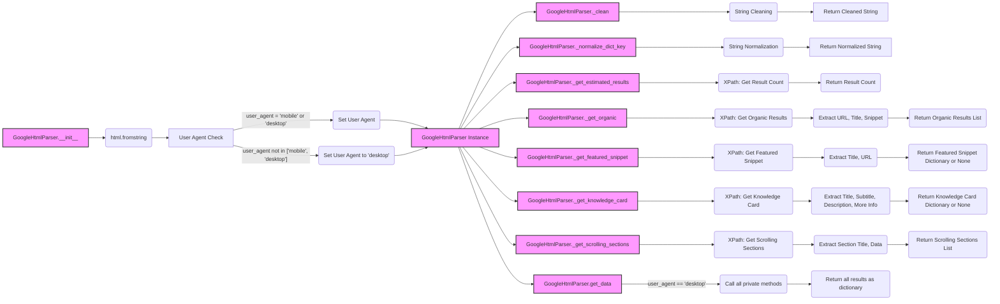

## <алгоритм>

1.  **Инициализация `GoogleHtmlParser`**:
    *   Принимает на вход HTML-код страницы поиска Google (`html_str`) и тип пользовательского агента (`user_agent`, по умолчанию 'desktop').
    *   Преобразует HTML-код в дерево элементов (`self.tree`) с помощью `html.fromstring()`.
    *   Устанавливает атрибут `user_agent` в 'mobile' или 'desktop' (по умолчанию).
    *   *Пример*: `parser = GoogleHtmlParser(html_code, 'mobile')`

2.  **Очистка текста `_clean(content)`**:
    *   Принимает на вход строку `content`.
    *   Удаляет начальные и конечные пробелы (`strip()`).
    *   Заменяет множественные пробелы на одиночные.
    *   Возвращает очищенную строку.
    *   *Пример*: `_clean("   hello  world  ")` вернет `"hello world"`

3.  **Нормализация ключа словаря `_normalize_dict_key(content)`**:
    *   Принимает строку `content`.
    *   Заменяет пробелы на подчеркивания.
    *   Удаляет двоеточия.
    *   Приводит строку к нижнему регистру.
    *   Удаляет подчеркивания в начале и конце строки.
    *   Возвращает нормализованную строку.
    *   *Пример*: `_normalize_dict_key("  Some Key: Value ")` вернет `"some_key_value"`

4.  **Получение количества результатов `_get_estimated_results()`**:
    *   Ищет элемент, содержащий общее количество результатов, с помощью XPath (`'//*[@id="result-stats"]/text()'`).
    *   Извлекает число из текста и возвращает его в виде целого числа.
    *   *Пример*: Если найдена строка "About 1,234,567 results", вернет `1234567`.

5.  **Получение органических результатов `_get_organic()`**:
    *   Ищет блоки с органическими результатами с помощью XPath (`'//div[@class="g"]'`).
    *   Для каждого результата извлекает URL, заголовок и сниппет (включая rich snippet) используя XPath запросы.
    *   Формирует словарь с ключами `url`, `title`, `snippet` и `rich_snippet` для каждого результата.
    *   Возвращает список словарей.
     *   *Пример*: `[{'url': 'https://example.com', 'title': 'Example', 'snippet': 'Description', 'rich_snippet': 'Rich Description'}, ...]`

6.  **Получение featured snippet `_get_featured_snippet()`**:
    *   Ищет блок featured snippet с помощью XPath (`'//div[contains(@class, "kp-blk")]'`).
    *   Извлекает заголовок и URL.
    *   Возвращает словарь с ключами `title` и `url` или `None`, если не найден.
      *   *Пример*: `{'title': 'Featured Snippet Title', 'url': 'https://featured.example.com'}`

7.  **Получение карточки знаний `_get_knowledge_card()`**:
    *   Ищет блок карточки знаний с помощью XPath (`'//div[contains(@class, "kp-wholepage")]'`).
    *   Извлекает заголовок, подзаголовок, описание и дополнительную информацию.
    *   Формирует словарь с ключами `title`, `subtitle`, `description`, `more_info`.
    *   Возвращает словарь или `None`, если не найдена.
      *   *Пример*: `{'title': 'Knowledge Card Title', 'subtitle': 'Subtitle', 'description': 'Description', 'more_info': [{'key1': 'value1'}, {'key2': 'value2'}]}`

8.  **Получение скроллируемых секций `_get_scrolling_sections()`**:
    *   Ищет скроллируемые секции с помощью XPath (`'//g-section-with-header'`).
    *   Для каждой секции извлекает заголовок и данные (заголовок и URL).
    *   Формирует список словарей с ключами `section_title` и `section_data`.
    *   Возвращает список словарей.
     *   *Пример*: `[{'section_title': 'Top Stories', 'section_data': [{'title': 'Story Title', 'url': 'https://story.example.com'}, ...]}, ...]`

9.  **Получение всех данных `get_data()`**:
    *   Определяет, какой пользовательский агент (mobile/desktop).
    *   Вызывает соответствующие методы для извлечения данных:
        *   Для desktop: `_get_estimated_results()`, `_get_featured_snippet()`, `_get_knowledge_card()`, `_get_organic()`, `_get_scrolling_sections()`.
    *   Формирует общий словарь с собранными данными.
    *   Возвращает словарь со всеми данными.
    *   *Пример*: `{'estimated_results': 1234567, 'featured_snippet': {'title': '...', 'url': '...'}, 'knowledge_card': {'title': '...', 'subtitle': '...', 'description': '...', 'more_info': [...]}, 'organic_results': [{'url': '...', 'title': '...', 'snippet': '...', 'rich_snippet': '...'}, ...], 'scrolling_widgets': [{'section_title': '...', 'section_data': [{'title': '...', 'url': '...'}, ...]}, ...]}`

## <mermaid>

**Описание диаграммы `mermaid`**:

*   `A[GoogleHtmlParser.\_\_init\_\_]`: Начальный узел, представляющий конструктор класса `GoogleHtmlParser`.
*   `B(html.fromstring)`: Функция для преобразования HTML-строки в дерево элементов.
*   `C[User Agent Check]`: Проверка `user_agent` на 'mobile' или 'desktop'.
*   `D(Set User Agent)`: Установка значения user agent если он правильный.
*  `E(Set User Agent to 'desktop')`: Установка user agent на default значение.
*   `F[GoogleHtmlParser Instance]`: Представляет созданный экземпляр класса.
*   `G[GoogleHtmlParser._clean]`: Метод для очистки строки от лишних пробелов.
*   `H(String Cleaning)`: Процесс очистки строки.
*    `I[Return Cleaned String]`: Возвращает очищенную строку.
*   `J[GoogleHtmlParser._normalize_dict_key]`: Метод для нормализации строки для ключей словаря.
*   `K(String Normalization)`: Процесс нормализации строки.
*   `L[Return Normalized String]`: Возвращает нормализованную строку.
*   `M[GoogleHtmlParser._get_estimated_results]`: Метод для получения количества результатов.
*   `N(XPath: Get Result Count)`: Извлечение количества результатов с помощью XPath.
*    `O(Return Result Count)`: Возвращает количество результатов.
*   `P[GoogleHtmlParser._get_organic]`: Метод для получения органических результатов.
*   `Q(XPath: Get Organic Results)`: Извлечение органических результатов с помощью XPath.
*   `R(Extract URL, Title, Snippet)`: Извлечение URL, заголовка и сниппета из результатов.
*   `S(Return Organic Results List)`: Возвращает список органических результатов.
*   `T[GoogleHtmlParser._get_featured_snippet]`: Метод для получения featured snippet.
*   `U(XPath: Get Featured Snippet)`: Извлечение featured snippet с помощью XPath.
*    `V(Extract Title, URL)`: Извлечение заголовка и URL из featured snippet.
*   `W(Return Featured Snippet Dictionary or None)`: Возвращает словарь featured snippet или None.
*   `X[GoogleHtmlParser._get_knowledge_card]`: Метод для получения карточки знаний.
*  `Y(XPath: Get Knowledge Card)`: Извлечение карточки знаний с помощью XPath.
* `Z(Extract Title, Subtitle, Description, More Info)`: Извлечение данных из карточки знаний.
* `AA(Return Knowledge Card Dictionary or None)`: Возвращает словарь карточки знаний или None.
*   `BB[GoogleHtmlParser._get_scrolling_sections]`: Метод для получения скроллируемых секций.
*   `CC(XPath: Get Scrolling Sections)`: Извлечение скроллируемых секций с помощью XPath.
* `DD(Extract Section Title, Data)`: Извлечение данных из скроллируемых секций.
* `EE(Return Scrolling Sections List)`: Возвращает список скроллируемых секций.
*   `FF[GoogleHtmlParser.get_data]`: Метод для получения всех данных.
*   `GG(Call all private methods)`: Вызов всех частных методов для сбора данных.
*    `HH(Return all results as dictionary)`: Возвращает общий словарь со всеми результатами.

## <объяснение>

**Импорты**:

*   `from lxml import html`: Импортирует модуль `html` из библиотеки `lxml`, используемый для парсинга HTML. `lxml` является сторонней библиотекой, устанавливается с помощью pip, и она является более быстрой и более гибкой чем стандартная библиотека для парсинга html.

**Класс `GoogleHtmlParser`**:

*   **Роль**: Парсит HTML-код страницы поисковой выдачи Google и извлекает из него данные (количество результатов, органические результаты, featured snippet, карточка знаний, и т.д.).
*   **Атрибуты**:
    *   `tree (html.Element)`: Дерево элементов HTML, полученное с помощью `html.fromstring()`.
    *   `user_agent (str)`: Тип пользовательского агента ('mobile' или 'desktop').
*   **Методы**:
    *   `__init__(self, html_str: str, user_agent: str = 'desktop') -> None`: Конструктор класса, инициализирует дерево HTML и устанавливает user agent.
    *   `_clean(self, content: str) -> str`: Очищает строку от лишних пробелов.
    *   `_normalize_dict_key(self, content: str) -> str`: Нормализует строку для использования в качестве ключа словаря.
    *    `_get_estimated_results(self) -> int`: Извлекает количество результатов поиска.
    *    `_get_organic(self) -> list`: Извлекает органические результаты.
    *   `_get_featured_snippet(self) -> dict | None`: Извлекает featured snippet.
    *   `_get_knowledge_card(self) -> dict | None`: Извлекает карточку знаний.
    *   `_get_scrolling_sections(self) -> list`: Извлекает данные из скроллируемых виджетов.
    *   `get_data(self) -> dict`: Собирает все данные и возвращает в виде словаря.

**Функции**:

*   `_clean(self, content: str) -> str`:
    *   **Аргументы**: `content` (строка для очистки).
    *   **Возвращаемое значение**: Очищенная строка.
    *   **Назначение**: Удаляет начальные и конечные пробелы, заменяет множественные пробелы на одинарные.
    *   **Пример**: `_clean("  hello   world  ")` вернет `"hello world"`
*   `_normalize_dict_key(self, content: str) -> str`:
    *   **Аргументы**: `content` (строка для нормализации).
    *   **Возвращаемое значение**: Нормализованная строка.
    *   **Назначение**: Заменяет пробелы на `_`, удаляет двоеточия, приводит к нижнему регистру.
    *   **Пример**: `_normalize_dict_key("  Some Key: Value ")` вернет `"some_key_value"`
*   `_get_estimated_results(self) -> int`:
    *   **Аргументы**: Нет.
    *   **Возвращаемое значение**: Целое число (количество результатов).
    *   **Назначение**: Извлекает и возвращает количество найденных результатов.
    *   **Пример**: Вернет `1234567` из строки "About 1,234,567 results".
*   `_get_organic(self) -> list`:
    *   **Аргументы**: Нет.
    *   **Возвращаемое значение**: Список словарей с органическими результатами.
    *   **Назначение**: Извлекает и возвращает список органических результатов.
    *   **Пример**: `[{'url': 'https://example.com', 'title': 'Example', 'snippet': 'Description', 'rich_snippet': 'Rich Description'}, ...]`
*   `_get_featured_snippet(self) -> dict | None`:
    *   **Аргументы**: Нет.
    *   **Возвращаемое значение**: Словарь с заголовком и URL featured snippet или `None`.
    *   **Назначение**: Извлекает и возвращает featured snippet, если он есть.
    *   **Пример**: `{'title': 'Featured Snippet Title', 'url': 'https://featured.example.com'}`
*   `_get_knowledge_card(self) -> dict | None`:
    *   **Аргументы**: Нет.
    *   **Возвращаемое значение**: Словарь с данными карточки знаний или `None`.
    *   **Назначение**: Извлекает и возвращает карточку знаний, если она есть.
    *   **Пример**: `{'title': 'Knowledge Card Title', 'subtitle': 'Subtitle', 'description': 'Description', 'more_info': [{'key1': 'value1'}, {'key2': 'value2'}]}`
*   `_get_scrolling_sections(self) -> list`:
    *   **Аргументы**: Нет.
    *   **Возвращаемое значение**: Список словарей с данными из скроллируемых виджетов.
    *   **Назначение**: Извлекает данные из виджетов (например, "Top Stories").
    *  **Пример**: `[{'section_title': 'Top Stories', 'section_data': [{'title': 'Story Title', 'url': 'https://story.example.com'}, ...]}, ...]`
*   `get_data(self) -> dict`:
    *   **Аргументы**: Нет.
    *   **Возвращаемое значение**: Словарь со всеми данными.
    *   **Назначение**: Собирает и возвращает все данные со страницы.
    *   **Пример**: `{'estimated_results': 1234567, 'featured_snippet': {'title': '...', 'url': '...'}, 'knowledge_card': {'title': '...', 'subtitle': '...', 'description': '...', 'more_info': [...]}, 'organic_results': [{'url': '...', 'title': '...', 'snippet': '...', 'rich_snippet': '...'}, ...], 'scrolling_widgets': [{'section_title': '...', 'section_data': [{'title': '...', 'url': '...'}, ...]}, ...]}`

**Переменные**:

*   `MODE`: Глобальная переменная, определяющая режим работы (по умолчанию 'dev').
*   `self.tree`: Дерево HTML-элементов, полученное после парсинга.
*   `self.user_agent`: Тип пользовательского агента ('mobile' или 'desktop').
*   Локальные переменные внутри методов используются для промежуточного хранения данных, например `estimated_results`, `organic`, `fs`, `kc_el`, `sections`, `data`.

**Потенциальные ошибки и области для улучшения**:

*   **Зависимость от структуры HTML Google**: Код сильно зависит от HTML-структуры страниц Google Search. Любое изменение в HTML может привести к неработоспособности парсера.
*   **Обработка ошибок**: Недостаточная обработка ошибок, если какие-либо элементы не найдены, могут возникать исключения.
*   **Отсутствие обработки mobile версии**: Присутствует обработка `desktop` версии.
*  **Производительность**: XPath запросы могут быть не оптимальными.
*   **Масштабируемость**: Код не рассчитан на обработку больших объемов HTML-данных одновременно.

**Взаимосвязь с другими частями проекта**:

*   Данный модуль `google_search.py` находится в директории `hypotez/src/goog`, что указывает на его принадлежность к функциональности работы с Google.
*   Он является частью проекта `hypotez`, который, вероятно, занимается анализом или обработкой поисковых данных.
*   Результаты работы данного парсера могут использоваться в других модулях проекта для дальнейшей обработки или анализа.

**Цепочка взаимосвязей**:
1.  HTML-код поисковой выдачи Google (полученный, например, через `requests`) поступает в конструктор `GoogleHtmlParser`.
2.  `GoogleHtmlParser` обрабатывает HTML-код, извлекая необходимые данные.
3.  Результаты парсинга используются для анализа или отображения в других модулях проекта.