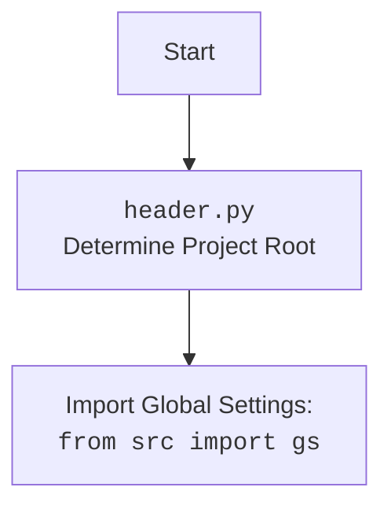

## <алгоритм>

1.  **Начало:**
    - Программа начинается с вызова функции `main()`, если скрипт запущен напрямую (`if __name__ == "__main__":`).

2.  **`main()` Функция:**
    - Запрашивает у пользователя ввод текста для перевода.
        - *Пример:* Пользователь вводит "Привет мир".
    - Запрашивает у пользователя код исходного языка (оставляется пустым для автоматического определения).
        - *Пример:* Пользователь вводит "ru".
    - Запрашивает у пользователя код целевого языка.
        - *Пример:* Пользователь вводит "en".
    - Вызывает функцию `translate()` с введенными данными.
    - Выводит переведенный текст на экран.
        - *Пример:* Вывод "Hello world".

3.  **`translate(text, locale_in, locale_out)` Функция:**
    - Создает экземпляр `Translator` из библиотеки `googletrans`.
    - **Проверка `locale_in`:**
        - Если `locale_in` не предоставлен (пустая строка):
            - Вызывает функцию `detect(text)` из библиотеки `langdetect` для автоматического определения языка текста.
                - *Пример:* `detect("Привет мир")` возвращает "ru".
            - Логирует в logger информацию об авто-определенном языке.
                - *Пример:* "Auto-detected input language: ru".
    - **Перевод:**
        - Вызывает метод `translate()` экземпляра `Translator` для перевода текста из языка `locale_in` в `locale_out`.
            - *Пример:* `translator.translate("Привет мир", src="ru", dest="en")`
        - Возвращает переведенный текст (`result.text`).
            - *Пример:* "Hello world"
    - **Обработка исключений:**
        - Если возникает ошибка (например, при переводе или определении языка), то:
            - Логирует ошибку в logger.
            - Возвращает пустую строку "".

## <mermaid>

```mermaid
flowchart TD
    Start[Start] --> MainFunctionCall[Call <code>main()</code>]
    
    MainFunctionCall --> InputText[Get Input Text from User]
    InputText --> InputSourceLanguage[Get Source Language Code from User (Optional)]
    InputSourceLanguage --> InputTargetLanguage[Get Target Language Code from User]
    InputTargetLanguage --> TranslateCall[Call <code>translate(text, locale_in, locale_out)</code>]
    
    TranslateCall --> CreateTranslator[Create <code>Translator</code> object]
    CreateTranslator --> CheckLocaleIn[Check if <code>locale_in</code> is provided]

    CheckLocaleIn -- locale_in is not provided --> DetectLanguage[Auto-detect language using <code>detect(text)</code>]
    DetectLanguage --> LogAutoDetectedLanguage[Log auto-detected language]
    LogAutoDetectedLanguage --> PerformTranslation[Perform <code>translate</code> API call]

    CheckLocaleIn -- locale_in is provided --> PerformTranslation
    PerformTranslation --> ReturnTranslatedText[Return translated text]

    ReturnTranslatedText --> OutputTranslatedText[Print translated text]

    OutputTranslatedText --> End[End]

    classDef classA fill:#f9f,stroke:#333,stroke-width:2px
    class Start,End classA
```



## <объяснение>

**Импорты:**

-   `from googletrans import Translator`: Импортирует класс `Translator` из библиотеки `googletrans`, который используется для создания объекта-переводчика.
-   `from langdetect import detect`: Импортирует функцию `detect` из библиотеки `langdetect`, которая используется для автоматического определения языка текста.
-   `from src.logger.logger import logger`: Импортирует объект `logger` из модуля `logger` внутри пакета `src`. Это используется для логирования сообщений об ошибках и информации о процессе перевода.

**Функции:**

-   `translate(text: str, locale_in: str = None, locale_out: str = 'EN') -> str`:
    -   **Аргументы:**
        -   `text`: `str` - Текст, который необходимо перевести.
        -   `locale_in`: `str` (опционально) - Код языка исходного текста (например, "ru" для русского). Если не указан, язык определяется автоматически.
        -   `locale_out`: `str` (опционально) - Код языка, на который нужно перевести текст (по умолчанию "EN" для английского).
    -   **Возвращает:** `str` - Переведенный текст, или пустую строку, если произошла ошибка.
    -   **Назначение:**
        -   Создает экземпляр `Translator`.
        -   Определяет язык исходного текста, если он не был указан (`locale_in`).
        -   Выполняет перевод текста.
        -   Обрабатывает исключения, возникающие при переводе.
-   `main()`:
    -   **Аргументы:** Отсутствуют
    -   **Возвращает:** Ничего
    -   **Назначение:**
        -   Запрашивает ввод текста, исходного языка (необязательно) и целевого языка у пользователя.
        -   Вызывает функцию `translate` для перевода текста.
        -   Выводит на экран переведенный текст.

**Переменные:**

-   `translator`: Экземпляр класса `Translator` из библиотеки `googletrans`. Используется для выполнения перевода.
-   `text`: Текст для перевода, полученный от пользователя или как аргумент функции `translate`.
-   `locale_in`: Код языка исходного текста, полученный от пользователя или автоматически определенный.
-   `locale_out`: Код языка, на который необходимо перевести текст, полученный от пользователя или имеет значение по умолчанию "EN".
-   `result`: Объект результата перевода, возвращенный методом `translate()` объекта `Translator`.
-   `translated_text`: Переведенный текст, полученный из `result.text`.

**Взаимосвязь с другими частями проекта:**

-   Импорт `from src.logger.logger import logger` показывает связь с модулем логирования, расположенным в `src/logger/logger.py`. Это позволяет отслеживать процесс перевода и регистрировать ошибки.

**Потенциальные ошибки и области для улучшения:**

1.  **Обработка неверных кодов языков:** Код не проверяет валидность введенных пользователем кодов языков. Если пользователь введет неправильный код, программа, скорее всего, выдаст ошибку. Можно улучшить, добавив проверку на корректность кода языка (например, с помощью словаря допустимых кодов).
2.  **Обработка сетевых ошибок:** При использовании `googletrans` могут возникать сетевые ошибки. Желательно добавить более подробную обработку этих ошибок, например, с возможностью повторной отправки запроса.
3.  **Ограниченность автоматического определения языка:** `langdetect` может иногда ошибаться в определении языка. Пользователю следует дать возможность явно указать язык, если автоматическое определение неверно.
4.  **Зависимость от внешних библиотек:** Код сильно зависит от библиотек `googletrans` и `langdetect`. Возможны проблемы, если эти библиотеки перестанут поддерживаться или изменят свой API. Необходимо предусмотреть возможность замены этих библиотек, если это потребуется.
5.  **Отсутствие асинхронности:** Код является синхронным, что может привести к задержкам при переводе больших текстов. Можно улучшить, добавив асинхронное выполнение перевода.
6.  **Нет проверок на пустой текст:** Если пользователь введет пустую строку, программа, скорее всего, выдаст ошибку, так как `langdetect` не сможет определить язык пустого текста. Нужно добавить проверку на пустой текст.