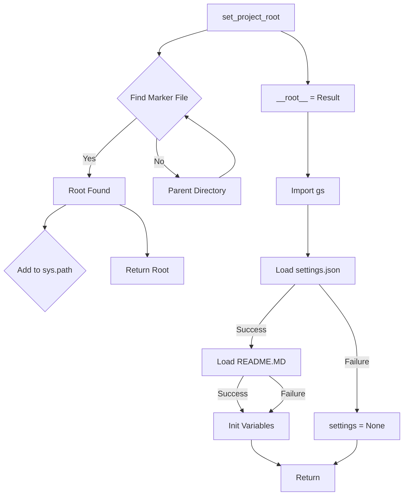

# <input code>

```python
## \file hypotez/src/goog/gtranslater/header.py
# -*- coding: utf-8 -*-\
#! venv/Scripts/python.exe
#! venv/bin/python/python3.12

"""
.. module: src.goog.gtranslater 
	:platform: Windows, Unix
	:synopsis:

"""
MODE = 'dev'

"""
	:platform: Windows, Unix
	:synopsis:

"""


"""
	:platform: Windows, Unix
	:synopsis:

"""


"""
  :platform: Windows, Unix

"""
"""
  :platform: Windows, Unix
  :platform: Windows, Unix
  :synopsis:
"""MODE = 'dev'
  
""" module: src.goog.gtranslater """

import sys
import json
from packaging.version import Version

from pathlib import Path
def set_project_root(marker_files=('pyproject.toml', 'requirements.txt', '.git')) -> Path:
    """
    Finds the root directory of the project starting from the current file's directory,
    searching upwards and stopping at the first directory containing any of the marker files.

    Args:
        marker_files (tuple): Filenames or directory names to identify the project root.
    
    Returns:
        Path: Path to the root directory if found, otherwise the directory where the script is located.
    """
    __root__:Path
    current_path:Path = Path(__file__).resolve().parent
    __root__ = current_path
    for parent in [current_path] + list(current_path.parents):
        if any((parent / marker).exists() for marker in marker_files):
            __root__ = parent
            break
    if __root__ not in sys.path:
        sys.path.insert(0, str(__root__))
    return __root__


# Get the root directory of the project
__root__ = set_project_root()
"""__root__ (Path): Path to the root directory of the project"""

from src import gs

settings:dict = None
try:
    with open(gs.path.root / 'src' /  'settings.json', 'r') as settings_file:
        settings = json.load(settings_file)
except (FileNotFoundError, json.JSONDecodeError):
    ...

doc_str:str = None
try:
    with open(gs.path.root / 'src' /  'README.MD', 'r') as settings_file:
        doc_str = settings_file.read()
except (FileNotFoundError, json.JSONDecodeError):
    ...


__project_name__ = settings.get("project_name", 'hypotez') if settings  else 'hypotez'
__version__: str = settings.get("version", '')  if settings  else ''
__doc__: str = doc_str if doc_str else ''
__details__: str = ''
__author__: str = settings.get("author", '')  if settings  else ''
__copyright__: str = settings.get("copyrihgnt", '')  if settings  else ''
__cofee__: str = settings.get("cofee", "Treat the developer to a cup of coffee for boosting enthusiasm in development: https://boosty.to/hypo69")  if settings  else "Treat the developer to a cup of coffee for boosting enthusiasm in development: https://boosty.to/hypo69"
```

# <algorithm>

**Шаг 1:** Модуль `set_project_root` ищет корневой каталог проекта.
   - Он принимает кортеж `marker_files`, содержащий имена файлов (и папок), указывающие на корень проекта.
   - Он начинает поиск с текущей директории.
   - Он итеративно поднимается вверх по дереву директорий.
   - Если в текущей директории существует какой-либо из файлов `marker_files`, то это — корень проекта.
   - Если корень найден, он добавляется в `sys.path`.
   - Если корень не найден, возвращается текущая директория.

**Пример:** Если текущий файл находится в `/home/user/project/goog/gtranslater/header.py`, и файлы `pyproject.toml`, `requirements.txt` или `.git` существуют в `/home/user/project`, то `set_project_root` вернет `/home/user/project`.

**Шаг 2:** Вызов `set_project_root` и инициализация глобальной переменной `__root__`.

**Шаг 3:** Импорт модуля `gs` из `src`.

**Шаг 4:** Попытка загрузки настроек из файла `settings.json`.
    - Если файл существует и содержит корректный JSON, `settings` заполняется загруженными данными.
    - В противном случае `settings` остается `None`.

**Шаг 5:** Попытка загрузки документации из файла `README.MD`.
    - Если файл существует, `doc_str` заполняется его содержимым.
    - В противном случае `doc_str` остается `None`.

**Шаг 6:** Инициализация переменных `__project_name__`, `__version__`, `__doc__`, `__details__`, `__author__`, `__copyright__`, `__cofee__` на основе данных из `settings` и `doc_str`. Если `settings` отсутствует, используются значения по умолчанию.

# <mermaid>



**Объяснение диаграммы:**
- `set_project_root`: Функция поиска корневой директории проекта.
- `Load settings.json`, `Load README.MD`: Попытки загрузить данные из файлов настроек и документации соответственно.
- `Init Variables`: Инициализация глобальных переменных.
- Зависимости: `set_project_root` использует `Path` для работы с путями, `json` для работы с файлом настроек, `gs` содержит функцию или атрибут `path`, который используется для построения пути к файлам настроек.


# <explanation>

**Импорты:**
- `sys`: Для работы со средой выполнения Python.  Используется для добавления пути к корню проекта в `sys.path`.
- `json`: Для работы с файлами в формате JSON. Используется для загрузки настроек из `settings.json`.
- `packaging.version`: Для работы с версиями пакетов. Не используется в данном примере напрямую, но может использоваться в связанных модулях для работы с версиями.
- `pathlib`: Для работы с путями к файлам. Используется для получения пути к файлам настроек.
- `gs`:  (Из `src`) - Вероятно, модуль, предоставляющий функции для работы с файловой системой или другими ресурсами. Необходим для доступа к переменной `gs.path.root` для построения пути к `settings.json` и `README.MD`.


**Классы:**
- Нет явных определений классов.

**Функции:**
- `set_project_root(marker_files)`:  Ищет корневой каталог проекта, используя заданные файлы-маркеры.  Этот метод важен для корректной работы импорта и поиска зависимостей проекта.  Возвращает `Path` к корневому каталогу.

**Переменные:**
- `MODE`: Строковая константа, вероятно, определяет режим работы.
- `__root__`: Путь к корневому каталогу проекта.
- `settings`: Словарь, хранящий настройки проекта из `settings.json` или `None` при ошибке загрузки.
- `doc_str`: Строка, содержащая содержимое файла `README.MD` или `None`.
- `__project_name__`, `__version__`, `__doc__`, `__details__`, `__author__`, `__copyright__`, `__cofee__`: Глобальные переменные, хранящие информацию о проекте, полученную из `settings`.

**Возможные ошибки и улучшения:**
- **Обработка ошибок:** Обработка `FileNotFoundError` и `json.JSONDecodeError` — это хорошо, но можно добавить более подробные сообщения об ошибках для отладки.  Добавление `logger` (например, `logging`) улучшит отслеживание ошибок и логов.
- **Типизация:**  Использование аннотаций типов (например, `-> Path` в `set_project_root`) делает код более читаемым и способствует раннему обнаружению ошибок.
- **Использование `logging`:**  Вместо `...` можно было бы использовать `logging` для записи подробностей об ошибках или других важных событий.
- **Улучшение `set_project_root`:** Возможно, добавить проверку, что найденный каталог действительно является корнем проекта.  Проверка, что один из `marker_files` существует, не гарантирует, что это корень.
- **`gs.path.root`:** Понятное название `gs.path.root` указывает на функциональность модуля `gs`, но в коде отсутствует определение.


**Взаимосвязи с другими частями проекта:**
- Модуль `gs`, вероятно, играет ключевую роль в организации файлов и доступа к ресурсам проекта.  `gs` необходим для корректного поиска файлов настроек.  Данный файл является частью модуля `goog.gtranslater`, который, вероятно, реализует функции работы с Google Translate.