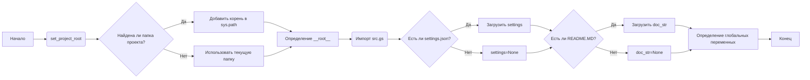

## Анализ кода `hypotez/src/goog/gtranslater/header.py`

### 1. <алгоритм>

**Блок-схема:**

1.  **Начало**:
    *   Задается константа `MODE = 'dev'`.
    *   Импортируются модули `sys`, `json`, `Version` из `packaging.version` и `Path` из `pathlib`.
    *   Определяется функция `set_project_root(marker_files)`.

2.  **`set_project_root(marker_files)`**:
    *   Принимает кортеж `marker_files` (по умолчанию `('pyproject.toml', 'requirements.txt', '.git')`).
    *   Определяет путь к текущему файлу (`__file__`) и его родительский каталог.
        *   Пример: Если `__file__` - `/home/user/hypotez/src/goog/gtranslater/header.py`, то родительский каталог - `/home/user/hypotez/src/goog/gtranslater`.
    *   Итерируется по родительским каталогам вверх, начиная с текущего.
        *   Пример: Если текущий каталог `/home/user/hypotez/src/goog/gtranslater`, то итерация будет по `/home/user/hypotez/src/goog/gtranslater`, `/home/user/hypotez/src/goog`, `/home/user/hypotez/src`, `/home/user/hypotez`, `/home/user` и т.д.
    *   Проверяет, существует ли любой из `marker_files` в текущем родительском каталоге.
        *   Пример: Если файл `pyproject.toml` найден в `/home/user/hypotez`, то цикл прерывается.
    *   Если корень проекта найден, он добавляется в `sys.path`, если его там нет.
        *   Пример: Если корень `/home/user/hypotez`, то он добавляется в список путей поиска модулей Python.
    *   Возвращает путь к корню проекта.

3.  **Определение корня проекта**:
    *   Вызывается функция `set_project_root()`, результат записывается в переменную `__root__`.

4.  **Импорт `src.gs`**:
    *   Импортируется модуль `src.gs`, используя полученный корень проекта из `sys.path`.

5.  **Загрузка настроек**:
    *   Инициализируется переменная `settings` в `None`.
    *   Попытка открыть файл `settings.json` из директории `src` в корне проекта (`gs.path.root / 'src' / 'settings.json'`).
    *   Загружает JSON данные из файла в переменную `settings`.
    *   Обработка исключений `FileNotFoundError` и `json.JSONDecodeError`, если файл не найден или не является валидным JSON, и присваивается `settings = None`

6.  **Загрузка документации**:
    *   Инициализируется переменная `doc_str` в `None`.
    *   Попытка открыть файл `README.MD` из директории `src` в корне проекта (`gs.path.root / 'src' / 'README.MD'`).
    *   Читает содержимое файла в переменную `doc_str`.
    *   Обработка исключений `FileNotFoundError` и `json.JSONDecodeError`, если файл не найден или ошибка при чтении.

7.  **Инициализация глобальных переменных**:
    *   Инициализация глобальных переменных проекта с значениями из `settings` или со значениями по умолчанию:
        *   `__project_name__`: Название проекта (по умолчанию 'hypotez').
        *   `__version__`: Версия проекта (по умолчанию '').
        *   `__doc__`: Документация проекта (содержимое README.MD, по умолчанию '').
        *   `__details__`: Детали проекта (пустая строка).
        *   `__author__`: Автор проекта (по умолчанию '').
        *   `__copyright__`: Авторское право (по умолчанию '').
        *   `__cofee__`: Сообщение о поддержке (по умолчанию ссылка на Boosty).

### 2. <mermaid>

**Описание `mermaid` диаграммы:**

*   **A**: Начало процесса.
*   **B**: Вызов функции `set_project_root`, которая ищет корень проекта, анализируя каталоги на наличие `marker_files`.
*   **C**: Проверка, найден ли корень проекта.
*   **D**: Если корень проекта найден, то он добавляется в `sys.path` для корректного импорта модулей.
*   **E**: Если корень проекта не найден, используется текущая папка.
*   **F**: Присваивание переменной `__root__` значения пути к корню проекта.
*   **G**: Импорт модуля `src.gs`, который использует `__root__`.
*   **H**: Проверка наличия файла `settings.json` в директории `src` корня проекта.
*   **I**: Загрузка данных из `settings.json` в переменную `settings`, если файл существует.
*   **J**: Если `settings.json` не найден, переменной `settings` присваивается `None`.
*  **K**: Проверка наличия файла `README.MD` в директории `src` корня проекта.
*   **L**: Загрузка данных из `README.MD` в переменную `doc_str`, если файл существует.
*   **M**: Если `README.MD` не найден, переменной `doc_str` присваивается `None`.
*   **N**: Инициализация глобальных переменных проекта `__project_name__`, `__version__`, `__doc__`, `__details__`, `__author__`, `__copyright__`, `__cofee__`, используя данные из `settings` или значения по умолчанию.
*  **O**: Завершение процесса.

Диаграмма отображает последовательность действий в коде, начиная от поиска корня проекта до инициализации глобальных переменных, с учетом возможных ветвлений и использования `settings.json` и `README.MD` для инициализации.

**Зависимости импорта:**

1.  `sys`: Модуль `sys` используется для работы с системными переменными, в частности `sys.path`, который необходим для динамического добавления пути к корню проекта, чтобы импортировать модули `src`.
2.  `json`: Модуль `json` используется для загрузки данных настроек из файла `settings.json`.
3.  `packaging.version.Version`:  Используется для управления версиями пакетов, в данной программе не используется напрямую, но в дальнейшем возможно будет использоваться.
4.  `pathlib.Path`: Модуль `pathlib` используется для работы с файловой системой, в частности для поиска корня проекта.
5.  `src.gs`: Локальный модуль, который предположительно содержит определения путей и других глобальных ресурсов проекта.
6.  `__file__`: Встроенная переменная, которая хранит путь к текущему файлу, используется для определения начальной точки поиска корня проекта.

### 3. <объяснение>

**Импорты:**

*   `sys`: Модуль для работы с системными параметрами и функциями. Используется для добавления пути к корню проекта в список путей поиска модулей Python (`sys.path`). Это необходимо для того, чтобы можно было импортировать модули из пакета `src` в любой части проекта.
*   `json`: Модуль для работы с данными в формате JSON. Используется для чтения данных настроек из файла `settings.json`.
*  `packaging.version.Version`:  Используется для управления версиями пакетов, в данной программе не используется напрямую, но в дальнейшем возможно будет использоваться.
*   `pathlib.Path`: Модуль для работы с путями в файловой системе. Используется для более удобного и кросс-платформенного определения путей к файлам и директориям.

**Классы:**

*   В данном коде не определены пользовательские классы. Используется только класс `pathlib.Path` для работы с путями.

**Функции:**

*   `set_project_root(marker_files)`:
    *   **Аргументы**:
        *   `marker_files` (tuple, по умолчанию `('pyproject.toml', 'requirements.txt', '.git')`): Кортеж имен файлов или директорий, наличие которых в директории указывает на корень проекта.
    *   **Возвращаемое значение**:
        *   `Path`: Объект `Path`, представляющий путь к корневой директории проекта. Если корень не найден, то возвращает путь к директории, где находится текущий файл.
    *   **Назначение**:
        Функция ищет корень проекта путем проверки наличия `marker_files` в родительских директориях, начиная с директории, где расположен текущий файл. Когда корень найден, путь к нему добавляется в `sys.path`. Это позволяет импортировать модули из пакета `src` из любого места проекта.
    *   **Примеры**:
        *   Если `marker_files` = `('setup.py', 'config.ini')` и функция находит файл `setup.py` в директории `/home/user/my_project`, то функция возвращает `Path('/home/user/my_project')` и добавляет `/home/user/my_project` в `sys.path`.

**Переменные:**

*   `MODE`: Строковая переменная, задающая режим работы программы (по умолчанию `'dev'`).
*   `__root__`: Объект `Path`, хранит абсолютный путь к корневой директории проекта.
*   `settings`: Словарь, содержащий настройки проекта, загруженные из файла `settings.json`. Если файл не найден или некорректный JSON, значение равно `None`.
*   `doc_str`: Строковая переменная, содержащая текст из файла `README.MD`. Если файл не найден, значение равно `None`.
*   `__project_name__`: Строка, содержащая название проекта. По умолчанию `'hypotez'`, перезаписывается значением из `settings`.
*   `__version__`: Строка, содержащая версию проекта. По умолчанию `''`, перезаписывается значением из `settings`.
*   `__doc__`: Строка, содержащая документацию проекта, считанную из `README.MD`. По умолчанию `''`, перезаписывается значением из `settings`.
*   `__details__`: Строка, хранящая детали проекта. По умолчанию `''`.
*   `__author__`: Строка, содержащая имя автора проекта. По умолчанию `''`, перезаписывается значением из `settings`.
*   `__copyright__`: Строка, содержащая информацию об авторских правах. По умолчанию `''`, перезаписывается значением из `settings`.
*   `__cofee__`: Строка, содержащая сообщение с ссылкой для поддержки проекта. По умолчанию "Treat the developer to a cup of coffee for boosting enthusiasm in development: https://boosty.to/hypo69", перезаписывается значением из `settings`.

**Потенциальные ошибки и области для улучшения:**

*   **Обработка ошибок**: Хотя код обрабатывает исключения `FileNotFoundError` и `json.JSONDecodeError` при загрузке настроек и документации, может быть полезно добавить логирование или более конкретные сообщения об ошибках. Например, можно вывести в консоль информацию о том, какой файл не был найден.
*   **Конфигурация**: Жесткое задание `marker_files` может быть не гибким. Можно предусмотреть возможность задания `marker_files` через переменные окружения или аргументы командной строки.
*   **Дублирование кода**: Логика чтения `settings.json` и `README.MD` почти идентична. Можно создать вспомогательную функцию для чтения файлов, чтобы избежать дублирования.
*   **Зависимость от `src.gs`**: Код зависит от существования модуля `src.gs`, что может быть не очевидным. Следует добавить проверку на его существование и вывод предупреждения, если модуль не найден.
*  **Обработка невалидного json**: При загрузке файла `settings.json`, в случае невалидного json,  выставляется `settings=None`. В последствии при попытке получить значения из словаря `settings.get("project_name", 'hypotez')`, будет возвращаться значение по умолчанию, но ошибка не обрабатывается.
*  **Неиспользуемые импорты**:  Модуль `packaging.version` импортируется, но не используется. Это может быть удалено.
*   **Стиль кода**: В коде есть избыточные тройные кавычки, необходимо исправить.

**Взаимосвязи с другими частями проекта:**

*   Данный модуль является точкой входа для получения глобальных настроек и информации о проекте. Он используется для инициализации проекта.
*   Он зависит от существования файла `settings.json` в корне проекта для получения настроек.
*  Он также зависит от существования файла `README.MD` для получения документации проекта.
*   Зависит от модуля `src.gs` для определения пути к корневой директории.
*   Обеспечивает доступ к глобальным переменным, таким как `__project_name__`, `__version__`, `__doc__` и т.д., которые могут использоваться другими модулями проекта.

**Цепочка взаимосвязей:**
1. `header.py` ищет корень проекта, добавляет его в `sys.path`.
2. `header.py` импортирует `src.gs`, получая доступ к путям проекта.
3. `header.py` загружает настройки из `settings.json`, если он существует, и устанавливает глобальные параметры проекта (`__project_name__`, `__version__` и другие) или берет значения по умолчанию.
4. Другие модули проекта, импортируя переменные из `header.py`, получают доступ к общим настройкам и информации о проекте.