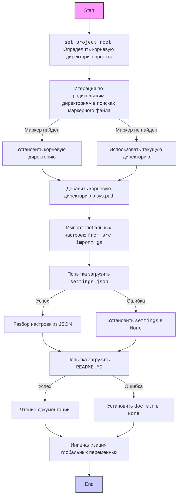
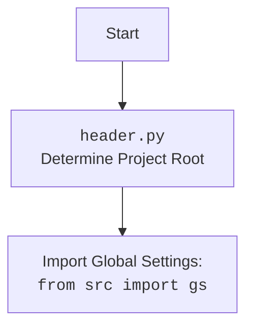

## ИНСТРУКЦИЯ:

Анализируй предоставленный код подробно и объясни его функциональность. Ответ должен включать три раздела:

1.  **<алгоритм>**: Опиши рабочий процесс в виде пошаговой блок-схемы, включая примеры для каждого логического блока, и проиллюстрируй поток данных между функциями, классами или методами.
2.  **<mermaid>**: Напиши код для диаграммы в формате `mermaid`, проанализируй и объясни все зависимости,
    которые импортируются при создании диаграммы.
    **ВАЖНО!** Убедитесь, что все имена переменных, используемые в диаграмме `mermaid`,
    имеют осмысленные и описательные имена. Имена переменных вроде `A`, `B`, `C`, и т.д., не допускаются!

    **Дополнительно**: Если в коде есть импорт `import header`, добавьте блок `mermaid` flowchart, объясняющий `header.py`:\
    ```mermaid
    flowchart TD
        Start --> Header[<code>header.py</code><br> Determine Project Root]

        Header --> import[Import Global Settings: <br><code>from src import gs</code>]
    ```

3.  **<объяснение>**: Предоставьте подробные объяснения:
    *   **Импорты**: Их назначение и взаимосвязь с другими пакетами `src.`.
    *   **Классы**: Их роль, атрибуты, методы и взаимодействие с другими компонентами проекта.
    *   **Функции**: Их аргументы, возвращаемые значения, назначение и примеры.
    *   **Переменные**: Их типы и использование.
    *   Выделите потенциальные ошибки или области для улучшения.

Дополнительно, постройте цепочку взаимосвязей с другими частями проекта (если применимо).

Это обеспечивает всесторонний и структурированный анализ кода.
## Формат ответа: `.md` (markdown)
**КОНЕЦ ИНСТРУКЦИИ**

## <алгоритм>

**1. Определение Корневой Директории Проекта (`set_project_root`):**

   *   **Начало:** Функция `set_project_root` вызывается без аргументов или с аргументами `marker_files` (по умолчанию `('__root__',)`).
   *   **Инициализация:**
        *   Определяется текущий путь файла `header.py` и его родительская директория.
        *   Переменная `__root__` инициализируется как текущая директория.
   *   **Поиск Маркерного Файла:**
        *   Происходит итерация по текущей директории и ее родительским директориям (вверх по дереву).
        *   Для каждой директории проверяется наличие одного из файлов-маркеров.
            *   **Пример**: Если текущая директория `/home/user/project/src/goog` и `marker_files` равно `('__root__',)`, функция будет проверять наличие файла `__root__` в `/home/user/project/src/goog`, `/home/user/project/src`, `/home/user/project`, `/home/user`, и т.д.
        *   Если маркерный файл найден, `__root__` переопределяется как директория, содержащая маркерный файл.
   *   **Добавление в `sys.path`:**
        *   Если `__root__` отсутствует в путях поиска модулей (`sys.path`), путь к корневой директории добавляется в начало `sys.path`.
   *   **Возврат:** Функция возвращает объект `Path`, представляющий корневую директорию проекта.

**2. Загрузка Настроек из `settings.json`:**

   *   **Попытка Открыть Файл:**
        *   Функция пытается открыть файл `settings.json`, находящийся в директории `src` относительно корневой директории (`gs.path.root / 'src' / 'settings.json'`).
        *   **Пример:** Если корневая директория `/home/user/project`, то путь к файлу будет `/home/user/project/src/settings.json`.
   *   **Разбор JSON:**
        *   Если файл успешно открыт, его содержимое парсится как JSON и сохраняется в переменную `settings`.
        *   **Пример:** `settings` может содержать словарь: `{"project_name": "hypotez", "version": "1.0.0", ...}`
   *   **Обработка Ошибок:**
        *   Если возникает ошибка `FileNotFoundError` или `json.JSONDecodeError`,  блок `try...except` обрабатывает исключение и ничего не делает (`...`). `settings` остаётся равным `None`.

**3. Загрузка Документации из `README.MD`:**

   *   **Попытка Открыть Файл:**
        *   Функция пытается открыть файл `README.MD`, находящийся в директории `src` относительно корневой директории (`gs.path.root / 'src' / 'README.MD'`).
        *   **Пример:** Если корневая директория `/home/user/project`, то путь к файлу будет `/home/user/project/src/README.MD`.
   *   **Чтение Документации:**
        *   Если файл успешно открыт, его содержимое считывается и сохраняется в строковую переменную `doc_str`.
   *  **Обработка Ошибок:**
         *   Если возникает ошибка `FileNotFoundError` или `json.JSONDecodeError`,  блок `try...except` обрабатывает исключение и ничего не делает (`...`). `doc_str` остаётся равным `None`.

**4. Инициализация Глобальных Переменных:**

    *   **project_name:**  Присваивается значение из `settings.get("project_name", 'hypotez')`, если `settings` не `None`, иначе присваивается значение по умолчанию `'hypotez'`.
    *   **version:**  Присваивается значение из `settings.get("version", '')`, если `settings` не `None`, иначе присваивается значение по умолчанию `''`.
    *   **doc:** Присваивается значение из `doc_str`, если `doc_str` не `None`, иначе присваивается значение по умолчанию `''`.
    *   **details:** Присваивается пустая строка `''`.
    *   **author:**  Присваивается значение из `settings.get("author", '')`, если `settings` не `None`, иначе присваивается значение по умолчанию `''`.
    *   **copyright:** Присваивается значение из `settings.get("copyrihgnt", '')`, если `settings` не `None`, иначе присваивается значение по умолчанию `''`.
    *   **cofee:** Присваивается значение из `settings.get("cofee", "Treat the developer to a cup of coffee for boosting enthusiasm in development: https://boosty.to/hypo69")`, если `settings` не `None`, иначе присваивается значение по умолчанию `"Treat the developer to a cup of coffee for boosting enthusiasm in development: https://boosty.to/hypo69"`.

## <mermaid>





**Анализ зависимостей:**

*   **`pathlib.Path`**: Используется для работы с путями в файловой системе.
*  **`sys`**: Модуль для работы с системными параметрами и функциями (например, добавление пути к `sys.path`).
*   **`json`**: Модуль для работы с данными в формате JSON (чтение файла `settings.json`).
*   **`packaging.version.Version`**: Используется для парсинга и сравнения версий (в данном коде не используется, но импортирован).
*    **`src.gs`**: Импортируется для доступа к глобальным настройкам проекта,  предположительно,  содержит путь к корневой директории и другим глобальным переменным. `src` указывает на корень проекта.

## <объяснение>

**Импорты:**

*   **`import sys`**: Модуль `sys` используется для доступа к системным параметрам и функциям. В данном коде он используется для добавления корневой директории проекта в `sys.path`, что позволяет импортировать модули из этой директории.
*   **`import json`**: Модуль `json` используется для работы с данными в формате JSON. Здесь он используется для чтения данных конфигурации из файла `settings.json`.
*   **`from packaging.version import Version`**:  Модуль `packaging.version` предоставляет класс `Version` для работы с версиями пакетов. В данном коде этот класс импортируется, но не используется. Вероятно, предполагается его использование в будущем для сравнения версий.
*   **`from pathlib import Path`**:  Модуль `pathlib` предоставляет класс `Path` для работы с путями в файловой системе в объектно-ориентированном стиле. В данном коде он используется для определения и манипулирования путями директорий и файлов.
*   **`from src import gs`**: Этот импорт предполагает, что в пакете `src` есть модуль `gs` (global settings). Этот модуль должен содержать глобальные переменные и настройки, доступные для всего проекта. В данном коде `gs` используется для получения пути к корневой директории проекта `gs.path.root`.

**Функции:**

*   **`set_project_root(marker_files=('__root__')) -> Path`**:
    *   **Аргументы:**
        *   `marker_files` (tuple, по умолчанию `('__root__')`): Список имен файлов или директорий, которые указывают на корневую директорию проекта.
    *   **Возвращаемое значение:**
        *   Объект `Path`, представляющий корневую директорию проекта.
    *   **Назначение:**
        *   Функция определяет корневую директорию проекта путем поиска вверх по дереву директорий, начиная с текущей директории файла. Она останавливается, когда находит директорию, содержащую хотя бы один из файлов-маркеров. Найденный путь добавляется в `sys.path`.
    *  **Пример**: Если вызывается без аргументов `set_project_root()`, то будет использоваться маркер `__root__`. Если вызвать `set_project_root(marker_files=('my_marker', 'other_marker'))`, то поиск будет вестись по наличию файлов `my_marker` или `other_marker`.

**Переменные:**

*   **``**: Глобальная переменная, задающая режим работы (в данном случае, `dev` - режим разработки).
*   **`__root__`**: Объект `Path`, представляющий корневую директорию проекта. Определяется с помощью функции `set_project_root`.
*   **`settings`**: Словарь (dict), который хранит настройки проекта, считанные из файла `settings.json`. Может быть `None`, если файл не был найден или не удалось распарсить JSON.
*   **`doc_str`**: Строка, содержащая документацию проекта, считанную из файла `README.MD`. Может быть `None`, если файл не был найден или не удалось прочитать его содержимое.
*   **`__project_name__`**: Имя проекта, извлекается из `settings` или устанавливается в значение по умолчанию `'hypotez'`.
*    **`__version__`**: Версия проекта, извлекается из `settings` или устанавливается в пустую строку `''`.
*    **`__doc__`**:  Документация проекта, извлекается из `doc_str` или устанавливается в пустую строку `''`.
*   **`__details__`**: Строка с деталями проекта, устанавливается в пустую строку `''`.
*   **`__author__`**: Автор проекта, извлекается из `settings` или устанавливается в пустую строку `''`.
*   **`__copyright__`**:  Авторские права проекта, извлекается из `settings` или устанавливается в пустую строку `''`.
*   **`__cofee__`**:  Строка с призывом угостить разработчика кофе, извлекается из `settings` или устанавливается в значение по умолчанию `"Treat the developer to a cup of coffee for boosting enthusiasm in development: https://boosty.to/hypo69"`.

**Потенциальные ошибки и области для улучшения:**

*   **Отсутствие `gs`:** Зависимость от `src.gs` может вызвать ошибку, если этот модуль не существует или не инициализирован должным образом.
*   **Обработка ошибок:**  Блок `try...except` для чтения `settings.json` и `README.MD`  просто пропускает ошибки. Было бы лучше обрабатывать эти ошибки более явно, например, выводя сообщение в лог или используя значения по умолчанию.
*   **Использование `...`:** Использование многоточия `...` в блоках `except` не является очень хорошей практикой. Следует обрабатывать исключения более явно, чтобы понимать, какие проблемы возникают и как их можно исправить.
*   **Неиспользуемый импорт `Version`:** Импорт `Version` не используется в коде. Следует удалить этот импорт, если он не нужен.
*   **Отсутствие проверок на типы данных:** Код предполагает, что значения из `settings.json` имеют определенный тип (строка для `project_name`, `version`, `author`, `copyright` и `cofee`). Можно добавить проверки на типы, чтобы избежать ошибок.
*    **Опечатка:**  `copyrihgnt` в строке `__copyright__: str = settings.get("copyrihgnt", '')` имеет опечатку, правильно  `copyright`.

**Цепочка взаимосвязей с другими частями проекта:**

*   Этот файл (`header.py`) является фундаментальным для проекта, так как он определяет корневую директорию, загружает настройки и устанавливает глобальные переменные, необходимые для работы других модулей.
*   Модуль `src.gs`, предположительно,  предоставляет доступ к глобальным настройкам, которые используются в `header.py` для поиска корневой директории.
*   Другие модули проекта, вероятно, будут использовать значения глобальных переменных, инициализированных в `header.py` (например, `__project_name__`, `__version__`), а также корневую директорию, чтобы получать доступ к ресурсам проекта.
*   Этот файл обеспечивает согласованность и конфигурацию проекта,  гарантируя, что все модули имеют доступ к общим настройкам и ресурсам.