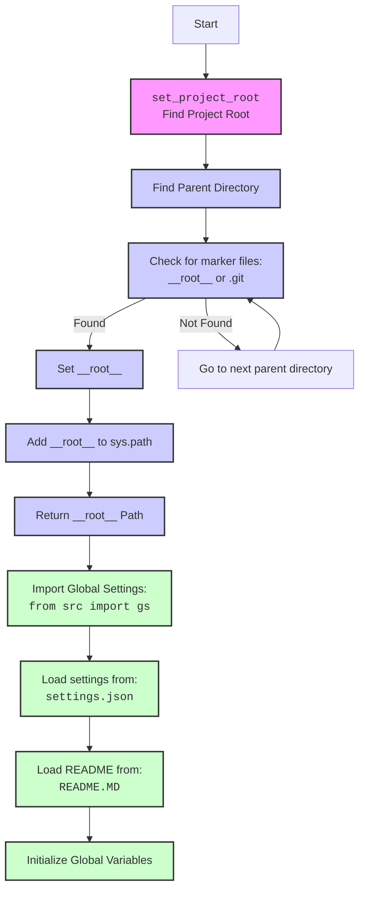

## ИНСТРУКЦИЯ:

Анализируй предоставленный код подробно и объясни его функциональность. Ответ должен включать три раздела:  

1. **<алгоритм>**: Опиши рабочий процесс в виде пошаговой блок-схемы, включая примеры для каждого логического блока, и проиллюстрируй поток данных между функциями, классами или методами.  
2. **<mermaid>**: Напиши код для диаграммы в формате `mermaid`, проанализируй и объясни все зависимости, 
    которые импортируются при создании диаграммы. 
    **ВАЖНО!** Убедитесь, что все имена переменных, используемые в диаграмме `mermaid`, 
    имеют осмысленные и описательные имена. Имена переменных вроде `A`, `B`, `C`, и т.д., не допускаются!  
    
    **Дополнительно**: Если в коде есть импорт `import header`, добавьте блок `mermaid` flowchart, объясняющий `header.py`:\
    ```mermaid
    flowchart TD
        Start --> Header[<code>header.py</code><br> Determine Project Root]
    
        Header --> import[Import Global Settings: <br><code>from src import gs</code>] 
    ```

3. **<объяснение>**: Предоставьте подробные объяснения:  
   - **Импорты**: Их назначение и взаимосвязь с другими пакетами `src.`.  
   - **Классы**: Их роль, атрибуты, методы и взаимодействие с другими компонентами проекта.  
   - **Функции**: Их аргументы, возвращаемые значения, назначение и примеры.  
   - **Переменные**: Их типы и использование.  
   - Выделите потенциальные ошибки или области для улучшения.  

Дополнительно, постройте цепочку взаимосвязей с другими частями проекта (если применимо).  

Это обеспечивает всесторонний и структурированный анализ кода.
## Формат ответа: `.md` (markdown)
**КОНЕЦ ИНСТРУКЦИИ**

## <алгоритм>

1.  **`set_project_root(marker_files=('__root__','.git'))`**:
    *   **Начало**: Функция принимает кортеж `marker_files` (по умолчанию `('__root__', '.git')`) как аргумент для поиска корневого каталога.
    *   **Инициализация**: Получает абсолютный путь к текущему файлу, `__file__`, и сохраняет его родительский каталог в `current_path` в виде объекта `Path`.
        ```python
        current_path = Path(__file__).resolve().parent
        ```
        _Пример:_ Если `__file__` это `/path/to/project/src/goog/header.py`, то `current_path` будет `/path/to/project/src/goog`.
    *   **Поиск корневого каталога**:
        *   Перебирает все родительские каталоги `current_path`, включая сам `current_path`.
        *   Для каждого каталога `parent` проверяет, существует ли в нем хотя бы один из файлов или каталогов из `marker_files`.
            ```python
             if any((parent / marker).exists() for marker in marker_files):
            ```
            _Пример:_ Если `parent` это `/path/to/project` и существует файл `/path/to/project/.git`, то условие будет истинным.
        *   Если маркерный файл найден, то текущий `parent` сохраняется как корневой каталог в `__root__` и цикл прекращается.
    *   **Добавление в `sys.path`**: Проверяет, находится ли `__root__` в `sys.path`. Если нет, то добавляет его в начало, чтобы модули в корне проекта были доступны для импорта.
        ```python
        if __root__ not in sys.path:
            sys.path.insert(0, str(__root__))
        ```
    *   **Возврат**: Функция возвращает путь к корневому каталогу `__root__` как объект `Path`.
2.  **`__root__: Path = set_project_root()`**: Вызывает функцию `set_project_root()` и сохраняет возвращенное значение в глобальной переменной `__root__`.
3.  **Импорт глобальных настроек**: Импортирует глобальные настройки из `src.gs`.
    ```python
    from src import gs
    ```
4.  **Загрузка настроек из `settings.json`**:
    *   Пытается открыть и прочитать файл `settings.json`, расположенный в каталоге `src` относительно корня проекта.
    *   Если файл найден и успешно прочитан, его содержимое (словарь JSON) сохраняется в переменной `settings`.
    *   Если возникает `FileNotFoundError` или `json.JSONDecodeError`, обработка ошибок переходит на "pass", т.е. ничего не происходит.
5.  **Загрузка README из `README.MD`**:
    *   Пытается открыть и прочитать файл `README.MD`, расположенный в каталоге `src` относительно корня проекта.
    *   Если файл найден и успешно прочитан, его содержимое сохраняется в переменной `doc_str`.
    *   Если возникает `FileNotFoundError` или `json.JSONDecodeError`, обработка ошибок переходит на "pass", т.е. ничего не происходит.
6.  **Инициализация глобальных переменных**:
    *   Инициализирует глобальные переменные, такие как `__project_name__`, `__version__`, `__doc__`, `__details__`, `__author__`, `__copyright__`, `__cofee__` , читая значения из загруженных настроек `settings` или используя значения по умолчанию.
        ```python
        __project_name__ = settings.get("project_name", 'hypotez') if settings else 'hypotez'
        ```
        _Пример:_ Если `settings` содержит ключ `"project_name"`, то его значение будет присвоено `__project_name__`, иначе будет использовано `'hypotez'`.

## <mermaid>



## <объяснение>

**Импорты:**

*   `sys`: Модуль `sys` используется для модификации `sys.path`, добавляя корень проекта для правильного импорта модулей.
*   `json`: Модуль `json` используется для загрузки данных конфигурации из файла `settings.json`.
*   `packaging.version.Version`: Импортируется класс `Version` из пакета `packaging.version`, но в данном коде не используется. Это, вероятно, заготовка для дальнейшего использования в управлении версиями.
*   `pathlib.Path`: Класс `Path` из модуля `pathlib` используется для работы с файловыми путями как с объектами, что делает код более читаемым и кросс-платформенным.

**Функции:**

*   **`set_project_root(marker_files=('__root__', '.git')) -> Path`**:
    *   **Назначение**: Эта функция определяет корень проекта. Она ищет вверх по дереву каталогов, начиная с текущего файла, до тех пор, пока не найдет каталог, содержащий один из маркерных файлов или каталогов (по умолчанию `__root__` или `.git`).
    *   **Аргументы**:
        *   `marker_files`: Кортеж строк, представляющих имена файлов или каталогов, которые служат признаками корневого каталога проекта (например: `('__root__', '.git')`).
    *   **Возвращаемое значение**: Объект `Path`, представляющий путь к корневому каталогу проекта.
    *   **Пример:**
    Если структура каталогов проекта выглядит так:
    ```
    /path/to/project/
        .git/
        src/
            goog/
                header.py
    ```
    То, при запуске `header.py`, `set_project_root()` вернет `Path("/path/to/project")`.

**Переменные:**

*   `__root__`: Глобальная переменная типа `Path`, хранящая путь к корневому каталогу проекта. Инициализируется результатом вызова функции `set_project_root()`.
*   `settings`: Глобальная переменная типа `dict`, хранящая загруженные настройки из `settings.json`, если файл существует и успешно прочитан. Иначе `None`.
*   `doc_str`: Глобальная переменная типа `str`, хранящая содержимое файла `README.MD`, если файл существует и успешно прочитан. Иначе `None`.
*   `__project_name__`: Глобальная переменная типа `str`, хранящая название проекта. Если `settings` определены, то берется значение из `settings.get("project_name", "hypotez")` или "hypotez" по умолчанию.
*   `__version__`: Глобальная переменная типа `str`, хранящая версию проекта. Если `settings` определены, то берется значение из `settings.get("version", "")` или "" по умолчанию.
*  `__doc__`: Глобальная переменная типа `str`, хранящая содержимое файла `README.MD`.
*  `__details__`: Глобальная переменная типа `str`, хранящая описание проекта.
*   `__author__`: Глобальная переменная типа `str`, хранящая имя автора проекта. Если `settings` определены, то берется значение из `settings.get("author", "")` или "" по умолчанию.
*   `__copyright__`: Глобальная переменная типа `str`, хранящая информацию об авторском праве. Если `settings` определены, то берется значение из `settings.get("copyrihgnt", "")` или "" по умолчанию.
*    `__cofee__`: Глобальная переменная типа `str`, хранящая информацию об пожертвовании на кофе для разработчика.  Если `settings` определены, то берется значение из `settings.get("cofee", "Treat the developer to a cup of coffee for boosting enthusiasm in development: https://boosty.to/hypo69")` или  "Treat the developer to a cup of coffee for boosting enthusiasm in development: https://boosty.to/hypo69" по умолчанию.
*   `current_path`: Локальная переменная типа `Path` в функции `set_project_root()`, хранящая путь к каталогу, где находится текущий скрипт.
*   `parent`: Локальная переменная типа `Path` в функции `set_project_root()`, используется в цикле для перебора родительских каталогов.
*    `settings_file`: Локальная переменная, используемая как контекстный менеджер для открытия файлов `settings.json` и `README.MD`.
*    `marker`: Локальная переменная в `set_project_root` представляет один из маркерных файлов, которые используются для поиска корня проекта.

**Взаимосвязь с другими частями проекта:**

*   `from src import gs`: Этот импорт указывает на зависимость от глобальных настроек, расположенных в пакете `src.gs`. Это подразумевает наличие модуля `gs.py` в каталоге `src`, который, вероятно, содержит глобальные константы или настройки путей.
*   Файлы `settings.json` и `README.MD` используются для получения информации о проекте.
*   `sys.path.insert(0, str(__root__))`: Это обеспечивает возможность импорта модулей из корневой директории проекта, что позволяет структурировать проект более гибко.

**Потенциальные ошибки и улучшения:**

*   **Обработка ошибок:** Использование `try-except` блока с `pass` может скрывать ошибки. Логирование ошибок было бы полезнее.
*   **`packaging.version.Version`**: Импортирован, но не используется. Его стоит либо удалить, либо использовать.
*   **Использование `gs.path.root`**: Предполагается, что в модуле `src.gs` есть переменная `path.root`, которая, скорее всего, должна быть тем же самым, что и `__root__`. Возможно, стоит унифицировать это.
*   **Отсутствие документации к модулю `src.gs`**: Необходимо документировать структуру и контент модуля `src.gs`.
*   **Улучшение гибкости**:  Можно добавить возможность передавать путь к `settings.json` и `README.MD` как аргументы, для большей гибкости.
*   **Захардкоженные маркерные файлы**: Маркерные файлы можно сделать настраиваемыми через параметры командной строки или переменные окружения.
* **Отсутствие обработки ошибок при извлечении данных из JSON** - `settings.get("project_name", 'hypotez')`, если ключ "project_name" отсутствует в словаре, вернётся "hypotez", что не всегда является желательным результатом. Стоит добавить логирование или выбрасывать исключение.