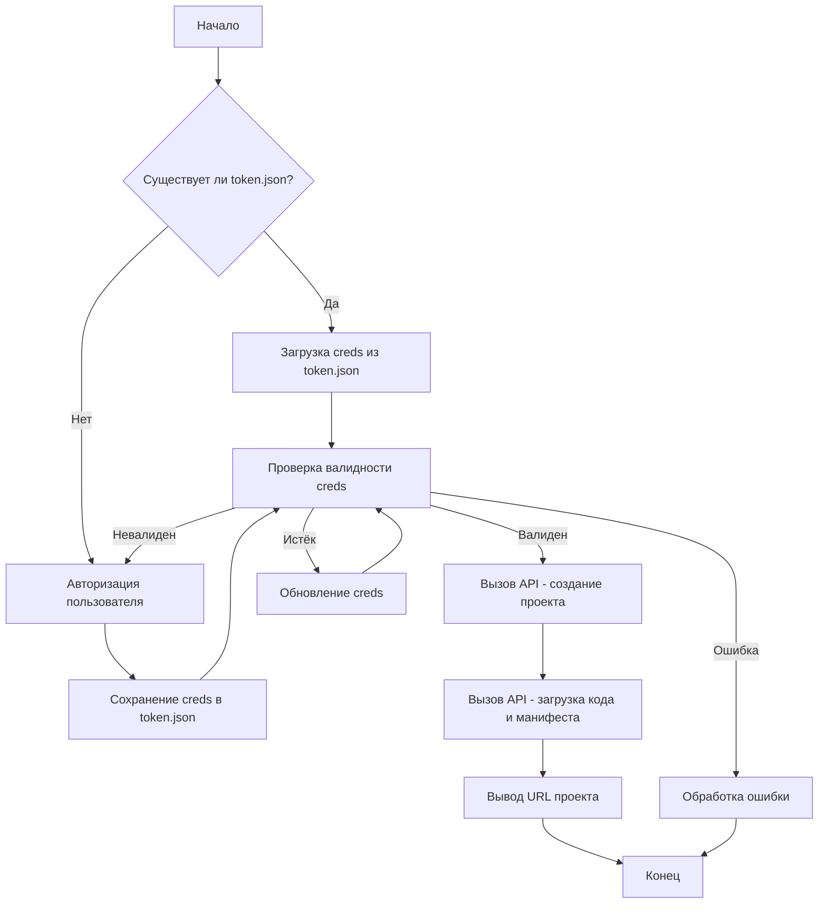

```MD
# <input code>

```python
## \file hypotez/src/goog/quickstart.py
# -*- coding: utf-8 -*-\
#! venv/Scripts/python.exe
#! venv/bin/python/python3.12

"""
.. module: src.goog 
	:platform: Windows, Unix
	:synopsis:

"""
MODE = 'dev'


"""
Shows basic usage of the Apps Script API.
Call the Apps Script API to create a new script project, upload a file to the
project, and log the script's URL to the user.

https://developers.google.com/apps-script/api/quickstart/python
"""


from pathlib import Path

from google.auth.transport.requests import Request
from google.oauth2.credentials import Credentials
from google_auth_oauthlib.flow import InstalledAppFlow
from googleapiclient import errors
from googleapiclient.discovery import build

import header
from src import gs

# If modifying these scopes, delete the file token.json.
SCOPES = ['https://www.googleapis.com/auth/script.projects']

SAMPLE_CODE = """
function helloWorld() {
  console.log("Hello, world!");
}
""".strip()

SAMPLE_MANIFEST = """
{
  "timeZone": "America/New_York",
  "exceptionLogging": "CLOUD"
}
""".strip()


def main():
    """Calls the Apps Script API."""
    creds = None
    # The file token.json stores the user's access and refresh tokens, and is
    # created automatically when the authorization flow completes for the first
    # time.
    token_path = gs.path.tmp / 'e-cat-346312-137284f4419e.json'
    if token_path.exists():
        creds = Credentials.from_authorized_user_file(token_path, SCOPES)
    # If there are no (valid) credentials available, let the user log in.
    if not creds or not creds.valid:
        if creds and creds.expired and creds.refresh_token:
            creds.refresh(Request())
        else:
            flow = InstalledAppFlow.from_client_secrets_file(
                'credentials.json', SCOPES)
            creds = flow.run_local_server(port=0)
        # Save the credentials for the next run
        with Path('token.json').open('w') as token:
            token.write(creds.to_json())

    try:
        service = build('script', 'v1', credentials=creds)

        # Call the Apps Script API
        # Create a new project
        request = {'title': 'My Script'}
        response = service.projects().create(body=request).execute()

        # Upload two files to the project
        request = {
            'files': [
                {
                    'name': 'hello',
                    'type': 'SERVER_JS',
                    'source': SAMPLE_CODE
                },
                {
                    'name': 'appsscript',
                    'type': 'JSON',
                    'source': SAMPLE_MANIFEST
                }
            ]
        }
        response = service.projects().updateContent(
            body=request,
            scriptId=response['scriptId']).execute()
        print('https://script.google.com/d/' + response['scriptId'] + '/edit')
    except errors.HttpError as error:
        # The API encountered a problem.
        print(error.content)


if __name__ == '__main__':
    main()
```

# <algorithm>

1. **Инициализация:**
    * `creds = None`: Переменная `creds` инициализируется как `None` для хранения токена доступа.
    * `token_path`: Определяется путь к файлу `token.json` для хранения токенов.  
    * Проверка существования `token.json`.
2. **Получение токена:**
    * Если `token.json` существует, то `creds` загружается из него.
    * Если `creds` не валидны или истекли:
        * Попытка обновить `creds` используя refresh token.
        * Если refresh token отсутствует, то вызывается `run_local_server` для авторизации пользователя и получения токенов.
        * Полученный `creds` сохраняется в `token.json`.
3. **Обращение к API Google Apps Script:**
    * `service = build('script', 'v1', credentials=creds)`: Создаётся объект `service` для взаимодействия с API.
    * `response = service.projects().create(...)`: Создаётся новый проект в Apps Script.
    * `response = service.projects().updateContent(...)`: Загружаются примерный код и манифест в проект.
4. **Вывод URL проекта:**
    * Выводится URL созданного проекта для доступа к нему.
5. **Обработка ошибок:**
    * Обрабатываются возможные ошибки `errors.HttpError`.

**Пример данных, перемещаемых между функциями/классами:**

* `creds`: Объект, содержащий информацию для авторизации. Передается в метод `build` для создания объекта `service`.
* `request`: Словарь, содержащий данные для API запросов (например, название проекта, код скрипта). Передается в методы `create` и `updateContent`.
* `response`: Словарь, содержащий ответ от API.  `scriptId` из `response` используется для `updateContent`.

# <mermaid>



**Объяснение зависимостей по диаграмме:**

* `A`, `J`: Точки входа и выхода программы.
* `B`, `E`, `K`: Условные блоки, зависящие от состояния переменных.
* `C`, `G`: Операции по работе с файлом `token.json`.
* `D`: Процесс авторизации, в который входит запрос API.
* `F`, `H`: Вызовы функций `service.projects().create` и `service.projects().updateContent`.
* `L`: Обработка исключений.


# <explanation>

**Импорты:**

* `from pathlib import Path`: Импортирует класс `Path` для работы с путями к файлам.  Связан с модулем `pathlib`, предоставляющим объекты для представления путей.
* `from google.auth.transport.requests import Request`: Импортирует класс `Request` для работы с запросами. Непосредственно связан с `google-auth` для авторизации.
* `from google.oauth2.credentials import Credentials`: Импортирует класс `Credentials` для работы с учетными данными доступа. Связан с модулем `google.oauth2`.
* `from google_auth_oauthlib.flow import InstalledAppFlow`: Импортирует класс `InstalledAppFlow` для работы с установкой приложений. Связан с модулем `google-auth-oauthlib`, необходимым для авторизации приложения.
* `from googleapiclient import errors`: Импортирует класс `errors` для обработки ошибок API. Связан с модулем `googleapiclient`, предоставляющим инструменты для взаимодействия с API.
* `from googleapiclient.discovery import build`: Импортирует функцию `build` для создания сервисного объекта для взаимодействия с API. Связан с модулем `googleapiclient` и необходим для взаимодействия с Google Apps Script API.
* `import header`: Импортирует модуль `header`.  Связь с другими частями проекта не указана, поэтому необходимо изучить сам модуль.
* `from src import gs`: Импортирует модуль `gs` из пакета `src`. Связь с другими частями проекта через `gs`. Возможно, он содержит вспомогательные функции или классы для работы с файловой системой или другими сервисами.

**Классы:**

* `Credentials`: Представляет данные для авторизации. Используется для взаимодействия с API.
* `InstalledAppFlow`:  Представляет процесс установки приложения и получения токенов доступа. Используется для авторизации с помощью серверной части.

**Функции:**

* `main()`: Точка входа программы. В ней происходит инициализация, авторизация, запрос API и вывод результата. Принимает данные из переменных `creds` и `service`. Возвращает результат в консоль.

**Переменные:**

* `SCOPES`: Список требуемых прав доступа к API.
* `SAMPLE_CODE`: Пример кода на языке JavaScript для выполнения в Apps Script.
* `SAMPLE_MANIFEST`: Пример манифеста для скрипта Apps Script.
* `creds`: Содержит токен доступа, необходимый для авторизации.
* `token_path`: Путь к файлу `token.json`, который хранит токен доступа.
* `service`: Объект, представляющий сервисный API для работы с Google Apps Script.
* `response`: Результат запроса к API.  Важно обращение по `response['scriptId']`.
* `request`: Словарь, содержащий параметры запроса к API (например, название проекта).

**Возможные ошибки/улучшения:**

* Не хватает информации о переменных и функциях в `header` и `gs`. Необходима дополнительная информация о структуре проекта, чтобы проанализировать взаимосвязи и возможные ошибки.
*  Обработка ошибок в `main()` недостаточно детализирована. Важно выводить подробную информацию об ошибках, например, код ошибки или сообщение от сервера.
* Отсутствие верификации полученного `scriptId` после создания проекта.  Поле `scriptId` должно быть проверено на корректность.

**Взаимосвязи с другими частями проекта:**

Программа использует модули `gs` и `header`. Необходимо больше информации о содержимом этих модулей, чтобы оценить их роль и взаимосвязи с другими частями приложения.