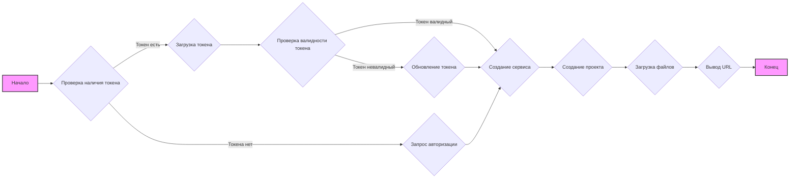
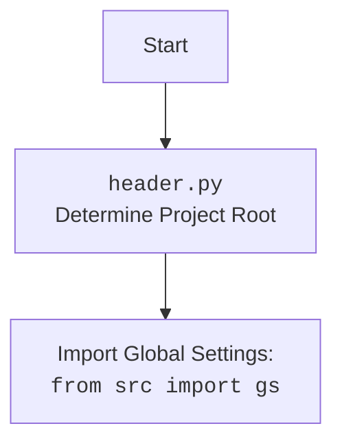

## Анализ кода `hypotez/src/goog/quickstart.py`

### 1. <алгоритм>

**Блок-схема:**



**Примеры для блоков:**
1. **Проверка наличия токена:** Проверяется наличие файла `e-cat-346312-137284f4419e.json` в директории `tmp`. 
2. **Загрузка токена:** Загружаются учетные данные из JSON файла, если он существует.
3. **Проверка валидности токена:** Проверяется, не истек ли срок действия токена.
4. **Обновление токена:** Используется `refresh_token` для получения нового токена доступа.
5. **Запрос авторизации:** Пользователь авторизуется через браузер, если токен отсутствует или невалиден.
6. **Создание сервиса:** Создается сервис `script` для взаимодействия с Apps Script API.
7. **Создание проекта:** Создается новый проект с названием `My Script`.
8. **Загрузка файлов:** Загружаются два файла: `hello` (код скрипта) и `appsscript` (манифест).
9. **Вывод URL:** Выводится URL скрипта для доступа через браузер.

**Поток данных:**

1. Изначально проверяется наличие файла `token.json` (ранее был `e-cat-346312-137284f4419e.json`) для загрузки учетных данных.
2. Если файл отсутствует или учетные данные недействительны, выполняется процесс авторизации через браузер.
3. После получения учетных данных создается сервис `script` для взаимодействия с Google Apps Script API.
4. Создается новый проект `My Script` через API.
5. В проект загружаются два файла: код скрипта и манифест.
6. Возвращается URL для просмотра и редактирования скрипта.

### 2. <mermaid>

```mermaid
flowchart TD
    Start --> CheckTokenFile[Check if token file exists: <br> <code>gs.path.tmp / 'e-cat-346312-137284f4419e.json'</code>];
    CheckTokenFile -- "Exists" --> LoadToken[Load credentials from file: <br> <code>Credentials.from_authorized_user_file()</code>];
    CheckTokenFile -- "Not exists" --> AuthorizeUser[Authorize user via browser: <br> <code>InstalledAppFlow.run_local_server()</code>];
    LoadToken --> ValidateToken[Validate Token: <br> <code>creds.valid</code>];
     AuthorizeUser --> SaveToken[Save credentials to file: <br> <code>token.json</code>];
    ValidateToken -- "Token is valid" --> CreateService[Create Script API service: <br> <code>build('script', 'v1', credentials=creds)</code>];
    ValidateToken -- "Token is not valid" --> RefreshToken[Refresh Token: <br> <code>creds.refresh(Request())</code>];
    RefreshToken --> CreateService;
    SaveToken --> CreateService;
    CreateService --> CreateProject[Create new script project: <br> <code>service.projects().create()</code>];
    CreateProject --> UploadFiles[Upload files to the project: <br> <code>service.projects().updateContent()</code>];
    UploadFiles --> PrintScriptURL[Print script URL: <br> <code>https://script.google.com/d/.../edit</code>];
    PrintScriptURL --> End[End];
    
    style Start fill:#f9f,stroke:#333,stroke-width:2px
    style End fill:#f9f,stroke:#333,stroke-width:2px
    
```

**Импорт зависимостей:**
*   **`from pathlib import Path`**:  Используется для работы с путями к файлам и каталогам.
*   **`from google.auth.transport.requests import Request`**: Используется для создания HTTP-запросов для обновления токена.
*   **`from google.oauth2.credentials import Credentials`**:  Используется для работы с учетными данными, полученными от Google.
*  **`from google_auth_oauthlib.flow import InstalledAppFlow`**: Используется для создания потока авторизации.
*   **`from googleapiclient import errors`**: Используется для обработки ошибок, возникающих при работе с API.
*   **`from googleapiclient.discovery import build`**: Используется для создания сервиса для вызова Google API.
*   **`import header`**: Импортирует модуль `header` (описано ниже).
*   **`from src import gs`**: Импортирует глобальные настройки проекта из `src.gs`.

**Блок-схема `header.py`**



### 3. <объяснение>

#### Импорты:

*   `pathlib.Path`: Управляет путями к файлам. Позволяет создавать и обрабатывать пути независимо от операционной системы.
*   `google.auth.transport.requests.Request`: Используется для обновления токенов.
*   `google.oauth2.credentials.Credentials`: Класс для представления учетных данных OAuth 2.0.
*   `google_auth_oauthlib.flow.InstalledAppFlow`: Класс для управления потоком авторизации OAuth 2.0.
*   `googleapiclient.errors`: Содержит классы исключений, которые могут возникнуть при взаимодействии с Google API.
*   `googleapiclient.discovery.build`: Функция для создания экземпляра сервиса Google API.
*   `header`: Модуль `header.py`, вероятно, содержит общие настройки проекта, включая определение корня проекта и импорт глобальных настроек.
*   `src.gs`: Модуль, содержащий глобальные настройки проекта, такие как пути, константы, и т.д.

#### Переменные:

*   `MODE`: Указывает режим работы приложения ('dev').
*   `SCOPES`: Список разрешений (scopes), необходимых для доступа к Google Apps Script API.
*   `SAMPLE_CODE`: Строка с примером кода Apps Script.
*   `SAMPLE_MANIFEST`: Строка с примером манифеста Apps Script.

#### Функции:

*   `main()`:
    *   **Назначение:** Основная функция, реализующая логику взаимодействия с Google Apps Script API.
    *   **Алгоритм:**
        1. Проверяет наличие файла `token.json` (ранее был `e-cat-346312-137284f4419e.json`) с учетными данными.
        2. Если файл существует, загружает учетные данные.
        3. Если файл отсутствует или учетные данные недействительны, запускается процесс авторизации через браузер.
        4. Сохраняет полученные учетные данные в файл `token.json`.
        5. Создает сервис `script` для взаимодействия с Google Apps Script API.
        6. Создает новый проект с именем "My Script".
        7. Загружает в проект два файла: `hello` с кодом скрипта и `appsscript` с манифестом.
        8. Выводит URL для просмотра и редактирования скрипта.
    *   **Примеры:**
        *   `token_path = gs.path.tmp / 'e-cat-346312-137284f4419e.json'`: Создание пути к файлу токена, используя объект `gs.path.tmp`.
        *   `service = build('script', 'v1', credentials=creds)`: Создание сервиса для работы с Google Apps Script API, используя загруженные учетные данные.
        *   `request = {'title': 'My Script'}`: Формирование запроса на создание нового проекта.
        *   `service.projects().create(body=request).execute()`: Выполнение запроса на создание проекта через API.
        *   `print('https://script.google.com/d/' + response['scriptId'] + '/edit')`: Вывод URL созданного скрипта.

#### Потенциальные ошибки и улучшения:

*   **Обработка ошибок:** В коде есть блок `try...except` для обработки `HttpError`, но можно добавить более детальную обработку ошибок и логирование.
*   **Конфигурация:** Имя файла `credentials.json` и имя проекта "My Script" можно вынести в конфигурационный файл.
*   **Использование `gs`:** Активно используется `gs` (глобальные настройки). Нужно убедиться, что все настройки, такие как пути к файлам, ключи API и т.д., правильно сконфигурированы.
*   **Обработка `token.json`:** Код использует `token.json` для хранения учетных данных, что является хорошей практикой, но нужно обеспечить правильную обработку ситуаций, когда файл отсутствует, поврежден или некорректен.

#### Взаимосвязи с другими частями проекта:

*   `src.gs`: Используется для доступа к глобальным настройкам, таким как пути и константы.
*   `header.py`: Скорее всего, используется для определения корня проекта и импорта глобальных настроек.

**Цепочка взаимосвязей:**

1.  `quickstart.py` импортирует `header` для инициализации.
2.  `header` определяет корень проекта и импортирует `src.gs`.
3.  `quickstart.py` использует `gs` для доступа к путям, например, к временной директории `tmp`, где хранится `token.json` (ранее `e-cat-346312-137284f4419e.json`).
4.  `quickstart.py` использует  библиотеки `google.oauth2`, `google_auth_oauthlib` и `googleapiclient` для взаимодействия с Google API.

Этот анализ предоставляет полное представление о функциональности, структуре и взаимосвязях кода, что позволяет лучше понять его работу и области для улучшения.