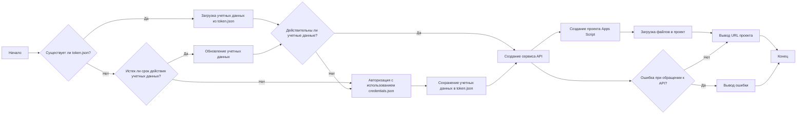

## Анализ кода `hypotez/src/goog/quickstart.py`

### 1. <алгоритм>

**Пошаговый алгоритм работы программы:**

1.  **Инициализация:**
    *   Устанавливается режим работы `MODE = 'dev'`.
    *   Импортируются необходимые библиотеки: `pathlib`, `google.auth`, `googleapiclient` и модули `header` и `gs` из `src`.
    *   Объявляется область действия `SCOPES` для API Google Apps Script.
    *   Определяется код `SAMPLE_CODE` для скрипта Google Apps Script на JavaScript и `SAMPLE_MANIFEST` для JSON манифеста.

2.  **Функция `main()`:**
    *   Инициализируется переменная `creds` для хранения учетных данных пользователя.
    *   Определяется путь к файлу `token.json`  в директории временных файлов, используя `gs.path.tmp`.
    *   **Проверка наличия токена:**
        *   Если файл `token.json` существует, то загружаются учетные данные из файла с помощью `Credentials.from_authorized_user_file()`.
    *   **Авторизация:**
        *   Если учетные данные отсутствуют или недействительны:
            *   Если учетные данные существуют, но срок их действия истек, то они обновляются с помощью `creds.refresh(Request())`.
            *   Если учетных данных нет или они недействительны, выполняется процесс авторизации с помощью `InstalledAppFlow.from_client_secrets_file()` и `flow.run_local_server(port=0)`. Этот шаг открывает браузер для авторизации пользователя и получения доступа к Google API.
        *   После получения учетных данных, они сохраняются в файл `token.json`.
    *   **Создание сервиса API:**
        *   Используя полученные учетные данные, создается сервис Google Apps Script API с помощью `build('script', 'v1', credentials=creds)`.
    *   **Создание проекта Apps Script:**
        *   Создается новый проект Apps Script с заголовком "My Script" с помощью метода `service.projects().create()`. Результат сохраняется в переменную `response`.
    *   **Загрузка файлов в проект:**
        *   Создается запрос для обновления содержимого проекта с двумя файлами:
            *   `hello` - файл с кодом на JavaScript (`SAMPLE_CODE`).
            *   `appsscript` - файл манифеста (`SAMPLE_MANIFEST`).
        *   Файлы загружаются в созданный проект с помощью метода `service.projects().updateContent()` с использованием `scriptId` из предыдущего запроса. Результат сохраняется в `response`.
    *   **Вывод URL:**
        *   Извлекается `scriptId` из ответа и выводится URL для редактирования скрипта.
    *   **Обработка ошибок:**
        *   Если возникает ошибка при обращении к API, то выводится содержимое ошибки из `error.content`.

3.  **Запуск:**
    *   Если скрипт запускается напрямую (`if __name__ == '__main__':`), вызывается функция `main()`.

**Примеры:**

*   **Инициализация:**  `MODE` установлен в `'dev'`, `SCOPES` содержит URL доступа к проекту скриптов,  `SAMPLE_CODE`  и `SAMPLE_MANIFEST` содержат  код JavaScript и JSON соответственно.
*   **Проверка наличия токена:**  Если `gs.path.tmp / 'e-cat-346312-137284f4419e.json'` существует, `creds` инициализируются из этого файла.
*   **Авторизация:**  Если  `token.json` отсутствует или учетные данные недействительны, будет использован файл  `credentials.json` для получения новых токенов.
*   **Создание проекта:**  Пример запроса: `{'title': 'My Script'}`.
*   **Загрузка файлов:** Пример запроса:
    ```
    {
        'files': [
            {
                'name': 'hello',
                'type': 'SERVER_JS',
                'source': 'function helloWorld() {\n  console.log("Hello, world!");\n}'
            },
            {
                'name': 'appsscript',
                'type': 'JSON',
                'source': '{\n  "timeZone": "America/New_York",\n  "exceptionLogging": "CLOUD"\n}'
            }
        ]
    }
    ```
*   **Вывод URL:**  Пример: `https://script.google.com/d/xxxxxxxxxxxxxxxxxxxxxxxx/edit`

### 2. <mermaid>



**Разбор диаграммы:**

*   `A[Начало]` - начало выполнения скрипта.
*   `B{Существует ли token.json?}` - проверка существования файла `token.json`, содержащего учетные данные.
*   `C[Загрузка учетных данных из token.json]` - загрузка учетных данных из файла `token.json`.
*   `D{Истек ли срок действия учетных данных?}` - проверка срока действия загруженных учетных данных.
*   `F[Обновление учетных данных]` - обновление учетных данных, если они устарели.
*  `G[Авторизация с использованием credentials.json]` - если нет токена или токен не валиден, то выполняется запрос на авторизацию пользователя с помощью файла `credentials.json`.
*   `I[Сохранение учетных данных в token.json]` - сохранение полученных учетных данных в файл `token.json`.
*   `E{Действительны ли учетные данные?}` - проверка валидности загруженных учетных данных.
*   `H[Создание сервиса API]` - создание объекта сервиса Google Apps Script API с использованием полученных учетных данных.
*   `J[Создание проекта Apps Script]` - создание нового проекта Apps Script.
*   `K[Загрузка файлов в проект]` - загрузка кода JavaScript и манифеста JSON в проект.
*   `L[Вывод URL проекта]` - вывод URL для редактирования скрипта.
*  `N{Ошибка при обращении к API?}` - проверка наличия ошибки при взаимодействии с API.
*  `O[Вывод ошибки]` - вывод сообщения об ошибке.
*   `M[Конец]` - завершение выполнения скрипта.

**Импортированные зависимости для диаграммы:**

*   Диаграмма не использует импортированные зависимости напрямую, но опирается на логику программы, которая зависит от модулей:
    *   `google.auth`: для работы с авторизацией и учетными данными Google API.
    *   `googleapiclient`: для взаимодействия с API Google Apps Script.
    *   `pathlib`: для работы с путями к файлам.
    *   `src.gs` : для получения пути к временным файлам.
    *   `header`: (Не используется в данной логике и не является частью блок-схемы.)

### 3. <объяснение>

**Импорты:**

*   `from pathlib import Path`:  Используется для работы с файловыми путями в кросс-платформенном режиме. Позволяет удобно создавать и манипулировать путями к файлам.
*   `from google.auth.transport.requests import Request`:  Используется для создания объектов запросов при обновлении токена доступа.
*   `from google.oauth2.credentials import Credentials`: Используется для создания объекта `Credentials`, который хранит учетные данные пользователя для доступа к Google API.
*   `from google_auth_oauthlib.flow import InstalledAppFlow`: Используется для создания процесса авторизации через OAuth 2.0, который позволяет пользователю предоставить доступ к своему аккаунту Google.
*   `from googleapiclient import errors`: Импортирует обработчик ошибок для API Google.
*   `from googleapiclient.discovery import build`:  Используется для создания сервисного объекта API Google Apps Script.
*    `import header`:  Импорт модуля `header` (не используется в данном коде).
*    `from src import gs`: Импортирует модуль `gs` из пакета `src`, предположительно для доступа к настройкам или вспомогательным функциям, таким как пути к временным файлам.

**Переменные:**

*   `MODE = 'dev'`:  Режим работы приложения. В данном случае установлен в `'dev'`, предположительно для режима разработки.
*   `SCOPES = ['https://www.googleapis.com/auth/script.projects']`: Список разрешений (областей действия), необходимых для работы с Google Apps Script API. В данном случае требуется доступ к созданию и управлению проектами скриптов.
*   `SAMPLE_CODE`: Строка, содержащая пример кода JavaScript для скрипта Google Apps Script.
*   `SAMPLE_MANIFEST`: Строка, содержащая JSON манифест для скрипта Google Apps Script.
*   `creds`:  Объект типа `Credentials`, хранящий учетные данные пользователя.
*   `token_path`:  Объект типа `Path`, представляющий путь к файлу `token.json`, где хранятся учетные данные.
*   `flow`:  Объект типа `InstalledAppFlow`, используемый для процесса авторизации OAuth 2.0.
*   `service`: Объект сервиса Google Apps Script API.
*   `request`:  Словарь, представляющий тело запроса для создания проекта и обновления его содержимого.
*   `response`:  Словарь, содержащий ответ от API Google Apps Script.

**Функции:**

*   `def main():`: Главная функция программы, которая выполняет следующие действия:
    1.  Инициализирует переменные и загружает или получает учетные данные.
    2.  Создает сервис API.
    3.  Создает новый проект Apps Script.
    4.  Загружает код и манифест в проект.
    5.  Выводит URL для редактирования скрипта.
    6.  Обрабатывает возможные ошибки при обращении к API.
    *   **Аргументы:** Не принимает аргументов.
    *   **Возвращаемое значение:** Не возвращает значения.
    *   **Назначение:** Выполняет весь процесс взаимодействия с Google Apps Script API, включая авторизацию, создание проекта и загрузку кода.

**Классы:**

*   `Credentials`: Класс из пакета `google.oauth2.credentials`, представляющий учетные данные пользователя.
*   `InstalledAppFlow`: Класс из пакета `google_auth_oauthlib.flow`, реализующий процесс авторизации OAuth 2.0.
*   `Request`: Класс из пакета `google.auth.transport.requests` для создания запросов при обновлении токена.
*   `Path`: Класс из модуля `pathlib`, представляющий файловый путь.

**Взаимосвязи с другими частями проекта:**

*   Модуль `gs` из пакета `src`, используется для получения пути к временным файлам.  Это позволяет скрипту работать с временным файлом токена в зависимости от настроек проекта.
*  Модуль `header` импортируется, но не используется в данной реализации, что может указывать на его использование в других частях проекта или является неактуальным импортом.

**Потенциальные ошибки и улучшения:**

*   **Обработка ошибок:**  Хотя есть `try-except` для ошибок HTTP, может потребоваться более детальная обработка ошибок (например, ошибок авторизации).
*   **Конфигурация:**  Использование `credentials.json` и `token.json` в корневой директории может быть не оптимальным. Лучше использовать конфигурационный файл и переменные окружения.
*   **Модульность:**  Функцию `main()` можно разбить на более мелкие и специализированные функции для повышения читаемости и тестируемости кода.
*   **Неиспользуемый импорт**: `import header` не используется в этом модуле и может быть удален.
*   **Жестко заданный путь к файлу токена**: `token_path = gs.path.tmp / 'e-cat-346312-137284f4419e.json'` может быть параметризован, чтобы быть более гибким.

**Цепочка взаимосвязей с другими частями проекта:**

*   **`src/gs.py`**: Предоставляет доступ к конфигурации проекта, включая пути к временным файлам, где хранится токен авторизации. Это позволяет этому скрипту быть более портативным в рамках проекта.
*   **`credentials.json`**: Файл, содержащий учетные данные для авторизации OAuth 2.0. Этот файл является внешним ресурсом, необходимым для работы скрипта.
*   **`token.json`**: Файл, сохраняющий токен доступа для повторного использования, что позволяет избежать повторной авторизации при каждом запуске скрипта.
*   **Другие модули проекта**: Если другие модули также используют `googleapiclient` или `src/gs`, то между ними будет общая зависимость от этих библиотек и конфигурации.