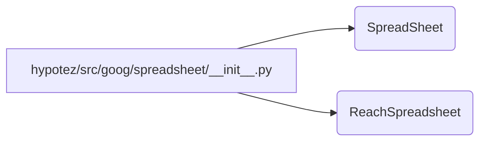

# <input code>

```python
## \file hypotez/src/goog/spreadsheet/__init__.py
# -*- coding: utf-8 -*-
#! venv/Scripts/python.exe
#! venv/bin/python/python3.12

"""
.. module: src.goog.spreadsheet 
	:platform: Windows, Unix
	:synopsis:

"""
MODE = 'dev'


from .spreadsheet import SpreadSheet
from .reach_spreadsheet import ReachSpreadsheet
```

# <algorithm>

Пошаговая блок-схема отсутствует, так как код состоит из импортов и определения константы.  Логики исполнения нет, только импорт.

# <mermaid>



**Описание диаграммы:**

Диаграмма представляет собой простую блок-схему, отображающую импорты из модулей `spreadsheet` и `reach_spreadsheet` в текущий модуль `__init__.py`.  Из файла `hypotez/src/goog/spreadsheet/__init__.py` импортируются классы `SpreadSheet` и `ReachSpreadsheet`, которые находятся в подпапках `spreadsheet` и `reach_spreadsheet` соответственно.

# <explanation>

* **Импорты:**

```python
from .spreadsheet import SpreadSheet
from .reach_spreadsheet import ReachSpreadsheet
```

Эти строки импортируют классы `SpreadSheet` и `ReachSpreadsheet` из подпапок `spreadsheet` и `reach_spreadsheet` внутри текущей директории `hypotez/src/goog/spreadsheet`.  Символ `.` означает, что модули находятся в подпапках, относящихся к этому файлу (`__init__.py`).   Связь с другими частями проекта напрямую представлена в импортах. Этот код подразумевает, что в папках `spreadsheet` и `reach_spreadsheet` находятся файлы с определениями классов `SpreadSheet` и `ReachSpreadsheet`.

* **Константа:**

```python
MODE = 'dev'
```

Эта строка определяет константу `MODE` со значением `'dev'`.  Скорее всего, эта константа используется для выбора режима работы (например, `dev`, `prod`) в приложении.

* **Классы (`SpreadSheet`, `ReachSpreadsheet`):**

Классы `SpreadSheet` и `ReachSpreadsheet` определены в других модулях (`hypotez/src/goog/spreadsheet/spreadsheet.py` и `hypotez/src/goog/spreadsheet/reach_spreadsheet.py`) и импортируются в текущий модуль.  В этом файле (`__init__.py`) нет логики работы с этими классами, только их импорт.  Чтобы понять их работу, нужно посмотреть определения этих классов в соответствующих файлах.

* **Возможные ошибки или улучшения:**

    * Нет проверок импортируемых объектов. Если `spreadsheet` или `reach_spreadsheet` отсутствуют, код выдаст ошибку. Рекомендуется добавить проверки наличия этих файлов при импорте.
    * Отсутствует документация для константы `MODE`.  Добавьте docstring для лучшей читаемости кода.

* **Цепочка взаимосвязей:**

Этот `__init__.py` файл служит как точка входа для взаимодействия с другими модулями, связанными с работой с Google Spreadsheets.  Он импортирует классы, необходимые для работы.  Дальнейшие действия, такие как инициализация, использование этих классов, находятся в других частях приложения.  Модули, в которые происходит импорт, вероятно, содержат функции и классы для взаимодействия с Google Spreadsheet API.


**Общий вывод:**

Код представляет собой простейший `__init__.py` файл, который служит для импорта необходимых классов и констант из других модулей. Это типичный шаблон для организации кода в Python-проектах.  Для понимания полной функциональности нужно рассмотреть код `spreadsheet.py` и `reach_spreadsheet.py`.