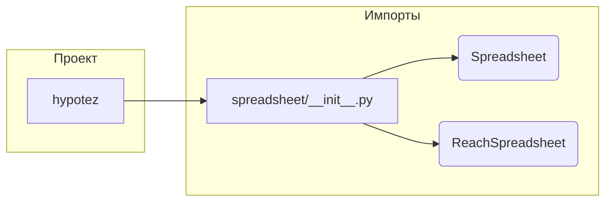

# Анализ кода hypotez/src/goog/spreadsheet/__init__.py

## <input code>

```python
## \file hypotez/src/goog/spreadsheet/__init__.py
# -*- coding: utf-8 -*-
#! venv/Scripts/python.exe
#! venv/bin/python/python3.12

"""
.. module: src.goog.spreadsheet 
	:platform: Windows, Unix
	:synopsis:

"""
MODE = 'dev'


from .spreadsheet import SpreadSheet
from .reach_spreadsheet import ReachSpreadsheet
```

## <algorithm>

В данном файле нет алгоритма в привычном смысле, так как он не содержит циклов или сложных вычислений.  Он просто импортирует классы из модулей `spreadsheet` и `reach_spreadsheet`.

Шаг 1: Импортировать класс `Spreadsheet` из модуля `spreadsheet`.
Шаг 2: Импортировать класс `ReachSpreadsheet` из модуля `reach_spreadsheet`.

Пример:
```python
from hypotez.src.goog.spreadsheet import SpreadSheet # Пример использования
```


## <mermaid>



## <explanation>

Этот файл `__init__.py` — это инициализирующий модуль для пакета `goog.spreadsheet` внутри проекта `hypotez`.  Он играет ключевую роль в импорте необходимых классов и модулей.

**Импорты:**

* `from .spreadsheet import SpreadSheet`: Импортирует класс `SpreadSheet` из модуля `spreadsheet`, находящегося в той же директории. Значок `.` перед именем модуля означает импорт из подпапки `spreadsheet`. Это типичная практика для модулей Python.  
* `from .reach_spreadsheet import ReachSpreadsheet`: Импортирует класс `ReachSpreadsheet` из модуля `reach_spreadsheet`, также находящегося в той же директории.

**Классы:**

* `SpreadSheet`, `ReachSpreadsheet`:  Эти классы, вероятно, определены в модулях `spreadsheet.py` и `reach_spreadsheet.py` соответственно, и предоставляют функциональность для работы с Google Таблицами (или подобными сервисами).  Подробное описание их функциональности  можно найти в этих модулях.


**Переменные:**

* `MODE = 'dev'`:  Эта переменная определяет режим работы приложения, вероятно, для настройки поведения кода или конфигурации.

**Возможные ошибки и улучшения:**

* **Документация:** Не хватает подробной документации к классам `SpreadSheet` и `ReachSpreadsheet` для понимания их функциональности, атрибутов и методов. Добавление docstrings к этим классам улучшило бы читаемость и поддержку кода.
* **Использование констант:** Лучше было бы использовать константы для режима `MODE` с использованием `UPPERCASE`.
* **Обработка исключений:**  В этом файле нет обработки исключений, возникших при импорте классов. В реальном коде необходимо предусмотреть обработку таких ситуаций, чтобы предотвратить сбой программы при сбое импорта.

**Взаимосвязь с другими частями проекта:**

Файл `__init__.py`  служит посредником между внешним кодом и классами, которые он импортирует.  Это означает, что код, который использует этот пакет, сможет импортировать необходимые классы, такие как `SpreadSheet` и `ReachSpreadsheet`, без необходимости знать внутреннюю структуру пакета.  Далее, `SpreadSheet` и `ReachSpreadsheet` (скорее всего) используют библиотеку `google-api-python-client`, обеспечивающую взаимодействие с Google Cloud Platform.  Это указывает на связь с другими частями проекта, связанными с обработкой Google Spreadsheet.