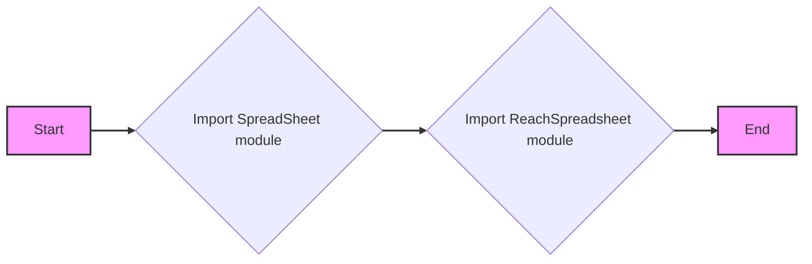
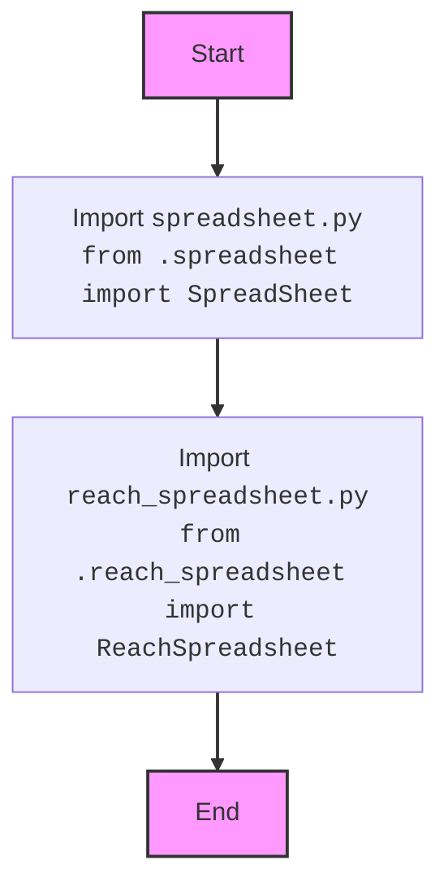

## АНАЛИЗ КОДА: `src/goog/spreadsheet/__init__.py`

### 1. <алгоритм>

**Общее описание:**

Файл `__init__.py` в пакете `src.goog.spreadsheet` служит точкой входа для этого подмодуля. Он импортирует классы `SpreadSheet` и `ReachSpreadsheet` из соответствующих модулей, делая их доступными для использования при импорте самого пакета `src.goog.spreadsheet`.

**Пошаговая блок-схема:**

**Примеры:**

1.  `from src.goog import spreadsheet`: Импортирует пакет, делая `SpreadSheet` и `ReachSpreadsheet` доступными через `spreadsheet.SpreadSheet` и `spreadsheet.ReachSpreadsheet` соответственно.
2.  `from src.goog.spreadsheet import SpreadSheet`: Импортирует класс `SpreadSheet` напрямую.
3.  `from src.goog.spreadsheet import ReachSpreadsheet`: Импортирует класс `ReachSpreadsheet` напрямую.

### 2. <mermaid>

**Анализ зависимостей:**

*   `from .spreadsheet import SpreadSheet`: Импортирует класс `SpreadSheet` из модуля `spreadsheet.py`, находящегося в той же директории. Это означает, что функциональность для работы с гугл-таблицами, вероятно, определена в классе `SpreadSheet` в файле `spreadsheet.py`.
*   `from .reach_spreadsheet import ReachSpreadsheet`: Импортирует класс `ReachSpreadsheet` из модуля `reach_spreadsheet.py`, также находящегося в той же директории. Это указывает на наличие функциональности, связанной с "достижением" или специальными операциями над гугл-таблицами, определенной в классе `ReachSpreadsheet` в файле `reach_spreadsheet.py`.

### 3. <объяснение>

**Импорты:**

*   `from .spreadsheet import SpreadSheet`:
    *   Импортирует класс `SpreadSheet` из модуля `spreadsheet.py`, находящегося в той же директории (`src/goog/spreadsheet`). Это обеспечивает доступ к функциональности, связанной с базовыми операциями над Google-таблицами, такими как чтение, запись, создание и т.д., через класс `SpreadSheet`.
    *   Использование `.` в `from .spreadsheet` означает, что импорт происходит из текущего пакета.
*   `from .reach_spreadsheet import ReachSpreadsheet`:
    *   Импортирует класс `ReachSpreadsheet` из модуля `reach_spreadsheet.py`, который также находится в текущем пакете. Это предоставляет функциональность для расширенных или специальных операций с Google-таблицами, возможно, связанных с "охватом" или специфическими запросами к данным.

**Взаимосвязь с другими пакетами `src.`:**

Файл `__init__.py` является частью пакета `src.goog.spreadsheet`. Он обеспечивает интерфейс для доступа к функциональности работы с Google-таблицами, предоставляя классы `SpreadSheet` и `ReachSpreadsheet`, которые, вероятно, используют другие части `src` (например, `src.auth` для авторизации, если требуется).

**Классы:**

*   `SpreadSheet`:
    *   Роль: Представляет абстракцию для работы с Google-таблицей.
    *   Атрибуты и методы: (не определены в этом файле) В файле `spreadsheet.py` будут атрибуты, представляющие состояние таблицы (например, идентификатор, заголовок) и методы для операций с данными (чтение, запись, обновление).
    *   Взаимодействие:  Используется для базовых операций с Google-таблицами, возможно, взаимодействует с другими модулями для аутентификации и API Google Sheets.
*   `ReachSpreadsheet`:
    *   Роль:  Представляет расширенные или специальные операции над Google-таблицами, возможно, ориентированные на "достижение" определенных целей.
    *   Атрибуты и методы: (не определены в этом файле) В файле `reach_spreadsheet.py` будут атрибуты и методы, ориентированные на специальные операции, возможно, с более сложной логикой.
    *   Взаимодействие: Может использовать `SpreadSheet` или напрямую взаимодействовать с API Google Sheets, вероятно, требует доступа к аутентификационным данным.

**Функции:**

В этом файле нет функций, он отвечает за импорт и экспорт классов.

**Переменные:**

В этом файле нет явных переменных, только импорты.

**Потенциальные ошибки и области для улучшения:**

*   **Отсутствие документации:** Файл `__init__.py` имеет docstring, но она не описывает конкретные классы и их функциональность. Рекомендуется добавить документацию для каждого класса (`SpreadSheet` и `ReachSpreadsheet`) в их соответствующих файлах.
*   **Неявные зависимости:**  Классы `SpreadSheet` и `ReachSpreadsheet` вероятно зависят от других частей проекта (например, аутентификации). Эти зависимости не определены в данном файле, что может усложнить отладку.
*   **Абстракция:**  Хотя `__init__.py` предоставляет интерфейс к модулям, сами классы могут быть расширены для более гибкого использования.

**Цепочка взаимосвязей с другими частями проекта:**

*   `src.goog.spreadsheet`  зависит от:
    *   `src.goog.spreadsheet.spreadsheet`: для базовых операций с таблицами.
    *   `src.goog.spreadsheet.reach_spreadsheet`: для расширенных операций с таблицами.
    *   Возможно от других модулей, например, `src.auth` для аутентификации с Google API.
    *   В конечном итоге от Google Sheets API.

В целом, этот файл служит точкой входа в пакет `src.goog.spreadsheet` и предоставляет интерфейс для использования классов, реализующих логику работы с Google Sheets.