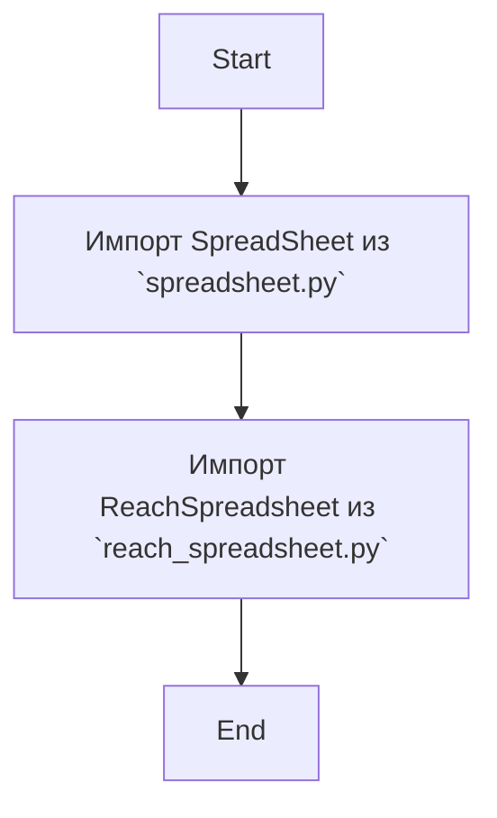
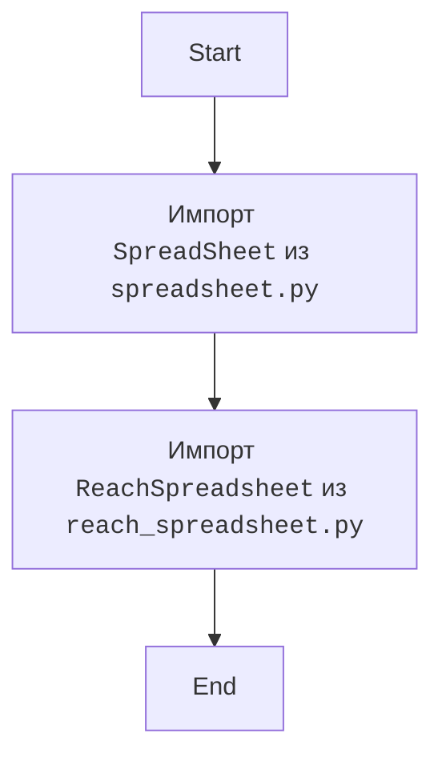

## АНАЛИЗ КОДА: `hypotez/src/goog/spreadsheet/__init__.py`

### <алгоритм>

1.  **Импорт `SpreadSheet`:**
    *   Импортирует класс `SpreadSheet` из модуля `src.goog.spreadsheet.spreadsheet`.
    *   Этот класс, вероятно, предоставляет функциональность для работы с Google Sheets.

2.  **Импорт `ReachSpreadsheet`:**
    *   Импортирует класс `ReachSpreadsheet` из модуля `src.goog.spreadsheet.reach_spreadsheet`.
    *   Этот класс, вероятно, расширяет или дополняет функциональность `SpreadSheet` с акцентом на "достижение" данных, возможно, с дополнительными методами для обработки или получения данных.

**Пример потока данных:**

### <mermaid>

**Объяснение `mermaid`:**

Диаграмма `mermaid` отражает последовательность импорта классов. Сначала импортируется класс `SpreadSheet`, затем класс `ReachSpreadsheet`. Эти классы предоставляют основные строительные блоки для работы с электронными таблицами Google.

### <объяснение>

**Импорты:**

*   `from .spreadsheet import SpreadSheet`:
    *   Импортирует класс `SpreadSheet` из модуля `spreadsheet.py`, находящегося в той же директории (`src/goog/spreadsheet`).
    *   Этот класс, вероятно, инкапсулирует логику для взаимодействия с Google Sheets API, включая чтение, запись и обновление данных в таблицах.
    *   Он является частью пакета `src.goog.spreadsheet`, предоставляющего специализированную функциональность для работы с Google Sheets.

*   `from .reach_spreadsheet import ReachSpreadsheet`:
    *   Импортирует класс `ReachSpreadsheet` из модуля `reach_spreadsheet.py`, который находится в той же директории, что и `__init__.py`.
    *   `ReachSpreadsheet`, вероятно, расширяет `SpreadSheet` или добавляет специализированную логику, связанную с "достижением" (возможно, получением и обработкой) данных в Google Sheets.
    *   Он также является частью пакета `src.goog.spreadsheet` и взаимодействует с `SpreadSheet` или его API.

**Классы:**

*   **`SpreadSheet`:**
    *   Предположительно, это базовый класс для работы с Google Sheets.
    *   Он, вероятно, предоставляет методы для:
        *   Аутентификации в Google Sheets API.
        *   Чтения данных из листов.
        *   Записи данных в листы.
        *   Создания и удаления листов.
    *   Возможные атрибуты:
        *   `credentials`: Учетные данные Google API.
        *   `spreadsheet_id`: ID таблицы Google Sheets.
    *   Методы:
        *   `get_data(range)`: Получение данных из указанного диапазона.
        *   `update_data(range, values)`: Обновление данных в указанном диапазоне.
        *   `create_sheet(name)`: Создание нового листа.
*   **`ReachSpreadsheet`:**
    *   Предположительно, расширяет класс `SpreadSheet` или добавляет специфические методы для извлечения или манипулирования данными.
    *   Может включать методы для:
        *   Поиска данных по определенным критериям.
        *   Агрегации данных.
        *   Выполнения дополнительных преобразований данных.
    *   Методы:
        *   `find_by_column(column, value)`: Поиск данных в колонке.
        *   `summarize_data(range)`: Суммирование данных в диапазоне.
        *   `format_data(data)`: Приведение данных к требуемому формату.
        
**Цепочка взаимосвязей:**

1.  `__init__.py` импортирует классы `SpreadSheet` и `ReachSpreadsheet` из соответствующих модулей.
2.  Эти классы, вероятно, используют Google Sheets API для взаимодействия с электронными таблицами.
3.  `ReachSpreadsheet` может использовать функциональность `SpreadSheet` для доступа к таблице и дальнейшей обработки данных.
4.  Пакет `src.goog.spreadsheet` предоставляет высокоуровневый интерфейс для работы с Google Sheets для других частей проекта.

**Потенциальные ошибки и области для улучшения:**

1.  **Отсутствие подробной документации:** Код не содержит подробных docstring для классов и модулей, что затрудняет понимание его функциональности.
2.  **Обработка ошибок:** Неясно, как обрабатываются ошибки, возникающие при работе с API Google Sheets (например, ошибки аутентификации, ошибки сети).
3.  **Тестирование:** Неясно, есть ли в проекте тесты для проверки корректности работы с Google Sheets.
4.  **Расширяемость:** Если проект планируется расширять, может потребоваться рефакторинг классов для более удобной поддержки новых функций.

**Дополнительно:**
- Данный файл `__init__.py` действует как точка входа для пакета `src.goog.spreadsheet`, делая классы `SpreadSheet` и `ReachSpreadsheet` доступными для импорта из других частей проекта.