## <алгоритм>

1.  **Начало**:
    *   Инициализация: Задаётся режим `MODE = 'debug'`.
    *   Подготовка: В HTML-документе описывается задача по созданию Google-таблицы через Python API.
    *   Установка: Предлагается установить библиотеку `google-api-python-client` через pip.

2.  **Создание Service-объекта**:
    *   Импорт: Импортируются необходимые модули `httplib2`, `apiclient.discovery` и `oauth2client.service_account`.
    *   Аутентификация: Считываются учетные данные сервисного аккаунта из JSON-файла (`CREDENTIALS_FILE`).
    *   Авторизация: Создаётся HTTP-объект для авторизации.
    *   Инициализация сервиса: Создаётся объект `service` для взаимодействия с Google Sheets API v4.

3.  **Создание Spreadsheet**:
    *   Запрос: Создаётся запрос к API на создание нового документа.
    *   Параметры: Задаются свойства документа (название, локаль) и первого листа (тип, ID, название, размеры).
    *   Выполнение: Запрос выполняется, и получается объект Spreadsheet с `spreadsheetId`.
    *   Пример:
        *   **Запрос**:
        ```python
            spreadsheet = service.spreadsheets().create(body = {
                'properties': {'title': 'Сие есть название документа', 'locale': 'ru_RU'},
                'sheets': [{'properties': {'sheetType': 'GRID',
                                        'sheetId': 0,
                                        'title': 'Сие есть название листа',
                                        'gridProperties': {'rowCount': 8, 'columnCount': 5}}}]
            }).execute()
        ```
        *   **Результат**: Объект Spreadsheet с `spreadsheetId`.

4.  **Настройка доступа**:
    *   Создание Drive Service: Создаётся объект `driveService` для работы с Google Drive API.
    *   Запрос доступа: Создаётся запрос на выдачу доступа к созданному документу (например, доступ на чтение для всех).
    *    Пример:
        *   **Запрос**:
            ```python
                shareRes = driveService.permissions().create(
                    fileId = spreadsheet['spreadsheetId'],
                    body = {'type': 'anyone', 'role': 'reader'},
                    fields = 'id'
                ).execute()
            ```
        *   **Результат**: Доступ к документу предоставлен.

5.  **Настройка ширины столбцов**:
    *   `UpdateDimensionPropertiesRequest`:  Формируются запросы для изменения ширины столбцов A, B, C/D, E.
    *   `spreadsheets.batchUpdate`: Запросы отправляются в Google Sheets API.
    *   Пример:
        *   **Запрос**:
             ```python
            results = service.spreadsheets().batchUpdate(spreadsheetId = spreadsheet['spreadsheetId'], body = {
            "requests": [
                {
                "updateDimensionProperties": {
                    "range": {
                    "sheetId": 0,
                    "dimension": "COLUMNS",
                    "startIndex": 0,
                    "endIndex": 1
                    },
                    "properties": {
                    "pixelSize": 317
                    },
                    "fields": "pixelSize"
                }
                },
                {
                "updateDimensionProperties": {
                    "range": {
                    "sheetId": 0,
                    "dimension": "COLUMNS",
                    "startIndex": 1,
                    "endIndex": 2
                    },
                    "properties": {
                    "pixelSize": 200
                    },
                    "fields": "pixelSize"
                }
                },
                {
                "updateDimensionProperties": {
                    "range": {
                    "sheetId": 0,
                    "dimension": "COLUMNS",
                    "startIndex": 2,
                    "endIndex": 4
                    },
                    "properties": {
                    "pixelSize": 165
                    },
                    "fields": "pixelSize"
                }
                },
                {
                "updateDimensionProperties": {
                    "range": {
                    "sheetId": 0,
                    "dimension": "COLUMNS",
                    "startIndex": 4,
                    "endIndex": 5
                    },
                    "properties": {
                    "pixelSize": 100
                    },
                    "fields": "pixelSize"
                }
                }
            ]
            }).execute()
            ```
        *   **Результат**: Ширина столбцов изменена.

6.  **Класс-обертка Spreadsheet**:
    *   Инкапсуляция: Создаётся класс `Spreadsheet` для управления запросами к Sheets API.
    *   Методы:
        *   `prepare_setDimensionPixelSize`:  Добавляет запрос на изменение размера столбцов/строк.
        *   `prepare_setColumnsWidth`: Добавляет запрос на изменение ширины столбцов.
        *   `prepare_setColumnWidth`: Добавляет запрос на изменение ширины конкретного столбца.
        *   `prepare_setValues`: Добавляет запрос на обновление значений в диапазоне ячеек.
        *   `runPrepared`: Выполняет подготовленные запросы.
    *   Пример:
        *   **Использование**:
           ```python
            ss = Spreadsheet(...)
            ss.prepare_setColumnWidth(0, 317)
            ss.prepare_setColumnWidth(1, 200)
            ss.prepare_setColumnsWidth(2, 3, 165)
            ss.prepare_setColumnWidth(4, 100)
            ss.runPrepared()
            ```
        *   **Результат**: Ширина столбцов изменяется с помощью методов класса.

7.  **Заполнение данными**:
    *   `spreadsheets.values.batchUpdate`: Выполняется запрос для заполнения ячеек данными (текст, формулы).
    *    Пример:
        *   **Запрос**:
             ```python
                results = service.spreadsheets().values().batchUpdate(spreadsheetId = spreadsheet['spreadsheetId'], body = {
                    "valueInputOption": "USER_ENTERED",
                    "data": [
                        {"range": "Сие есть название листа!B2:C3",
                        "majorDimension": "ROWS",
                        "values": [["This is B2", "This is C2"], ["This is B3", "This is C3"]]},
                        {"range": "Сие есть название листа!D5:E6",
                        "majorDimension": "COLUMNS",
                        "values": [["This is D5", "This is D6"], ["This is E5", "=5+5"]]}
                    ]
                }).execute()
             ```
        *   **Результат**: Ячейки заполнены данными.
        *  **Использование класса**:
            ```python
                ss.prepare_setValues("B2:C3", [["This is B2", "This is C2"], ["This is B3", "This is C3"]])
                ss.prepare_setValues("D5:E6", [["This is D5", "This is D6"], ["This is E5", "=5+5"]], "COLUMNS")
                ss.runPrepared()
            ```

8.  **Объединение и форматирование ячеек**:
    *   `MergeCellsRequest`: Объединение ячеек.
    *   `RepeatCellRequest`: Изменение формата ячеек (жирность, выравнивание, формат отображения, цвет фона).
    *   `UpdateCellsRequest`: Индивидуальные изменения для каждой ячейки.
    *   `UpdateBordersRequest`: Установка границ ячеек.

9.  **Конец**: Описание тонкостей работы с API (локаль, формат продолжительности, GridRange, квоты) и заключение.

```mermaid
graph LR
    A[Начало] --> B(Инициализация);
    B --> C{Создание Service-объекта};
    C --> D[Аутентификация];
    D --> E[Инициализация сервиса Google Sheets API];
    E --> F{Создание Spreadsheet};
    F --> G[Запрос к API для создания документа];
    G --> H(Получение spreadsheetId);
    H --> I{Настройка доступа к документу};
    I --> J[Создание Drive Service];
    J --> K[Запрос к API для настройки прав доступа];
    K --> L(Доступ предоставлен);
    L --> M{Настройка ширины столбцов};
    M --> N[Формирование UpdateDimensionPropertiesRequest];
    N --> O[Отправка запросов через spreadsheets.batchUpdate];
    O --> P(Ширина столбцов изменена);
    P --> Q{Создание класса Spreadsheet};
    Q --> R[Методы prepare_*];
    R --> S[Метод runPrepared];
    S --> T{Заполнение данными};
    T --> U[Формирование запроса spreadsheets.values.batchUpdate];
    U --> V(Ячейки заполнены данными);
    V --> W{Форматирование ячеек};
    W --> X[MergeCellsRequest];
    X --> Y[RepeatCellRequest];
    Y --> Z[UpdateCellsRequest];
    Z --> AA[UpdateBordersRequest];
    AA --> BB(Форматирование завершено);
    BB --> CC[Конец];
     style A fill:#f9f,stroke:#333,stroke-width:2px
     style B fill:#ccf,stroke:#333,stroke-width:2px
    style C fill:#ccf,stroke:#333,stroke-width:2px
    style D fill:#ccf,stroke:#333,stroke-width:2px
    style E fill:#ccf,stroke:#333,stroke-width:2px
     style F fill:#ccf,stroke:#333,stroke-width:2px
    style G fill:#ccf,stroke:#333,stroke-width:2px
     style H fill:#ccf,stroke:#333,stroke-width:2px
    style I fill:#ccf,stroke:#333,stroke-width:2px
     style J fill:#ccf,stroke:#333,stroke-width:2px
    style K fill:#ccf,stroke:#333,stroke-width:2px
      style L fill:#ccf,stroke:#333,stroke-width:2px
    style M fill:#ccf,stroke:#333,stroke-width:2px
    style N fill:#ccf,stroke:#333,stroke-width:2px
    style O fill:#ccf,stroke:#333,stroke-width:2px
     style P fill:#ccf,stroke:#333,stroke-width:2px
     style Q fill:#ccf,stroke:#333,stroke-width:2px
     style R fill:#ccf,stroke:#333,stroke-width:2px
     style S fill:#ccf,stroke:#333,stroke-width:2px
    style T fill:#ccf,stroke:#333,stroke-width:2px
     style U fill:#ccf,stroke:#333,stroke-width:2px
    style V fill:#ccf,stroke:#333,stroke-width:2px
     style W fill:#ccf,stroke:#333,stroke-width:2px
   style X fill:#ccf,stroke:#333,stroke-width:2px
   style Y fill:#ccf,stroke:#333,stroke-width:2px
  style Z fill:#ccf,stroke:#333,stroke-width:2px
  style AA fill:#ccf,stroke:#333,stroke-width:2px
  style BB fill:#ccf,stroke:#333,stroke-width:2px
    style CC fill:#f9f,stroke:#333,stroke-width:2px
```

## <mermaid>



**Зависимости:**

*   `httplib2`: Используется для выполнения HTTP-запросов.
*   `apiclient.discovery`: Используется для построения сервисных объектов для взаимодействия с Google APIs.
*   `oauth2client.service_account`: Используется для аутентификации сервисного аккаунта.

## <объяснение>

### Импорты:
*   **`httplib2`**:  
    -   **Назначение**: HTTP-клиент для отправки запросов к Google API.  
    -   **Связь**: Используется `oauth2client` для авторизации и последующего взаимодействия с API.
*   **`apiclient.discovery`**:  
    -   **Назначение**:  Используется для динамического построения API-клиентов, позволяя коду не зависеть от конкретных версий API.
    -   **Связь**:  Создаёт объекты сервисов (например, `service` для Sheets API, `driveService` для Drive API), которые затем используются для выполнения запросов к Google API.
*   **`oauth2client.service_account`**:  
    -   **Назначение**: Предоставляет механизм аутентификации с использованием учетных данных сервисного аккаунта.
    -   **Связь**:  Позволяет приложению авторизоваться от имени сервисного аккаунта и получать доступ к Google Sheets и Drive API.

### Классы:
*   **`Spreadsheet`**:
    *   **Роль**: Класс-обертка для упрощения работы с Google Sheets API v4.
    *   **Атрибуты**:
        - `service`: Объект API-сервиса Google Sheets.
        -   `spreadsheetId`: ID Google-документа.
        -   `sheetId`: ID текущего листа.
        -   `sheetTitle`: Название текущего листа.
        -   `requests`: Список подготовленных запросов на изменение форматирования.
        -   `valueRanges`: Список диапазонов ячеек и их значений для обновления.
    *   **Методы**:
        -   `__init__(self, service, spreadsheetId, sheetId, sheetTitle)`:  Конструктор класса.
        -   `prepare_setDimensionPixelSize(self, dimension, startIndex, endIndex, pixelSize)`: Добавляет запрос на изменение размера столбцов/строк.
        -   `prepare_setColumnsWidth(self, startCol, endCol, width)`: Добавляет запрос на изменение ширины столбцов.
        -   `prepare_setColumnWidth(self, col, width)`: Добавляет запрос на изменение ширины конкретного столбца.
        -    `prepare_setValues(self, cellsRange, values, majorDimension="ROWS")`: Добавляет запрос на обновление значений в диапазоне ячеек.
        -   `runPrepared(self, valueInputOption="USER_ENTERED")`: Выполняет подготовленные запросы.
        -  `toGridRange(self, cellsRange)`: Преобразует строковый диапазон ячеек (A1-нотация) в GridRange (словарь с индексами).
        - `prepare_mergeCells(self, cellsRange)`: Добавляет запрос на объединение ячеек.
        - `prepare_setCellsFormat(self, cellsRange, cellFormat, fields="userEnteredFormat")`: Добавляет запрос на изменение формата ячеек.
         - `prepare_setCellsFormats(self, cellsRange, cellFormats, fields="userEnteredFormat")`: Добавляет запрос на изменение формата ячеек с разными форматами.
        - `prepare_setBorders(self, cellsRange, borders)`: Добавляет запрос на установку границ.
    *   **Взаимодействие**:
        -   Класс `Spreadsheet` инкапсулирует логику взаимодействия с Google Sheets API, предоставляя удобные методы для настройки и управления таблицами.
        -   Экземпляр класса использует объект `service` (созданный на основе `apiclient.discovery`) для отправки запросов к API.
        -  Методы `prepare_*`  добавляют запросы в очередь, а `runPrepared` отправляет их группами, повышая эффективность.

### Функции:
*   В коде присутствуют только методы класса `Spreadsheet` и функции библиотеки `apiclient`.

### Переменные:
*   `MODE`: Строковая переменная, определяющая режим работы скрипта, в примере имеет значение `debug`.
*   `CREDENTIALS_FILE`: Строковая переменная, содержащая путь к файлу с учетными данными сервисного аккаунта.
*   `credentials`: Объект, представляющий учетные данные сервисного аккаунта, полученный из `ServiceAccountCredentials`.
*   `httpAuth`: Объект, представляющий авторизованный HTTP-клиент.
*   `service`: Объект сервиса Google Sheets API v4, созданный с использованием `apiclient.discovery.build`.
*   `driveService`: Объект сервиса Google Drive API v3, созданный с использованием `apiclient.discovery.build`.
*   `spreadsheet`: Объект, представляющий созданный Google Spreadsheet, содержащий metadata, включая spreadsheetId.
*   `shareRes`: Объект ответа на запрос доступа к документу.
*   `results`: Объект ответа на запрос к API на обновление ширины столбцов или ячеек.
*   `ss`: Экземпляр класса `Spreadsheet`, используемый для работы с таблицей.

### Потенциальные ошибки и области для улучшения:
1.  **Обработка ошибок**:  В коде не хватает явной обработки ошибок при выполнении API-запросов. Необходимо добавить try-except блоки для обработки исключений, которые могут возникнуть в процессе взаимодействия с API.
2.  **Разбиение на модули**: Логику класса `Spreadsheet` можно разбить на несколько модулей, чтобы улучшить ее читаемость и масштабируемость.
3.  **Динамическое определение размеров**:  Текущий код хардкодит размеры столбцов, строк. Желательно использовать автоматический расчет, либо конфигурационные файлы.
4.  **Проверка входных данных**:  Методы класса `Spreadsheet` не проверяют корректность входных данных (например, диапазоны ячеек, форматы). Добавление проверок позволит избежать ошибок времени выполнения.
5.  **Комментарии**: Код содержит места с копипастой, и некоторые сложные моменты не описаны в комментариях.

### Взаимосвязи с другими частями проекта:
*  Данный код является частью модуля `src.goog.spreadsheet._docs`, и взаимодействует непосредственно с Google Sheets и Drive API.
*  Класс `Spreadsheet` может использоваться другими модулями, которым необходимо создавать и модифицировать Google-таблицы.

### Дополнительные замечания:
*   Код демонстрирует взаимодействие с Google Sheets API v4 для создания и форматирования таблиц.
*   Он предоставляет абстракцию над низкоуровневым API, упрощая выполнение стандартных операций.
*   Класс `Spreadsheet` является полезным инструментом для автоматизации работы с Google-таблицами в Python.