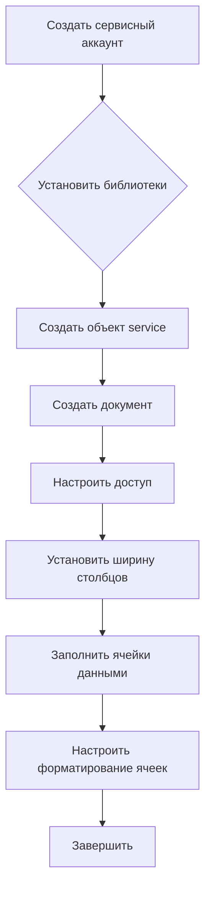
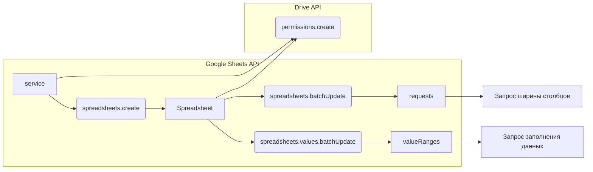

# Код для работы с Google Sheets API v4

```
## \file hypotez/src/goog/spreadsheet/_docs/index.html
# -*- coding: utf-8 -*-
#! venv/Scripts/python.exe

""" module: src.goog.spreadsheet._docs """
MODE = 'debug'
<div class="article-formatted-body article-formatted-body article-formatted-body_version-1"><div xmlns="http://www.w3.org/1999/xhtml"><h2>Постановка задачи</h2><br>
    Пусть нам нужно создать программой на языке Python <a href="https://docs.google.com/spreadsheets/d/1kygOW5wSSVqwf26M-OCT72i0FX0olZAz4duT2i6psp4/edit?usp=sharing">вот такую таблицу</a>:<br>
    <br>
    <a href="https://habrahabr.ru/post/305378/"></a><br>
    <br>
    ... (описание задачи)
```

## <algorithm>



**Пример:**

1. **Создать сервисный аккаунт:**  Создание учетной записи Google для приложения.
2. **Установить библиотеки:** Скачать `google-api-python-client`.
3. **Создать объект service:** Инициализировать подключение к Google Sheets API.
4. **Создать документ:**  Создать новый документ в Google Таблицах.
5. **Настроить доступ:** Предоставить сервисному аккаунту доступ к документу.
6. **Установить ширину столбцов:** Установить ширину столбцов таблицы.
7. **Заполнить ячейки данными:** Вставить значения в ячейки.
8. **Настроить форматирование ячеек:** Изменить стиль, шрифт, цвет и т.д.
9. **Завершить:** Выполнить все запросы, закрыть сессии.

Данные передаются между этапами через переменные, хранящие результаты вызовов функций Google Sheets API.


## <mermaid>



**Описание зависимостей:**

* **Google Sheets API:** Используется для взаимодействия с Google Таблицами (функции `spreadsheets.create`, `spreadsheets.batchUpdate`, `spreadsheets.values.batchUpdate`).
* **Drive API:** Используется для управления доступом к созданному документу (функция `permissions.create`).


## <explanation>

* **Импорты:**
    * `httplib2`:  Библиотека для работы с HTTP-запросами, необходимая для взаимодействия с Google API.
    * `apiclient.discovery`:  Модуль для построения объектов API, упрощающий работу с Google API.
    * `oauth2client.service_account`:  Модуль для работы с учетными записями сервисов, необходим для аутентификации.
* **Классы:**
    * `Spreadsheet`:  Класс-обёртка над Google Sheets API, упрощающий работу с таблицей.  Хранит запросы (`requests`) и массивы значений (`valueRanges`) для последовательной обработки.  Методы `prepare_*` добавляют запросы в внутренние списки, а `runPrepared` выполняет их и очищает списки.
* **Функции:**
    * `spreadsheets.create`: Создает новый документ в Google Таблицах.
    * `spreadsheets.batchUpdate`: Обновляет документ, выполняя пакетную операцию.
    * `spreadsheets.values.batchUpdate`: Заполняет данные в указанные ячейки.
    * `permissions.create`: Устанавливает доступ к документу для сервисного аккаунта.
* **Переменные:**
    * `CREDENTIALS_FILE`:  Путь к файлу с ключом сервисного аккаунта.
    * `credentials`: Объект аутентификации.
    * `httpAuth`: Авторизованный HTTP-объект.
    * `service`: Объект Google Sheets API.
    * `spreadsheet`: Объект созданного документа.
    * `driveService`: Объект Google Drive API.


**Возможные ошибки и улучшения:**

* **Обработка ошибок:**  Код не содержит существенной обработки ошибок, например, исключений при подключении к API или некорректных запросах.  Добавление `try...except` блоков значительно повысит надежность.
* **Переиспользование кода:**  Класс `Spreadsheet` хорошо структурирует работу, но можно улучшить структуризацию, например, добавлением методов для различных операций с ячейками, в которых будут описаны дополнительные проверки корректности данных.
* **Документация:** Класс `Spreadsheet` и его методы должны быть дополнены подробной документацией, объясняющей их назначение, аргументы и возвращаемые значения.
* **Управление состоянием:** Лучше использовать контекстный менеджер для работы с Google API, чтобы гарантировать закрытие сессий.


**Цепочка взаимосвязей с другими частями проекта:**

Код предполагает наличие файла с ключом сервисного аккаунта (`test-proj-for-habr-article-1ab131d98a6b.json`).  Этот файл, скорее всего, генерируется в рамках процесса настройки сервисного аккаунта в Google Cloud Console и хранится в папке `hypotez/src/goog/spreadsheet`.