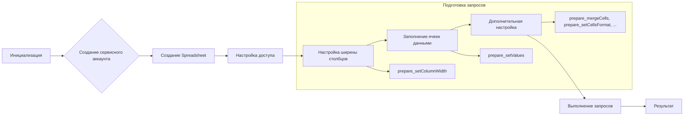

# Код Google Sheets API

```
## \file hypotez/src/goog/spreadsheet/_docs/index.html
# -*- coding: utf-8 -*-\
#! venv/Scripts/python.exe

""" module: src.goog.spreadsheet._docs """
MODE = 'debug'
<div class="article-formatted-body article-formatted-body article-formatted-body_version-1"><div xmlns="http://www.w3.org/1999/xhtml"><h2>Постановка задачи</h2><br>
    Пусть нам нужно создать программой на языке Python <a href="https://docs.google.com/spreadsheets/d/1kygOW5wSSVqwf26M-OCT72i0FX0olZAz4duT2i6psp4/edit?usp=sharing">вот такую таблицу</a>:<br>
    <br>
    <a href="https://habrahabr.ru/post/305378/"></a><br>
    ... (остальной код)
```

## Алгоритм работы

Данный код описывает процесс создания и настройки Google Sheet документа с использованием Google Sheets API v4.  Алгоритм можно разбить на несколько этапов:

1. **Инициализация:**
   - Импортируются необходимые библиотеки: `httplib2`, `apiclient.discovery`, `oauth2client.service_account`.
   - Задаётся путь к файлу с закрытым ключом сервисного аккаунта.
   - Получаются учетные данные (`credentials`) из JSON-файла с ключом.
   - Авторизуется `http`-клиент (`httpAuth`) с помощью учетных данных.
   - Создаётся `service`-объект для взаимодействия с Google Sheets API.

2. **Создание Spreadsheet:**
   - Создаётся новый `Spreadsheet`-документ с заданным именем и языковым стандартом (`ru_RU`).
   - Создаются листы (`sheet`) с заданными параметрами.  В данном случае, один лист по умолчанию.

3. **Настройка доступа:**
   - Используя `driveService`, предоставляется доступ к созданному документу с помощью сервисного аккаунта. Доступ на чтение всем пользователям.

4. **Настройка ширины столбцов:**
   - Используя `spreadsheets.batchUpdate`, создаётся и выполняется запрос на обновление размеров столбцов (`pixelSize`).  Запрос содержит список обновлений.
   - Методы `prepare_setColumnWidth` и `prepare_setColumnsWidth` в классе Spreadsheet собирают эти запросы.

5. **Заполнение ячеек данными:**
   - Используя `spreadsheets.values.batchUpdate`, заполняются данные в ячейки с использованием `majorDimension` для указания, строки или столбцы для заполнения.
   - Метод `prepare_setValues` в классе Spreadsheet собирает эти запросы.

6. **Дополнительная настройка:**
   - Можно добавить другие типы запросов (объединение ячеек, форматирование текста, цвета, границы), собирая их в `requests` в классе `Spreadsheet`.
   - Метод `runPrepared` выполняет все подготовленные запросы `batchUpdate`.
   - Результаты работы сохраняются в переменные `upd1Res` и `upd2Res`


## Mermaid



**Объяснение зависимостей:**

* `httplib2`: Библиотека для работы с HTTP-запросами. Используется для авторизации.
* `apiclient.discovery`: Библиотека для построения API-запросов.  Обеспечивает взаимодействие с Google Sheets API.
* `oauth2client.service_account`:  Модуль для работы с учетными данными сервисного аккаунта.
* `google-api-python-client`:  Основная библиотека, которая предоставляют API-клиенты, используемые для работы с различными Google API.  
    * `oauth2client` и другие зависимости импортируются через нее.


## Объяснение

**Импорты:**

- `httplib2`:  Для работы с HTTP-запросами, необходимыми для взаимодействия с API.
- `apiclient.discovery`:  Создаёт объекты API-клиентов, которые используются для выполнения запросов к Google Sheets API.
- `oauth2client.service_account`:  Упрощает процесс аутентификации, используя учетные данные сервисного аккаунта.

**Классы:**

- `Spreadsheet`:  Класс-обёртка над Google Sheets API.  Объект этого класса хранит подготовленные запросы и предоставляет методы для их выполнения в едином потоке, улучшая читабельность и структурируя работу с API. `requests` - список запросов на обновление таблицы. `valueRanges` - список запросов на занесение данных.

**Функции:**

- `prepare_setColumnWidth`/`prepare_setColumnsWidth`:  Подготавливают запросы на изменение размеров столбцов.
- `prepare_setValues`: Подготавливает запросы на заполнение ячеек.
- `runPrepared`:  Выполняет подготовленные запросы к Google Sheets API. Возвращает результат.

**Переменные:**

- `CREDENTIALS_FILE`: Путь к файлу с ключом сервисного аккаунта.
- `service`: Объект API-клиента для работы с Google Sheets API.
- `httpAuth`: Авторизованный HTTP-клиент.
- `spreadsheet`:  Результат выполнения запроса на создание документа, содержащий `spreadsheetId`.


**Возможные ошибки и улучшения:**

- **Обработка ошибок:** Код не содержит подробной обработки ошибок.  Нужно добавить `try...except` блоки для перехвата потенциальных исключений (например, проблем с подключением к API, ошибочных данных).
- **Более гибкие запросы:**  Класс `Spreadsheet` можно расширить для более сложных операций, таких как форматирование ячеек (шрифт, цвет, границы) или создание сложных формул.
- **Валидация данных:**  Добавление валидации входных данных для предотвращения ошибок.
- **Документация:**  Класс `Spreadsheet` должен быть более подробным, с документацией к методам и атрибутам.

**Взаимосвязи с другими частями проекта:**

- Проект использует Google Sheets API v4, что является внешней зависимостью.
- Проект использует `oauth2client` для работы с учетными данными.
- Проект явно предполагает наличие `test-proj-for-habr-article-1ab131d98a6b.json` и его корректное содержимое.

**Дополнительные замечания:**

Код изначально написан для конкретной задачи и демонстрирует методику организации работы с Google Sheets API.  Но его можно расширять и использовать в других проектах для создания и управления Google Sheet-документами.