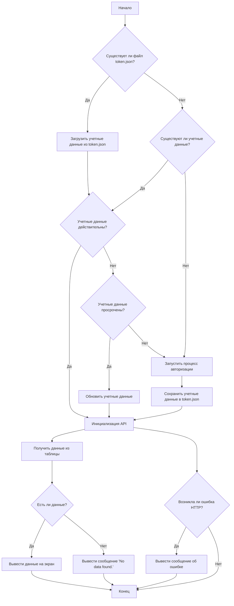

# Анализ кода `google_sample.py`

## <алгоритм>

1.  **Инициализация**:
    *   Устанавливается переменная `MODE = 'dev'`.
    *   Импортируются необходимые модули и библиотеки.
    *   Определяются константы: `SCOPES`, `SAMPLE_SPREADSHEET_ID`, `SAMPLE_RANGE_NAME` и `ROOT_DIRECTORY`.
    *   Формируется путь к файлу `client_secret.json` на основе `ROOT_DIRECTORY`.

2.  **Функция `main()`**:
    *   **Проверка учетных данных:**
        *   Инициализируется переменная `creds` в `None`.
        *   Проверяется наличие файла `token.json` (файл, содержащий токены доступа).
        *   Если файл существует, учетные данные загружаются из него (`creds = Credentials.from_authorized_user_file(path, SCOPES)`).
    *   **Получение/обновление учетных данных:**
        *   Если учетные данные отсутствуют или недействительны, происходит попытка обновления токена.
        *   Если токен не может быть обновлен, запускается процесс авторизации через веб-браузер. (`flow = InstalledAppFlow.from_client_secrets_file('credentials.json', SCOPES)`)
        *   Полученные учетные данные сохраняются в файл `token.json`.
    *   **Инициализация API**:
        *   Создается объект `service` для работы с Google Sheets API (`service = build('sheets', 'v4', credentials=creds)`).
    *   **Получение данных из таблицы**:
        *   Вызывается метод `get()` для получения данных из указанной таблицы и диапазона ячеек (`result = sheet.values().get(spreadsheetId=SAMPLE_SPREADSHEET_ID, range=SAMPLE_RANGE_NAME).execute()`).
    *   **Обработка и вывод данных**:
        *   Извлекаются значения из полученного результата.
        *   Если данные отсутствуют, выводится сообщение `No data found.`.
        *   Выводятся заголовки `Name, Major:`.
        *   В цикле по каждой строке выводятся значения из 0 и 4 столбцов.
    *   **Обработка ошибок**:
        *   Если происходит ошибка HTTP, выводится сообщение об ошибке.
3. **Запуск программы:**
    *  Проверяется, является ли скрипт головным (`if __name__ == '__main__':`).
    *  Если да, вызывается функция `main()`.

## <mermaid>

**Описание диаграммы `mermaid`:**

*   **A** (Начало): Начальная точка выполнения скрипта.
*   **B** (Существует ли файл `token.json`?): Проверка существования файла с сохраненными токенами.
*   **C** (Загрузить учетные данные из `token.json`): Загрузка сохраненных учетных данных из файла.
*   **D** (Существуют ли учетные данные?): Проверка наличия загруженных учетных данных.
*   **E** (Учетные данные действительны?): Проверка валидности загруженных учетных данных.
*   **F** (Запустить процесс авторизации): Запуск процесса авторизации пользователя через Google API.
*   **G** (Инициализация API): Создание объекта `service` для работы с Google Sheets API.
*   **H** (Учетные данные просрочены?): Проверка, просрочены ли учетные данные.
*   **I** (Обновить учетные данные): Обновление просроченных токенов.
*   **J** (Сохранить учетные данные в `token.json`): Сохранение новых учетных данных в файл.
*   **K** (Получить данные из таблицы): Получение данных из Google Sheets API.
*   **L** (Есть ли данные?): Проверка, вернула ли API какие-либо данные.
*   **M** (Вывести данные на экран): Вывод полученных данных на консоль.
*   **N** (Вывести сообщение 'No data found.'): Вывод сообщения, если данные не найдены.
*   **O** (Конец): Конечная точка выполнения скрипта.
*   **P** (Возникла ли ошибка HTTP?): Проверка на наличие ошибок HTTP при обращении к API.
*   **Q** (Вывести сообщение об ошибке): Вывод сообщения об ошибке HTTP.

## <объяснение>

### Импорты:

*   `os.path`: Для работы с путями к файлам (например, проверка существования файла `token.json`).
*   `pathlib.Path`: Для удобного создания путей к файлам и каталогам.
*   `google.auth.transport.requests.Request`: Используется для создания запросов при обновлении токена.
*   `google.oauth2.credentials.Credentials`: Для работы с учетными данными пользователя.
*   `google_auth_oauthlib.flow.InstalledAppFlow`: Для управления процессом авторизации.
*   `googleapiclient.discovery.build`: Для создания API-сервиса.
*   `googleapiclient.errors.HttpError`: Для обработки ошибок HTTP.
*   `from __future__ import print_function`: Обеспечивает совместимость функции `print` с версиями Python 2 и 3.

**Взаимосвязь с другими пакетами `src`**:
Данный скрипт является примером работы с Google Sheets API и находится в поддиректории `src.goog.spreadsheet._examples`, что говорит о том, что он связан с функциональностью Google Sheets в рамках более широкого проекта `src.goog.spreadsheet`.

### Переменные:

*   `MODE`: Строка, определяющая режим работы приложения (здесь 'dev').
*   `SCOPES`: Список строк, содержащих права доступа к Google API (здесь - чтение из Google Sheets).
*   `SAMPLE_SPREADSHEET_ID`: Строка, содержащая ID Google таблицы.
*   `SAMPLE_RANGE_NAME`: Строка, содержащая диапазон ячеек для чтения из Google таблицы.
*    `ROOT_DIRECTORY`: Объект `pathlib.Path`, представляющий абсолютный путь к текущей рабочей директории.
*   `path`: Объект `pathlib.Path`, представляющий путь к файлу `client_secret.json`.
*   `creds`: Объект `Credentials` или `None`, содержащий учетные данные.
*   `service`: Объект, представляющий API-сервис Google Sheets.
*   `sheet`: Объект, представляющий таблицу Google Sheets.
*   `result`: Словарь, содержащий результат запроса к Google Sheets API.
*   `values`: Список списков, представляющий значения из Google таблицы.

### Функции:

*   `main()`:
    *   **Аргументы**: Отсутствуют.
    *   **Возвращаемое значение**: Отсутствует (None).
    *   **Назначение**:
        *   Управляет процессом получения данных из Google Sheets.
        *   Авторизует пользователя через Google API.
        *   Извлекает данные из указанной таблицы и выводит их на экран.
    *   **Пример**: Функция выполняется при запуске скрипта, и в результате выводит на консоль значения из указанной Google таблицы.

### Классы:
  * `Credentials`: класс из `google.oauth2.credentials`, используемый для хранения учетных данных пользователя Google.

### Потенциальные ошибки и области для улучшения:

*   **Обработка ошибок**: В данный момент обработка ошибок ограничена выводом сообщения на экран. Можно улучшить обработку ошибок, добавив логирование или более детальный анализ ошибок.
*   **Конфигурация**: Файл `credentials.json` должен находиться в той же директории, что и скрипт или в другом месте с правильным указанием пути, это можно вынести в параметры для гибкости.
*   **Использование переменных**: Переменные `SAMPLE_SPREADSHEET_ID` и `SAMPLE_RANGE_NAME` можно сделать параметрами функции, чтобы можно было вызывать ее для разных таблиц и диапазонов.
*   **Безопасность**: Файл `client_secret.json` содержит секретные данные. Стоит подумать о безопасном хранении и передаче этой информации.
*  **Расширение функционала**: Можно добавить поддержку записи в Google Sheets, фильтрацию данных, форматирование и другие функции.

### Цепочка взаимосвязей с другими частями проекта:

*   Скрипт является частью пакета `src.goog.spreadsheet`, что предполагает наличие других модулей и классов, связанных с Google Sheets.
*   Скрипт использует общие библиотеки Google API, которые могут использоваться и в других частях проекта.
*   Скрипт может быть использован как пример для создания более сложных инструментов для работы с Google Sheets.

Данный анализ предоставляет подробное Разбор кода `google_sample.py`, включая его функциональность, структуру и взаимодействие с другими частями проекта.