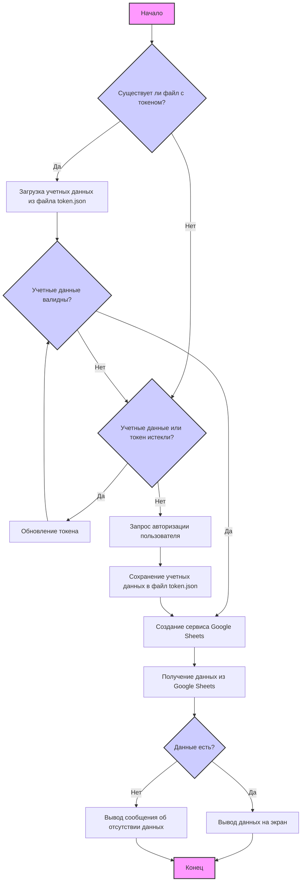
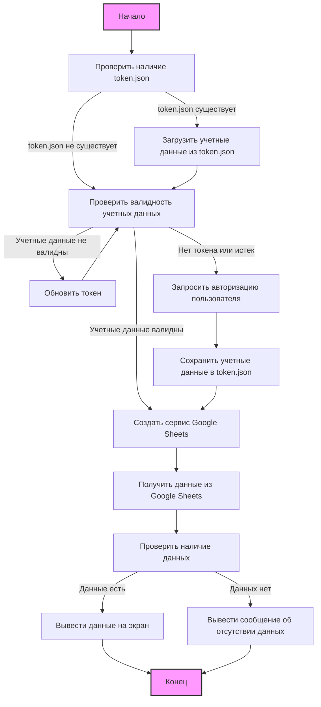

## ИНСТРУКЦИЯ:

Анализируй предоставленный код подробно и объясни его функциональность. Ответ должен включать три раздела:

1.  **<алгоритм>**: Опиши рабочий процесс в виде пошаговой блок-схемы, включая примеры для каждого логического блока, и проиллюстрируй поток данных между функциями, классами или методами.
2.  **<mermaid>**: Напиши код для диаграммы в формате `mermaid`, проанализируй и объясни все зависимости,
    которые импортируются при создании диаграммы.
    **ВАЖНО!** Убедитесь, что все имена переменных, используемые в диаграмме `mermaid`,
    имеют осмысленные и описательные имена. Имена переменных вроде `A`, `B`, `C`, и т.д., не допускаются!

    **Дополнительно**: Если в коде есть импорт `import header`, добавьте блок `mermaid` flowchart, объясняющий `header.py`:
    ```mermaid
    flowchart TD
        Start --> Header[<code>header.py</code><br> Determine Project Root]

        Header --> import[Import Global Settings: <br><code>from src import gs</code>]
    ```

3.  **<объяснение>**: Предоставьте подробные объяснения:
    *   **Импорты**: Их назначение и взаимосвязь с другими пакетами `src.`.
    *   **Классы**: Их роль, атрибуты, методы и взаимодействие с другими компонентами проекта.
    *   **Функции**: Их аргументы, возвращаемые значения, назначение и примеры.
    *   **Переменные**: Их типы и использование.
    *   Выделите потенциальные ошибки или области для улучшения.

Дополнительно, постройте цепочку взаимосвязей с другими частями проекта (если применимо).

Это обеспечивает всесторонний и структурированный анализ кода.
## Формат ответа: `.md` (markdown)
**КОНЕЦ ИНСТРУКЦИИ**

### <алгоритм>



**Пояснение к алгоритму:**

1.  **Начало**: Запускается выполнение скрипта.
2.  **Проверка файла токена**: Проверяется наличие файла `token.json`, который хранит учетные данные пользователя.
    *   **Пример**: `os.path.exists(path)` возвращает `True` если файл существует, иначе `False`.
3.  **Загрузка учетных данных**: Если файл существует, происходит загрузка учетных данных из файла.
    *   **Пример**: `creds = Credentials.from_authorized_user_file(path, SCOPES)`
4.  **Проверка валидности учетных данных**: Проверяется валидность загруженных учетных данных.
    *   **Пример**: `if not creds or not creds.valid:`
5.  **Обновление токена**: Если учетные данные не валидны, проверяется, нужно ли их обновить.
    *   **Пример**: `if creds and creds.expired and creds.refresh_token:`
6.  **Запрос авторизации пользователя**: Если учетные данные отсутствуют или истекли, происходит запрос авторизации пользователя через браузер.
    *   **Пример**: `flow = InstalledAppFlow.from_client_secrets_file('credentials.json', SCOPES)` и `creds = flow.run_local_server(port=0)`
7.  **Сохранение учетных данных**: Учетные данные сохраняются в файл `token.json` для последующего использования.
    *   **Пример**: `with open('token.json', 'w') as token:`
8.  **Создание сервиса Google Sheets**: Создается экземпляр сервиса Google Sheets для взаимодействия с API.
    *   **Пример**: `service = build('sheets', 'v4', credentials=creds)`
9.  **Получение данных из Google Sheets**: Извлекаются данные из указанного листа Google Sheets.
    *   **Пример**: `result = sheet.values().get(spreadsheetId=SAMPLE_SPREADSHEET_ID, range=SAMPLE_RANGE_NAME).execute()`
10. **Проверка наличия данных**: Проверяется наличие данных в полученном ответе.
    *   **Пример**: `if not values:`
11. **Вывод данных на экран**: Если данные есть, они выводятся на экран в формате "Имя, Специальность".
    *   **Пример**: `print('%s, %s' % (row[0], row[4]))`
12. **Вывод сообщения об отсутствии данных**: Если данных нет, выводится сообщение об отсутствии данных.
13. **Конец**: Завершается работа скрипта.

### <mermaid>



**Описание диаграммы:**

1.  **Start (Начало):** Начальная точка выполнения скрипта.
2.  **CheckTokenFile (Проверить наличие `token.json`):** Проверяется существование файла с токеном авторизации.
3.  **LoadCredentials (Загрузить учетные данные из `token.json`):** Если файл `token.json` существует, из него загружаются учетные данные.
4.  **CheckCredentialsValidity (Проверить валидность учетных данных):** Проверяется, валидны ли загруженные учетные данные или нет.
5.  **RefreshToken (Обновить токен):** Если токен устарел, делается попытка его обновления.
6.  **AuthorizeUser (Запросить авторизацию пользователя):** Если токен отсутствует или не может быть обновлен, запрашивается авторизация пользователя.
7.  **SaveCredentials (Сохранить учетные данные в `token.json`):**  Учетные данные после авторизации сохраняются в файл `token.json`.
8.  **CreateSheetsService (Создать сервис Google Sheets):** Создается объект сервиса для работы с Google Sheets API.
9.  **GetSheetData (Получить данные из Google Sheets):** Запрашиваются данные из указанного листа Google Sheets.
10. **CheckDataExists (Проверить наличие данных):** Проверяется, были ли получены какие-либо данные из Google Sheets.
11. **OutputData (Вывести данные на экран):** Если данные есть, они выводятся в консоль.
12. **OutputNoDataMessage (Вывести сообщение об отсутствии данных):** Если данных нет, выводится сообщение об этом.
13. **End (Конец):** Конечная точка выполнения скрипта.

### <объяснение>

**Импорты:**

*   `from __future__ import print_function`: Обеспечивает совместимость кода с Python 2 и Python 3 для функции `print`.
*   `import os.path`:  Предоставляет функции для работы с путями файлов и каталогов. Используется для проверки существования файла `token.json`.
*   `from pathlib import Path`: Позволяет работать с путями файлов и директорий в объектно-ориентированном стиле.
*   `from google.auth.transport.requests import Request`: Используется для создания запросов для обновления токена.
*   `from google.oauth2.credentials import Credentials`: Класс для работы с учетными данными Google OAuth2.
*   `from google_auth_oauthlib.flow import InstalledAppFlow`:  Класс для выполнения OAuth2-потока авторизации через файл с ключами клиента.
*   `from googleapiclient.discovery import build`: Функция для создания сервисного объекта Google API.
*   `from googleapiclient.errors import HttpError`: Класс для обработки ошибок HTTP, возникающих при работе с Google API.

**Переменные:**

*   `SCOPES`: Список областей доступа (scopes) для Google Sheets API. В данном случае используется только чтение (`https://www.googleapis.com/auth/spreadsheets.readonly`).
*   `SAMPLE_SPREADSHEET_ID`: Идентификатор (ID) тестовой таблицы Google Sheets.
*   `SAMPLE_RANGE_NAME`:  Диапазон ячеек, которые нужно прочитать из таблицы (в данном случае, `Class Data!A2:E`).
*   `ROOT_DIRECTORY`: Абсолютный путь к корневой директории проекта.
*   `path`:  Полный путь к файлу с учетными данными (`client_secret_...json`).
*   `creds`: Переменная для хранения учетных данных Google.
*  `service`: Объект сервиса Google Sheets.
*  `sheet`: Объект таблицы Google Sheets.
* `result`: Результат запроса к Google Sheets.
* `values`: Значения из таблицы Google Sheets.

**Функции:**

*   `main()`:
    *   **Назначение**: Основная функция, которая управляет процессом чтения данных из Google Sheets.
    *   **Алгоритм**:
        1.  Проверяет наличие файла с токеном (`token.json`).
        2.  Если файл существует, пытается загрузить учетные данные из него.
        3.  Если учетные данные не существуют или не валидны, происходит процесс авторизации пользователя.
        4.  После успешной авторизации сохраняет учетные данные в файл `token.json`.
        5.  Создает сервис Google Sheets API.
        6.  Получает данные из указанного листа Google Sheets.
        7.  Выводит данные на экран или сообщение об отсутствии данных.
        8.  Обрабатывает возможные ошибки `HttpError` при работе с API.
    *   **Пример**:

        ```python
         if __name__ == '__main__':
             main()
        ```

    *   **Взаимодействие**: Зависит от наличия токена, работы Google API и наличия данных в таблице.
* **`Credentials.from_authorized_user_file(path, SCOPES)`**:
    *  **Назначение**: Загружает учетные данные из файла с ключами `json`.
    *  **Аргументы**:
        *   `path`: путь к файлу с ключами.
        *   `SCOPES`: области доступа.
    *  **Возвращаемое значение**: Объект `Credentials` или `None` в случае ошибки.
    *  **Пример**:
    ```python
        creds = Credentials.from_authorized_user_file(path, SCOPES)
    ```
* **`InstalledAppFlow.from_client_secrets_file('credentials.json', SCOPES)`**:
     *   **Назначение**: Создает объект потока авторизации из файла `credentials.json`.
     *   **Аргументы**:
          *  `'credentials.json'`: путь к файлу с учетными данными.
          *  `SCOPES`: области доступа.
     *   **Возвращаемое значение**: Объект `InstalledAppFlow`.
     *  **Пример**:
     ```python
        flow = InstalledAppFlow.from_client_secrets_file('credentials.json', SCOPES)
     ```
* **`flow.run_local_server(port=0)`**:
    *   **Назначение**: Запускает локальный сервер для авторизации пользователя.
    *   **Аргументы**:
         *   `port`: Порт, на котором будет запущен сервер. Если 0, выбирается случайный свободный порт.
    *   **Возвращаемое значение**: Объект `Credentials`.
    *  **Пример**:
     ```python
        creds = flow.run_local_server(port=0)
     ```
*   **`service = build('sheets', 'v4', credentials=creds)`**:
    *   **Назначение**: Создает экземпляр сервиса Google Sheets.
    *   **Аргументы**:
        *   `'sheets'`: Название сервиса.
        *   `'v4'`: Версия API.
        *   `credentials`: Учетные данные для аутентификации.
    *   **Возвращаемое значение**: Объект сервиса Google Sheets.
    *   **Пример**:
        ```python
         service = build('sheets', 'v4', credentials=creds)
        ```

*  **`sheet.values().get(spreadsheetId=SAMPLE_SPREADSHEET_ID, range=SAMPLE_RANGE_NAME).execute()`**:
    *  **Назначение**: Получает значения из листа Google Sheets.
    *  **Аргументы**:
        *  `spreadsheetId`: ID таблицы.
        *  `range`: Диапазон ячеек.
    *  **Возвращаемое значение**: Результат запроса в формате JSON.
    *  **Пример**:
    ```python
    result = sheet.values().get(spreadsheetId=SAMPLE_SPREADSHEET_ID,
                                    range=SAMPLE_RANGE_NAME).execute()
    ```
* **`creds.refresh(Request())`**:
    *  **Назначение**: Обновляет токен доступа.
    *  **Аргументы**:
         *   `Request()`: Объект для запроса на обновление токена.
    *  **Возвращаемое значение**:  `None`.
    *  **Пример**:
    ```python
        creds.refresh(Request())
    ```
*  **`creds.to_json()`**:
    * **Назначение**: Представляет учетные данные в формате JSON.
    * **Аргументы**: Отсутствуют.
    * **Возвращаемое значение**:  `str` JSON строка.
    * **Пример**:
    ```python
        token.write(creds.to_json())
    ```

**Цепочка взаимосвязей с другими частями проекта:**

*   Данный скрипт использует библиотеку `googleapiclient` и `google-auth-httplib2` для доступа к Google Sheets API.
*   Файл `credentials.json` и `client_secret_...json` содержит ключи для авторизации.
*  Результат работы скрипта может быть использован для дальнейшей обработки данных.
* Данный скрипт является примером работы с Google Sheets API и может быть использован как основа для других проектов.

**Потенциальные ошибки и области для улучшения:**

*   **Обработка исключений**: Добавить более детальную обработку исключений (например, при отсутствии файла `credentials.json`).
*   **Конфигурация**: Вынести настройки (ID таблицы, имя файла `token.json`, диапазон ячеек) в отдельный конфигурационный файл.
*   **Безопасность**: Обеспечить более безопасное хранение `credentials.json` и `token.json`.
*   **Логирование**: Добавить логирование для отслеживания ошибок и работы программы.
*  **Зависимости**: Указать все необходимые зависимости в `requirements.txt`.
* **Синхронность**: Перевести асинхронную работу для оптимизации времени работы.
* **Рефакторинг**: Разделить логику на более мелкие функции для улучшения читаемости.