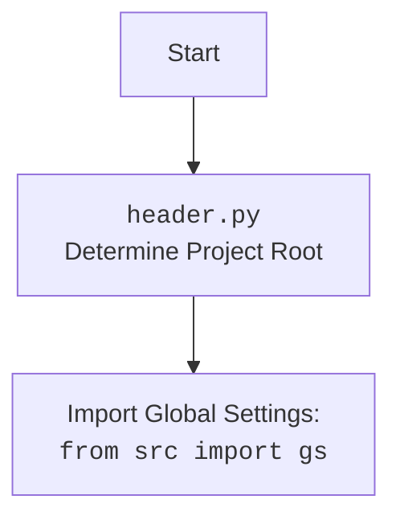

## <алгоритм>
1.  **Инициализация:**
    *   Определяются константы `SCOPES`, `SAMPLE_SPREADSHEET_ID`, `SAMPLE_RANGE_NAME`.
    *   Вычисляется абсолютный путь к корневой директории `ROOT_DIRECTORY` и пути к файлу с секретным ключом `path`.
2.  **Получение учетных данных:**
    *   Проверяется наличие файла с токеном (`token.json`)  для доступа к google api.
        *   Если файл существует, загружаются учетные данные.
            *   Если учетные данные не валидны и есть токен обновления, то учетные данные обновляются.
        *   Если файл отсутствует или учетные данные не валидны, запускается процесс авторизации через браузер.
            *   Учетные данные сохраняются в файл `token.json`.
3.  **Вызов Google Sheets API:**
    *   Создается объект `service` для взаимодействия с Google Sheets API.
    *   Вызывается метод `spreadsheets().values().get()`, для получения данных из листа, заданного переменными `SAMPLE_SPREADSHEET_ID` и `SAMPLE_RANGE_NAME`.
        *   Полученные данные сохраняются в переменную `values`.
4.  **Обработка данных:**
    *   Если данные отсутствуют, выводится сообщение "No data found."
    *   Если данные есть, выводится заголовок "Name, Major:"
    *   Итерируясь по каждой строке `row` в списке `values`:
        *   Выводится значение из нулевого и четвертого столбца, `row[0]` и `row[4]`.
5.  **Обработка ошибок:**
    *   Если во время взаимодействия с Google Sheets API возникла ошибка `HttpError`, выводится сообщение об ошибке.
6.  **Запуск main:**
    *   При запуске скрипта напрямую, вызывается функция `main()`.

## <mermaid>
```mermaid
flowchart TD
    Start(Start) --> CheckTokenFile[Check if token.json exists];
    CheckTokenFile -- Yes --> LoadCredentials[Load credentials from token.json];
    CheckTokenFile -- No --> AuthorizeUser[Authorize user via browser];
    LoadCredentials --> ValidateCredentials[Validate credentials];
    AuthorizeUser --> SaveCredentials[Save credentials to token.json];
    ValidateCredentials -- Valid --> CreateSheetsService[Create Google Sheets service];
    ValidateCredentials -- Invalid --> CheckRefreshToken[Check for refresh token];
    CheckRefreshToken -- Yes --> RefreshCredentials[Refresh credentials];
    CheckRefreshToken -- No --> AuthorizeUser;
    RefreshCredentials --> CreateSheetsService;
    SaveCredentials --> CreateSheetsService;
    CreateSheetsService --> GetSheetValues[Get values from spreadsheet];
    GetSheetValues --> CheckValues[Check if values are empty];
    CheckValues -- Yes --> NoDataMessage[Print "No data found."];
    CheckValues -- No --> PrintHeader[Print "Name, Major:"];
    PrintHeader --> ProcessRows[Iterate through rows];
    ProcessRows --> PrintRowValues[Print values from columns 0 and 4];
    PrintRowValues --> ProcessRows;
    ProcessRows -- No More Rows --> End(End);
     GetSheetValues --> HttpError(HttpError);
     HttpError --> ErrorMessage[Print error message];

    style Start fill:#f9f,stroke:#333,stroke-width:2px
    style End fill:#f9f,stroke:#333,stroke-width:2px
```



## <объяснение>
### Импорты:
*   `from __future__ import print_function`:  Используется для обеспечения совместимости с Python 2 и Python 3 в части использования `print` как функции.
*   `import os.path`: Модуль для работы с путями к файлам, используется для проверки существования файла `token.json`.
*   `from pathlib import Path`: Модуль для работы с путями к файлам как с объектами, упрощает формирование путей.
*   `from google.auth.transport.requests import Request`: Используется для обновления токена доступа Google API.
*   `from google.oauth2.credentials import Credentials`: Класс для представления учетных данных Google API.
*   `from google_auth_oauthlib.flow import InstalledAppFlow`: Используется для процесса авторизации через браузер.
*   `from googleapiclient.discovery import build`: Используется для создания сервиса для работы с API Google Sheets.
*   `from googleapiclient.errors import HttpError`: Используется для обработки ошибок HTTP при взаимодействии с API Google.

### Переменные:
*   `SCOPES`: Список областей доступа к Google API, в данном случае только для чтения таблиц Google Sheets.
*   `SAMPLE_SPREADSHEET_ID`: ID тестовой таблицы.
*  `SAMPLE_RANGE_NAME`: Диапазон данных для чтения из таблицы.
*   `ROOT_DIRECTORY`: Абсолютный путь к корневой директории проекта.
*   `path`: Абсолютный путь к файлу с секретным ключом Google API.

### Функции:
*   `main()`: Основная функция, которая выполняет весь процесс получения и обработки данных из Google Sheets API.
    *   **Аргументы**: Нет
    *   **Возвращаемое значение**: Нет
    *   **Назначение**:
        1.  Инициализирует переменные `creds` для хранения учетных данных.
        2.  Пытается загрузить учетные данные из файла `token.json`.
        3.  Если учетные данные не валидны, запускает процесс авторизации через браузер.
        4.  Использует `build()` для создания сервиса для работы с Google Sheets API.
        5.  Вызывает метод `sheet.values().get()` для получения данных.
        6.  Обрабатывает и выводит полученные данные.
        7.  Обрабатывает возможные ошибки `HttpError`.
*   `if __name__ == '__main__': main()`: Запускает функцию `main()` при прямом запуске скрипта.

### Потенциальные ошибки и области для улучшения:
*   **Обработка ошибок:** Код обрабатывает только `HttpError`, но могут возникнуть и другие исключения, например, ошибки ввода/вывода при работе с файлами.
*   **Использование констант:** Значения `SCOPES`, `SAMPLE_SPREADSHEET_ID`, `SAMPLE_RANGE_NAME`, а также пути к файлам, могут быть вынесены в отдельный файл конфигурации, чтобы их было легче настраивать.
*   **Безопасность:** Хранение `credentials.json`  в репозитории может быть небезопасным.
*   **Аутентификация:** В коде используется `credentials.json` для авторизации,  лучше использовать `client_secret.json` и настроить процесс авторизации по всем правилам, как это делается в других примерах Google.
*   **Гибкость**: Использование жестко заданных индексов `row[0]`, `row[4]` для доступа к колонкам делает код негибким.  Лучше использовать имена столбцов (или номера) вместо индексов.
*    **Логирование**: Использование логов вместо `print()` может сделать отладку более информативной.

### Цепочка взаимосвязей с другими частями проекта:
*   Этот скрипт является примером использования Google Sheets API и не зависит от других частей проекта. Однако, может потребоваться внести изменения в `header.py` для корректного определения пути к файлам.

**Дополнительные комментарии:**

*   Код написан с использованием библиотек Google API, которые необходимо предварительно установить.
*   Скрипт предназначен для демонстрации базового функционала чтения данных из Google Sheets.
*   Для корректной работы требуется наличие `credentials.json` (или `client_secret.json`) и корректная настройка Google Cloud Project.