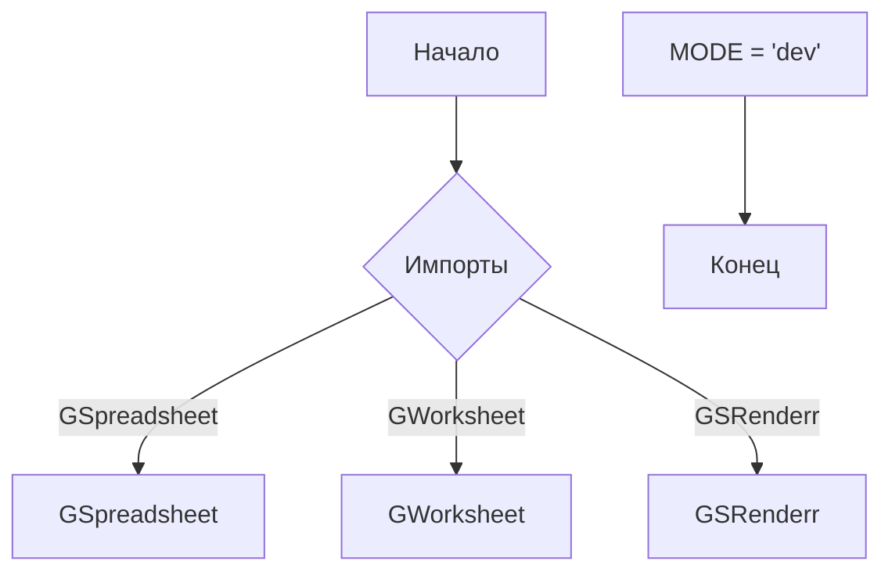
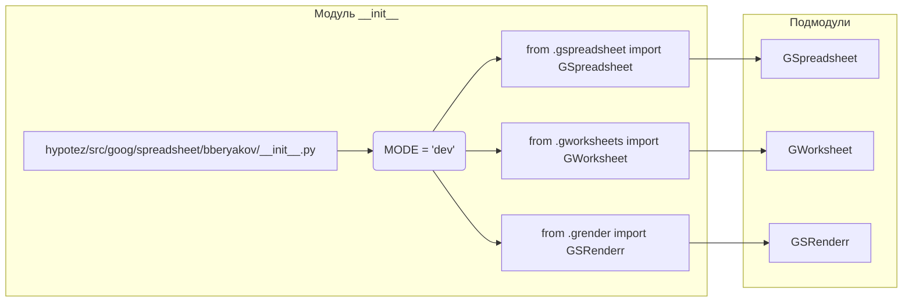

# Анализ кода hypotez/src/goog/spreadsheet/bberyakov/__init__.py

## <input code>

```python
## \file hypotez/src/goog/spreadsheet/bberyakov/__init__.py
# -*- coding: utf-8 -*-\
#! venv/Scripts/python.exe
#! venv/bin/python/python3.12

"""
.. module: src.goog.spreadsheet.bberyakov 
	:platform: Windows, Unix
	:synopsis:

"""
MODE = 'dev'

from .gspreadsheet import GSpreadsheet
from .gworksheets import GWorksheet
from .grender import GSRenderr
```

## <algorithm>



**Пошаговая блок-схема:**

1. **Начало:** Программа инициализируется.
2. **Импорты:** Модуль импортирует классы `GSpreadsheet`, `GWorksheet`, и `GSRenderr` из подпапок `gspreadsheet`, `gworksheets`, и `grender` соответственно.
3. **Константа MODE:** Устанавливается переменная `MODE` со значением 'dev'.
4. **Конец:** Выполнение программы завершается.

**Пример:**  При последующем использовании модуля будут доступны классы `GSpreadsheet`, `GWorksheet` и `GSRenderr`, которые вероятно содержат логику работы с Google Spreadsheets.

## <mermaid>



**Описание диаграммы:**

Диаграмма показывает импорты, происходящие внутри файла `__init__.py`.  `__init__.py` сам по себе импортирует классы из подмодулей: `gspreadsheet`, `gworksheets`, `grender`.  Эти подмодули, по логике, должны содержать реализацию классов `GSpreadsheet`, `GWorksheet` и `GSRenderr`.  Отсутствие других зависимостей, помимо самих подмодулей, предполагает, что данный `__init__.py` служит для  их экспорта и использования.

## <explanation>

**Импорты:**

- `from .gspreadsheet import GSpreadsheet`: Импортирует класс `GSpreadsheet` из модуля `gspreadsheet`.  Символ `.` указывает на поиск модуля внутри текущей папки (вложенной в `bberyakov`).
- `from .gworksheets import GWorksheet`: Импортирует класс `GWorksheet` из модуля `gworksheets`.
- `from .grender import GSRenderr`: Импортирует класс `GSRenderr` из модуля `grender`.

**Классы:**

- `GSpreadsheet`, `GWorksheet`, `GSRenderr` -  это классы, предназначенные для работы с Google Spreadsheets, вероятно, предоставляя методы для работы с таблицами, листами и рендеринга.  Без просмотра самих классов сложно дать более детальное описание.

**Функции:**

В файле нет функций, только импорты и константа.

**Переменные:**

- `MODE = 'dev'`:  Переменная, вероятно, используется для выбора режимов работы (например, 'dev' для разработки, 'prod' для производства).

**Возможные ошибки или области для улучшений:**

- Не указана кодировка в первом комментарии.
- Необходимо добавить документацию к классам `GSpreadsheet`, `GWorksheet` и `GSRenderr` в их соответствующих модулях.
- Нет информации о назначении переменной `MODE` без дополнительного контекста.


**Взаимосвязи с другими частями проекта:**

Данный `__init__.py` служит для экспорта и импорта классов из подмодулей `gspreadsheet`, `gworksheets`, `grender`.  Это указывает на то, что `gspreadsheet`, `gworksheets` и `grender` - это, вероятно, модули, реализующие взаимодействие с Google Spreadsheets, содержащие определенную логику работы с этими сервисами.  Связь осуществляется через импорт этих модулей в других частях проекта.  Без доступа к коду этих модулей сложно сказать об их точном функционале и взаимодействии друг с другом.