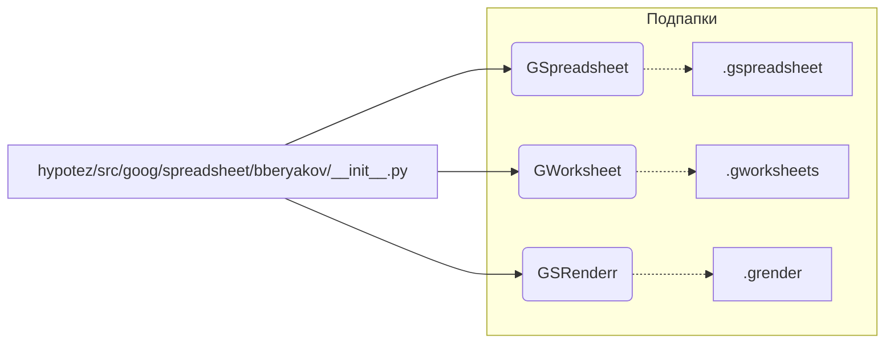

```MD
# Анализ кода hypotez/src/goog/spreadsheet/bberyakov/__init__.py

## <input code>

```python
## \file hypotez/src/goog/spreadsheet/bberyakov/__init__.py
# -*- coding: utf-8 -*-\
#! venv/Scripts/python.exe
#! venv/bin/python/python3.12

"""
.. module: src.goog.spreadsheet.bberyakov 
	:platform: Windows, Unix
	:synopsis:

"""
MODE = 'dev'

from .gspreadsheet import GSpreadsheet
from .gworksheets import GWorksheet
from .grender import GSRenderr
```

## <algorithm>

Алгоритм работы представленного файла крайне прост. Он лишь импортирует модули из подпапок.  Блок-схема - это всего лишь список импортов.  Данные не передаются между функциями/классами/методами.

```
[Start]
    |
    V
  Import GSpreadsheet from .gspreadsheet
    |
    V
  Import GWorksheet from .gworksheets
    |
    V
  Import GSRenderr from .grender
    |
    V
[End]
```

Пример: Если в другом файле этого проекта понадобится класс `GSpreadsheet`, то он будет доступен через `from hypotez.src.goog.spreadsheet.bberyakov import GSpreadsheet`.


## <mermaid>



**Объяснение диаграммы:**

Диаграмма показывает, как модуль `__init__.py` импортирует классы `GSpreadsheet`, `GWorksheet` и `GSRenderr` из своих подмодулей (`gspreadsheet`, `gworksheets`, `grender`).  Связь между `__init__.py` и подпапками обозначается как отношение импорта/экспорта.

## <explanation>

**Импорты:**

Файл `__init__.py` отвечает за инициализацию пакета `bberyakov`.  В нем происходят импорты подмодулей.

* `from .gspreadsheet import GSpreadsheet`: Импортирует класс `GSpreadsheet` из модуля `gspreadsheet`, расположенного в той же директории, что и текущий файл (`./`).
* `from .gworksheets import GWorksheet`:  Аналогично, импортирует класс `GWorksheet` из модуля `gworksheets`.
* `from .grender import GSRenderr`: Импортирует класс `GSRenderr` из модуля `grender`.


**Классы (не определены в данном файле, но импортированы):**

* `GSpreadsheet`, `GWorksheet`, `GSRenderr` - предполагаемые классы, которые, вероятно, реализуют работу с Google Spreadsheet, листами и рендерингом.  Подробная информация о них не доступна без просмотра соответствующих файлов (.gspreadsheet, .gworksheets, .grender).


**Функции (отсутствуют):**

Файл `__init__.py` не содержит функций. Он предназначен только для импорта классов.


**Переменные:**

* `MODE = 'dev'`:  Вероятно, константа, определяющая режим работы (разработка, релиз и т.д.)  Это переменная, а не константа, так как её значение потенциально может быть изменено.


**Возможные ошибки или области для улучшений:**

* Нет явной проверки существования импортируемых модулей.  Если модули `.gspreadsheet`, `.gworksheets`, или `.grender` отсутствуют или содержат ошибки, то при выполнении программы произойдет ошибка импорта.  Добавление проверок на существование и обработка исключений в `__init__.py` улучшит надёжность кода.
* Отсутствует описание или документация методов и атрибутов классов.


**Цепочка взаимосвязей:**

Код взаимодействует с другими частями проекта через импорты.  Для понимания полной функциональности необходимо изучить `gspreadsheet`, `gworksheets` и `grender`.  Вероятно, эти модули используют внешние библиотеки (например, для работы с Google API).

**Вывод:**

Файл `__init__.py` является типичным файлом инициализации пакета Python. Он импортирует необходимые компоненты, но без подробностей о классах, функциях и их взаимодействии трудно оценить всю картину.