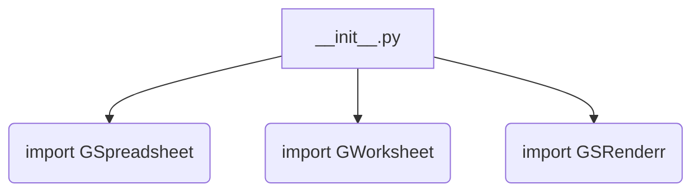
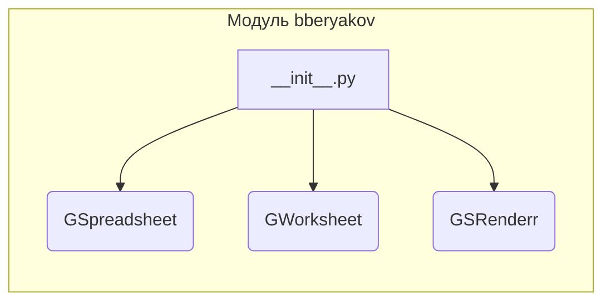

```MD
# Анализ кода hypotez/src/goog/spreadsheet/bberyakov/__init__.py

## <input code>

```python
## \file hypotez/src/goog/spreadsheet/bberyakov/__init__.py
# -*- coding: utf-8 -*-\
#! venv/Scripts/python.exe
#! venv/bin/python/python3.12

"""
.. module:: src.goog.spreadsheet.bberyakov 
	:platform: Windows, Unix
	:synopsis:

"""
MODE = 'dev'

from .gspreadsheet import GSpreadsheet
from .gworksheets import GWorksheet
from .grender import GSRenderr
```

## <algorithm>

Этот код представляет собой файл инициализации для модуля `bberyakov` внутри пакета `goog.spreadsheet`.  Он не содержит логики, а лишь импортирует другие модули из внутри этой же папки.  Алгритм работы сводится к импорту.  Нет циклов, условных операторов, или других вычислений.

**Блок-схема:**



**Пример данных:**

Нет данных, переносимых между функциями, поскольку данный код не содержит функций с вводом и выводом.  Он лишь создает необходимые связи для использования классов и функций, определенных в подмодулях.


## <mermaid>



## <explanation>

**Импорты:**

- `from .gspreadsheet import GSpreadsheet`: Импортирует класс `GSpreadsheet` из модуля `gspreadsheet`, находящегося в текущей папке (`.`). Это указывает на то, что модуль `gspreadsheet` содержит определение класса `GSpreadsheet`, вероятно, связанного с работой с Google Spreadsheets.
- `from .gworksheets import GWorksheet`: Аналогично импортирует класс `GWorksheet` из модуля `gworksheets`.  Вероятно, этот модуль содержит классы для работы с отдельными листами (worksheets) в Google Spreadsheets.
- `from .grender import GSRenderr`: Импортирует класс `GSRenderr` из модуля `grender`.  Вероятно, этот модуль отвечает за визуализацию, рендеринг или обработку данных из Google Spreadsheets.

**Классы:**

Этот код не определяет классы, а только импортирует классы из других модулей. Классы `GSpreadsheet`, `GWorksheet`, `GSRenderr` будут определены в файлах `gspreadsheet.py`, `gworksheets.py`, `grender.py` соответственно.  Их функциональность будет зависеть от того, как эти классы реализованы.

**Функции:**

Нет определенных функций в данном файле.  Функциональность будет в импортируемых модулях.

**Переменные:**

- `MODE = 'dev'`: Переменная глобального уровня, вероятно, определяет режим работы программы (например, "разработка", "производство").  Может использоваться в других частях кода.

**Возможные ошибки или области для улучшений:**

- Нет явной проверки существования импортируемых файлов (`gspreadsheet.py`, `gworksheets.py`, `grender.py`). Если они отсутствуют, то код вызовет ошибку `ImportError`.  
- Недостаточно информации, чтобы оценить возможные проблемы в коде этих файлов.

**Цепочка взаимосвязей:**

Файл `__init__.py` в папке `bberyakov` служит своего рода точкой входа в этот пакет.  Он связывает классы и функции из других файлов (`gspreadsheet.py`, `gworksheets.py`, `grender.py`), делая их доступными для использования в других частях проекта.  Это стандартный подход для организации кода на Python.  Например, в других частях приложения, возможно, будет импортироваться `bberyakov`, чтобы получить доступ к  `GSpreadsheet`, `GWorksheet`, и `GSRenderr`.
```