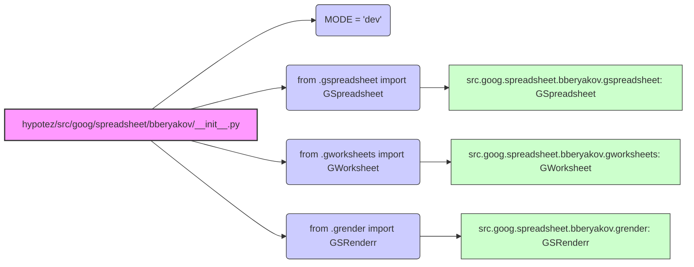

## Анализ кода `hypotez/src/goog/spreadsheet/bberyakov/__init__.py`

### <алгоритм>

1. **Инициализация:**
   - Устанавливается глобальная переменная `MODE` в значение `'dev'`. Это, вероятно, определяет режим работы модуля (разработка, тестирование, продакшн и т.д.).
   - `MODE = 'dev'`
   - Пример: В режиме `'dev'` может включаться отладочная информация.

2. **Импорт модуля `gspreadsheet`:**
   - Импортируется класс `GSpreadsheet` из модуля `src.goog.spreadsheet.bberyakov.gspreadsheet`.
   - `from .gspreadsheet import GSpreadsheet`
   - Пример: `GSpreadsheet` отвечает за работу с Google Sheets.

3. **Импорт модуля `gworksheets`:**
   - Импортируется класс `GWorksheet` из модуля `src.goog.spreadsheet.bberyakov.gworksheets`.
   - `from .gworksheets import GWorksheet`
   - Пример: `GWorksheet` представляет собой отдельный лист внутри Google Sheet.

4. **Импорт модуля `grender`:**
   - Импортируется класс `GSRenderr` из модуля `src.goog.spreadsheet.bberyakov.grender`.
   - `from .grender import GSRenderr`
   - Пример: `GSRenderr` вероятно отвечает за рендеринг данных в Google Sheet.

5. **Завершение:**
    -  Модуль готов к использованию, предоставляя классы `GSpreadsheet`, `GWorksheet` и `GSRenderr`.

### <mermaid>

**Объяснение зависимостей:**

-   `hypotez/src/goog/spreadsheet/bberyakov/__init__.py` является корневым модулем пакета `bberyakov`.
-   Импортирует классы `GSpreadsheet`, `GWorksheet` и `GSRenderr` из соответствующих модулей внутри пакета `bberyakov`.
-   `GSpreadsheet` (из `gspreadsheet.py`) - отвечает за взаимодействие с Google Sheets как с целыми документами.
-   `GWorksheet` (из `gworksheets.py`) - отвечает за взаимодействие с отдельными листами (worksheet) внутри Google Sheets.
-   `GSRenderr` (из `grender.py`) - отвечает за преобразование и отрисовку данных в Google Sheets.

### <объяснение>

-   **Импорты**:
    -   `from .gspreadsheet import GSpreadsheet`: Импортирует класс `GSpreadsheet` из модуля `gspreadsheet.py`, находящегося в том же пакете (`.`). Этот класс, вероятно, предоставляет функциональность для работы с Google Sheets, например, чтение, запись и управление.
    -   `from .gworksheets import GWorksheet`: Импортирует класс `GWorksheet` из модуля `gworksheets.py`, также находящегося в том же пакете. Этот класс отвечает за взаимодействие с отдельными листами (worksheet) в Google Sheets.
    -   `from .grender import GSRenderr`: Импортирует класс `GSRenderr` из модуля `grender.py` в текущем пакете. Этот класс, по-видимому, отвечает за рендеринг или преобразование данных для Google Sheets.
    - Взаимосвязь: Все импортированные модули (`gspreadsheet`, `gworksheets`, `grender`) являются частями одного пакета `bberyakov` и представляют собой отдельные функциональные блоки для работы с Google Sheets.

-   **Классы**:
    -   `GSpreadsheet`: Предположительно, этот класс управляет общим доступом к Google Sheets, например, создание, открытие, закрытие и т.д.
    -   `GWorksheet`: Этот класс, вероятно, предоставляет интерфейс для работы с конкретным листом (worksheet), включая чтение данных, запись, форматирование и т.д.
    -   `GSRenderr`: Этот класс, вероятно, отвечает за преобразование данных в нужный формат и их отрисовку на листе Google Sheets.

    Взаимодействие: Классы предназначены для совместной работы, где `GSpreadsheet` отвечает за Google Sheets в целом, `GWorksheet` за отдельные листы, а `GSRenderr` за представление данных на этих листах.

-   **Функции**:
    -  В предоставленном коде нет функций.

-   **Переменные**:
    -   `MODE`: Строковая переменная, указывающая на режим работы модуля. В данном случае, `'dev'` (разработка).

-   **Потенциальные ошибки или области для улучшения**:
    - Отсутствует документация внутри кода, что может затруднить его понимание.
    -  Необходимо проверить, как используется переменная `MODE` и какие режимы работы она поддерживает.
    -  Необходимо добавить обработку возможных ошибок, которые могут возникнуть при работе с API Google Sheets.
    -  Стоит добавить проверку типов аргументов для всех методов классов.
    -  Следует добавить тесты для проверки работоспособности модуля.
    -  Необходимо пересмотреть именование классов. `GSRenderr` - это опечатка `GSRender`.

-   **Цепочка взаимосвязей с другими частями проекта**:
    -  Этот модуль является частью более крупного проекта `hypotez`, который, вероятно, предоставляет инструменты для работы с Google Sheets.
    -  Ожидается, что другие части проекта будут использовать классы `GSpreadsheet`, `GWorksheet` и `GSRenderr` для взаимодействия с Google Sheets.

В целом, предоставленный код является частью пакета для работы с Google Sheets и предоставляет базовые классы для взаимодействия с Google Sheets, листами и для отрисовки данных. Необходимо добавить документацию, обработку ошибок и тестирование для обеспечения надежной работы модуля.