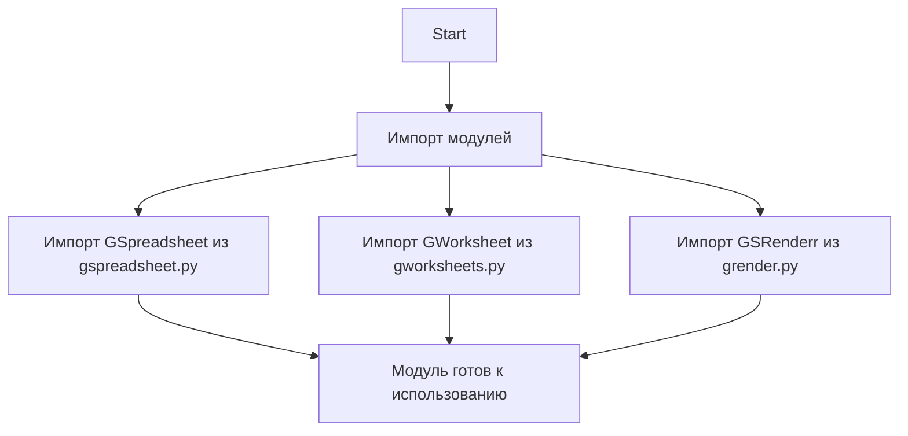

## АНАЛИЗ КОДА: `hypotez/src/goog/spreadsheet/bberyakov/__init__.py`

### <алгоритм>

1.  **Начало**: Инициализация модуля `src.goog.spreadsheet.bberyakov`.
2.  **Импорт**: Импортируются три модуля:
    *   `GSpreadsheet` из `src.goog.spreadsheet.bberyakov.gspreadsheet`.
    *   `GWorksheet` из `src.goog.spreadsheet.bberyakov.gworksheets`.
    *   `GSRenderr` из `src.goog.spreadsheet.bberyakov.grender`.
3. **Завершение**: Модуль готов к использованию, предоставляя доступ к классам `GSpreadsheet`, `GWorksheet` и `GSRenderr`.

### <mermaid>

**Зависимости импорта:**

*   `GSpreadsheet` импортируется из модуля `gspreadsheet.py`, который, вероятно, содержит класс или функции для работы с Google Spreadsheet.
*   `GWorksheet` импортируется из модуля `gworksheets.py`, который, вероятно, содержит класс или функции для работы с отдельными листами Google Spreadsheet.
*   `GSRenderr` импортируется из модуля `grender.py`, который, вероятно, содержит класс или функции для визуализации данных из Google Spreadsheet.

### <объяснение>

**Импорты:**

*   `from .gspreadsheet import GSpreadsheet`: Импортирует класс `GSpreadsheet` из модуля `gspreadsheet.py`, расположенного в той же директории. Этот класс, вероятно, предназначен для взаимодействия с Google Spreadsheet как с объектом.
*   `from .gworksheets import GWorksheet`: Импортирует класс `GWorksheet` из модуля `gworksheets.py`, расположенного в той же директории. Этот класс, вероятно, предназначен для работы с отдельными листами (worksheet) в Google Spreadsheet.
*   `from .grender import GSRenderr`: Импортирует класс `GSRenderr` из модуля `grender.py`, расположенного в той же директории.  Этот класс, вероятно, предназначен для визуализации данных, полученных из Google Spreadsheet.

**Классы:**

*   `GSpreadsheet`: Предположительно, класс, который инкапсулирует логику взаимодействия с Google Spreadsheet, включая аутентификацию, чтение, запись данных, создание и удаление таблиц.
*   `GWorksheet`: Представляет логику для работы с отдельными листами в Google Spreadsheet, включая чтение, запись, форматирование данных и другие операции, специфичные для листов.
*   `GSRenderr`: Класс для визуализации данных из Google Sheets.  Это может включать преобразование данных в различные форматы (например, JSON, CSV) или отрисовку графиков и диаграмм.

**Функции:**

В данном файле нет функций. Этот файл служит точкой входа (entry point) для пакета, импортируя классы из других модулей.

**Переменные:**

В этом файле нет переменных, кроме неявных переменных, создаваемых при импорте классов.

**Потенциальные ошибки и области для улучшения:**

*   Отсутствует явная документация или docstring для самого модуля `__init__.py`, что затрудняет понимание его назначения без изучения исходного кода.
*   Нет обработки возможных исключений (например, NetworkError, AuthenticationError), которые могут возникнуть при работе с Google API.
*   Не ясно, каким образом используются классы. Требуется добавить примеры использования.

**Взаимосвязи с другими частями проекта:**

Данный файл является частью пакета `src.goog.spreadsheet.bberyakov`, который, скорее всего, отвечает за работу с Google Sheets в контексте проекта.  Другие части проекта могут использовать классы `GSpreadsheet`, `GWorksheet` и `GSRenderr` для доступа к данным и управления ими в Google Sheets.

**Дополнительно**
нет импорта header.py, блок mermaid не требуется.