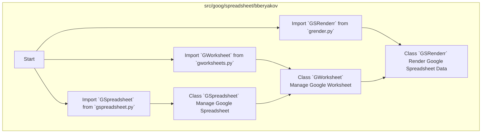

## Анализ кода `hypotez/src/goog/spreadsheet/bberyakov/__init__.py`

### 1. <алгоритм>

1.  **Импорт модулей**:
    *   Импортируются модули `GSpreadsheet`, `GWorksheet` и `GSRenderr` из текущего пакета (`.`), то есть из того же каталога `bberyakov`.
    *   Пример: `from .gspreadsheet import GSpreadsheet` - импортирует класс `GSpreadsheet` из файла `gspreadsheet.py`.

2.  **Использование импортированных классов**:
    *   Эти классы предположительно используются для работы с Google Sheets:
        *   `GSpreadsheet` - для управления электронной таблицей.
        *   `GWorksheet` - для работы с отдельными листами.
        *   `GSRenderr` - для рендеринга данных из Google Sheets.
    *   Пример: Создание экземпляра `GSpreadsheet`: `spreadsheet = GSpreadsheet(...)`, что может включать параметры идентификатора таблицы и аутентификации.

3.  **Поток данных**:
    *   Предположительно, `GSpreadsheet` инициализируется с идентификатором Google Sheets и аутентификационными данными.
    *   Затем, используя экземпляр `GSpreadsheet`, можно получить доступ к отдельным листам через `GWorksheet`.
    *   Данные, полученные из `GWorksheet`, можно передать в `GSRenderr` для форматирования и отображения.

### 2. <mermaid>

**Объяснение `mermaid` диаграммы:**

1.  **`flowchart TD`**: Объявляет диаграмму типа "flowchart" (блок-схема) с направлением сверху вниз (TD).
2.  **`subgraph src/goog/spreadsheet/bberyakov`**: Группирует все узлы в подграф, представляющий пакет `bberyakov`.
3.  **`Start[Start]`**: Начальный узел, показывающий начало процесса.
4.  **`ImportGSpreadsheet`, `ImportGWorksheet`, `ImportGSRenderr`**: Узлы, представляющие операции импорта модулей. Указывают на импорт соответствующих классов из файлов `gspreadsheet.py`, `gworksheets.py`, и `grender.py`.
5.  **`GSpreadsheetClass`, `GWorksheetClass`, `GSRenderrClass`**: Узлы, представляющие импортированные классы, с описанием их функциональности.
6.  **Стрелки**: Показывают зависимость и порядок использования. Например, класс `GSpreadsheet` вероятно может использовать  `GWorksheet` и `GSRenderr` для получения данных и их последующей обработки.

### 3. <объяснение>

**Импорты:**

*   `from .gspreadsheet import GSpreadsheet`: Импортирует класс `GSpreadsheet` из модуля `gspreadsheet.py`, находящегося в текущем пакете `bberyakov`. Этот класс, вероятно, предназначен для работы с Google Sheets, предоставляя методы для открытия, чтения и изменения электронных таблиц. `.` обозначает текущий каталог.
*   `from .gworksheets import GWorksheet`: Импортирует класс `GWorksheet` из модуля `gworksheets.py`, также находящегося в текущем пакете `bberyakov`. Этот класс, вероятно, предназначен для работы с отдельными листами (worksheets) внутри электронной таблицы.
*   `from .grender import GSRenderr`: Импортирует класс `GSRenderr` из модуля `grender.py`, который также находится в текущем пакете `bberyakov`. Этот класс, по-видимому, отвечает за рендеринг или форматирование данных из Google Sheets.

**Взаимосвязь с пакетами `src.`**:
Все импортированные модули принадлежат к пакету `src.goog.spreadsheet.bberyakov`.  Это означает, что все файлы с которыми работает `__init__.py` находятся в рамках того же каталога `bberyakov`.  Это говорит о модульной структуре проекта, где функции для работы с Google Sheets организованы в отдельный пакет.

**Классы:**

*   `GSpreadsheet`: Представляет собой класс для работы с электронными таблицами Google Sheets. Он, вероятно, предоставляет методы для аутентификации, открытия, чтения, записи и манипулирования электронными таблицами.
*   `GWorksheet`: Представляет собой класс для работы с отдельными листами в электронной таблице Google Sheets. Он, вероятно, предоставляет методы для получения и изменения данных на листе.
*   `GSRenderr`: Представляет собой класс для рендеринга данных из Google Sheets в определенном формате. Он, вероятно, используется для преобразования данных в строки, таблицы или другие форматы.

**Функции:**

Поскольку в данном файле нет функций, этот раздел не применим.

**Переменные:**

В данном файле нет явных переменных, только импорты.

**Потенциальные ошибки и области для улучшения:**

*   **Обработка исключений:** В коде отсутствуют явные механизмы обработки исключений. При работе с внешними API, такими как Google Sheets, важно предусмотреть обработку сетевых ошибок, ошибок авторизации и т.д.
*   **Конфигурация:** Аутентификационные данные и другие настройки должны быть вынесены в конфигурационный файл или передаваться через переменные окружения, чтобы не хранить их непосредственно в коде.
*   **Документация:** Код содержит docstring в начале файла, но не имеет документации к классам и методам. Добавление docstring для классов и методов сделает код более понятным.
*  **Управление ресурсами**: В случае если в классах `GSpreadsheet`, `GWorksheet`  открываются ресурсы (например соединения), то необходимо предусмотреть механизмы управления этими ресурсами, например контекстные менеджеры.

**Цепочка взаимосвязей:**

1.  **`__init__.py`**: Является точкой входа для пакета `src.goog.spreadsheet.bberyakov`, импортируя основные классы.
2.  **`gspreadsheet.py`**: Содержит класс `GSpreadsheet`, который предоставляет функциональность для работы с электронными таблицами Google Sheets.
3.  **`gworksheets.py`**: Содержит класс `GWorksheet`, который предоставляет функциональность для работы с отдельными листами в электронной таблице.
4.  **`grender.py`**: Содержит класс `GSRenderr`, который предоставляет функциональность для рендеринга данных из Google Sheets.
5.  **Другие части проекта**: Эти модули, вероятно, используются в других частях проекта для работы с данными из Google Sheets. Например, могут быть модули для анализа данных, генерации отчетов или интеграции с другими сервисами.