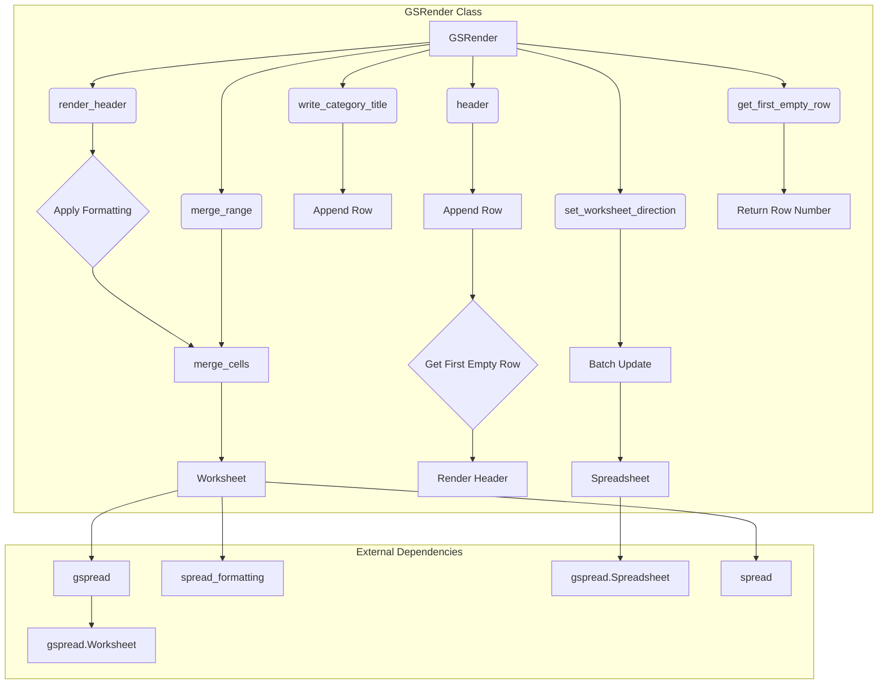

# <input code>

```python
## \file hypotez/src/goog/spreadsheet/bberyakov/grender.py
# -*- coding: utf-8 -*-
#! venv/Scripts/python.exe
#! venv/bin/python/python3.12

"""
.. module:: src.goog.spreadsheet.bberyakov 
	:platform: Windows, Unix
	:synopsis:

"""
MODE = 'dev'

"""
	:platform: Windows, Unix
	:synopsis:

"""

"""
	:platform: Windows, Unix
	:synopsis:

"""


"""
  :platform: Windows, Unix

"""
"""
  :platform: Windows, Unix
  :platform: Windows, Unix
  :synopsis:
"""MODE = 'dev'
  
""" module: src.goog.spreadsheet.bberyakov """


"""  Render Google Table

 
 @section libs imports:
  - json 
  - typing 
  - gspread_formatting 
  - gspread 
  - goog.helpers 
  - gspread.utils 
  
Author(s):
  - Created by [Davidka] [BenAvraham] on 08.11.2023 .
"""
# ------------------------------
from src import gs
from src.helpers import logger, WebDriverException,  pprint

# -------------------------------

import json
from typing import List, Type, Union
from spread_formatting import *
from spread import Spreadsheet, Worksheet
from goog.helpers import hex_color_to_decimal, decimal_color_to_hex, hex_to_rgb

from spread.utils import ValueInputOption, ValueRenderOption


class GSRender():
    """
     [Class's description]


    """
    """
     Table Render
    Украшательства. 
    ------------------------------
    class CellFormat(
        numberFormat: Any | None = None,
        backgroundColor: Any | None = None,
        borders: Any | None = None,
        padding: Any | None = None,
        horizontalAlignment: Any | None = None,
        verticalAlignment: Any | None = None,
        wrapStartegy: Any | None = None,
        textDirection: Any | None = None,
        textFormat: Any | None = None,
        hyperlinkDisplayType: Any | None = None,
        textRotation: Any | None = None,
        backgroundColorStyle: Any | None = None
    )
    """
    render_schemas: dict
    

    def __init__ (self, *args, **kwards) -> None:
        """
         [Function's description]

        Parameters : 
             self : [description]
             *args : [description]
             **kwards : [description]
        Returns : 
             None : [description]

        """
        #self.render_schemas = json.loads('goog\\schema.json')
        ...
    
    # ... (rest of the code)
```

# <algorithm>

The code defines a `GSRender` class for formatting and rendering Google Sheets.  The algorithm breaks down into several steps depending on the method called:

1. **`__init__`:** Initializes the `GSRender` object.  It likely loads rendering schemas from a JSON file, but the current implementation is commented out.

2. **`render_header`:** Formats the header row of a worksheet.
    - Calculates background and foreground colors.
    - Creates a `CellFormat` object defining formatting attributes (background, alignment, direction, font).
    - Creates a `ConditionalFormatRule` that applies the `fmt` to cells where their values are greater than 50 (though this part is commented out in the provided code)  
    - Sets row height (assuming the `set_row_height` is defined elsewhere).
    - Applies the `fmt` to all cells in the `range`.
    - Merges cells in the specified `range` using `merge_type`.


3. **`merge_range`:** Merges cells in a specified range based on the `merge_type`. This involves directly calling the `gspread` method `merge_cells`.


4. **`set_worksheet_direction`:** Updates the direction of the worksheet (LTR or RTL).
   - Creates a `data` dictionary containing the request to update the `sheetProperties` in a `batch_update` call.

5. **`header`:** Appends a row with the specified header (`ws_header`) to the worksheet at the first empty row.
    - Determines the first empty row using `get_first_empty_row`.
    - Appends the header.
    - Calls `render_header` to format and merge the header row.

6. **`write_category_title`:** Similar to `header`, but appends a row with the category title to a specific column.


7. **`get_first_empty_row`:** Finds the first empty row in the worksheet.
    - If `by_col` is specified, returns the row number.
    - Otherwise, finds the first empty row by checking the values in the worksheet.
    - Returns the row number.


**Data Flow Example (render_header):**

```
Spreadsheet -> Worksheet -> GSRender.render_header(ws, world_title, range, merge_type)
  |                                      ^
  |                                      |
  |--------------------------------------|
  |   (Input: world_title, range, ...) | ----> CellFormat object (calculations, formatting)
  |                                      | ----> ConditionalFormatRule object (conditional logic)
  |                                      | ----> format_cell_range (applies format)
  |                                      | ----> merge_range (merges cells)
  |                                      |
  -----------------------------------------> Worksheet (modified) -> Spreadsheet
```

# <mermaid>



# <explanation>

**Imports:**

- `from src import gs`: Imports the `gs` module from the `src` package. This likely contains functions or classes related to Google Sheets interaction.
- `from src.helpers import logger, WebDriverException, pprint`: Imports helper functions (`logger`, `WebDriverException`, `pprint`) from the `helpers` module within the `src` package.  These are likely logging, error handling, and pretty-printing utilities.
- `import json`: Imports the `json` module for working with JSON data.
- `from typing import List, Type, Union`: Imports type hints from the `typing` module, improving code readability and maintainability.
- `from spread_formatting import *`: Imports all classes and functions from the `spread_formatting` package (unspecified).
- `from spread import Spreadsheet, Worksheet`: Imports `Spreadsheet` and `Worksheet` classes from the `spread` package. These are likely custom classes for representing Google Sheets spreadsheets and worksheets, respectively.
- `from goog.helpers import hex_color_to_decimal, decimal_color_to_hex, hex_to_rgb`: Imports helper functions for color conversions.  Likely part of a larger helper library within the `goog` package.
- `from spread.utils import ValueInputOption, ValueRenderOption`: Imports utility classes for handling various value input and rendering options likely from the `spread.utils` module.


**Classes:**

- `GSRender`: This class encapsulates the logic for rendering Google Sheets. Its methods handle various formatting and manipulation tasks.  Crucially, it interacts with the `spread` package classes.

**Functions:**

- `__init__`: Initializes the `GSRender` object.  The commented-out part suggests an intended loading of rendering schemas from a JSON file.
- `render_header`: Formats the header row. Note the use of `CellFormat`, a custom format specification class likely defined within `spread_formatting`.
- `merge_range`: Merges cells based on a provided `merge_type`. This method directly uses the `gspread` library.
- `set_worksheet_direction`: Updates the worksheet's direction using a batch update to the spreadsheet. This is a common method of interacting with the Google Sheets API.
- `header`: Appends the header row to the worksheet.
- `write_category_title`: Similar to `header`, but for category titles.
- `get_first_empty_row`: Retrieves the index of the first empty row in the worksheet.


**Possible Errors/Improvements:**

- **Hardcoded values:** The code uses hardcoded values like `'#FFAAAA'` for colors.  Consider using named constants or loading from a config file for better maintainability.
- **Missing `set_row_height`:**  The code calls `set_row_height`, but it's not defined within the snippet. This should be implemented elsewhere to properly set the row height in the spreadsheet.
- **Unclear `format_cell_ranges`/`format_cell_range` interaction:** The code shows both `format_cell_ranges` and `format_cell_range` functions. It needs clarification on whether these are meant to be used in tandem or if one is a replacement for the other.


**Project Dependencies:**

The code relies on `gspread`, `spread_formatting`, `spread`, and `goog.helpers` packages/modules.  These are assumed to exist in the project structure (possibly within the `src` directory).  Also, it's implicitly dependent on the `src` package's modules for interacting with the Google Sheets API.  The existence of an API token or authentication mechanism is also assumed.