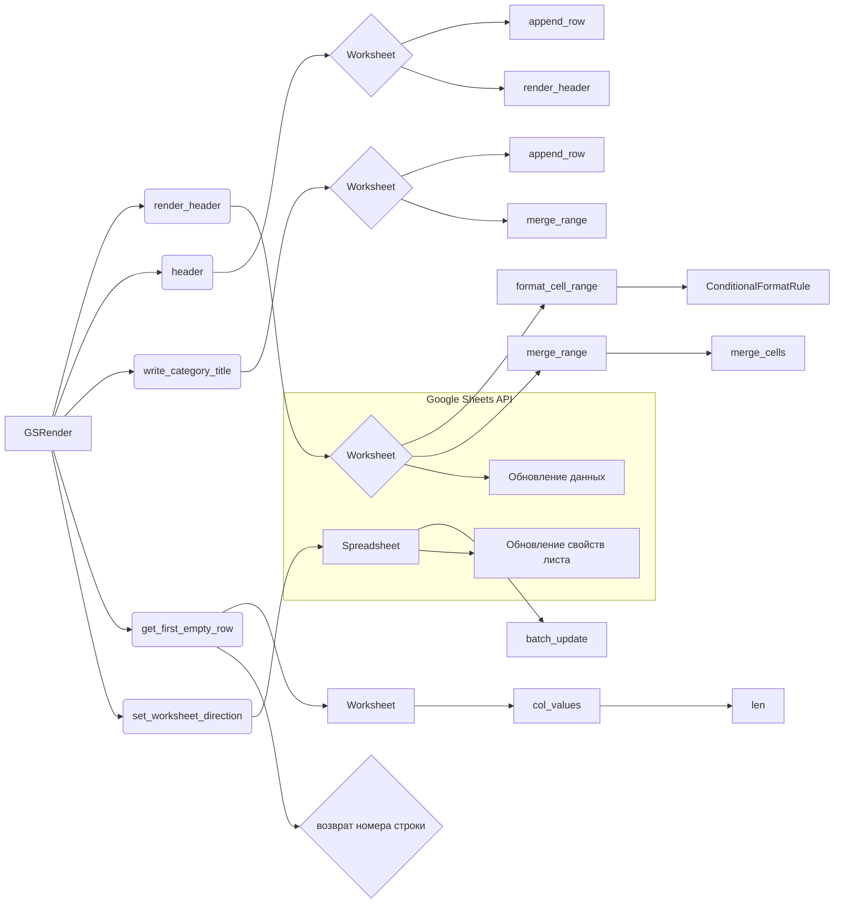

# <input code>

```python
## \file hypotez/src/goog/spreadsheet/bberyakov/grender.py
# -*- coding: utf-8 -*-
#! venv/Scripts/python.exe
#! venv/bin/python/python3.12

"""
.. module: src.goog.spreadsheet.bberyakov 
	:platform: Windows, Unix
	:synopsis:

"""
MODE = 'dev'


"""
	:platform: Windows, Unix
	:synopsis:

"""


"""
	:platform: Windows, Unix
	:synopsis:

"""


"""
  :platform: Windows, Unix

"""
"""
  :platform: Windows, Unix
  :platform: Windows, Unix
  :synopsis:
"""MODE = 'dev'

""" module: src.goog.spreadsheet.bberyakov """


"""  Render Google Table

 
 @section libs imports:
  - json 
  - typing 
  - gspread_formatting 
  - gspread 
  - goog.helpers 
  - gspread.utils 
  
Author(s):
  - Created by [Davidka] [BenAvraham] on 08.11.2023 .
"""
# ------------------------------
from src import gs
from src.helpers import logger, WebDriverException,  pprint

# -------------------------------


import json
from typing import List, Type, Union
from spread_formatting import *
from spread import Spreadsheet, Worksheet
from goog.helpers import hex_color_to_decimal, decimal_color_to_hex, hex_to_rgb

from spread.utils import ValueInputOption, ValueRenderOption


class GSRender():
    """
     [Class's description]


    """
    """
     Table Render
    Украшательства. 
    ------------------------------
    class CellFormat(
        numberFormat: Any | None = None,
        backgroundColor: Any | None = None,
        borders: Any | None = None,
        padding: Any | None = None,
        horizontalAlignment: Any | None = None,
        verticalAlignment: Any | None = None,
        wrapStrategy: Any | None = None,
        textDirection: Any | None = None,
        textFormat: Any | None = None,
        hyperlinkDisplayType: Any | None = None,
        textRotation: Any | None = None,
        backgroundColorStyle: Any | None = None
    )
    """
    render_schemas: dict

    def __init__ (self, *args, **kwards) -> None:
        """
         [Function's description]

        Parameters : 
             self : [description]
             *args : [description]
             **kwards : [description]
        Returns : 
             None : [description]

        """
        #self.render_schemas = json.loads('goog\\schema.json')
        ...
    # ... (rest of the code)
```

# <algorithm>

**Алгоритм работы GSRender:**

Класс `GSRender` предназначен для форматирования и рендеринга Google Spreadsheets.  Он содержит методы для работы с ячейками, заголовками, и выполняет необходимые операции в Google Sheets API.

1. **__init__():**  Инициализирует объект.  В данном примере пока не используется никакое сложное поведение.


2. **render_header(ws, world_title, range, merge_type):**
    * Получает Worksheet, заголовок, диапазон и тип объединения.
    * Определяет цвета фона и текста.
    * Создает `CellFormat` для форматирования ячеек.
    * Создает `ConditionalFormatRule`  (условие:  число больше 50).
    * Устанавливает высоту строки.
    * Применяет форматирование к ячейкам, используя `format_cell_range`.
    * Объединяет ячейки, используя `merge_range`.

3. **merge_range(ws, range, merge_type):**
    * Объединяет ячейки в Google Sheet согласно переданному типу объединения.

4. **set_worksheet_direction(sh, ws, direction):**
   * Изменяет направление листа в Google Sheet.

5. **header(ws, ws_header, row):**
   * Получает первую пустую строку.
   * Формирует диапазон для заголовка.
   * Добавляет заголовок в лист, используя `append_row`.
   * Применяет форматирование заголовка, используя `render_header`.

6. **write_category_title(ws, ws_category_title, row):**
   * Аналогично методу `header`, но форматирует заголовок категории.

7. **get_first_empty_row(ws, by_col):**
   * Находит первую пустую строку в Google Sheet, либо по заданной колонке, либо по всем заполненным ячейкам.


**Пример перемещения данных:**

`header` вызывает `render_header`, передавая ему Worksheet, заголовок, диапазон и тип объединения.  `render_header` использует `format_cell_range` и `merge_range` для изменения Worksheet.  Все эти методы работают напрямую с объектом `ws` типа `gspread.Worksheet`.

# <mermaid>



**Объяснение зависимостей:**

* `src.gs`: Вероятно, содержит вспомогательные функции или классы для работы с Google Sheets API (по названию).
* `src.helpers`: Содержит классы `logger`, `WebDriverException`, `pprint` -  помогающие в логировании, обработке исключений и красивой печати данных.
* `spread_formatting`, `spread`, `goog.helpers`: вероятно, модули или пакеты, предоставляющие классы и функции для работы с таблицами.
* `gspread`, `gspread_formatting`, `json`: Стандартные библиотеки Python.
* `typing`:  Для типов данных.

# <explanation>

**Импорты:**

Импорты `src`, `src.helpers`, `json`, `typing`, `spread_formatting`, `spread`, `goog.helpers`, `gspread`, `gspread_formatting`, `spread.utils` указывают на то, что код взаимодействует с компонентами проекта `hypotez`. Модуль `src` (наверное) содержит базовые классы и функции для работы с Google Sheets API, `src.helpers` предоставляет вспомогательные функции (возможно для логирования или работы с браузерами). `gspread`, `gspread_formatting` – библиотеки для работы с Google Sheets. Остальные импорты необходимы для работы с JSON, типов данных и функционалом форматирования.


**Классы:**

* **GSRender:**  Основной класс для работы с рендерингом таблиц. Объекты класса хранят информацию о схемах форматирования и содержат методы для обработки различных операций с Google Sheet. Атрибут `render_schemas` вероятно хранит данные о структуре форматирования.  Не все методы класса полностью реализованы.

**Функции:**

* **__init__():** Конструктор класса, но в данном примере он очень простой.
* **render_header():** Форматирует заголовок таблицы в Google Sheet.  Содержит логику применения стилей, объединения ячеек и дополнительных условий.
* **merge_range():** Объединяет ячейки в Google Sheet.
* **set_worksheet_direction():**  Изменяет направление текста на листе.
* **header(), write_category_title():** Добавляют данные в лист. Важно, что они используют `render_header` для форматирования.
* **get_first_empty_row():**  Находит первую пустую строку в листе.


**Переменные:**

Переменные `MODE`, `range`, `merge_type`, `row`, `ws_header`, `ws_category_title` - используются для передачи параметров в функции.


**Возможные ошибки и улучшения:**

* **Неполные реализации:**  Многие методы класса `GSRender` имеют `...` -  указывает на то, что код фрагментарный и не полностью реализован.  Нужно заполнить пропущенную функциональность.
* **Обработка ошибок:**  В коде отсутствует достаточная обработка возможных исключений при работе с Google Sheets API.  Необходимо добавить `try...except` блоки.
* **Проверка данных:**  Необходимо добавить проверки валидности входных данных (например, типов).


**Взаимосвязь с другими частями проекта:**

Код сильно зависит от других модулей, таких как `src.helpers`, `spread_formatting`, `spread`, `goog.helpers` и `gspread`.  Это указывает на то, что `GSRender` является частью более крупной системы, отвечающей за работу с Google Sheets.  Необходимы дополнительные данные о структуре проекта `hypotez`, чтобы полностью понять контекст.