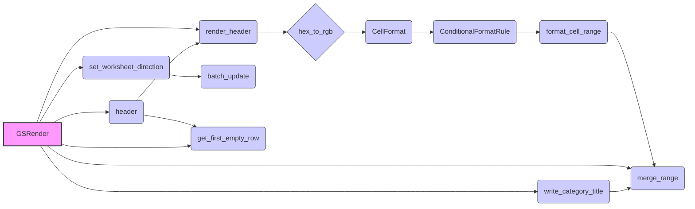

## Анализ кода `hypotez/src/goog/spreadsheet/bberyakov/grender.py`

### 1. <алгоритм>

**Общая схема работы:**

1.  **Инициализация `GSRender`**:
    *   Создается экземпляр класса `GSRender`. На этапе инициализации пока не происходит никаких действий.
2.  **Рендеринг заголовка (`render_header`)**:
    *   Принимает `Worksheet` (лист таблицы), заголовок `world_title`, диапазон ячеек `range`, и тип слияния ячеек `merge_type`.
    *   Преобразует HEX-цвета в RGB для фона и текста заголовка.
    *   Создает объект `CellFormat` с заданными стилями (цвет фона, выравнивание, направление текста, формат текста).
        *   Пример:  `CellFormat(backgroundColor=Color(1.0, 0.6666666666666666, 0.6666666666666666), horizontalAlignment='RIGHT', textDirection='RIGHT_TO_LEFT', textFormat=TextFormat(bold=True, foregroundColor=Color(0.6666666666666666, 0.6666666666666666, 0.6666666666666666), fontSize=24))`
    *   Создает правило условного форматирования `ConditionalFormatRule`, которое применяет заданный формат к диапазону ячеек.
        *   Пример:  `ConditionalFormatRule(ranges=[GridRange(sheetId=0, startRowIndex=0, endRowIndex=1, startColumnIndex=0, endColumnIndex=26)], booleanRule=BooleanRule(condition=BooleanCondition(type='NUMBER_GREATER', values=['50']), format=<spread_formatting.format.CellFormat object at 0x00000204C6D98190>))`
    *   Устанавливает высоту строки.
    *   Применяет форматирование к диапазону ячеек.
    *   Вызывает `merge_range` для слияния ячеек в заголовке.
3.  **Слияние ячеек (`merge_range`)**:
    *   Принимает `Worksheet`, диапазон ячеек `range`, и тип слияния `merge_type` (например, `'MERGE_ALL'`).
    *   Вызывает метод `merge_cells` объекта `Worksheet` для слияния ячеек.
4.  **Установка направления листа (`set_worksheet_direction`)**:
    *   Принимает `Spreadsheet` (книгу), `Worksheet`, и направление `direction` ('ltr' или 'rtl').
    *   Формирует JSON-запрос для обновления свойств листа (установка направления справа налево `rightToLeft = True`).
    *   Отправляет запрос на обновление свойств листа с помощью метода `batch_update` объекта `Spreadsheet`.
5.  **Запись заголовка таблицы (`header`)**:
    *   Принимает `Worksheet`, заголовок таблицы `ws_header` (строка или список), и номер строки `row` (опционально).
    *   Определяет первую пустую строку, если `row` не указан.
    *   Приводит `ws_header` к списку, если это строка.
    *   Добавляет строку заголовка в таблицу.
    *   Формирует диапазон для заголовка и вызывает `render_header` для его форматирования и слияния.
6.  **Запись заголовка категории (`write_category_title`)**:
    *   Принимает `Worksheet`, заголовок категории `ws_category_title` (строка или список), и номер строки `row` (опционально).
    *   Формирует диапазон для заголовка категории.
    *   Приводит `ws_category_title` к списку, если это строка.
    *   Добавляет строку заголовка категории в таблицу.
    *   Сливает ячейки для заголовка категории с помощью `merge_range`.
7.  **Получение первой пустой строки (`get_first_empty_row`)**:
    *   Принимает `Worksheet` и номер столбца `by_col` (опционально).
    *   Возвращает номер первой пустой строки. Если `by_col` указан, то ищет в указанной колонке, иначе ищет в пределах всей таблицы.
        *   Пример:
            *   если таблица пустая, то вернет 1.
            *   если есть 3 заполненных строки и колонка `by_col` не указан, то вернет 4.

### 2. <mermaid>

**Описание `mermaid` диаграммы:**

*   `GSRender` (A): Центральный класс, который управляет рендерингом таблицы.
*   `render_header` (B): Метод для форматирования и слияния заголовка таблицы.
*   `hex_to_rgb` (C): Функция, преобразующая HEX-цвета в RGB.
*   `CellFormat` (D): Класс, определяющий формат ячейки.
*   `ConditionalFormatRule` (E): Класс для создания правил условного форматирования.
*   `format_cell_range` (F): Функция для применения формата к диапазону ячеек.
*   `merge_range` (G): Метод для слияния ячеек в таблице.
*   `set_worksheet_direction` (H): Метод для установки направления листа (слева направо или справа налево).
*    `batch_update` (I): Метод объекта `Spreadsheet` для обновления свойств листа.
*    `header` (J): Метод для записи и форматирования заголовка таблицы.
*    `get_first_empty_row` (K): Метод для получения номера первой пустой строки.
*    `write_category_title` (L): Метод для записи заголовка категории.

Диаграмма показывает поток данных и вызовы методов, используемых для рендеринга таблицы.

### 3. <объяснение>

**Импорты:**

*   `from src import gs`: Импорт модуля `gs` из пакета `src`. Назначение этого модуля неясно из предоставленного кода.
*   `from src.helpers import logger, WebDriverException, pprint`: Импорт функций `logger`, класса `WebDriverException` и функции `pprint` из модуля `helpers` пакета `src`. `logger` вероятно используется для логирования, `WebDriverException` для обработки ошибок веб-драйвера, а `pprint` для "красивой" печати.
*   `import json`:  Импорт модуля `json` для работы с JSON-данными.  В данном коде не используется явно, но возможно будет использоваться для загрузки `render_schemas`.
*   `from typing import List, Type, Union`: Импорт типов из модуля `typing` для аннотации типов (список, тип, объединение типов)
*   `from spread_formatting import *`: Импорт всех элементов из библиотеки `spread_formatting`.  Библиотека позволяет задавать форматы ячейки (цвет, шрифт, и т.д)
*   `from spread import Spreadsheet, Worksheet`: Импорт классов `Spreadsheet` и `Worksheet` из модуля `spread`. Вероятно, это часть кастомной библиотеки для работы с таблицами.
*   `from goog.helpers import hex_color_to_decimal, decimal_color_to_hex, hex_to_rgb`: Импорт функций для конвертации цветов из `goog.helpers`.
*   `from spread.utils import ValueInputOption, ValueRenderOption`: Импорт опций ввода и вывода данных из модуля `utils` библиотеки `spread`.

**Класс `GSRender`:**

*   **Назначение**: Класс `GSRender` предназначен для форматирования и рендеринга таблиц Google Sheets.
*   **Атрибуты**:
    *   `render_schemas`: Словарь для хранения схем рендеринга. В текущей реализации не используется.
*   **Методы:**
    *   `__init__(self, *args, **kwards)`: Конструктор класса.  В текущей реализации не имеет никакой логики.
    *   `render_header(self, ws: Worksheet, world_title: str, range: str = 'A1:Z1', merge_type: str = 'MERGE_ALL')`: Метод для отрисовки заголовка таблицы. Применяет форматирование и сливает ячейки.
    *   `merge_range(self, ws: Worksheet, range: str, merge_type: str = 'MERGE_ALL')`: Метод для слияния ячеек.
    *   `set_worksheet_direction(self, sh: Spreadsheet, ws: Worksheet, direction: str = 'rtl')`: Метод для установки направления листа.
    *   `header(self, ws: Worksheet, ws_header: str | list, row: int = None)`: Метод для записи и форматирования заголовка таблицы, используя `render_header`.
    *   `write_category_title(self, ws: Worksheet, ws_category_title: str | list, row: int = None)`: Метод для записи заголовка категории.
    *   `get_first_empty_row(self, ws: Worksheet, by_col: int = None) -> int`: Метод для определения первой пустой строки в таблице.

**Функции:**

*   `hex_to_rgb(hex_color: str) -> tuple`: Функция из `goog.helpers`, которая преобразует HEX-цвет в RGB-кортеж.
    *   Пример: `hex_to_rgb('#FFAAAA')` вернет `(255, 170, 170)`.
*   `format_cell_ranges(ws: Worksheet, ranges: List[str], format)`: Функция из `spread_formatting`, которая применяет форматирование к диапазону ячеек.
*   `set_row_height (ws, \'1\', 50)`: Функция из `spread_formatting`, которая устанавливает высоту строки.
*   `format_cell_range (ws, range, fmt)`: Функция из `spread_formatting`, которая устанавливает формат к диапазону ячеек.
*    `ws.merge_cells(range, merge_type)`: Метод из `gspread`, который сливает ячейки на листе Google Sheet.
*    `ws.append_row (values, table_range)`: Метод из `gspread`, который добавляет строку значений на лист Google Sheet.
*    `sh.batch_update(data)`: Метод из `gspread`, который обновляет свойства листа Google Sheet.
*    `ws.col_values(1)`: Метод из `gspread`, который возвращает список значений из указанной колонки.
*    `ws.get_all_values()`: Метод из `gspread`, который возвращает список списков всех значений из таблицы.

**Переменные:**

*   `MODE`:  Глобальная переменная, определяющая режим работы (по умолчанию 'dev').

**Потенциальные ошибки и области для улучшения:**

*   В конструкторе `__init__` класса `GSRender` нет никакой логики. Возможно, там должна происходить загрузка схем рендеринга (комментарий `self.render_schemas = json.loads('goog\\\\schema.json')` намекает на это).
*   Используется импорт `from spread_formatting import *`, что может привести к конфликту имен, лучше импортировать нужные элементы.
*   В функции `get_first_empty_row` при `by_col` не None используется `list (filter (None, ws.get_all_values ()))`, но  при это `by_col` не как не используется, а по хорошему он должен был использоваться.
*   Жестко заданные значения высоты строки (`set_row_height`) и условие форматирования (`'NUMBER_GREATER'`, `['50']`) можно вынести в конфигурационные параметры.
*   Не хватает обработки ошибок, например, при работе с таблицей или при преобразовании цветов.
*   Нет документации для всех функций и класса.
*   Нет примеров использования функций.
*   Код нуждается в рефакторинге и унификации.

**Взаимосвязь с другими частями проекта:**

*   Код взаимодействует с модулями `gs` и `helpers` из пакета `src`, а также с кастомной библиотекой `spread`, которые, вероятно, отвечают за интеграцию с Google Sheets и вспомогательные функции.
*   Предполагается, что `goog.helpers` предоставляет функции для работы с цветами.

В целом, код представляет собой набор функций для форматирования и рендеринга таблиц Google Sheets. Он нуждается в доработке, улучшении читаемости и повышении устойчивости к ошибкам.