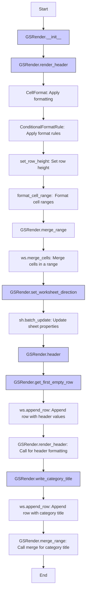

## Анализ кода `grender.py`

### 1. <алгоритм>

**Блок-схема работы класса `GSRender`:**

```mermaid
graph LR
    A[Начало] --> B(GSRender.__init__);
    B --> C{self.render_schemas};
    C -- Загрузка из файла или инициализация -- D(GSRender.render_header);
    D --> E{Форматирование ячеек};
    E --> F(GSRender.merge_range);
    F --> G(GSRender.set_worksheet_direction);
    G --> H(GSRender.header);
    H --> I(GSRender.write_category_title);
    I --> J(GSRender.get_first_empty_row);    
    J --> K[Конец];
    
    
    style A fill:#f9f,stroke:#333,stroke-width:2px
    style K fill:#f9f,stroke:#333,stroke-width:2px
    style B fill:#ccf,stroke:#333,stroke-width:1px
    style D fill:#ccf,stroke:#333,stroke-width:1px
    style F fill:#ccf,stroke:#333,stroke-width:1px
    style G fill:#ccf,stroke:#333,stroke-width:1px
    style H fill:#ccf,stroke:#333,stroke-width:1px
    style I fill:#ccf,stroke:#333,stroke-width:1px
    style J fill:#ccf,stroke:#333,stroke-width:1px
    
```

**Примеры для логических блоков:**

1.  **`GSRender.__init__`**:
    *   Инициализирует экземпляр класса `GSRender`. 
    *   Предполагается загрузка конфигурации из `json`, но сейчас это `...` (опущено)

2.  **`GSRender.render_header`**:
    *   **Входные данные**: `ws` (таблица gspread), `world_title` (заголовок, строка), `range` (диапазон ячеек, строка, по умолчанию `A1:Z1`), `merge_type` (тип слияния, строка, по умолчанию `MERGE_ALL`).
    *   Устанавливает цвет фона и текста, выравнивание, жирность и размер шрифта для заголовка.
    *   Пример: `render_header(ws, "Мой заголовок", "A1:C1", 'MERGE_COLUMNS')`.

3.  **`GSRender.merge_range`**:
    *   **Входные данные**: `ws` (таблица gspread), `range` (диапазон ячеек, строка), `merge_type` (тип слияния, строка, по умолчанию `MERGE_ALL`).
    *   Выполняет слияние ячеек в заданном диапазоне, например, слияние всех ячеек в строке заголовка.
    *   Пример: `merge_range(ws, "A1:C1", 'MERGE_COLUMNS')`.

4.  **`GSRender.set_worksheet_direction`**:
    *   **Входные данные**: `sh` (книга gspread), `ws` (таблица gspread), `direction` (направление текста, строка, по умолчанию `rtl`).
    *   Устанавливает направление текста (слева направо или справа налево) для таблицы.
    *   Пример: `set_worksheet_direction(sh, ws, 'ltr')`.

5.  **`GSRender.header`**:
    *   **Входные данные**: `ws` (таблица gspread), `ws_header` (заголовок, строка или список), `row` (номер строки, целое число, по умолчанию None).
    *   Добавляет заголовок таблицы в указанную строку или в первую пустую строку, если `row` не указан.
    *   Вызывает `render_header` для форматирования.
    *   Пример: `header(ws, ["Заголовок 1", "Заголовок 2"], 3)`.

6.  **`GSRender.write_category_title`**:
    *   **Входные данные**: `ws` (таблица gspread), `ws_category_title` (категория, строка или список), `row` (номер строки, целое число, по умолчанию None).
    *   Добавляет заголовок категории в указанную строку.
    *   Вызывает `merge_range` для форматирования.
    *   Пример: `write_category_title(ws, "Категория 1", 5)`.

7.  **`GSRender.get_first_empty_row`**:
    *   **Входные данные**: `ws` (таблица gspread), `by_col` (номер колонки, целое число, по умолчанию None).
    *   Возвращает номер первой пустой строки в таблице или в указанной колонке.
    *   Пример: `get_first_empty_row(ws, 2)`.

### 2. <mermaid>



**Импорты и их зависимости:**

1.  `from src import gs`: Импортирует глобальные настройки проекта. Предполагается, что `gs` содержит настройки для работы с Google Sheets.
2.  `from src.helpers import logger, WebDriverException, pprint`: Импортирует утилиты для логирования, обработки ошибок, форматированного вывода.
3.  `import json`: Используется для работы с JSON-данными. Предположительно, используется для загрузки схем рендеринга, хотя в текущем коде использование закомментировано.
4.  `from typing import List, Type, Union`: Импортирует типы для аннотации.
5.  `from spread_formatting import *`: Импортирует все классы и функции из библиотеки для форматирования Google Sheets.
6.  `from spread import Spreadsheet, Worksheet`: Импортирует классы для работы с таблицами Google Sheets (`Spreadsheet` - для книг, `Worksheet` - для листов).
7.  `from goog.helpers import hex_color_to_decimal, decimal_color_to_hex, hex_to_rgb`: Импортирует функции для преобразования цветов из HEX в RGB и обратно, а также в десятичный формат.
8.  `from spread.utils import ValueInputOption, ValueRenderOption`: Импортирует настройки для ввода и вывода значений.

### 3. <объяснение>

**Импорты:**

*   `from src import gs`: Импортирует глобальные настройки из пакета `src`. Это позволяет использовать общие параметры и конфигурации, специфичные для проекта.
*   `from src.helpers import logger, WebDriverException, pprint`: Импортирует инструменты для логирования (`logger`), обработки исключений WebDriver (`WebDriverException`), и форматированного вывода (`pprint`). Эти инструменты помогают в отладке и организации кода.
*   `import json`: Используется для работы с JSON, в частности для десериализации схем форматирования (хотя сейчас это закомментировано) из `goog/schema.json`.
*   `from typing import List, Type, Union`: Типы используются для статической проверки типов и улучшения читаемости кода.
*   `from spread_formatting import *`: Библиотека для установки форматов ячеек в Google Sheets, позволяет использовать различные классы `CellFormat`, `Color`, `TextFormat`, `ConditionalFormatRule`, `BooleanRule` и т.д.
*   `from spread import Spreadsheet, Worksheet`: Обеспечивает работу с листами и таблицами Google Sheets. `Spreadsheet` — класс для представления электронной таблицы Google, `Worksheet` — для представления одного листа.
*   `from goog.helpers import hex_color_to_decimal, decimal_color_to_hex, hex_to_rgb`: Набор утилит для преобразования цветов. Используются для преобразования цветов в нужные форматы.
*   `from spread.utils import ValueInputOption, ValueRenderOption`: Определяют параметры ввода и отображения значений в Google Sheets.

**Класс `GSRender`:**

*   **Роль**: Класс предназначен для управления внешним видом таблиц Google Sheets. Он предоставляет методы для форматирования заголовков, слияния ячеек, установки направления текста и добавления заголовков.
*   **Атрибуты**:
    *   `render_schemas`: Словарь для хранения схем рендеринга (не используется в текущей версии, код закомментирован).
*   **Методы**:
    *   `__init__(self, *args, **kwards)`: Инициализирует объект `GSRender`. Сейчас закомментирован код по чтению файла конфигурации.
    *   `render_header(self, ws: Worksheet, world_title: str, range: str = 'A1:Z1', merge_type: str = 'MERGE_ALL') -> None`: Применяет форматирование к диапазону ячеек, включая цвет фона, выравнивание, направление текста и жирность.
    *   `merge_range(self, ws: Worksheet, range: str, merge_type: str = 'MERGE_ALL') -> None`: Выполняет слияние ячеек в указанном диапазоне в соответствии с заданным типом слияния (`MERGE_ALL`, `MERGE_COLUMNS`, `MERGE_ROWS`).
    *   `set_worksheet_direction(self, sh: Spreadsheet, ws: Worksheet, direction: str = 'rtl')`: Устанавливает направление текста (слева направо или справа налево) для таблицы.
    *   `header(self, ws: Worksheet, ws_header: str | list, row: int = None)`: Создает заголовок таблицы, добавляет его в указанную строку или в первую пустую, вызывает `render_header` для форматирования.
    *   `write_category_title(self, ws: Worksheet, ws_category_title: str | list, row: int = None)`: Добавляет заголовок категории в указанную строку и выполняет слияние ячеек.
    *   `get_first_empty_row(self, ws: Worksheet, by_col: int = None) -> int`: Возвращает номер первой пустой строки в таблице. Если `by_col` указана, то ищет первую пустую строку в заданной колонке.

**Функции:**

*   Все функции, кроме `__init__`, принимают `ws` (объект `Worksheet`) в качестве аргумента, что указывает на их прямое взаимодействие с таблицами Google Sheets.
*   Функции `render_header`, `merge_range`, `set_worksheet_direction` и `header` используются для форматирования таблиц и добавления заголовков.
*   `get_first_empty_row` используется для определения места вставки новых данных.

**Переменные:**

*   `render_schemas`: Словарь, предназначенный для хранения схем форматирования, но пока не используется в коде.
*   `ws`, `sh`: Объекты `Worksheet` и `Spreadsheet` представляют собой таблицы и книги Google Sheets, соответственно.
*   `range`, `merge_type`, `direction`, `row`: Строковые или целочисленные переменные, используемые для настройки форматирования и слияния ячеек.

**Потенциальные ошибки и области для улучшения:**

1.  Отсутствует обработка ошибок в методах работы с Google Sheets.
2.  `render_schemas` не загружается из файла, что делает класс менее гибким.
3.  Закомментированный код в `__init__` намекает на неполную реализацию.
4.  Многочисленные аннотации `Any` приводят к потере контроля типов.
5.  `merge_type`  в методах `render_header` и `merge_range` дублируются.
6.  Не хватает документации `docstring` для всех функций.

**Цепочка взаимосвязей с другими частями проекта:**

*   `src.gs` обеспечивает доступ к глобальным настройкам, например, ключам API Google Sheets.
*   `src.helpers` предоставляет общие утилиты для логирования и обработки исключений.
*   `spread_formatting` и `spread` предоставляют функционал для работы с Google Sheets.
*   `goog.helpers` предоставляет утилиты для преобразования цветов.

В целом, код представляет собой набор инструментов для форматирования и добавления заголовков в Google Sheets, но требует улучшения в части обработки ошибок, загрузки конфигураций и документирования.