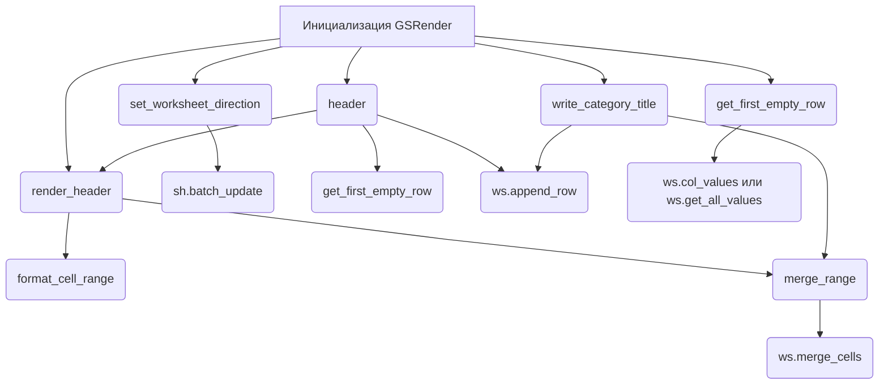

## <алгоритм>

**Общая схема работы:**

1.  **Инициализация `GSRender`:**
    *   Создается экземпляр класса `GSRender`. На этапе `__init__` происходит  инициализация. В текущей версии функциональность инициализации не реализована, что обозначено как `...`
2.  **Рендеринг заголовка таблицы (`render_header`)**:
    *   Принимает объект `Worksheet`, заголовок `world_title` (строка), диапазон `range` (по умолчанию 'A1:Z1'), и тип слияния `merge_type` (по умолчанию 'MERGE_ALL').
    *   Задает цвета фона и текста, а также выравнивание, направление текста и размер шрифта.
    *   Создает объект `CellFormat` с заданными стилями.
    *   Создает правило условного форматирования `ConditionalFormatRule`, применяющее заданный формат к ячейкам в указанном диапазоне. **Пример:** диапазон `'A1:Z1'`, условное форматирование:  значение ячейки > 50.
    *   Устанавливает высоту строки.
    *   Применяет форматирование к диапазону ячеек.
    *   Вызывает метод `merge_range` для слияния ячеек.
3.  **Слияние ячеек (`merge_range`)**:
    *   Принимает объект `Worksheet`, диапазон `range` (строка) и тип слияния `merge_type` (по умолчанию 'MERGE_ALL').
    *   Вызывает метод `merge_cells` объекта `Worksheet` для слияния ячеек.
4.  **Установка направления листа (`set_worksheet_direction`)**:
    *   Принимает объект `Spreadsheet`, объект `Worksheet` и направление `direction` ('ltr' или 'rtl', по умолчанию 'rtl').
    *   Создает словарь `data` для обновления свойств листа, включая установку `rightToLeft` в `True`, если `direction` равно 'rtl'.
    *   Вызывает метод `batch_update` объекта `Spreadsheet` для применения изменений.
5.  **Создание заголовка (`header`)**:
    *   Принимает объект `Worksheet`, заголовок `ws_header` (строка или список), и номер строки `row` (по умолчанию None).
    *   Определяет первую пустую строку (если `row` не указан) с помощью `get_first_empty_row`.
    *   Преобразует заголовок в список, если он строка.
    *   Добавляет строку заголовка в `Worksheet`.
    *   Формирует диапазон для заголовка и вызывает `render_header` для применения стилей и слияния ячеек.
6.   **Запись заголовка категории (`write_category_title`)**:
    *   Принимает объект `Worksheet`, заголовок категории `ws_category_title` (строка или список), и номер строки `row` (по умолчанию None).
    *   Формирует диапазон для заголовка категории.
    *   Преобразует заголовок в список, если он строка.
    *   Добавляет строку с заголовком категории в `Worksheet`.
    *   Формирует диапазон слияния и вызывает `merge_range` для слияния ячеек.
7.  **Получение первой пустой строки (`get_first_empty_row`)**:
    *   Принимает объект `Worksheet` и номер колонки `by_col` (по умолчанию None).
    *   Фильтрует значения из колонки (если `by_col` указан) или все значения из таблицы, исключая пустые значения.
    *   Возвращает номер следующей пустой строки.

**Поток данных:**



## <mermaid>

```mermaid
flowchart TD
    Start[Start] --> InitializeGSRender(Initialize GSRender Class);
    InitializeGSRender --> renderHeaderFunction(render_header Function);
    renderHeaderFunction --> SetCellFormat[Set Cell Format];
     SetCellFormat --> ApplyConditionalFormatting[Apply Conditional Formatting];
    ApplyConditionalFormatting --> SetRowHeight[Set Row Height];
    SetRowHeight --> formatCellRange(format_cell_range Function);
    formatCellRange --> mergeRangeFunction(merge_range Function);
    mergeRangeFunction --> MergeCells(ws.merge_cells);
    
    InitializeGSRender --> setWorksheetDirectionFunction(set_worksheet_direction Function);
    setWorksheetDirectionFunction --> UpdateSheetProperties(sh.batch_update);
    
   InitializeGSRender --> headerFunction(header Function);
    headerFunction --> GetFirstEmptyRow(get_first_empty_row Function);
    GetFirstEmptyRow --> GetColumnValues(ws.col_values или ws.get_all_values)
    headerFunction --> AppendRow(ws.append_row);
    headerFunction --> renderHeaderFunction;
    
    InitializeGSRender --> writeCategoryTitleFunction(write_category_title Function);
    writeCategoryTitleFunction --> AppendRowCategory(ws.append_row);
    writeCategoryTitleFunction --> mergeRangeFunction;
     
    
    
     
    classDef function fill:#f9f,stroke:#333,stroke-width:2px
    class renderHeaderFunction, mergeRangeFunction, setWorksheetDirectionFunction, headerFunction, writeCategoryTitleFunction, GetFirstEmptyRow function
```

**Зависимости:**

*   `src`: Локальный пакет, используется для импорта `gs` (глобальные настройки) и `helpers` (вспомогательные функции, включая логирование).
*   `json`: Стандартная библиотека Python для работы с JSON-данными.
*   `typing`: Стандартная библиотека Python для аннотации типов. Используются `List` и `Union` для описания типов списков и объединений.
*   `spread_formatting`: Внешняя библиотека, используется для форматирования Google Sheets.
*   `spread`: Локальный пакет, включает классы `Spreadsheet` и `Worksheet`, абстрагирующие работу с таблицами.
*  `goog.helpers`:  Локальный пакет, содержит вспомогательные функции для работы с цветами (hex\_color\_to\_decimal, decimal\_color\_to\_hex, hex\_to\_rgb).
*  `spread.utils`:  Локальный пакет, содержит утилиты для  `ValueInputOption`, `ValueRenderOption`

## <объяснение>

**Импорты:**

*   `from src import gs`: Импортирует глобальные настройки из пакета `src`. Предположительно, `gs` содержит общие параметры и константы для проекта.
*   `from src.helpers import logger, WebDriverException, pprint`: Импортирует вспомогательные инструменты, такие как `logger` для логирования, `WebDriverException` для обработки ошибок, связанных с веб-драйвером, и `pprint` для форматированного вывода.
*   `import json`:  Используется для обработки JSON-данных (хотя в данном коде не используется, вероятно, предполагается использование в будущем).
*   `from typing import List, Type, Union`: Используется для аннотации типов переменных. `List` для списков, `Union` для объединения нескольких типов, что делает код более читаемым и позволяет проводить статическую проверку типов.
*   `from spread_formatting import *`: Импортирует все определения из библиотеки `spread_formatting`, которая, как можно предположить, отвечает за форматирование Google Sheets, включая стили ячеек.
*   `from spread import Spreadsheet, Worksheet`: Импортирует классы `Spreadsheet` и `Worksheet` из пакета `spread`, представляющие абстракции для работы с Google Sheets.
*    `from goog.helpers import hex_color_to_decimal, decimal_color_to_hex, hex_to_rgb`: Импортирует функции для преобразования цветов из hex в decimal и RGB и обратно. Это позволяет задавать цвета в удобном формате и использовать их для стилизации таблиц.
*    `from spread.utils import ValueInputOption, ValueRenderOption`: Импортирует константы `ValueInputOption` и `ValueRenderOption` из пакета `spread.utils`, которые управляют способом ввода и отображения данных в Google Sheets.

**Классы:**

*   `class GSRender:`
    *   Основной класс для рендеринга Google Sheets.
    *   `render_schemas: dict`: Атрибут класса, который, предположительно, должен содержать схемы рендеринга, но в текущем коде не инициализируется (остался `...`).
    *   `__init__`: Метод-конструктор класса, который на данный момент не выполняет никаких действий.
    *   `render_header`: Метод для форматирования и объединения ячеек заголовка таблицы.
    *   `merge_range`: Метод для объединения ячеек в заданном диапазоне.
    *   `set_worksheet_direction`: Метод для изменения направления отображения листа (слева направо или справа налево).
    *   `header`: Метод для создания строки заголовка.
    *   `write_category_title`: Метод для создания заголовка категории.
    *   `get_first_empty_row`: Метод для определения номера первой пустой строки в таблице.

**Функции:**

*   `render_header(self, ws: Worksheet, world_title: str, range: str = 'A1:Z1', merge_type: str = 'MERGE_ALL') -> None`:
    *   Аргументы:
        *   `ws`: Объект `Worksheet`, представляющий таблицу.
        *   `world_title`: Заголовок таблицы (не используется в текущей реализации).
        *   `range`: Диапазон ячеек для применения форматирования (по умолчанию 'A1:Z1').
        *   `merge_type`: Тип слияния ячеек ('MERGE_ALL', 'MERGE_COLUMNS' или 'MERGE_ROWS').
    *   Назначение: Применяет форматирование (цвет фона, цвет текста, выравнивание, шрифт) к заданному диапазону ячеек, устанавливает высоту строки и объединяет ячейки.
*    `merge_range(self, ws: Worksheet, range: str, merge_type: str = 'MERGE_ALL') -> None`:
    *   Аргументы:
        *   `ws`: Объект `Worksheet`, представляющий таблицу.
        *   `range`: Диапазон ячеек для слияния.
        *   `merge_type`: Тип слияния ячеек ('MERGE_ALL', 'MERGE_COLUMNS' или 'MERGE_ROWS').
    *   Назначение: Объединяет ячейки в заданном диапазоне.
*    `set_worksheet_direction(self, sh: Spreadsheet, ws: Worksheet, direction: str = 'rtl') -> None`:
    *   Аргументы:
        *   `sh`: Объект `Spreadsheet`, представляющий книгу.
        *   `ws`: Объект `Worksheet`, представляющий таблицу.
        *  `direction`:  Направление листа (по умолчанию 'rtl').
    *   Назначение: Устанавливает направление отображения листа справа налево или слева направо.
*   `header(self, ws: Worksheet, ws_header: str | list, row: int = None) -> None`:
    *   Аргументы:
        *   `ws`: Объект `Worksheet`, представляющий таблицу.
        *   `ws_header`: Заголовок (строка или список).
        *   `row`: Номер строки, в которой нужно разместить заголовок (по умолчанию None).
    *   Назначение: Добавляет строку заголовка в таблицу, форматирует и объединяет ячейки заголовка.
*   `write_category_title(self, ws: Worksheet, ws_category_title: str | list, row: int = None) -> None`:
    *   Аргументы:
         *   `ws`: Объект `Worksheet`, представляющий таблицу.
        *   `ws_category_title`: Заголовок категории (строка или список).
        *   `row`: Номер строки, в которой нужно разместить заголовок категории (по умолчанию None).
    *   Назначение: Добавляет строку заголовка категории, объединяет ячейки.
*   `get_first_empty_row(self, ws: Worksheet, by_col: int = None) -> int`:
    *   Аргументы:
        *   `ws`: Объект `Worksheet`, представляющий таблицу.
        *   `by_col`: Номер столбца для проверки (по умолчанию None).
    *   Назначение: Определяет номер первой пустой строки в таблице (или в указанной колонке).

**Переменные:**

*   `render_schemas`: Словарь для схем рендеринга, не используется в текущей версии.
*   `bg_color`, `fg_color`: Цвета фона и текста в формате RGB.
*   `fmt`: Объект `CellFormat`, содержащий стили ячейки.
*   `rule`: Объект `ConditionalFormatRule`, представляющий правило условного форматирования.
*   `data`: Словарь, содержащий параметры обновления свойств листа.
*  `table_range`: Диапазон ячеек для добавления данных.

**Потенциальные ошибки и улучшения:**

*   **Отсутствие инициализации `render_schemas`:** Атрибут `render_schemas` не инициализирован, и не используется, что может быть причиной ошибок, если его предполагается использовать в дальнейшем.
*   **Неиспользуемый параметр `world_title`:** Параметр `world_title` в методе `render_header` не используется. Возможно, его предполагалось использовать для отображения заголовка в ячейке, но этого не реализовано.
*   **Жестко заданные цвета:** Цвета `bg_color` и `fg_color` жестко заданы в `render_header`. Было бы лучше сделать их настраиваемыми параметрами.
*   **Условное форматирование:** Условие условного форматирования применимо ко всему диапазону, а не конкретно к ячейке с значением.
*   **Отсутствие обработки исключений:** Код не обрабатывает возможные исключения, такие как ошибки при работе с API Google Sheets.
*   **Неполная документация:** Некоторые методы (например, `__init__`, `merge_range`, `set_worksheet_direction`)  не имеют подробного описания.

**Взаимосвязи с другими частями проекта:**

*   Зависит от `src.gs` для получения глобальных настроек проекта.
*   Зависит от `src.helpers` для логирования, обработки ошибок и форматированного вывода.
*   Зависит от `spread_formatting` для стилизации Google Sheets.
*   Зависит от `spread` для работы с  `Spreadsheet` и `Worksheet`
*    Зависит от `goog.helpers` для работы с цветами.

Этот код предназначен для автоматизации процесса создания и форматирования таблиц в Google Sheets. Он предоставляет удобные методы для рендеринга заголовков, объединения ячеек, установки направления листа и добавления заголовков, что упрощает работу с таблицами. Однако, для стабильной и надежной работы, требуется дополнительная доработка и добавление обработки ошибок.