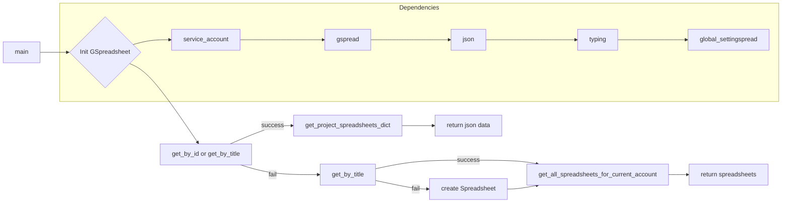

```MD
# <input code>

```python
## \file hypotez/src/goog/spreadsheet/bberyakov/gspreadsheet.py
# -*- coding: utf-8 -*-
#! venv/Scripts/python.exe
#! venv/bin/python/python3.12

"""
.. module: src.goog.spreadsheet.bberyakov 
	:platform: Windows, Unix
	:synopsis:

"""
MODE = 'dev'


"""
	:platform: Windows, Unix
	:synopsis:

"""


"""
	:platform: Windows, Unix
	:synopsis:

"""


"""
  :platform: Windows, Unix

"""
"""
  :platform: Windows, Unix
  :platform: Windows, Unix
  :synopsis:
"""MODE = 'dev'
  
""" module: src.goog.spreadsheet.bberyakov """


"""  [File's Description]

@namespace src: src
 \package beeryakov.goog
\file gspreadsheet.py
 
 @section libs imports:
  - gspread 
  - gspread 
  - json 
  - typing 
Author(s):
  - Created by [Davidka] [BenAvraham] on 08.11.2023 .
"""

from global_settingspread import Spreadsheet, service_account
import gspread
#import gs
#from global_settings import GWorksheet
import json
from typing import List, Type, Union

# see another app in
# https://github.com/xflr6/GSpreadsheet


class GSpreadsheet(Spreadsheet):
    """
     [Class's description]

    ## Inheritances : 
        - Implements Spreadsheet : [description]

    """
    """
    Книга Google sheets 
    """
    gsh: Spreadsheet = None # <- книга
    # """ Книги """

    gclient = gspread.client
    
    def __init__(self, s_id: str = None, s_title: str = None, *args, **kwards):
        """
         [Function's description]

        Parameters : 
             self : [description]
             s_id : str = None : [description]
             s_title : str = None : [description]
             *args : [description]
             **kwards : [description]

        """
        """
        Книга google spreadsheet
        """
        
        secret_file = f'goog\\onela-hypotez-1aafa5e5d1b5.json'
        self.gclient = service_account(filename = secret_file)
        if s_id:
            self.gsh = self.get_by_id('1ZcK74BCgWKVr4kODjPmSvjp5IyO0OxhXdbeHKWzLQiM')
        if s_title:
            self.gsh = self.get_by_title(s_title)
   
    def get_project_spreadsheets_dict(self) -> dict:
        """
         [Function's description]

        Parameters : 
             self : [description]
        Returns : 
             dict : [description]

        """
        return json.loads('goog\\spreadsheets.json')
    
    #def create_spreadsheet (self, sh_title: str = 'New Spreadsheet') -> Spreadsheet:
    def get_by_title (self, sh_title: str = 'New Spreadsheet'):
        """
         [Function's description]

        Parameters : 
             self : [description]
             sh_title : str = 'NewSpreadsheet' : [description]

        """
        """
        Создаю книгу, если такой нет
        """
        if sh_title not in [sh.title for sh in self.gsh.openall()]:
            self.gsh.create(sh_title)
            self.gsh.share('d07708766@gmail.com', perm_type='user', role='writer')

            # _gsh = self.create(sh_title)
            # self.set_spreadsheet_direction(_gsh, 'rtl')
            # _gsh.share('d07708766@gmail.com', perm_type='user', role='writer')
            # self = _gsh
        else:
            print(f'Spreadsheet {sh_title} already exist')
            self.gsh.open_by_title(sh_title)

    def get_by_id (self, sh_id: str) -> Spreadsheet:
        """
         [Function's description]

        Parameters : 
             self : [description]
             sh_id : str : [description]
        Returns : 
             Spreadsheet : [description]

        """
        """
        Открываю таблицу
        """
        #self = self.gclient.open_by_key (sh_id)
        return self.gclient.open_by_key (sh_id)
   
    def get_all_spreadsheets_for_current_account (self):
        """
         [Function's description]

        Parameters : 
             self : [description]

        """
        """
        открываю все книги (spreadsheets) аккаунта
        """
        return self.openall()
    
```

# <algorithm>

**Шаг 1:** Импорт необходимых библиотек: `gspread`, `json`, `typing` и `global_settingspread`.

**Пример:** `import gspread` - импортирует библиотеку для работы с Google Sheets.

**Шаг 2:** Определение класса `GSpreadsheet`, который наследуется от класса `Spreadsheet`.

**Пример:** `class GSpreadsheet(Spreadsheet):` - определяет новый класс, который расширяет функциональность класса `Spreadsheet`.

**Шаг 3:** Инициализация класса `GSpreadsheet`.
*   Получение доступа к Google Sheets через service account (`service_account`).
*   Поиск таблицы по ID или имени (`s_id`, `s_title`).

**Пример:** `self.gclient = service_account(filename = secret_file)` - устанавливает соединение с аккаунтом Google.

**Шаг 4:** Функция `get_project_spreadsheets_dict`.
*   Возвращает данные из файла `spreadsheets.json`.

**Пример:** `return json.loads('goog\\spreadsheets.json')` - считывает JSON-данные из файла.

**Шаг 5:** Функция `get_by_title`.
*   Создает таблицу, если она не существует по указанному имени (`sh_title`).
*   Делает доступ к созданной таблице.

**Пример:** `self.gsh.create(sh_title)` - создает новую таблицу в Google Sheets.

**Шаг 6:** Функция `get_by_id`.
*   Открывает таблицу по заданному ID (`sh_id`).

**Пример:** `self.gclient.open_by_key (sh_id)` - открывает таблицу в Google Sheets по предоставленному идентификатору.

**Шаг 7:** Функция `get_all_spreadsheets_for_current_account`.
*   Возвращает все таблицы текущего аккаунта.

**Пример:** `return self.openall()` - возвращает все таблицы, доступные текущему пользователю в Google Sheets.


# <mermaid>



**Описание диаграммы:**

*   `main` - точка входа в скрипт.
*   `Init GSpreadsheet` - инициализация класса `GSpreadsheet`.
*   `get_by_id` и `get_by_title` - методы поиска таблицы по ID или имени.
*   `get_project_spreadsheets_dict` - метод, возвращающий данные о таблицах.
*   `get_by_title` - метод создания таблицы, если она не существует.
*   `get_all_spreadsheets_for_current_account` - метод, возвращающий список всех таблиц.
*   `service_account`, `gspread`, `json`, `typing`, `global_settingspread` - подключаемые зависимости.

# <explanation>

**Импорты:**

*   `from global_settingspread import Spreadsheet, service_account`: Импортирует классы `Spreadsheet` и `service_account` из модуля `global_settingspread`.  Этот модуль, скорее всего, содержит определения, относящиеся к работе с Google Sheets, и логику для авторизации.
*   `import gspread`: Импортирует библиотеку `gspread` для работы с Google Sheets API.
*   `import json`: Импортирует модуль `json` для работы с JSON-данными.
*   `from typing import List, Type, Union`: Импортирует типы данных из `typing`. Это используется для явного указания типов переменных и аргументов функций, что улучшает читаемость и позволяет IDE делать более точные проверки.


**Классы:**

*   `GSpreadsheet(Spreadsheet)`: Наследуется от класса `Spreadsheet`. `Spreadsheet` - это, предположительно, базовый класс, предоставляющий общие функции для работы со спредшитами.  `GSpreadsheet` добавляет специализированные функции работы с Google Sheets.
    *   `gsh`: атрибут, хранящий объект Google Spreadsheet, на который ссылается.
    *   `gclient`:  атрибут, хранящий объект `gspread.client` для работы с Google Sheets API.

**Функции:**

*   `__init__`: Конструктор класса. Инициализирует `gclient` используя `service_account`, подключает `Spreadsheet`. Загружает таблицу по идентификатору или имени, если они переданны.
*   `get_project_spreadsheets_dict`: Возвращает данные из `spreadsheets.json`, вероятно, информацию о других таблицах.
*   `get_by_title`: Создаёт таблицу с указанным названием, если её ещё нет.
*   `get_by_id`: Открывает таблицу по ID.
*   `get_all_spreadsheets_for_current_account`: Открывает все таблицы пользователя.


**Возможные ошибки и улучшения:**

*   Отсутствует обработка исключений. Если файл `goog\\onela-hypotez-1aafa5e5d1b5.json` или `goog\\spreadsheets.json` не найден, произойдет ошибка. Нужно добавить обработку `FileNotFoundError` для повышения надёжности.
*   Не ясна логика и поведение методов. Нужно прокомментировать цели и действия каждой функции более подробно.
*   Добавление логгирования будет полезным для отладки и анализа поведения кода.
*   В коде есть комментарии-заглушки `[Class's description]`, `[Function's description]`, которые нужно заполнить описанием функциональности.
*   Непонятно, для чего используется переменная `MODE`.


**Взаимосвязи с другими частями проекта:**

Код зависит от модуля `global_settingspread`, который предоставляет классы и функции для работы с Google Sheets и авторизации. Также код использует `gspread`, `json` и `typing`. Непонятно, как связана `global_settingspread` с остальным кодом, но скорее всего, он связан с другими модулями, которые взаимодействуют с Google Sheets.