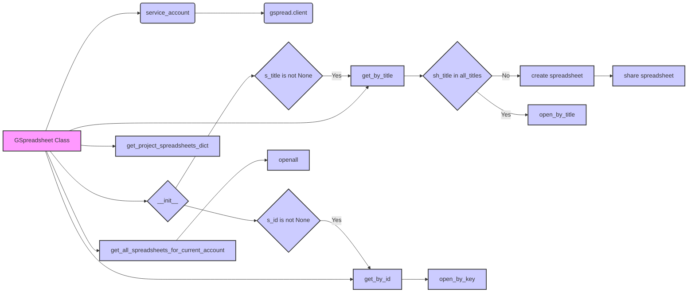

## <алгоритм>

1. **Инициализация GSpreadsheet:**
   - При создании экземпляра класса `GSpreadsheet`, вызывается метод `__init__`.
   - Загружается JSON файл с секретным ключом для аутентификации Google API.
   - Если передан `s_id` (идентификатор таблицы), вызывается `get_by_id` для открытия таблицы по ID.
   - Если передан `s_title` (название таблицы), вызывается `get_by_title` для открытия таблицы по названию.
   
   *Пример:* 
   ```python
   gspread_obj_with_id = GSpreadsheet(s_id="1ZcK74BCgWKVr4kODjPmSvjp5IyO0OxhXdbeHKWzLQiM")
   gspread_obj_with_title = GSpreadsheet(s_title="MySpreadsheet")
   gspread_obj_default = GSpreadsheet()
   ```
   
2. **Получение списка таблиц проекта:**
   - Метод `get_project_spreadsheets_dict` возвращает словарь с информацией о таблицах из файла `goog/spreadsheets.json`.
   
   *Пример:*
     ```python
     project_spreadsheets = gspread_obj_with_title.get_project_spreadsheets_dict()
    ```

3. **Открытие таблицы по названию:**
    - Метод `get_by_title` проверяет существует ли таблица с указанным именем.
    - Если таблицы нет, создает новую таблицу с указанным именем,  предоставляет доступ для `d07708766@gmail.com` с правами `writer`.
    - Если таблица существует, открывает ее и выводит сообщение.

    *Пример:*
     ```python
     gspread_obj_default.get_by_title("New Spreadsheet")
     ```
4. **Открытие таблицы по ID:**
    - Метод `get_by_id` открывает таблицу Google Sheets по ее идентификатору.
    
    *Пример:*
      ```python
     spreadsheet = gspread_obj_with_id.get_by_id("1ZcK74BCgWKVr4kODjPmSvjp5IyO0OxhXdbeHKWzLQiM")
      ```

5. **Получение списка всех таблиц аккаунта:**
    - Метод `get_all_spreadsheets_for_current_account` открывает все таблицы Google Sheets, к которым имеет доступ текущий аккаунт.

    *Пример:*
     ```python
      all_spreadsheets = gspread_obj_default.get_all_spreadsheets_for_current_account()
     ```

## <mermaid>



**Описание зависимостей:**

-   **`GSpreadsheet Class`**: Основной класс, который управляет взаимодействием с Google Sheets.
-   **`service_account`**: Функция из библиотеки `global_settingspread`, которая используется для аутентификации в Google API. Она принимает путь к файлу с секретным ключом.
-   **`gspread.client`**: Клиентский объект из библиотеки `gspread` для работы с Google Sheets.
-   **`__init__`**: Конструктор класса `GSpreadsheet`, который инициализирует клиент и открывает таблицу при необходимости.
-   **`s_id is not None`**: Условный блок, проверяющий, был ли передан идентификатор таблицы.
-   **`get_by_id`**: Метод для открытия таблицы по ее ID.
-  **`s_title is not None`**: Условный блок, проверяющий, было ли передано название таблицы.
-   **`get_by_title`**: Метод для открытия таблицы по ее названию.
-  **`get_project_spreadsheets_dict`**: Метод для загрузки списка таблиц проекта из JSON файла.
-   **`sh_title in all_titles`**: Условный блок, проверяющий, существует ли таблица с указанным названием.
-    **`create spreadsheet`**: Метод для создания таблицы.
-    **`share spreadsheet`**: Метод для предоставления доступа к таблице.
-   **`open_by_title`**: Метод для открытия таблицы по названию, если она существует.
-   **`open_by_key`**: Метод из `gspread.client` для открытия таблицы по её ID.
-   **`get_all_spreadsheets_for_current_account`**: Метод для получения списка всех таблиц аккаунта.
-  **`openall`**: Метод для открытия всех таблиц, к которым имеет доступ текущий аккаунт.

## <объяснение>

**Импорты:**

-   `from global_settingspread import Spreadsheet, service_account`: Импортирует классы `Spreadsheet` и функцию `service_account` из модуля `global_settingspread`. `Spreadsheet`, вероятно, является базовым классом для работы с таблицами, а `service_account` используется для аутентификации через JSON-ключ. Это указывает на использование кастомной логики для работы с Google Sheets, выходящей за рамки `gspread`.
-   `import gspread`: Импортирует библиотеку `gspread` для работы с Google Sheets API. Используется для аутентификации и управления таблицами.
-   `import json`: Импортирует стандартную библиотеку `json` для работы с JSON-файлами, используется для загрузки конфигураций таблиц.
-   `from typing import List, Type, Union`: Импортирует типы из библиотеки `typing` для статической типизации, используется для улучшения читаемости и предотвращения ошибок.

**Классы:**

-   **`GSpreadsheet(Spreadsheet)`:**
    -   **Роль**: Класс для управления Google Sheets. Наследуется от кастомного класса `Spreadsheet`.
    -   **Атрибуты**:
        -   `gsh: Spreadsheet = None`:  Представляет открытую таблицу, тип `Spreadsheet`, что намекает на использование кастомного класса.
        -   `gclient = gspread.client`:  Клиент Google Sheets, используется для работы с API.
    -   **Методы**:
        -   `__init__(self, s_id: str = None, s_title: str = None, *args, **kwards)`: Конструктор класса.
            -   Инициализирует клиента `gspread` с помощью `service_account`.
            -   Открывает таблицу по ID (`s_id`) или заголовку (`s_title`), если они переданы.
        -   `get_project_spreadsheets_dict(self) -> dict`: Возвращает словарь с информацией о таблицах проекта, загружая данные из JSON-файла.
        -   `get_by_title(self, sh_title: str = 'New Spreadsheet')`: Открывает таблицу по заголовку, создает таблицу, если она не существует и предоставляет доступ пользователю `d07708766@gmail.com` с правами `writer`.
        -   `get_by_id(self, sh_id: str) -> Spreadsheet`: Открывает таблицу по её идентификатору.
        -   `get_all_spreadsheets_for_current_account(self)`: Возвращает список всех доступных таблиц аккаунта.
    -   **Взаимодействие**: Использует `global_settingspread.service_account` для аутентификации, `gspread` для работы с Google Sheets API.

**Функции:**

-   `__init__(self, s_id: str = None, s_title: str = None, *args, **kwards)`:
    -   **Аргументы**:
        -   `self`: Ссылка на текущий экземпляр класса.
        -   `s_id: str = None`: Идентификатор Google Sheets.
        -   `s_title: str = None`: Название Google Sheets.
        -   `*args, **kwards`: Дополнительные аргументы.
    -   **Возвращаемое значение**: None (конструктор не возвращает значения).
    -   **Назначение**: Инициализирует объект `GSpreadsheet`. Загружает credentials из json файла, открывает Google Sheet по id или title.
    -   **Пример**:
       ```python
        gspread_obj = GSpreadsheet(s_id = "123456", s_title = "My Sheet")
       ```

-  `get_project_spreadsheets_dict(self) -> dict`:
    -   **Аргументы**: `self`: Ссылка на текущий экземпляр класса.
    -   **Возвращаемое значение**: `dict`: Словарь с информацией о таблицах проекта.
    -   **Назначение**: Загружает словарь из JSON файла `goog/spreadsheets.json`.
    -   **Пример**:
       ```python
       project_data = gspread_obj.get_project_spreadsheets_dict()
       ```

-   `get_by_title(self, sh_title: str = 'New Spreadsheet')`:
    -   **Аргументы**:
        -   `self`: Ссылка на текущий экземпляр класса.
        -   `sh_title: str = 'New Spreadsheet'`: Название таблицы.
    -   **Возвращаемое значение**: None
    -   **Назначение**: Открывает таблицу по названию, создает таблицу, если её не существует, предоставляет доступ.
    -    **Пример:**
       ```python
        gspread_obj.get_by_title("My New Sheet")
       ```

-   `get_by_id(self, sh_id: str) -> Spreadsheet`:
    -   **Аргументы**:
        -   `self`: Ссылка на текущий экземпляр класса.
        -   `sh_id: str`: Идентификатор таблицы.
    -   **Возвращаемое значение**: `Spreadsheet`: Объект открытой таблицы.
    -   **Назначение**: Открывает таблицу по ее ID.
    -  **Пример:**
      ```python
       spreadsheet = gspread_obj.get_by_id("123456")
      ```

-   `get_all_spreadsheets_for_current_account(self)`:
    -   **Аргументы**: `self`: Ссылка на текущий экземпляр класса.
    -   **Возвращаемое значение**: Список таблиц.
    -   **Назначение**: Возвращает список всех таблиц Google Sheets, к которым имеет доступ текущий аккаунт.
     -  **Пример:**
      ```python
       all_spreadsheets = gspread_obj.get_all_spreadsheets_for_current_account()
      ```

**Переменные:**

-   ``: Глобальная переменная режима работы, используется для определения окружения.
-   `secret_file`: Локальная переменная, содержащая имя JSON файла с ключом.
-   `gsh`: Атрибут класса `GSpreadsheet`, представляет открытую таблицу.
-   `gclient`: Атрибут класса `GSpreadsheet`, представляет клиента `gspread`.

**Потенциальные ошибки и области для улучшения:**

-   **Обработка ошибок**: В коде отсутствует обработка исключений (например, при открытии файла, создании таблицы).
-   **Дублирование логики**: Логика открытия таблицы по ID и по title, а также проверки существования таблицы в `get_by_title`  может быть вынесена в отдельные методы.
-    **Жестко заданные данные**: Имя файла `goog/onela-hypotez-1aafa5e5d1b5.json` и email `d07708766@gmail.com` жёстко прописаны в коде, следует вынести в конфигурационные файлы или переменные среды.
-   **Отсутствие закрытия**: Нет явного закрытия открытых таблиц, что может привести к утечкам ресурсов.
-    **Неиспользуемый импорт:** Закомментированные импорты `import gs`  и  `from global_settings import GWorksheet` не используются, их стоит удалить.
-   **Несоответствие документации и кода**:  `_gsh = self.create(sh_title)` и дальнейший код в `get_by_title` закомментированы. Нужно актуализировать код или удалить комментарий.

**Взаимосвязи с другими частями проекта:**

-   Зависит от `global_settingspread`, который, вероятно, предоставляет общую логику для работы с Google Sheets и аутентификации.
-   Использует библиотеку `gspread` для доступа к Google Sheets API.
-   Использует `json` для загрузки конфигурации таблиц и секретных ключей.
-   Предполагается, что файл `goog/spreadsheets.json` содержит метаданные о таблицах проекта.
-   Предполагается, что файл `goog/onela-hypotez-1aafa5e5d1b5.json` содержит ключи для аутентификации Google API.
-   Может быть частью системы обработки данных, где используется Google Sheets как хранилище данных.

В целом, код представляет собой класс для управления Google Sheets с базовой функциональностью: открытие таблиц по ID, названию, создание таблиц и предоставление доступа. Однако код требует улучшения в части обработки ошибок, конфигурации, и общей структуры.