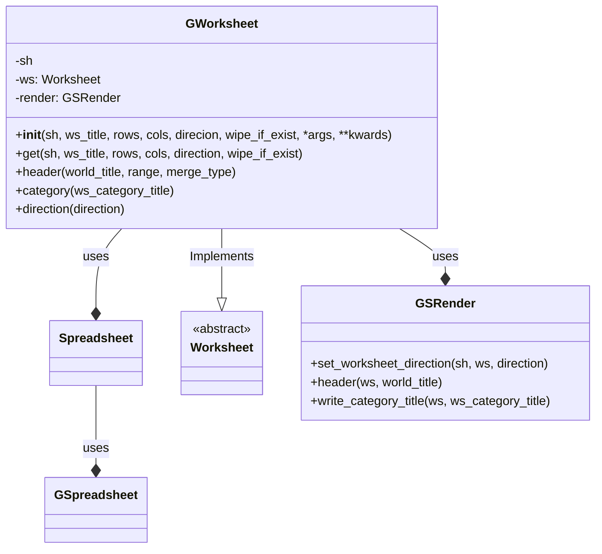

## Анализ кода `hypotez/src/goog/spreadsheet/bberyakov/gworksheets.py`

### 1. <алгоритм>

**Блок-схема работы класса `GWorksheet`:**

1.  **Инициализация (`__init__`)**:
    *   Принимает аргументы: `sh` (объект Spreadsheet), `ws_title` (название листа, по умолчанию 'new'), `rows`, `cols`, `direction` (направление, по умолчанию 'rtl'), `wipe_if_exist` (очищать ли данные, по умолчанию True), а также `*args` и `**kwards`.
    *   Сохраняет объект `sh` в атрибут `self.sh`.
    *   Вызывает метод `get()` для получения или создания листа.
    *   `...` - подразумевается продолжение кода (логики) в `__init__`

    *   _Пример_: `gws = GWorksheet(sh=spreadsheet_object, ws_title='Лист1', rows=50, cols=10, wipe_if_exist=False)`

2.  **Получение листа (`get`)**:
    *   Принимает аргументы: `sh` (объект Spreadsheet), `ws_title` (название листа, по умолчанию 'new'), `rows` (количество строк, по умолчанию 100), `cols` (количество столбцов, по умолчанию 100), `direction` (направление, по умолчанию 'rtl'), `wipe_if_exist` (очищать ли данные, по умолчанию True).
    *   **Если** `ws_title` равно 'new':
        *   Получает объект worksheet  из `sh.gsh.get()` и сохраняет его в `self.ws`.
        *   _Пример_:  `sh` - это `Spreadsheet`, `sh.gsh` - `GSpreadsheet`.
    *   **Иначе** (если `ws_title` не равно 'new'):
        *   **Если** лист с названием `ws_title` уже существует в электронной таблице:
            *   Выводит сообщение `worksheet {ws_title} already exist !`
            *   Получает существующий worksheet  из `sh.gsh.worksheet(ws_title)` и сохраняет его в `self.ws`.
            *   **Если** `wipe_if_exist` равен `True`:
                *   Очищает данные на листе  вызовом `self.ws.clear()`.
        *   **Иначе** (если листа с названием `ws_title` не существует):
            *   Создает новый worksheet  вызовом `sh.gsh.add_worksheet (ws_title, rows, cols )`  и сохраняет его в `self.ws`.
    *   Устанавливает направление листа  вызовом `self.render.set_worksheet_direction(sh.gsh, self.ws, 'rtl')`.

    *   _Пример_: `gws.get(sh=spreadsheet_object, ws_title='Лист2', rows=20, cols=5, wipe_if_exist=True)`

3.  **Установка заголовка (`header`)**:
    *   Принимает аргументы: `world_title` (заголовок), `range` (диапазон ячеек, по умолчанию 'A1:Z1'), `merge_type` (тип объединения ячеек, по умолчанию 'MERGE_ALL').
    *   Вызывает `self.render.header(self.ws, world_title)` для записи заголовка.

    *   _Пример_: `gws.header(world_title='Отчет за 2024 год', range='A1:F1', merge_type='MERGE_COLUMNS')`

4.  **Установка категории (`category`)**:
    *   Принимает аргумент `ws_category_title` (название категории).
    *   Вызывает `self.render.write_category_title(self, ws_category_title)`.

    *   _Пример_: `gws.category(ws_category_title='Финансовые показатели')`

5.  **Установка направления (`direction`)**:
    *   Принимает аргумент `direction` (направление, по умолчанию 'rtl').
    *   Вызывает `self.render.set_worksheet_direction(sh = self.sh, ws = self, direction = 'rtl')` для установки направления.

    *   _Пример_: `gws.direction(direction='ltr')`

### 2. <mermaid>

**Описание диаграммы `mermaid`:**

*   **`GWorksheet`**: Основной класс, представляющий лист в Google Sheets.
    *   Имеет атрибуты: `sh` (ссылка на объект `Spreadsheet`), `ws` (ссылка на объект `Worksheet`), `render` (ссылка на объект `GSRender`).
    *   Методы: `__init__` (конструктор), `get` (получение листа), `header` (запись заголовка), `category` (запись категории), `direction` (установка направления).
    *   Реализует интерфейс `Worksheet` (`--|>`).
    *   Использует классы  `GSRender`, `Spreadsheet`, `GSpreadsheet`(`--*`).
*   **`Spreadsheet`**:  Класс представляющий электронную таблицу.
*   **`GSpreadsheet`**: Класс для работы с электронной таблицей,  предоставляет методы для получения листов (`get`), создания (`add_worksheet`), и  доступа к ним (`worksheet`).
*   **`Worksheet`**: Абстрактный класс, представляющий лист. `GWorksheet` наследует и реализует его методы.
*   **`GSRender`**: Класс, отвечающий за отрисовку элементов листа.
    *   Методы: `set_worksheet_direction` (установка направления листа), `header` (запись заголовка), `write_category_title` (запись категории).

### 3. <объяснение>

**Импорты:**

*   `from global_settingspread import Spreadsheet, Worksheet`: Импортируются классы `Spreadsheet` и `Worksheet` из модуля `global_settingspread`. `Spreadsheet` вероятно, представляет собой электронную таблицу, а `Worksheet` - интерфейс для работы с листами.
*   `from goog.grender import GSRender`: Импортируется класс `GSRender` из модуля `goog.grender`. Этот класс используется для отрисовки элементов на листе.
*   `from typing import Union`: Импортируется тип `Union` для аннотации типов.

**Класс `GWorksheet`:**

*   **Роль**: Представляет собой конкретную реализацию листа электронной таблицы Google Sheets. Он управляет созданием, получением, очисткой и настройкой листа.
*   **Атрибуты**:
    *   `sh`: Ссылка на объект `Spreadsheet`, который представляет всю электронную таблицу.
    *   `ws`: Ссылка на объект `Worksheet`, представляющий текущий лист.
    *   `render`: Ссылка на объект `GSRender`, используемый для отрисовки.
*   **Методы**:
    *   `__init__(self, sh, ws_title='new', rows=None, cols=None, direcion='rtl', wipe_if_exist=True, *args, **kwards)`: Конструктор класса, принимает объект электронной таблицы `sh`, название листа `ws_title`, количество строк `rows`, количество столбцов `cols`, направление `direcion`, флаг очистки `wipe_if_exist`, а также произвольные `*args`, `**kwards`. Инициализирует атрибуты и получает лист.
    *   `get(self, sh, ws_title='new', rows=100, cols=100, direction='rtl', wipe_if_exist=True)`: Получает или создает лист с заданным названием, количеством строк, столбцов и направлением. Если лист уже существует и `wipe_if_exist` истинно, то он очищается.
    *   `header(self, world_title, range='A1:Z1', merge_type='MERGE_ALL')`: Устанавливает заголовок на листе.
    *   `category(self, ws_category_title)`: Устанавливает категорию на листе.
    *   `direction(self, direction='rtl')`: Устанавливает направление листа (справа налево или слева направо).

**Функции (методы класса `GWorksheet`)**:

*   `__init__`: Инициализация объекта `GWorksheet`. Принимает объект `sh` (электронная таблица) и другие параметры. Вызывает метод `get` для получения или создания объекта листа.
*   `get`: Получает объект листа `Worksheet`. Если `ws_title` равно `'new'`, то вызывается `sh.gsh.get()`, иначе, ищется существующий лист по `ws_title`. Если лист не найден, то создается новый с заданными `rows` и `cols`. Если лист существует и `wipe_if_exist` `True`, то старые данные удаляются. В конце устанавливается направление листа.
*   `header`: Записывает заголовок в указанный диапазон ячеек листа. Использует метод `header` объекта `GSRender`.
*   `category`: Записывает заголовок категории на листе. Использует метод `write_category_title` объекта `GSRender`.
*   `direction`: Устанавливает направление листа. Использует метод `set_worksheet_direction` объекта `GSRender`.

**Переменные**:

*   `MODE`: Строка `'dev'`, возможно, указывает на режим разработки.
*   `sh`: Атрибут класса `GWorksheet`, ссылка на объект `Spreadsheet`.
*   `ws`: Атрибут класса `GWorksheet`, ссылка на объект `Worksheet`.
*    `render`: Атрибут класса `GWorksheet`, ссылка на объект `GSRender`.

**Потенциальные ошибки и области для улучшения:**

*   В методе `__init__` после вызова `self.get()` есть `...`, что предполагает пропущенную логику.
*   Может быть целесообразно добавить обработку исключений для случаев, когда не удается получить или создать лист.
*   Использование магических строк, таких как `'new'` и `'rtl'`, может быть заменено на константы или перечисления.
*   Много повторяющегося кода в коментариях - `[Function's description]`, `[description]`.

**Взаимосвязь с другими частями проекта:**

*   `GWorksheet` использует классы `Spreadsheet` и `Worksheet` из модуля `global_settingspread`, `GSRender` из `goog.grender`.
*   Предполагается, что `Spreadsheet` представляет собой обёртку над Google Sheets API, а `GSRender` предоставляет функциональность для управления стилями и форматированием.

**Цепочка взаимосвязей:**

1.  Пользователь создает объект `GWorksheet`, передавая объект электронной таблицы (например, `Spreadsheet`) и другие параметры.
2.  `GWorksheet` использует объект `Spreadsheet` для доступа к Google Sheets API.
3.  `GWorksheet` вызывает `get` для получения объекта `Worksheet` (существующего или нового) из  `Spreadsheet.gsh`.
4.  `GWorksheet` использует `GSRender` для отрисовки элементов на листе (`header`, `category`, `direction`).
5.  `Spreadsheet` в свою очередь использует  `GSpreadsheet` для непосредственной работы с Google Sheets API.