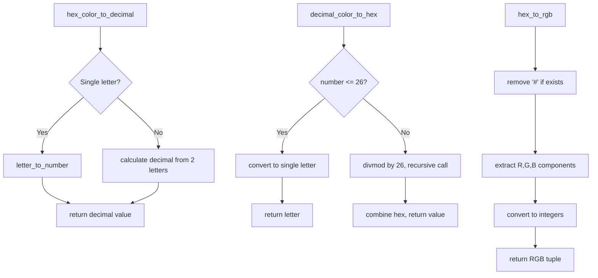

# <input code>

```python
## \file hypotez/src/goog/spreadsheet/bberyakov/helpers.py
# -*- coding: utf-8 -*-\
#! venv/Scripts/python.exe
#! venv/bin/python/python3.12

"""
.. module: src.goog.spreadsheet.bberyakov 
	:platform: Windows, Unix
	:synopsis:

"""
MODE = 'dev'

"""
	:platform: Windows, Unix
	:synopsis:

"""


"""
	:platform: Windows, Unix
	:synopsis:

"""


"""
  :platform: Windows, Unix

"""
"""
  :platform: Windows, Unix
  :platform: Windows, Unix
  :synopsis:
"""MODE = 'dev'
  
""" module: src.goog.spreadsheet.bberyakov """


""" перевод цветовых форматов.
Перевод:
- HEX->DECIMAL
- DECIMAL->HEX
- HEX->RGB

 @section libs imports:

Author(s):
  - Created by hypotez
"""


def hex_color_to_decimal(letters: str) -> int:
    """ Перевод HEX->DECIMAL
    
    @param letters `str` : [description]
    Returns : 
         int : [description]

    ### Example usage 
    print(number_to_letter(1))  # Output: 'a' \n
    print(number_to_letter(2))  # Output: 'b' \n
    print(number_to_letter(3))  # Output: 'c' \n
    print(number_to_letter(27))  # Output: 'aa' \n
    print(number_to_letter(28))  # Output: 'ab' \n
    print(number_to_letter(29))  # Output: 'ac' \n
    """
    letters = letters.upper()

    def letter_to_number(letter: str) -> int:
        """
         [Function's description]

        Parameters : 
             letter : str : [description]
        Returns : 
             int : [description]

        """
        """
        ord() function returns the Unicode code from a given character. \n
        print(ord('a'))  # Output: 97 \n
        """
        return str (ord (letter.lower()) - 96).upper()
    return letter_to_number(letters) if len(letters) == 1 else (letter_to_number(letters[0]) * 26) + letter_to_number(letters[1])

def decimal_color_to_hex(number: int) -> str:
    """
     [Function's description]

    Parameters : 
         number : int : [description]
    Returns : 
         str : [description]

    """
    if number <= 26:
        return str (chr (number + 96)).upper()
    else:
        quotient, remainder = divmod (number - 1, 26)
        return str ( decimal_color_to_hex (quotient) + chr (remainder + 97) ).upper()


def hex_to_rgb (hex: str) -> tuple:
    """
     [Function's description]

    Parameters : 
         hex : str : [description]
    Returns : 
         tuple : [description]

    """
        """
        #FFFFFF -> (255, 255, 255) \n
        `hex`: color in hexadecimal
        """
        hex = hex[1:] if '#' in hex else hex           
        return (int (hex[:2], 16), int (hex[2:4], 16), int (hex[4:], 16) )
```

# <algorithm>

The code defines functions for converting colors between hexadecimal (HEX), decimal, and RGB formats.

**hex_color_to_decimal:**

1. Takes a hexadecimal letter(s) as input.
2. Converts input to uppercase.
3. Uses an inner function `letter_to_number` to convert single letters to their decimal representation (a -> 1, b -> 2, etc.)
4. If input is a single letter, returns the result of `letter_to_number`.
5. If input is two letters, calculates the decimal value by combining the decimal values of the individual letters.

**decimal_color_to_hex:**

1. Takes a decimal number as input.
2. If the number is less than or equal to 26, converts the number to its single letter equivalent.
3. If the number is greater than 26, performs integer division (`divmod`) by 26 to find quotient and remainder. Converts the quotient to HEX, then combines it with the remainder letter, returning the combined result in uppercase.

**hex_to_rgb:**

1. Takes a hexadecimal color code (e.g., "#FFFFFF") as input.
2. Removes the '#' if present.
3. Extracts the red, green, and blue components from the hexadecimal string using slicing and `int(..., 16)` to convert from hexadecimal to decimal.
4. Returns a tuple containing the RGB values.


# <mermaid>



**Dependencies:**

The code relies on the Python built-in `ord()` function for character to Unicode code conversion, and `divmod()` for integer division and remainder calculation. It does not use external libraries.


# <explanation>

**Imports:**

There are no imports in this code.  All functions used are built-in to Python.

**Classes:**

There are no classes defined.

**Functions:**

* **`hex_color_to_decimal(letters: str) -> int`**: Converts a hexadecimal color letter(s) to its decimal equivalent.
    * Takes a string `letters` as input representing a single or double hexadecimal character.
    * Returns an integer representing the decimal equivalent.
* **`decimal_color_to_hex(number: int) -> str`**: Converts a decimal number to its hexadecimal equivalent, also handling cases with multiple hexadecimal letters.
    * Takes an integer `number` as input.
    * Returns a string containing the hexadecimal representation.
* **`hex_to_rgb(hex: str) -> tuple`**: Extracts the RGB values from a hexadecimal color code.
    * Takes a hexadecimal color code (string) as input.
    * Returns a tuple containing the red, green, and blue values as integers (RGB format).

**Variables:**

* **`MODE`**: A global string variable, likely used for setting a development mode, but it's not used within the functions.


**Possible Errors/Improvements:**

* **Error Handling:** The `hex_to_rgb` function doesn't explicitly handle cases where the input string `hex` might not be in the correct format (e.g., wrong number of characters, non-hexadecimal characters).  Adding input validation would make it more robust.


**Relationships with other parts of the project:**

The code's purpose is to provide color conversion helpers for the `goog.spreadsheet` module. Its usage will be within another file, likely within the same package, `src.goog.spreadsheet`, and its functions are expected to be called there to convert color values in hexadecimal and decimal formats.