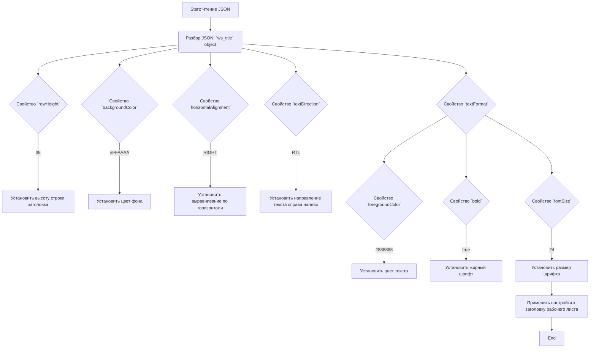

## АНАЛИЗ JSON КОНФИГУРАЦИИ

### <алгоритм>
1.  **Чтение JSON:**
    *   Приложение считывает JSON-файл `shcema.json`.
    *   Файл содержит объект JSON, представляющий настройки стиля для заголовка рабочего листа.
    *   Пример: `{ "ws_title": { ... } }`
2.  **Разбор объекта `ws_title`:**
    *   Объект `ws_title` определяет стиль для заголовка рабочего листа.
    *   Свойства объекта `ws_title` (такие как `rowHeight`, `backgroundColor`, `horizontalAlignment`, `textDirection`, `textFormat`) управляют внешним видом заголовка.
3.  **Применение настроек:**
    *   Приложение использует эти настройки при создании или обновлении рабочего листа Google Sheets.
    *   Например, `rowHeight` устанавливает высоту строки заголовка, `backgroundColor` - цвет фона, и так далее.
4.  **Обработка `textFormat`:**
    *   Объект `textFormat` содержит дополнительные настройки форматирования текста:
        *   `foregroundColor` - цвет текста,
        *   `bold` - жирный шрифт,
        *   `fontSize` - размер шрифта.
    *   Эти настройки применяются к текстовому содержимому заголовка.

### <mermaid>

### <объяснение>

**Описание JSON:**

Данный JSON-файл представляет собой конфигурацию для стилизации заголовка рабочего листа Google Sheets. Он определяет ряд настроек, применяемых к строке заголовка. Основным ключом является `ws_title`, который содержит все параметры стиля.

**Ключи и их значения:**
*   `ws_title`
    *   `rowHeight`: `"35"` - задаёт высоту строки заголовка в пикселях.
    *   `backgroundColor`: `"#FFAAAA"` - устанавливает цвет фона строки заголовка (в данном случае, светло-красный).
    *   `horizontalAlignment`: `"RIGHT"` - выравнивает содержимое заголовка по правому краю ячейки.
    *   `textDirection`: `"RTL"` - устанавливает направление текста справа налево (например, для арабских языков).
    *   `textFormat`
        *   `foregroundColor`: `"#888888"` - устанавливает цвет текста заголовка (в данном случае, серый).
        *   `bold`: `true` - устанавливает жирный шрифт для текста заголовка.
        *   `fontSize`: `"24"` - устанавливает размер шрифта текста заголовка.

**Использование:**

JSON-конфигурация может быть использована в приложении, которое взаимодействует с Google Sheets API. Приложение читает этот JSON-файл, разбирает его и применяет настройки к заголовку рабочего листа.

**Пример использования:**
*   При создании нового рабочего листа, приложение может установить высоту строки заголовка на 35 пикселей, цвет фона на `#FFAAAA`, выравнивание по правому краю, направление текста справа налево, цвет текста серый, жирный шрифт и размер шрифта 24.
*   При обновлении существующего рабочего листа, приложение может переконфигурировать стиль заголовка в соответствии с данными в файле `shcema.json`.

**Возможные улучшения:**
*   Добавление валидации для значений: Например, проверка, что `rowHeight` - положительное число, `backgroundColor` - корректный hex-код, `fontSize` - тоже число.
*   Возможность переопределить настройки: предусмотреть возможность задавать настройки по умолчанию и переопределять их из файла конфигурации.
*   Поддержка дополнительных стилей: Добавить поддержку других стилей, таких как границы, тип шрифта и т.д.

**Цепочка взаимосвязей:**

1.  Приложение, использующее этот `shcema.json`, является частью более крупной системы.
2.  Это приложение скорее всего использует Google Sheets API для взаимодействия с электронными таблицами.
3.  `shcema.json` является файлом конфигурации, предоставляющим параметры для стилизации заголовков в электронных таблицах.
4.  Приложение читает файл конфигурации и применяет настройки к Google Sheets.
5.  Вся цепочка работает в рамках проекта по автоматизации работы с электронными таблицами Google.