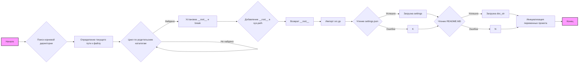

## Анализ кода `hypotez/src/goog/spreadsheet/header.py`

### <алгоритм>
1.  **Инициализация**:
    *   Устанавливается режим ``.
    *   Импортируются необходимые модули: `sys`, `json`, `Version` из `packaging.version` и `Path` из `pathlib`.

2.  **Определение `set_project_root`**:
    *   Функция `set_project_root` принимает кортеж `marker_files` (по умолчанию `('pyproject.toml', 'requirements.txt', '.git')`) в качестве аргумента.
    *   Определяется текущий путь к файлу `__file__` и его родительский каталог `current_path`.
    *   Итерируется по `current_path` и всем его родительским каталогам.
    *   На каждом шаге проверяется, существует ли какой-либо из `marker_files` в текущем родительском каталоге.
        *   **Пример**: Если `current_path` – `/Users/user/hypotez/src/goog/spreadsheet` и `marker_files` – `('pyproject.toml', 'requirements.txt', '.git')`,  функция будет искать наличие этих файлов в этой и родительских директориях.
    *   Если `marker_files` найден, то родительский каталог присваивается `__root__`, и цикл прерывается.
    *   Если `__root__` отсутствует в `sys.path`, то он добавляется.
    *   Возвращается `__root__`.
        *   **Пример**: Если `pyproject.toml` находится в `/Users/user/hypotez`,  функция вернет `/Users/user/hypotez`.

3.  **Определение `__root__`**:
    *   Вызывается функция `set_project_root()` для определения корневого каталога проекта и присваивается переменной `__root__`.

4.  **Импорт модуля `src.gs`**:
    *   Импортируется модуль `src.gs`. Это предполагает, что в корневом каталоге проекта находится каталог `src` и в нем есть модуль `gs`.
    *   Модуль `gs` должен содержать `gs.path.root` - путь к корневому каталогу.

5.  **Чтение настроек из `settings.json`**:
    *   Пытается открыть файл `settings.json`, расположенный в `src` относительно корневого каталога проекта.
        *   **Пример**: Если `__root__` это `/Users/user/hypotez`, файл будет открыт `/Users/user/hypotez/src/settings.json`.
    *   Читает содержимое файла и загружает его в словарь `settings`.
    *   В случае ошибок `FileNotFoundError` или `json.JSONDecodeError`, выполнение переходит в блок `except` и ничего не происходит.

6.  **Чтение документации из `README.MD`**:
    *   Пытается открыть файл `README.MD`, расположенный в `src` относительно корневого каталога проекта.
         *   **Пример**: Если `__root__` это `/Users/user/hypotez`, файл будет открыт `/Users/user/hypotez/src/README.MD`.
    *   Читает содержимое файла и загружает его в строку `doc_str`.
    *   В случае ошибок `FileNotFoundError` или `json.JSONDecodeError`, выполнение переходит в блок `except` и ничего не происходит.

7.  **Инициализация переменных проекта**:
    *   Извлекаются значения из словаря `settings` для переменных проекта:
        *   `__project_name__`: Название проекта, по умолчанию `hypotez`.
        *   `__version__`: Версия проекта.
        *   `__doc__`: Документация проекта из файла `README.MD`.
        *    `__details__`: Пустая строка.
        *   `__author__`: Автор проекта.
        *   `__copyright__`: Информация об авторских правах.
        *   `__cofee__`: Сообщение с призывом поддержать автора.
        *   Если словарь `settings` отсутствует, используются значения по умолчанию.

### <mermaid>

**Описание диаграммы:**
Диаграмма описывает поток выполнения программы.
1.  Начинается с блока **Начало**.
2.  Вызывается функция поиска корневой директории.
3.  Определяется текущий путь к файлу `__file__`.
4.  Итерируется по родительским каталогам в цикле.
5.  Если нужный маркер найден, то устанавливается значение `__root__`.
6.  Добавляется `__root__` в `sys.path`, если его там нет.
7.  Возвращается значение `__root__`.
8.  Импортируется модуль `src.gs`.
9.  Читается файл `settings.json`, загружается в переменную `settings` если успешно, иначе игнорируется ошибка.
10. Читается файл `README.MD`, загружается в переменную `doc_str` если успешно, иначе игнорируется ошибка.
11. Инициализируются переменные проекта, используя значения из `settings` или значения по умолчанию.
12. Программа завершается.

### <объяснение>
**Импорты:**

*   `sys`:  Используется для управления путями импорта модулей (`sys.path`).
*   `json`: Используется для работы с данными в формате JSON (чтение `settings.json`).
*   `packaging.version.Version`:  Используется для работы с версиями, но в данном коде не используется.
*   `pathlib.Path`: Используется для работы с путями к файлам и каталогам.

**Функция `set_project_root`:**
*   **Аргументы:** `marker_files` (tuple):  Кортеж с именами файлов или каталогов, которые указывают на корень проекта.
*   **Возвращаемое значение:** `Path`: Путь к корневому каталогу проекта.
*   **Назначение:**  Определяет корневой каталог проекта путем поиска родительских каталогов, содержащих определенные маркерные файлы (например, `pyproject.toml`, `requirements.txt`, `.git`). Это позволяет программе определить свою корневую директорию независимо от того, где она была вызвана.

**Переменные:**

*   `MODE` (str): Устанавливает режим работы приложения, в данном случае `'dev'`.
*   `__root__` (Path):  Хранит путь к корневому каталогу проекта. Определяется функцией `set_project_root`.
*   `settings` (dict): Содержит настройки проекта, прочитанные из файла `settings.json`. Может быть `None`, если файл не найден или его содержимое не является корректным JSON.
*   `doc_str` (str): Содержит содержимое файла `README.MD`, если он найден. Может быть `None`, если файл не найден.
*    `__project_name__` (str): Название проекта.
*   `__version__` (str): Версия проекта.
*   `__doc__` (str): Документация проекта.
*   `__details__` (str):  Дополнительные детали проекта (не используется, всегда пустая строка).
*   `__author__` (str): Автор проекта.
*   `__copyright__` (str): Информация об авторских правах.
*   `__cofee__` (str): Сообщение с просьбой поддержать разработчика.

**Классы:**
*   В этом файле нет классов.

**Взаимосвязь с другими частями проекта:**

*   `src.gs`: Модуль `src.gs` предполагается как модуль содержащий основную логику,  используется для доступа к корню проекта через `gs.path.root`. Этот модуль, вероятно, определен в файле `hypotez/src/gs/__init__.py` и должен содержать объект `path` c полем `root`.
*   `settings.json`:  Файл `settings.json` содержит основные настройки проекта, такие как имя проекта, версию, автора и т.д.
*   `README.MD`: Файл `README.MD` используется для получения описания проекта.

**Потенциальные ошибки и улучшения:**

*   **Обработка ошибок:** Обработка `FileNotFoundError` и `json.JSONDecodeError` выполняется через `...`.  Это означает, что в случае ошибки программа просто проигнорирует ее и использует значения по умолчанию. Было бы лучше логировать ошибки.
*   **Использование `Version`:** Импортируется класс `Version` из `packaging.version`, но не используется. Возможно,  планируется использование в будущем.
*   **Словарь `settings`:** Доступ к словарю `settings` происходит через `settings.get()`, что позволяет избежать `KeyError` при отсутствии ключа.
*    **Переменная `__details__`**:  Остается пустой строкой. Возможно, она будет использоваться в будущем, или ее следует убрать.

**Цепочка взаимосвязей:**

1.  Модуль `header.py` определяет корневую директорию проекта.
2.  Загружает основные настройки проекта из `settings.json`.
3.  Читает документацию из `README.MD`.
4.  Инициализирует глобальные переменные, содержащие информацию о проекте.
5.  Все эти данные используются в других частях проекта.

Этот код является важной частью проекта, так как он обеспечивает доступ к основным настройкам и метаданным проекта.