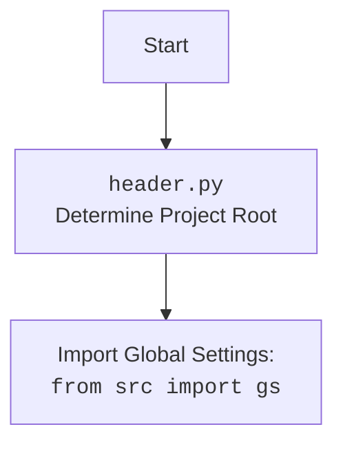

## ИНСТРУКЦИЯ:

Анализируй предоставленный код подробно и объясни его функциональность. Ответ должен включать три раздела:  

1. **<алгоритм>**: Опиши рабочий процесс в виде пошаговой блок-схемы, включая примеры для каждого логического блока, и проиллюстрируй поток данных между функциями, классами или методами.  
2. **<mermaid>**: Напиши код для диаграммы в формате `mermaid`, проанализируй и объясни все зависимости, 
    которые импортируются при создании диаграммы. 
    **ВАЖНО!** Убедитесь, что все имена переменных, используемые в диаграмме `mermaid`, 
    имеют осмысленные и описательные имена. Имена переменных вроде `A`, `B`, `C`, и т.д., не допускаются!  
    
    **Дополнительно**: Если в коде есть импорт `import header`, добавьте блок `mermaid` flowchart, объясняющий `header.py`:\
    ```mermaid
    flowchart TD
        Start --> Header[<code>header.py</code><br> Determine Project Root]
    
        Header --> import[Import Global Settings: <br><code>from src import gs</code>] 
    ```

3. **<объяснение>**: Предоставьте подробные объяснения:  
   - **Импорты**: Их назначение и взаимосвязь с другими пакетами `src.`.  
   - **Классы**: Их роль, атрибуты, методы и взаимодействие с другими компонентами проекта.  
   - **Функции**: Их аргументы, возвращаемые значения, назначение и примеры.  
   - **Переменные**: Их типы и использование.  
   - Выделите потенциальные ошибки или области для улучшения.  

Дополнительно, постройте цепочку взаимосвязей с другими частями проекта (если применимо).  

Это обеспечивает всесторонний и структурированный анализ кода.
## Формат ответа: `.md` (markdown)
**КОНЕЦ ИНСТРУКЦИИ**
## 

### 1. <алгоритм>

1.  **Начало**: Исполнение скрипта начинается.
2.  **`set_project_root()`**:
    *   Определение текущего пути файла: `current_path` присваивается путь к директории, где находится текущий файл.
    *   Инициализация `__root__`: Переменной `__root__` присваивается значение `current_path`.
    *   Поиск корневой директории:
        *   Перебор директорий: Цикл проходит по текущей директории и ее родительским директориям.
        *   Проверка маркерных файлов: Для каждой директории проверяется, существует ли любой из маркерных файлов (`__root__`, `.git`).
        *   Обновление `__root__`: Если маркерный файл найден, `__root__` обновляется до этой директории, цикл прерывается.
    *   Добавление корневой директории в `sys.path`: Если `__root__` еще не в `sys.path`, он добавляется в начало списка, чтобы модули из этой директории могли импортироваться.
    *   Возврат `__root__`: Функция возвращает путь к корневой директории.
    
    *Пример*:
    
    ```
    Текущая директория: /Users/user/projects/hypotez/src/goog/spreadsheet
    Маркерные файлы: ('__root__', '.git')
    Директории для проверки:
    1. /Users/user/projects/hypotez/src/goog/spreadsheet
    2. /Users/user/projects/hypotez/src/goog
    3. /Users/user/projects/hypotez/src
    4. /Users/user/projects/hypotez  <- Найден файл '__root__' или '.git', __root__ обновляется
    
    __root__ = /Users/user/projects/hypotez
    ```
3.  **Инициализация `__root__`**: Вызывается `set_project_root()`, и ее результат присваивается переменной `__root__`.
4.  **Импорт `gs`**: Импортируется модуль `gs` из `src`.
5.  **Загрузка настроек**:
    *   Чтение `settings.json`: Попытка открыть и загрузить `settings.json` из `src` папки относительно корневой директории. Если `settings.json` отсутствует или поврежден,  ошибки игнорируются.
    *   Присвоение настроек: Загруженные настройки присваиваются переменной `settings`.
6.  **Загрузка документации**:
    *   Чтение `README.MD`: Попытка открыть и прочитать `README.MD` из `src` папки относительно корневой директории. Если `README.MD` отсутствует или поврежден, ошибки игнорируются.
    *   Присвоение документации: Прочитанный текст присваивается переменной `doc_str`.
7.  **Инициализация глобальных переменных**:
    *   `__project_name__`: Получает название проекта из `settings` или использует `'hypotez'` по умолчанию.
    *   `__version__`: Получает версию проекта из `settings` или использует `''` по умолчанию.
    *   `__doc__`: Присваивает значение `doc_str`, или `''`, если `doc_str` не загружен.
    *   `__details__`:  Инициализируется пустой строкой `''`.
    *   `__author__`: Получает автора проекта из `settings` или использует `''` по умолчанию.
    *   `__copyright__`: Получает копирайт из `settings` или использует `''` по умолчанию.
    *   `__cofee__`: Получает сообщение для поддержки разработчика из `settings` или использует сообщение по умолчанию.

### 2. <mermaid>

```mermaid
flowchart TD
    Start --> FindRoot[<code>set_project_root()</code><br> Locate Project Root Directory]
    FindRoot --> SetRootVar[Set <code>__root__</code> variable]
    SetRootVar --> ImportGS[<code>from src import gs</code>]
    ImportGS --> LoadSettings[Load Settings: <br><code>settings.json</code>]
    LoadSettings --> LoadReadme[Load README: <br><code>README.MD</code>]
    LoadReadme --> InitializeGlobalVars[Initialize Global Variables]

    style FindRoot fill:#f9f,stroke:#333,stroke-width:2px
    style ImportGS fill:#ccf,stroke:#333,stroke-width:2px
```



**Объяснение:**

*   **Start**: Начало выполнения скрипта.
*   **FindRoot**: Функция `set_project_root()` определяет корневую директорию проекта, сканируя родительские директории в поисках маркерных файлов.
*    **SetRootVar**: Устанавливает переменную `__root__` на путь к корневой директории проекта, найденный функцией `set_project_root()`.
*   **ImportGS**:  Импортирует модуль `gs` из пакета `src`, содержащий глобальные настройки проекта, такие как пути.
*   **LoadSettings**: Пытается загрузить настройки из файла `settings.json`, расположенного в каталоге `src` относительно корневой директории проекта.
*   **LoadReadme**: Пытается загрузить документацию из файла `README.MD`, расположенного в каталоге `src` относительно корневой директории проекта.
*    **InitializeGlobalVars**: Инициализирует глобальные переменные, включая имя проекта, версию, документацию, автора, копирайт и сообщение для поддержки разработчика, используя данные из загруженных настроек.

### 3. <объяснение>

**Импорты:**

*   `sys`: Используется для модификации `sys.path`, добавляя корневую директорию проекта, чтобы обеспечить возможность импорта модулей.
*   `json`: Используется для загрузки данных из файла `settings.json`, который должен быть в формате JSON.
*   `packaging.version`:  Импортируется, но не используется в предоставленном коде. (Возможно, планировалось использовать для управления версиями).
*   `pathlib.Path`: Используется для работы с путями к файлам и директориям.
*   `src.gs`: Импортирует глобальные настройки проекта, включая пути и прочие параметры.

**Функции:**

*   **`set_project_root(marker_files= ('__root__','.git')) -> Path`**:
    *   **Аргументы**:
        *   `marker_files`: кортеж строк, представляющих имена файлов или директорий, которые являются маркерами корневой директории проекта. По умолчанию `('__root__', '.git')`.
    *   **Возвращаемое значение**: Объект `pathlib.Path`, представляющий путь к корневой директории проекта. Если корневая директория не найдена, возвращается директория, в которой находится скрипт.
    *   **Назначение**: Определяет корневую директорию проекта, начиная от текущего скрипта, и включает ее в `sys.path` для правильного импорта модулей.

**Переменные:**

*   `__root__`:  Объект `pathlib.Path`, представляющий путь к корневой директории проекта. Используется для нахождения других файлов, например, `settings.json` и `README.MD`.
*   `settings`:  Словарь (dict), который содержит настройки проекта, загруженные из файла `settings.json`.
*   `doc_str`: Строка (str), содержащая содержимое файла `README.MD`.
*   `__project_name__`: Строка (str), содержащая имя проекта, взятое из `settings` или "hypotez" по умолчанию.
*   `__version__`: Строка (str), содержащая версию проекта, взятую из `settings` или пустую строку по умолчанию.
*   `__doc__`: Строка (str), содержащая документацию проекта, полученную из файла `README.MD`.
*   `__details__`: Пустая строка (str), предназначенная для дополнительных деталей проекта, не определена в коде.
*   `__author__`: Строка (str), содержащая имя автора проекта, взятое из `settings` или пустую строку по умолчанию.
*   `__copyright__`: Строка (str), содержащая информацию о копирайте, взятую из `settings` или пустую строку по умолчанию.
*    `__cofee__`: Строка (str), содержащая сообщение для поддержки разработчика.

**Потенциальные ошибки и области для улучшения:**

*   **Обработка ошибок**: Обработка `FileNotFoundError` и `json.JSONDecodeError` осуществляется просто через `...`, что может затруднить отладку при проблемах с файлами.
*   **Зависимость от маркерных файлов**: Логика поиска корня проекта полагается на наличие маркерных файлов. Если маркерные файлы отсутствуют, корень будет определяться неправильно.
*   **Отсутствие проверки `settings`**:  Доступ к `settings` происходит без предварительной проверки его наличия. Хотя используется `settings.get()`, что предотвращает ошибки, проверка `settings is None` может быть более явной.
*   **Неиспользуемый импорт**: `from packaging.version import Version` импортируется, но не используется.

**Взаимосвязь с другими частями проекта:**

*   `header.py` устанавливает корневую директорию и импортирует `src.gs`, что является критически важным для правильного функционирования других модулей проекта, обеспечивая доступ к глобальным настройкам и путям.
*   Глобальные переменные, такие как `__project_name__`, `__version__`, `__doc__` и т. д., могут быть использованы в других модулях для получения информации о проекте.
*   Загрузка `settings.json` обеспечивает гибкость в настройке параметров проекта и может влиять на работу других модулей.