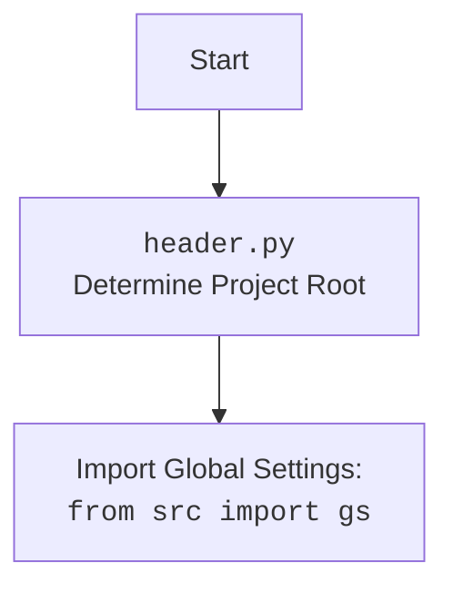

## ИНСТРУКЦИЯ:

Анализируй предоставленный код подробно и объясни его функциональность. Ответ должен включать три раздела:

1.  **<алгоритм>**: Опиши рабочий процесс в виде пошаговой блок-схемы, включая примеры для каждого логического блока, и проиллюстрируй поток данных между функциями, классами или методами.
2.  **<mermaid>**: Напиши код для диаграммы в формате `mermaid`, проанализируй и объясни все зависимости,
    которые импортируются при создании диаграммы.
    **ВАЖНО!** Убедитесь, что все имена переменных, используемые в диаграмме `mermaid`,
    имеют осмысленные и описательные имена. Имена переменных вроде `A`, `B`, `C`, и т.д., не допускаются!

    **Дополнительно**: Если в коде есть импорт `import header`, добавьте блок `mermaid` flowchart, объясняющий `header.py`:
    ```mermaid
    flowchart TD
        Start --> Header[<code>header.py</code><br> Determine Project Root]

        Header --> import[Import Global Settings: <br><code>from src import gs</code>]
    ```

3.  **<объяснение>**: Предоставьте подробные объяснения:
    -   **Импорты**: Их назначение и взаимосвязь с другими пакетами `src.`.
    -   **Классы**: Их роль, атрибуты, методы и взаимодействие с другими компонентами проекта.
    -   **Функции**: Их аргументы, возвращаемые значения, назначение и примеры.
    -   **Переменные**: Их типы и использование.
    -   Выделите потенциальные ошибки или области для улучшения.

Дополнительно, постройте цепочку взаимосвязей с другими частями проекта (если применимо).

Это обеспечивает всесторонний и структурированный анализ кода.
## Формат ответа: `.md` (markdown)
**КОНЕЦ ИНСТРУКЦИИ**

```md
## <алгоритм>

1.  **Определение корневой директории проекта (`set_project_root`)**:
    *   Начало: Функция `set_project_root` вызывается без аргументов или с пользовательскими именами файлов-маркеров.
        *   Пример: `set_project_root()`
        *   Пример: `set_project_root(marker_files=('my_marker_file',))`
    *   Получение пути к текущему файлу: `Path(__file__).resolve().parent` определяет директорию, где находится текущий скрипт.
        *   Пример: Если скрипт находится в `/home/user/project/src/goog/spreadsheet/header.py`, то `current_path` будет равен `/home/user/project/src/goog/spreadsheet`.
    *   Инициализация `__root__`: Переменной `__root__` присваивается текущий путь.
    *   Поиск родительской директории: Перебираются директории от текущей до корневой.
        *   Пример: `current_path`, `/home/user/project/src/goog`, `/home/user/project/src`, `/home/user/project`, `/home/user` и т.д.
    *   Проверка наличия маркерных файлов: Для каждой родительской директории проверяется, существует ли в ней хотя бы один из маркерных файлов (`__root__` по умолчанию).
        *   Пример: Проверяется наличие `/home/user/project/src/goog/spreadsheet/__root__`, `/home/user/project/src/goog/__root__`, `/home/user/project/src/__root__`, `/home/user/project/__root__`, `/home/user/__root__` и т.д.
    *   Обновление `__root__`: Если маркерный файл найден, `__root__` обновляется до родительской директории, и цикл прекращается.
    *   Добавление `__root__` в `sys.path`: Если `__root__` не в `sys.path`, то `__root__` добавляется в начало.
        *   Пример: Если `__root__`  это  `/home/user/project` то,  путь  добавляется в  `sys.path`.
    *   Возврат `__root__`: Функция возвращает путь к корневой директории проекта.
2.  **Инициализация корневой директории**:
    *   Вызов `set_project_root` и присвоение результата переменной `__root__`.
        *   Пример: `__root__ = /home/user/project`
3.  **Загрузка настроек из `settings.json`**:
    *   Открытие файла: Попытка открыть `settings.json` из директории `src` относительно корневой папки.
        *   Пример: `/home/user/project/src/settings.json`
    *   Загрузка JSON: Если файл открыт успешно, JSON загружается в переменную `settings`.
    *   Обработка ошибок: Если файл не найден или JSON имеет неверный формат, `settings` остается `None`.
4.  **Чтение документации из `README.MD`**:
    *   Открытие файла: Попытка открыть `README.MD` из директории `src` относительно корневой папки.
        *   Пример: `/home/user/project/src/README.MD`
    *   Чтение файла: Если файл открыт успешно, его содержимое читается в переменную `doc_str`.
    *   Обработка ошибок: Если файл не найден или возникают проблемы при чтении, `doc_str` остается `None`.
5.  **Инициализация глобальных переменных**:
    *   `__project_name__`: Получает имя проекта из `settings` или устанавливается в `hypotez` по умолчанию.
    *   `__version__`: Получает версию проекта из `settings` или устанавливается в `''` по умолчанию.
    *   `__doc__`: Присваивается  значение  `doc_str`, если оно не `None` или  `''` по умолчанию.
    *   `__details__`: Присваивается значение `''` по умолчанию.
    *   `__author__`: Получает автора проекта из `settings` или устанавливается в `''` по умолчанию.
    *   `__copyright__`: Получает авторские права из `settings` или устанавливается в `''` по умолчанию.
    *   `__cofee__`:  Получает сообщение из `settings` или устанавливается в строку по умолчанию "Treat the developer to a cup of coffee for boosting enthusiasm in development: https://boosty.to/hypo69"
6. **Импорт глобальных настроек**:
    * Импорт `from src import gs`: Импортирует глобальные настройки проекта из `src/gs/__init__.py`

## <mermaid>
```mermaid
flowchart TD
    Start --> FindProjectRoot[set_project_root():<br>Find Project Root Directory]
    FindProjectRoot --> GetCurrentPath[Get Current File Path:<br>Path(__file__).resolve().parent]
    GetCurrentPath --> InitRoot[Initialize Root:<br>__root__ = current_path]
    InitRoot --> IterateParents[Iterate through Parent Directories]
    IterateParents -- Marker File Exists --> UpdateRoot[Update Root:<br>__root__ = parent]
    UpdateRoot --> StopIteration[Break Loop]
    IterateParents -- No Marker File --> NextParent[Check Next Parent Directory]
    NextParent -- All Parents Checked --> CheckRootInPath[Check If __root__ In sys.path]
    CheckRootInPath -- __root__ Not In sys.path --> AddRootToPath[Add __root__ to sys.path]
    AddRootToPath --> ReturnRoot[Return __root__]
    CheckRootInPath -- __root__ In sys.path --> ReturnRoot[Return __root__]
    ReturnRoot --> SetGlobalRoot[Set global variable:<br> __root__ = set_project_root()]
    SetGlobalRoot --> ImportGlobalSettings[Import Global Settings:<br><code>from src import gs</code>]
    ImportGlobalSettings --> LoadSettings[Load settings from:<br> src/settings.json]
    LoadSettings --> LoadDoc[Load documentation from:<br> src/README.MD]
    LoadSettings -- Error --> LoadDoc
    LoadDoc --> InitProjectName[Initialize Project Name:<br>__project_name__]
    LoadDoc -- Error --> InitProjectName
    InitProjectName --> InitVersion[Initialize Version:<br>__version__]
    InitVersion --> InitDocString[Initialize Documentation:<br>__doc__]
     InitDocString --> InitDetails[Initialize Details:<br>__details__]
    InitDetails --> InitAuthor[Initialize Author:<br>__author__]
    InitAuthor --> InitCopyright[Initialize Copyright:<br>__copyright__]
    InitCopyright --> InitCoffee[Initialize Coffee:<br>__cofee__]
    InitCoffee --> End[End]

    style FindProjectRoot fill:#f9f,stroke:#333,stroke-width:2px
    style SetGlobalRoot fill:#ccf,stroke:#333,stroke-width:2px
    style ImportGlobalSettings fill:#ccf,stroke:#333,stroke-width:2px
```

## <объяснение>

### Импорты:

*   `sys`: Предоставляет доступ к некоторым переменным и функциям, взаимодействующим с интерпретатором Python. В данном коде используется для добавления пути к корневой директории проекта в `sys.path`, что позволяет импортировать модули из проекта без указания их полного пути.
*   `json`: Используется для работы с данными в формате JSON. В данном коде применяется для загрузки настроек проекта из файла `settings.json`.
*    `packaging.version.Version`:  Используется для  работы с версиями, но в данном коде не применяется.
*   `pathlib.Path`: Предоставляет объектно-ориентированный способ работы с путями к файлам и директориям. Позволяет работать с путями как с объектами, что делает код более читаемым и кроссплатформенным.

### Функции:

*   `set_project_root(marker_files=('__root__')) -> Path`:
    *   **Аргументы**:
        *   `marker_files` (tuple): Кортеж с именами файлов или директорий, которые будут использоваться для поиска корневой директории. Значение по умолчанию `('__root__')`.
    *   **Возвращаемое значение**:
        *   `Path`: Объект `pathlib.Path`, представляющий корневую директорию проекта. Если маркерные файлы не найдены, возвращает директорию, где находится скрипт.
    *   **Назначение**:
        *   Эта функция определяет корневую директорию проекта, поднимаясь вверх по дереву директорий от текущего файла, до тех пор пока не найдет директорию, содержащую один из маркерных файлов. Затем она добавляет этот путь к `sys.path`, чтобы модули проекта могли быть импортированы.
    *   **Примеры:**
        *   `set_project_root()`: Ищет маркерный файл `__root__`.
        *   `set_project_root(marker_files=('my_marker', '.git'))`: Ищет файлы `my_marker` или `.git`
        *   Если проектная структура такова:
            ```
            project/
            ├── src/
            │   ├── goog/
            │   │   └── spreadsheet/
            │   │       └── header.py
            │   └── settings.json
            └── __root__
            ```
             Вызов  `set_project_root()`  вернет `Path('/.../project')`.

### Переменные:

*   `__root__` (Path): Глобальная переменная, хранящая путь к корневой директории проекта. Она инициализируется с помощью функции `set_project_root`.
*   `settings` (dict | None): Глобальная переменная, хранящая настройки проекта, загруженные из `settings.json`. Может быть `None`, если файл не найден или не удается загрузить JSON.
*    `doc_str` (str | None): Глобальная переменная, хранящая документацию проекта, загруженную из `README.MD`. Может быть `None`, если файл не найден или не удается прочитать.
*   `__project_name__` (str): Глобальная переменная, хранящая имя проекта, загруженное из `settings` или установленное в `'hypotez'` по умолчанию.
*   `__version__` (str): Глобальная переменная, хранящая версию проекта, загруженную из `settings` или установленную в `''` по умолчанию.
*   `__doc__` (str): Глобальная переменная, хранящая документацию проекта,  значение  `doc_str`, если оно не `None` или  `''` по умолчанию.
*    `__details__` (str): Глобальная переменная, хранящая детали проекта установленная в `''` по умолчанию.
*   `__author__` (str): Глобальная переменная, хранящая имя автора проекта, загруженное из `settings` или установленное в `''` по умолчанию.
*   `__copyright__` (str): Глобальная переменная, хранящая информацию об авторских правах, загруженное из `settings` или установленное в `''` по умолчанию.
*   `__cofee__` (str): Глобальная переменная, хранящая сообщение для поддержки разработчика, загруженное из `settings` или установленное в "Treat the developer to a cup of coffee for boosting enthusiasm in development: https://boosty.to/hypo69" по умолчанию.

### Связи с другими частями проекта:

*   **`src`**:  `import gs` импортирует глобальные настройки проекта. Это означает, что данный файл зависит от структуры и содержания модуля `src/gs/__init__.py`.
*   **`settings.json`**: Файл конфигурации проекта, который используется для установки имени проекта, версии, имени автора,  копирайта  и сообщения для поддержки разработчика .
*    **`README.MD`**: Файл документации проекта, который используется для установки документации проекта.

### Потенциальные ошибки и области для улучшения:

*   **Обработка ошибок**: В текущем коде обработка ошибок при чтении `settings.json` и `README.MD` выполнена минимально (`...`). Желательно добавить более информативные сообщения об ошибках и возможностью использовать значения по умолчанию.
*   **Зависимость от файловой структуры**: Код полагается на то, что `settings.json` и `README.MD` находятся в директории `src` относительно корневой папки. Желательно добавить возможность конфигурирования этих путей или использовать более надежный способ поиска этих файлов.
*   **Обработка версий**: Хотя `packaging.version` импортируется, он не используется в коде. Рекомендуется использовать его для проверки и сравнения версий.
*   **Логирование**:  Было бы полезно добавить логгирование  действий, таких как определение корневой директории, загрузка настроек и документации, что облегчит отладку и понимание работы приложения.

В целом, код выполняет важную функцию инициализации проекта, но его можно улучшить в плане обработки ошибок, конфигурируемости и общей надежности.
```