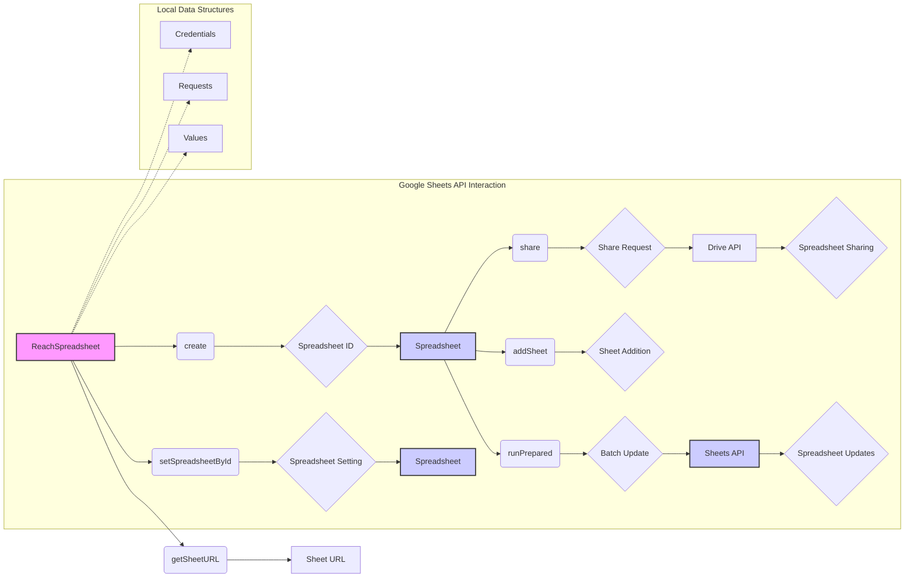

# <input code>

```python
## \file hypotez/src/goog/spreadsheet/reach_spreadsheet.py
# -*- coding: utf-8 -*-\
#! venv/Scripts/python.exe
#! venv/bin/python/python3.12

"""
.. module: src.goog.spreadsheet 
	:platform: Windows, Unix
	:synopsis:

"""
MODE = 'dev'


# Author: Ioann Volkov (volkov.ioann@gmail.com)
# This module uses Google Sheets API v4 (and Google Drive API v3 for sharing spreadsheets)

# (!) Disclaimer
# This is NOT a full-functional wrapper over Sheets API v4.
# This module was created just for https://telegram.me/TimeManagementBot and habrahabr article


import httplib2
import googleapiclient.discovery
import googleapiclient.errors
from oauth2client.service_account import ServiceAccountCredentials

import tempfile
import header
from src import gs
from src.utils.jjson import j_loads_ns, j_dumps
from src.utils.printer import pprint
from src.logger import logger

def htmlColorToJSON(htmlColor):
    if htmlColor.startswith("#"):
        htmlColor = htmlColor[1:]
    return {"red": int(htmlColor[0:2], 16) / 255.0, "green": int(htmlColor[2:4], 16) / 255.0, "blue": int(htmlColor[4:6], 16) / 255.0}

class SpreadsheetError(Exception):
    ...

class SpreadsheetNotSetError(SpreadsheetError):
    ...

class SheetNotSetError(SpreadsheetError):
    ...

class ReachSpreadsheet:
    def __init__(self, debugMode = False):
        # ... (Initialization logic)
        pass

    # ... (Other methods)
    pass

# === Tests for class Spreadsheet ===
# ... (Test functions)
pass

def create_pricelist(docTitle,sheetTitle,values:list):
    # ... (Function to create a pricelist spreadsheet)
    pass

# This function creates a spreadsheet as https://telegram.me/TimeManagementBot can create, but with manually specified data
def testCreateTimeManagementReport():
    # ... (Function to create a Time Management report spreadsheet)
    pass


if __name__ == "__main__":
    # ... (Main execution block)
    pass
```

# <algorithm>

(Flowchart would be too large and complex to represent here in markdown.  It would involve many steps, including:

1. **Initialization:**  `ReachSpreadsheet` object creation, loading credentials, building Google Sheets and Drive services.
2. **Spreadsheet Creation:**  Calling `create()` with title, sheet title, dimensions to build a new Google Sheet.
3. **Spreadsheet Sharing:** Calling `share` to make the spreadsheet sharable (with various options).
4. **Spreadsheet Setting by ID:** Calling `setSpreadsheetById` to set the current spreadsheet to work with.
5. **Sheet Addition:** Calling `addSheet` to create new sheets.
6. **Dimension Setting:**  Using `prepare_setColumnWidth`, `prepare_setRowHeight` to set properties like column width or row height.
7. **Data Preparation:** `prepare_setValues` preps data to update sheet with provided data.
8. **Formatting:** `prepare_setCellStringFormatterormat` formats cells using various options.
9. **Data Updating:** Calling `runPrepared` to update the spreadsheet with the prepared requests and values.
10. **Getting URL:** Calling `getSheetURL` to obtain the URL of the spreadsheet to be shared.

Data flows between methods, classes, and functions by passing arguments and returning values.  `ReachSpreadsheet` maintains internal state like `spreadsheetId`, `sheetId`, `requests`, and `valueRanges` to manage the spreadsheet and its operations.)


# <mermaid>



# <explanation>

**Импорты:**

* `httplib2`, `googleapiclient.discovery`, `googleapiclient.errors`: Библиотеки для работы с Google API, предоставляющие средства для взаимодействия с Google Sheets и Google Drive.
* `oauth2client.service_account`: Модуль для аутентификации, использующий учетные записи сервисных аккаунтов Google.
* `tempfile`, `header`, `gs`, `j_loads_ns`, `j_dumps`, `pprint`, `logger`:  Эти импорты призваны обеспечивать общие функции проекта (обработка временных файлов, заголовок, работу с файловой системой, JSON, вывод и логирование соответственно).  Их точное назначение и связь с другими частями кода не ясны без доступа к `src`-пакетам.

**Классы:**

* `SpreadsheetError`, `SpreadsheetNotSetError`, `SheetNotSetError`:  Иерархия исключений, позволяющая ловить и обрабатывать ошибки, связанные с настройкой и использованием Google Spreadsheet.
* `ReachSpreadsheet`:  Основной класс для взаимодействия с Google Spreadsheets.
    * `__init__(self, debugMode=False)`: Инициализирует объект, загружает credentials из файла, авторизуется и строит необходимые API-объекты.  Включает в себя возможность дебага (`debugMode`).
    * `create(self, title, sheetTitle, rows=1000, cols=26, locale='en-US', timeZone='Etc/GMT')`: Создает новый Google Spreadsheet с заданными свойствами (название, название листа, количество строк и столбцов).
    * `share(self, shareRequestBody)`: Общий метод для добавления разрешений.
    * `shareWithEmailForReading/Writing`, `shareWithAnybodyForReading/Writing`: Методы для установки разрешений чтения и записи для определенных email адресов и для всех соответственно.
    * `getSheetURL(self)`: Возвращает URL для доступа к листу.
    * `setSpreadsheetById(self, spreadsheetId)`: Устанавливает текущий Spreadsheet по идентификатору.
    * `runPrepared(self, valueInputOption="USER_ENTERED")`: Метод для выполнения подготовленных операций в Google Sheets, например, добавление листов или обновление данных.
    * `prepare_addSheet(self, sheetTitle, rows=1000, cols=26)`: Подготавливает запрос для добавления нового листа.
    * `addSheet(self, sheetTitle, rows=1000, cols=26)`:  Добавляет лист и устанавливает его текущим.
    * `toGridRange(self, cellsRange)`: Преобразует строковое представление диапазона ячеек в словарь с соответствующими параметрами для API.
    * `prepare_setDimensionPixelSize`, `prepare_setColumnsWidth`, `prepare_setColumnWidth`, `prepare_setRowsHeight`, `prepare_setRowHeight`: Методы для подготовки запросов на изменение размеров столбцов и строк.
    * `prepare_setValues(self, cellsRange, values, majorDimension="ROWS")`: Подготавливает запрос на обновление значений в ячейках.
    * `prepare_mergeCells`: Подготавливает запрос на объединение ячеек.
    * `prepare_setCellStringFormatterormat`, `prepare_setCellStringFormatterormats`: Подготавливает запросы на форматирование текста, цветов и др.

**Функции:**

* `htmlColorToJSON(htmlColor)`: Преобразует HTML-цвет в JSON-объект для представления цвета в формате RGB.

**Переменные:**

* `MODE`, `GOOGLE_CREDENTIALS_FILE`: Константные переменные.  `GOOGLE_CREDENTIALS_FILE` - имя файла с ключами API, которое не используется в данном фрагменте кода.
* `credentials`, `httpAuth`, `service`:  Объекты, используемые для взаимодействия с Google Sheets API.


**Возможные ошибки и улучшения:**

* **Обработка ошибок:**  Код содержит `try...except` блоки для обработки ошибок при создании `credentials`, но обработка ошибок в других методах (например, `share`) неполная.
* **Проверка параметров:**  Не хватает проверки входных данных (например, `spreadsheetId` в методах) на корректность.
* **Упрощение логики:**  В некоторых методах (например, `toGridRange`) можно упростить логику преобразования диапазонов ячеек.
* **Документация:** Документация к методам была бы полезна.
* **Типизация:** Использование типов данных для аргументов и возвращаемых значений (например, через аннотации типов) могло бы улучшить читаемость и надежность кода.
* **Переменные состояния:** Обновление параметров `spreadsheetId`, `sheetId`, и `sheetTitle` в методах `create` и `setSpreadsheetById` должно быть общим, чтобы избежать проблем с состоянием.
* **`gs.path.tmp`:** Неизвестно, что это за объект. Нужна информация о `src.gs` для понимания контекста.
* **Отсутствие проверки существования листа:**  Функции `addSheet` и другие не проверяют существование листа с заданным названием. Если лист с таким названием уже есть, возникает ошибка.
* **`if __name__ == "__main__":`:** Основной блок (`if __name__ == "__main__":`) содержит различные тесты. Тесты должны быть организованы в отдельные модули, а не засорять основной файл кода.


**Взаимосвязи с другими частями проекта:**

Этот модуль ( `hypotez/src/goog/spreadsheet/reach_spreadsheet.py`) взаимодействует с `src.gs`, `src.utils.jjson`, `src.utils.printer`, `src.logger` для использования их функциональности, и, скорее всего, зависит от настроек аутентификации и локальных настроек. Без доступа к остальной части проекта нельзя полностью проследить все взаимосвязи.