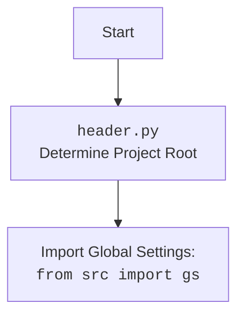

## <алгоритм>

1. **Инициализация `ReachSpreadsheet`**:
   - При создании объекта `ReachSpreadsheet` происходит загрузка учетных данных из JSON-файла (например, `e-cat-346312-137284f4419e.json`), расположенного во временной директории.
   - Создаются сервисы `sheets` и `drive` для взаимодействия с Google Sheets API и Google Drive API, используя авторизованный HTTP-клиент.
   - Инициализируются атрибуты `spreadsheetId`, `sheetId`, `sheetTitle`, `requests`, `valueRanges` для хранения данных о таблице и запросов.
   - Пример: `ss = ReachSpreadsheet(debugMode=True)`

2. **Создание новой таблицы `create(title, sheetTitle, rows, cols, locale, timeZone)`**:
   - Вызывает API для создания новой таблицы с указанным заголовком, свойствами листа, количеством строк и столбцов, локалью и временной зоной.
   - Полученный `spreadsheetId`, `sheetId` и `sheetTitle` сохраняются в атрибутах объекта.
   - Пример: `ss.create("My New Sheet", "Sheet1", 100, 20)`

3. **Управление доступом к таблице `share(shareRequestBody)`, `shareWithEmailForReading(email)`, `shareWithEmailForWriting(email)`, `shareWithAnybodyForReading()`, `shareWithAnybodyForWriting()`**:
   - Методы для настройки доступа к таблице, позволяющие делиться ею с конкретными пользователями (по email) или делать публично доступной для чтения или записи.
   - Для этого используется `driveService.permissions().create()`.
   - Пример: `ss.shareWithEmailForWriting("user@example.com")`

4. **Получение URL таблицы `getSheetURL()`**:
   - Возвращает URL для доступа к таблице по ее идентификаторам.
   - Пример: `url = ss.getSheetURL()`

5. **Установка текущей таблицы по ID `setSpreadsheetById(spreadsheetId)`**:
   - Позволяет задать текущую таблицу для работы по её ID, подгружая `sheetId` и `sheetTitle`.
   - Пример: `ss.setSpreadsheetById("1234567890abcdefgh")`

6. **Выполнение подготовленных запросов `runPrepared(valueInputOption)`**:
   - Отправляет накопленные запросы (из `requests` и `valueRanges`) к Google Sheets API.
   - Очищает списки запросов после выполнения.
   - Разделяет запросы на `batchUpdate` для форматирования и `batchUpdate.values` для данных.
   - Пример: `replies, responses = ss.runPrepared()`

7. **Подготовка запроса на добавление листа `prepare_addSheet(sheetTitle, rows, cols)`**:
   - Добавляет запрос на добавление нового листа в список `requests`.
   - Пример: `ss.prepare_addSheet("New Sheet", 50, 10)`

8. **Добавление листа `addSheet(sheetTitle, rows, cols)`**:
   - Добавляет новый лист и устанавливает его как текущий, возвращает `sheetId`.
   - Использует `runPrepared` для отправки запроса.
   - Пример: `new_sheet_id = ss.addSheet("Another Sheet")`

9. **Конвертация строкового диапазона в `GridRange` `toGridRange(cellsRange)`**:
   - Преобразует строковый диапазон (например, `"A3:B5"`) в формат `GridRange`, понятный Google Sheets API, для указания диапазона ячеек.
   - Пример: `grid_range = ss.toGridRange("C2:D4")`

10. **Подготовка запросов на изменение размеров колонок/строк `prepare_setDimensionPixelSize(dimension, startIndex, endIndex, pixelSize)`, `prepare_setColumnsWidth(startCol, endCol, width)`, `prepare_setColumnWidth(col, width)`, `prepare_setRowsHeight(startRow, endRow, height)`, `prepare_setRowHeight(row, height)`**:
    - Накапливают запросы на изменение размеров колонок или строк в список `requests`.
    - Пример: `ss.prepare_setColumnWidth(2, 120)`

11. **Подготовка запросов на установку значений ячеек `prepare_setValues(cellsRange, values, majorDimension)`**:
    -  Накапливает запросы на установку значений в ячейки в список `valueRanges`.
    - Пример: `ss.prepare_setValues("A1:B2", [[1, 2], [3, 4]])`

12. **Подготовка запросов на объединение ячеек `prepare_mergeCells(cellsRange, mergeType)`**:
    - Добавляет запрос на объединение ячеек в список `requests`.
    - Пример: `ss.prepare_mergeCells("A1:B1")`

13. **Подготовка запросов на форматирование ячеек `prepare_setCellStringFormatterormat(cellsRange, formatJSON, fields)`, `prepare_setCellStringFormatterormats(cellsRange, formatsJSON, fields)`**:
    - Накапливают запросы на форматирование ячеек (например, установка стиля текста или цвета фона) в список `requests`.
    - Пример: `ss.prepare_setCellStringFormatterormat("A1", {"textFormat": {"bold": True}})`.
    
14. **Тестовые функции**:
    - Содержат примеры использования класса `Spreadsheet` для создания таблиц, установки размеров колонок, применения форматов и т.д.

## <mermaid>

```mermaid
flowchart TD
    Start(Start) --> Init[Initialize ReachSpreadsheet];
    Init --> CreateCreds[Load Credentials from JSON];
    CreateCreds --> AuthHttp[Authorize HTTP client];
    AuthHttp --> CreateServices[Create Google Sheets and Drive services];
    CreateServices --> SetAttrs[Initialize spreadsheet attributes];
    
    SetAttrs --> CreateSpreadsheet{create()};
    CreateSpreadsheet -- Call API to Create Sheet --> UpdateAttrs[Update spreadsheet, sheet ID and title];
    UpdateAttrs --> ShareSheet{share()};
    ShareSheet -- Call API to Share Sheet--> GetSheetURL{getSheetURL()};
    GetSheetURL -- Returns Sheet URL --> SetSpreadsheet{setSpreadsheetById()};
    
    SetSpreadsheet -- Call API to Get Sheet --> UpdateAttrsAgain[Update spreadsheet, sheet ID and title];
    UpdateAttrsAgain --> RunPrepared{runPrepared()};
    RunPrepared -- Execute accumulated requests --> ClearReqs[Clear accumulated requests];
    
    ClearReqs --> PrepareAddSheet{prepare_addSheet()};
    PrepareAddSheet -- Add request to create a sheet --> AddSheet{addSheet()};
    AddSheet -- call prepare_addSheet, then runPrepared --> ReturnSheetId[Return sheet ID];
    
    ReturnSheetId --> ToGridRange{toGridRange()};
    ToGridRange -- Convert range to GridRange --> PrepareDimension{prepare_setDimensionPixelSize()};
    PrepareDimension -- Add request to set column/row dimensions --> PrepareColumnsWidth{prepare_setColumnsWidth()};
    PrepareColumnsWidth --> PrepareColumnWidth{prepare_setColumnWidth()};
     PrepareColumnWidth --> PrepareRowsHeight{prepare_setRowsHeight()};
     PrepareRowsHeight --> PrepareRowHeight{prepare_setRowHeight()};

    PrepareRowHeight --> PrepareValues{prepare_setValues()};
    PrepareValues -- Add request to set values --> PrepareMergeCells{prepare_mergeCells()};
     PrepareMergeCells -- Add request to merge cells --> PrepareCellFormat{prepare_setCellStringFormatterormat()};
     PrepareCellFormat --> PrepareCellFormats{prepare_setCellStringFormatterormats()};
     PrepareCellFormats --> End(End)

     
     
    
```



**Зависимости в `mermaid` диаграмме:**

-   Диаграмма отображает последовательность вызовов методов класса `ReachSpreadsheet`, начиная с инициализации и заканчивая форматированием ячеек.
-   Основные функции: создание таблицы, настройка доступа, получение URL, работа с листами, преобразование диапазонов, форматирование и установка значений.
-   Имена переменных соответствуют названиям методов и классов, делая диаграмму наглядной и понятной.

## <объяснение>

**Импорты:**

-   `httplib2`: Используется для создания HTTP-клиента, необходимого для взаимодействия с Google API.
-   `googleapiclient.discovery`: Позволяет создавать сервисные объекты для доступа к Google Sheets и Drive API.
-   `googleapiclient.errors`: Для обработки ошибок, возвращаемых Google API.
-   `oauth2client.service_account.ServiceAccountCredentials`: Используется для аутентификации с помощью сервисного аккаунта Google.
-   `tempfile`: Для работы с временными файлами.
-   `header`:  Модуль, определяющий корень проекта (см. `mermaid` блок выше).
-   `src.gs`:  Модуль глобальных настроек проекта, используемый для доступа к путям, учетным данным, и т.д.
-   `src.utils.jjson`:  Для работы с JSON-данными (сериализация и десериализация).
-   `src.utils.printer`:  Для форматированного вывода данных в консоль.
-    `src.logger.logger`: Для логирования ошибок и других событий.

**Классы:**

-   `SpreadsheetError`, `SpreadsheetNotSetError`, `SheetNotSetError`: Классы исключений для обработки ошибок, связанных с таблицами и листами.
-   `ReachSpreadsheet`:
    -   **Роль**: Основной класс для работы с Google Sheets API. Он инкапсулирует логику создания, редактирования и управления таблицами.
    -   **Атрибуты**:
        -   `debugMode`: Флаг для включения режима отладки с выводом отладочной информации.
        -   `credentials`: Учетные данные для доступа к API.
        -   `httpAuth`: Авторизованный HTTP-клиент.
        -   `service`: Сервисный объект для Google Sheets API.
        -   `driveService`: Сервисный объект для Google Drive API.
        -   `spreadsheetId`: ID текущей таблицы.
        -   `sheetId`: ID текущего листа.
        -   `sheetTitle`: Название текущего листа.
        -   `requests`: Список запросов для выполнения batchUpdate.
        -   `valueRanges`: Список диапазонов значений для выполнения batchUpdate.values.
    -   **Методы**:
        -   `__init__(debugMode)`: Конструктор класса, инициализирует учетные данные и сервисы.
        -   `create(title, sheetTitle, rows, cols, locale, timeZone)`: Создает новую таблицу.
        -   `share(shareRequestBody)`: Делится таблицей с пользователем или делает ее публичной.
        -   `shareWithEmailForReading(email)`: Делится таблицей с пользователем для чтения.
        -   `shareWithEmailForWriting(email)`: Делится таблицей с пользователем для записи.
        -   `shareWithAnybodyForReading()`: Делает таблицу публичной для чтения.
        -   `shareWithAnybodyForWriting()`: Делает таблицу публичной для записи.
        -   `getSheetURL()`: Возвращает URL таблицы.
        -   `setSpreadsheetById(spreadsheetId)`: Устанавливает текущую таблицу по её ID.
        -    `runPrepared(valueInputOption)`: Выполняет накопленные запросы.
        -   `prepare_addSheet(sheetTitle, rows, cols)`: Добавляет запрос на добавление листа.
        -   `addSheet(sheetTitle, rows, cols)`: Добавляет новый лист и устанавливает его текущим.
        -   `toGridRange(cellsRange)`: Преобразует строковый диапазон в `GridRange`.
        -   `prepare_setDimensionPixelSize(dimension, startIndex, endIndex, pixelSize)`: Добавляет запрос на изменение размеров колонок/строк.
        -   `prepare_setColumnsWidth(startCol, endCol, width)`: Устанавливает ширину нескольких колонок.
        -   `prepare_setColumnWidth(col, width)`: Устанавливает ширину одной колонки.
        -   `prepare_setRowsHeight(startRow, endRow, height)`: Устанавливает высоту нескольких строк.
        -   `prepare_setRowHeight(row, height)`: Устанавливает высоту одной строки.
        -   `prepare_setValues(cellsRange, values, majorDimension)`: Устанавливает значения ячеек.
        -   `prepare_mergeCells(cellsRange, mergeType)`: Объединяет ячейки.
        -   `prepare_setCellStringFormatterormat(cellsRange, formatJSON, fields)`: Форматирует ячейки (единичное применение).
        -   `prepare_setCellStringFormatterormats(cellsRange, formatsJSON, fields)`: Форматирует ячейки (массовое применение).

**Функции:**

-   `htmlColorToJSON(htmlColor)`: Преобразует HTML-цвет в формат JSON, необходимый для Google Sheets API.
    -   **Аргумент**: Строка HTML-цвета (например, "#FF0000").
    -   **Возвращает**: Словарь JSON с ключами `red`, `green`, `blue` (значения от 0 до 1).
    -   **Пример**: `htmlColorToJSON("#00FF00")` вернет `{'red': 0.0, 'green': 1.0, 'blue': 0.0}`.
-   Тестовые функции (`testCreateSpreadsheet`, `testSetSpreadsheet`, `testAddSheet`, `testSetDimensions`, `testGridRangeForStr`, `testSetCellStringFormatterormat`, `testPureBlackBorder`, `testUpdateCellStringFormatterieldsArg`, `testCreateTimeManagementReport`): Функции, предназначенные для тестирования функционала класса `Spreadsheet`.

**Переменные:**

-   `jsonKeyFileName`: Путь к JSON-файлу с ключом сервисного аккаунта.
-   `credentials`: Учетные данные сервисного аккаунта.
-   `httpAuth`: Авторизованный HTTP-клиент.
-   `service`: Сервис Google Sheets API.
-   `driveService`: Сервис Google Drive API.
-   `spreadsheetId`, `sheetId`, `sheetTitle`: Идентификаторы и название текущей таблицы и листа.
-   `requests`: Список запросов для batchUpdate API.
-   `valueRanges`: Список диапазонов значений для batchUpdate.values API.

**Потенциальные ошибки и области для улучшения:**

1.  **Обработка ошибок**: Хотя есть классы исключений, в коде мало мест, где эти исключения явно обрабатываются, особенно при обращении к API.
2.  **Расширение функциональности**: Класс `ReachSpreadsheet` можно расширить, добавив поддержку других методов API, например, для работы с фильтрами, диаграммами, условным форматированием и т.д.
3.  **Рефакторинг**: Некоторые методы могут быть разделены на более мелкие, чтобы улучшить читаемость и тестируемость.
4.  **Отсутствие валидации**: Нет валидации входных данных, например, проверка типа данных в `prepare_setValues` или корректности формата `cellsRange`.
5.  **Зависимость от `gs.path.tmp`**: Путь к файлу учетных данных является жестко закодированным и должен быть более гибким.
6.  **Логирование**: В тестах используется `print`, лучше использовать логгер для вывода информации.
7.  **Тесты**: Тесты являются демонстрационными, но не являются юнит-тестами.

**Взаимосвязи с другими частями проекта:**

-   Модуль использует `src.gs` для доступа к глобальным настройкам проекта и  временной директории.
-   Используется `src.utils.jjson` для работы с JSON данными и `src.utils.printer` для форматированного вывода.
-   Использует `src.logger.logger` для логирования.
-   Зависит от `header.py` для определения корня проекта.

Этот подробный анализ обеспечивает полное понимание кода, его функциональности, зависимостей и потенциальных областей для улучшения.