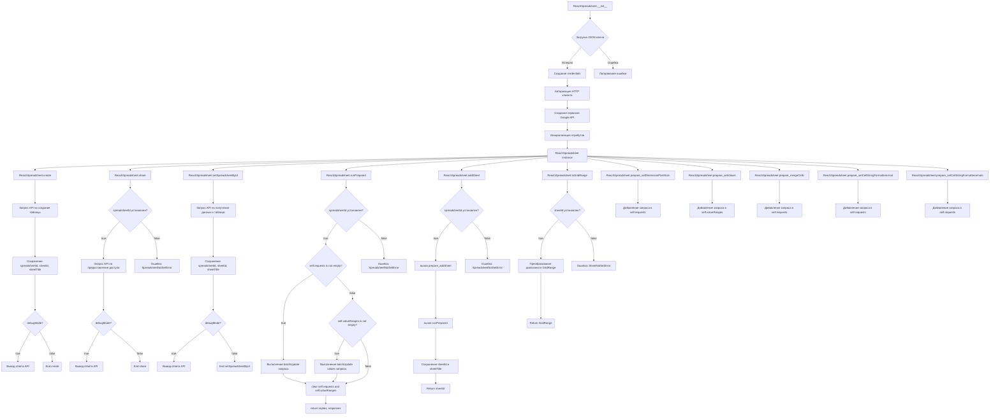

## Анализ кода `hypotez/src/goog/spreadsheet/reach_spreadsheet.py`

### <алгоритм>

1. **Инициализация (класс `ReachSpreadsheet`, метод `__init__`)**:
   -  Принимает параметр `debugMode` (по умолчанию `False`).
   -  Пытается загрузить данные для аутентификации из JSON файла `e-cat-346312-137284f4419e.json`, расположенного во временном каталоге.
        -  Если загрузка успешна, создает объект `ServiceAccountCredentials`.
        -  В случае ошибки, логирует ее и завершает работу.
   -  Создает авторизованный HTTP клиент (`httplib2.Http`).
   -  Инициализирует сервисы Google Sheets API v4 и Google Drive API v3.
   -  Устанавливает начальные значения атрибутов: `spreadsheetId`, `sheetId`, `sheetTitle` равными `None`, а `requests` и `valueRanges` пустыми списками.
     
   *Пример:*
    ```python
    ss = ReachSpreadsheet(debugMode=True)
    # загружаются credentials, создаются сервисы API, переменные инициализируются
    ```

2. **Создание электронной таблицы (метод `create`)**:
   -  Принимает `title` (название таблицы), `sheetTitle` (название листа), количество строк `rows` и столбцов `cols`, `locale` и `timeZone` (опционально).
   -  Отправляет запрос в Google Sheets API для создания таблицы.
   -  Сохраняет `spreadsheetId`, `sheetId` и `sheetTitle` из ответа.
   - Если `debugMode` включен, выводит ответ API в консоль.

   *Пример:*
    ```python
    ss.create("My Spreadsheet", "Sheet1", rows=50, cols=10)
    # создается электронная таблица с названием "My Spreadsheet" и листом "Sheet1"
    # spreadsheetId, sheetId, sheetTitle устанавливаются в соответствии с ответом API
    ```
3. **Совместный доступ (метод `share`)**:
   -  Принимает `shareRequestBody` (словарь с параметрами общего доступа).
   -  Проверяет, установлен ли `spreadsheetId`.
   -  Отправляет запрос в Google Drive API для предоставления общего доступа к таблице.
   -  Если `debugMode` включен, выводит ответ API в консоль.
     
     *Пример:*
    ```python
    ss.share({'type': 'user', 'role': 'reader', 'emailAddress': 'user@example.com'})
    # предоставляется доступ на чтение пользователю с почтой user@example.com
    ```
   
4. **Установка электронной таблицы по ID (метод `setSpreadsheetById`)**:
   -  Принимает `spreadsheetId`.
   -  Запрашивает информацию о таблице из Google Sheets API.
   -  Сохраняет `spreadsheetId`, `sheetId` и `sheetTitle` из ответа.
   -  Если `debugMode` включен, выводит ответ API в консоль.
    
     *Пример:*
     ```python
    ss.setSpreadsheetById("1234567890abcdefgh")
    # устанавливается текущая электронная таблица по ID, sheetId и sheetTitle обновляются
    ```
   
5. **Выполнение подготовленных запросов (метод `runPrepared`)**:
   -  Принимает `valueInputOption` (по умолчанию "USER_ENTERED").
   -  Проверяет, установлен ли `spreadsheetId`.
   -  Выполняет пакетный запрос `batchUpdate` в Google Sheets API для обновления таблицы, если есть подготовленные запросы в `self.requests`.
   -  Выполняет пакетный запрос `batchUpdate` значений в Google Sheets API, если есть подготовленные данные в `self.valueRanges`.
   -  Очищает списки `requests` и `valueRanges`.
   -  Возвращает ответы от API.
   
     *Пример:*
    ```python
    ss.prepare_setColumnWidth(0, 100)
    ss.prepare_setValues("A1:B2", [[1, 2], [3, 4]])
    replies, responses = ss.runPrepared()
    # выполняются запросы на изменение ширины столбца и запись значений
    ```
   
6. **Подготовка к добавлению листа (метод `prepare_addSheet`)**:
   -  Принимает `sheetTitle`, количество строк `rows` и столбцов `cols`.
   -  Добавляет запрос на добавление нового листа в `self.requests`.
     
    *Пример:*
    ```python
    ss.prepare_addSheet("Sheet2", rows=100, cols=20)
    # запрос на добавление листа "Sheet2" в список requests
    ```
   
7. **Добавление листа (метод `addSheet`)**:
   -  Принимает `sheetTitle`, количество строк `rows` и столбцов `cols`.
   -  Проверяет, установлен ли `spreadsheetId`.
   -  Подготавливает запрос на добавление листа, используя `prepare_addSheet`.
   -  Выполняет подготовленные запросы, используя `runPrepared`.
   -  Сохраняет `sheetId` и `sheetTitle` нового листа.
   -  Возвращает `sheetId` нового листа.
     
     *Пример:*
    ```python
    new_sheet_id = ss.addSheet("Sheet3")
    # добавляется лист "Sheet3", sheetId и sheetTitle устанавливаются
    ```

8. **Преобразование диапазона ячеек в GridRange (метод `toGridRange`)**:
   -  Принимает строковый диапазон ячеек (`cellsRange`), например, "A3:B4" или "A5:B".
   -  Преобразует строковый диапазон в словарь `GridRange`, содержащий `sheetId`, `startRowIndex`, `endRowIndex`, `startColumnIndex`, `endColumnIndex`.
   -  Возвращает словарь с параметрами диапазона.
   
     *Пример:*
    ```python
    grid_range = ss.toGridRange("B2:D5")
    # преобразует "B2:D5" в словарь GridRange с учетом текущего sheetId
    ```

9. **Подготовка к изменению размеров (методы `prepare_setDimensionPixelSize`, `prepare_setColumnsWidth`, `prepare_setColumnWidth`, `prepare_setRowsHeight`, `prepare_setRowHeight`)**:
    - Принимают параметры для изменения размеров строк или столбцов.
    -  Добавляют запрос на обновление размеров в `self.requests`.

10. **Подготовка к установке значений (метод `prepare_setValues`)**:
   -  Принимает `cellsRange` (строковый диапазон), `values` (список списков со значениями), `majorDimension` (по умолчанию "ROWS").
   -  Добавляет запрос на обновление значений в `self.valueRanges`.

11. **Подготовка к объединению ячеек (метод `prepare_mergeCells`)**:
   -  Принимает `cellsRange` и `mergeType` (по умолчанию "MERGE_ALL").
   -  Добавляет запрос на объединение ячеек в `self.requests`.

12. **Подготовка к форматированию (методы `prepare_setCellStringFormatterormat`, `prepare_setCellStringFormatterormats`)**:
   -  Принимают параметры для форматирования ячеек.
   -  Добавляют соответствующие запросы в `self.requests`.

### <mermaid>

**Описание зависимостей `mermaid`:**

- **`ReachSpreadsheet` Instance:** Главный объект, который координирует все действия.
- **`ReachSpreadsheet.__init__`**: Метод инициализирует объект, включая создание учетных данных и сервисов API.
- **`ReachSpreadsheet.create`**: Метод создает новую электронную таблицу и устанавливает ее ID.
- **`ReachSpreadsheet.share`**: Метод предоставляет общий доступ к электронной таблице.
- **`ReachSpreadsheet.setSpreadsheetById`**: Метод устанавливает текущую электронную таблицу по ID.
- **`ReachSpreadsheet.runPrepared`**: Метод выполняет подготовленные запросы на обновление таблицы и значений.
- **`ReachSpreadsheet.addSheet`**: Метод добавляет новый лист в электронную таблицу и возвращает его ID.
- **`ReachSpreadsheet.toGridRange`**: Метод преобразует строковый диапазон ячеек в объект GridRange.
- **`ReachSpreadsheet.prepare_setDimensionPixelSize`**:  Метод для подготовки запросов на изменение размеров строк или столбцов.
- **`ReachSpreadsheet.prepare_setValues`**:  Метод для подготовки запросов на запись данных в ячейки.
- **`ReachSpreadsheet.prepare_mergeCells`**:  Метод для подготовки запросов на объединение ячеек.
- **`ReachSpreadsheet.prepare_setCellStringFormatterormat`**: Метод для подготовки запросов на форматирование ячеек.
- **`ReachSpreadsheet.prepare_setCellStringFormatterormats`**: Метод для подготовки запросов на форматирование нескольких ячеек.

### <объяснение>

**Импорты:**
- `httplib2`: HTTP клиент для выполнения запросов к Google API.
- `googleapiclient.discovery`:  Библиотека для динамического создания клиентов API на основе их спецификаций. Используется для создания сервисов Google Sheets API и Google Drive API.
- `googleapiclient.errors`: Содержит классы исключений, которые возникают при работе с Google API.
- `oauth2client.service_account`:  Библиотека для аутентификации с использованием сервисных аккаунтов Google.
- `tempfile`: Модуль для создания временных файлов и каталогов. В данном случае используется для определения пути к файлу с ключом JSON.
- `header`:  Предположительно, внутренний модуль проекта, содержащий информацию о заголовках файлов. (Не используется в коде, поэтому связь не ясна).
- `src`:  Пакет, к которому относится данный модуль.
- `src.gs`:  Модуль для работы с путями в проекте. Здесь используется для получения пути к файлу ключа JSON.
- `src.utils.jjson`: Модуль для работы с JSON, включает функции `j_loads_ns` и `j_dumps`. (Не используется в коде, поэтому связь не ясна).
- `src.utils.printer`: Модуль для печати с форматированием (pretty print).
- `src.logger.logger`:  Модуль для логирования ошибок и другой информации.

**Классы:**
- `SpreadsheetError`: Базовый класс для ошибок, связанных с работой со spreadsheet.
- `SpreadsheetNotSetError`: Исключение, возникающее при попытке выполнить операцию с spreadsheet, когда `spreadsheetId` не установлен.
- `SheetNotSetError`: Исключение, возникающее при попытке выполнить операцию с листом, когда `sheetId` не установлен.
- `ReachSpreadsheet`: Основной класс, предоставляющий интерфейс для работы с Google Sheets API.
   -  **Атрибуты:**
        - `debugMode`: Флаг для включения режима отладки (вывод ответов API в консоль).
        - `credentials`: Учетные данные для доступа к Google API.
        - `httpAuth`: Авторизованный HTTP клиент.
        - `service`: Клиент Google Sheets API v4.
        - `driveService`: Клиент Google Drive API v3.
        - `spreadsheetId`: ID текущего spreadsheet.
        - `sheetId`: ID текущего листа.
        - `sheetTitle`: Название текущего листа.
        - `requests`: Список подготовленных запросов для `spreadsheets.batchUpdate`.
        - `valueRanges`: Список подготовленных запросов для `spreadsheets.values.batchUpdate`.
   -  **Методы:**
        - `__init__(self, debugMode=False)`: Инициализирует объект, устанавливает учетные данные, создает сервисы API.
        - `create(self, title, sheetTitle, rows=1000, cols=26, locale='en-US', timeZone='Etc/GMT')`: Создает новый spreadsheet.
        - `share(self, shareRequestBody)`: Предоставляет общий доступ к spreadsheet.
        - `shareWithEmailForReading(self, email)`: Предоставляет доступ на чтение по email.
        - `shareWithEmailForWriting(self, email)`: Предоставляет доступ на запись по email.
        - `shareWithAnybodyForReading(self)`: Предоставляет доступ на чтение всем.
        - `shareWithAnybodyForWriting(self)`: Предоставляет доступ на запись всем.
        - `getSheetURL(self)`: Возвращает URL spreadsheet.
        - `setSpreadsheetById(self, spreadsheetId)`: Устанавливает текущий spreadsheet по ID.
        - `runPrepared(self, valueInputOption="USER_ENTERED")`: Выполняет подготовленные запросы и возвращает ответы.
        - `prepare_addSheet(self, sheetTitle, rows=1000, cols=26)`: Подготавливает запрос на добавление нового листа.
        - `addSheet(self, sheetTitle, rows=1000, cols=26)`: Добавляет новый лист и устанавливает его как текущий.
        - `toGridRange(self, cellsRange)`: Преобразует строковый диапазон ячеек в GridRange.
        - `prepare_setDimensionPixelSize(self, dimension, startIndex, endIndex, pixelSize)`:  Подготавливает запрос на изменение размеров строк/столбцов.
        - `prepare_setColumnsWidth(self, startCol, endCol, width)`: Устанавливает ширину для нескольких столбцов.
        - `prepare_setColumnWidth(self, col, width)`: Устанавливает ширину для одного столбца.
        - `prepare_setRowsHeight(self, startRow, endRow, height)`: Устанавливает высоту для нескольких строк.
        - `prepare_setRowHeight(self, row, height)`: Устанавливает высоту для одной строки.
        - `prepare_setValues(self, cellsRange, values, majorDimension="ROWS")`: Подготавливает запрос на установку значений.
        - `prepare_mergeCells(self, cellsRange, mergeType="MERGE_ALL")`: Подготавливает запрос на объединение ячеек.
        - `prepare_setCellStringFormatterormat(self, cellsRange, formatJSON, fields="userEnteredFormat")`: Подготавливает запрос на форматирование ячеек.
        - `prepare_setCellStringFormatterormats(self, cellsRange, formatsJSON, fields="userEnteredFormat")`: Подготавливает запрос на форматирование нескольких ячеек.

**Функции:**
- `htmlColorToJSON(htmlColor)`: Преобразует HTML цвет в JSON формат для Google API.
- `testCreateSpreadsheet()`: Функция для тестирования создания электронной таблицы.
- `testSetSpreadsheet()`: Функция для тестирования установки электронной таблицы по ID.
- `testAddSheet()`: Функция для тестирования добавления листа.
- `testSetDimensions()`: Функция для тестирования установки размеров столбцов и строк.
- `testGridRangeForStr()`: Функция для тестирования преобразования строковых диапазонов в `GridRange`.
- `testSetCellStringFormatterormat()`: Функция для тестирования установки формата ячеек.
- `testPureBlackBorder()`: Функция для тестирования установки границ.
- `testUpdateCellStringFormatterieldsArg()`: Функция для тестирования обновления формата ячеек с разными полями.
- `create_pricelist(docTitle, sheetTitle, values)`: Создает электронную таблицу с заданными данными прайс-листа.
- `testCreateTimeManagementReport()`: Функция для тестирования создания отчета по управлению временем.

**Переменные:**
- `MODE`: Устанавливает режим работы (в данном случае `'dev'`).
- `jsonKeyFileName`: Имя файла с JSON ключом для аутентификации.

**Потенциальные ошибки и области для улучшения:**
- **Обработка ошибок:** В некоторых местах обработка ошибок (`try...except Exception as ex: ... return`) может быть улучшена, например, добавлением конкретных типов исключений и более информативным логированием.
- **Неиспользуемые импорты:**  Импорты `header`, `src.utils.jjson` не используются в коде и могут быть удалены.
- **Дублирование кода:**  Код для создания сервисов `driveService` дублируется в методе `share` и может быть вынесен в отдельный метод или инициализацию класса.
- **Форматирование:** Некоторые части кода могут быть отформатированы для лучшей читаемости.
- **Тестирование:** Модуль содержит набор тестовых функций. Эти тесты могут быть улучшены путем создания более структурированных тестовых наборов с использованием фреймворков, таких как `pytest`.

**Взаимосвязь с другими частями проекта:**
-  Модуль `reach_spreadsheet.py` использует модули `gs` (для путей к файлам), `printer` (для отладочной печати) и `logger` (для логирования) из пакета `src`.
-  Модуль является частью подсистемы `goog` в проекте, что говорит о его взаимодействии с сервисами Google.
-  Модуль используется для создания и управления электронными таблицами Google Sheets, например, при создании отчета по управлению временем.

В целом, код предоставляет функциональный API для работы с Google Sheets, однако есть области для улучшения в части обработки ошибок, организации кода и тестирования.