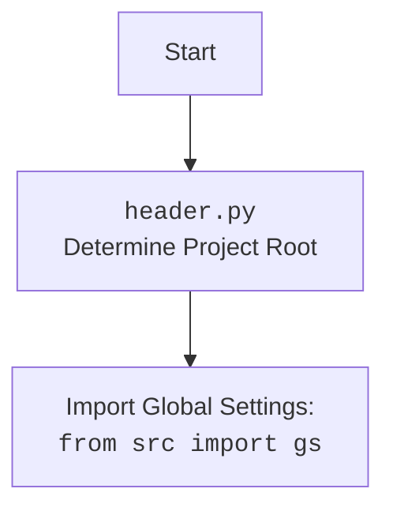

## <алгоритм>

1. **Инициализация `ReachSpreadsheet`**:
   - Создается экземпляр класса `ReachSpreadsheet`.
   - Загружаются учетные данные из JSON-файла ключа (`e-cat-346312-137284f4419e.json`).
   - Инициализируются сервисы Google Sheets API v4 и Google Drive API v3.
   - Устанавливаются атрибуты `spreadsheetId`, `sheetId`, `sheetTitle` в `None`.
   - Создаются пустые списки `requests` и `valueRanges` для хранения запросов на обновление.

2. **Создание новой таблицы (`create`)**:
   - Метод `create` принимает `title`, `sheetTitle`, `rows`, `cols`, `locale`, и `timeZone` в качестве аргументов.
     - Пример: `ss.create("My Spreadsheet", "Sheet1", 1000, 26, "en-US", "Etc/GMT")`
   - Создает новую таблицу с заданными параметрами используя `service.spreadsheets().create()`.
   - Если `debugMode` включен, выводит ответ API.
   - Сохраняет `spreadsheetId`, `sheetId`, и `sheetTitle` из ответа.

3. **Совместный доступ к таблице (`share`)**:
   - Метод `share` принимает словарь `shareRequestBody` с информацией о доступе.
   - Если `spreadsheetId` не установлен, выбрасывает `SpreadsheetNotSetError`.
   - Инициализирует `driveService`, если он `None`.
   - Создает разрешение с помощью `driveService.permissions().create()`.
   - Выводит ответ API, если `debugMode` включен.
     - Пример: `ss.share({'type': 'user', 'role': 'reader', 'emailAddress': 'user@example.com'})`

4. **Совместный доступ с определенным уровнем доступа (`shareWithEmailForReading`, `shareWithEmailForWriting`, `shareWithAnybodyForReading`, `shareWithAnybodyForWriting`)**:
   - Методы-обертки `shareWithEmailForReading` и `shareWithEmailForWriting`, принимающие электронный адрес и вызывающие `share` с соответствующими ролями `reader` или `writer`.
     - Пример: `ss.shareWithEmailForReading("user@example.com")`
   - Методы-обертки `shareWithAnybodyForReading` и `shareWithAnybodyForWriting` , вызывающие `share` с ролью  `reader` или `writer` для всех.
     - Пример: `ss.shareWithAnybodyForReading()`

5. **Получение URL таблицы (`getSheetURL`)**:
   - Если `spreadsheetId` или `sheetId` не установлены, выбрасывает соответствующие исключения.
   - Возвращает URL адрес текущей таблицы.
     - Пример: `ss.getSheetURL()`

6. **Установка текущей таблицы по ID (`setSpreadsheetById`)**:
   - Принимает `spreadsheetId` в качестве аргумента.
   - Получает информацию о таблице с помощью `service.spreadsheets().get()`.
   - Сохраняет `spreadsheetId`, `sheetId` и `sheetTitle` из ответа.
     - Пример: `ss.setSpreadsheetById('spreadsheet_id_from_google')`

7. **Выполнение подготовленных запросов (`runPrepared`)**:
   - Если `spreadsheetId` не установлен, выбрасывает `SpreadsheetNotSetError`.
   - Выполняет запросы на обновление (`requests`), если они есть.
   - Выполняет запросы на обновление значений (`valueRanges`), если они есть.
   - Очищает списки `requests` и `valueRanges` после выполнения.
   - Возвращает результаты `upd1Res` (обновление таблици) и `upd2Res` (обновление значений).

8. **Подготовка к добавлению листа (`prepare_addSheet`)**:
   - Добавляет запрос на добавление листа с заданным `sheetTitle`, `rows` и `cols` в список `requests`.
     - Пример: `ss.prepare_addSheet("New Sheet", 500, 26)`

9. **Добавление листа и установка его как текущего (`addSheet`)**:
   - Если `spreadsheetId` не установлен, выбрасывает `SpreadsheetNotSetError`.
   - Вызывает метод `prepare_addSheet` для подготовки запроса.
   - Вызывает `runPrepared`, чтобы выполнить запрос.
   - Устанавливает `sheetId` и `sheetTitle` нового листа.
   - Возвращает `sheetId` нового листа.

10. **Преобразование диапазона ячеек в `GridRange` (`toGridRange`)**:
    - Если `sheetId` не установлен, выбрасывает `SheetNotSetError`.
    - Принимает диапазон ячеек в строковом формате (например, "A1:B2").
    - Конвертирует строковый диапазон в `GridRange`, где индексы строк и столбцов начинаются с 0.
    - Возвращает словарь с параметрами `sheetId`, `startRowIndex`, `endRowIndex`, `startColumnIndex`, `endColumnIndex`.
        - Пример:  `ss.toGridRange("A3:B4")` вернет `{"sheetId": ss.sheetId, "startRowIndex": 2, "endRowIndex": 4, "startColumnIndex": 0, "endColumnIndex": 2}`

11. **Подготовка к изменению размера столбца/строки (`prepare_setDimensionPixelSize`)**:
    - Если `sheetId` не установлен, выбрасывает `SheetNotSetError`.
    - Добавляет запрос на изменение размера столбца/строки с заданными параметрами в `requests`.
      - Пример:  `ss.prepare_setDimensionPixelSize("COLUMNS", 0, 2, 100)`

12. **Подготовка к установке ширины столбца (`prepare_setColumnsWidth`, `prepare_setColumnWidth`)**:
    - Методы-обертки для `prepare_setDimensionPixelSize` для установки ширины одного или нескольких столбцов.
      - Пример:  `ss.prepare_setColumnWidth(0, 100)`

13. **Подготовка к установке высоты строки (`prepare_setRowsHeight`, `prepare_setRowHeight`)**:
    - Методы-обертки для `prepare_setDimensionPixelSize` для установки высоты одной или нескольких строк.
      - Пример:  `ss.prepare_setRowHeight(0, 100)`

14. **Подготовка к установке значений ячеек (`prepare_setValues`)**:
    - Если `sheetTitle` не установлен, выбрасывает `SheetNotSetError`.
    - Добавляет запрос на обновление значений ячеек с заданными `cellsRange` и `values` в список `valueRanges`.
      - Пример: `ss.prepare_setValues("A1:B2", [[1, 2], [3, 4]])`

15. **Подготовка к объединению ячеек (`prepare_mergeCells`)**:
    - Добавляет запрос на объединение ячеек в `requests`.
      - Пример: `ss.prepare_mergeCells("A1:B2")`

16. **Подготовка к установке форматирования ячейки (`prepare_setCellStringFormatterormat`)**:
    - Добавляет запрос на установку форматирования ячеек в `requests`.
       - Пример: `ss.prepare_setCellStringFormatterormat("A1", {"textFormat": {"bold": True}})`

17. **Подготовка к установке форматирования нескольких ячеек (`prepare_setCellStringFormatterormats`)**:
    - Добавляет запрос на установку форматирования нескольких ячеек в `requests`.
      - Пример: `ss.prepare_setCellStringFormatterormats("A1:B2", [[{"textFormat": {"bold": True}}, {"textFormat": {"italic": True}}]])`

## <mermaid>

```mermaid
flowchart TD
    classDef common fill:#f9f,stroke:#333,stroke-width:2px;
    classDef error fill:#fbb,stroke:#333,stroke-width:2px;
    classDef start fill:#ccf,stroke:#333,stroke-width:2px;
    classDef end fill:#cfc,stroke:#333,stroke-width:2px;
    
    Start(Начало)  :::start --> CreateObject(Создание экземпляра ReachSpreadsheet)
    
    CreateObject --> Auth(Авторизация и создание сервисов Google API)
    
    Auth --> LoadCredentials(Загрузка учетных данных из JSON)
    
    LoadCredentials -- Error --> ErrorHandler(Обработка ошибок) :::error
    LoadCredentials -- Success --> CreateServices(Создание сервисов google sheets и drive API)
    CreateServices --> InitVars(Инициализация переменных)

    InitVars --> CreateSpreadsheet(Создание таблицы <br> (create))
    CreateSpreadsheet -- Success --> SetSpreadsheetId(Сохранение ID таблицы)
    SetSpreadsheetId --> ShareSpreadsheet(Установка прав доступа  <br> (shareWith*))
    ShareSpreadsheet --> GetSheetURL(Получение URL таблицы  <br> (getSheetURL))
    
    
    GetSheetURL --> SetSpreadsheetByID(Установка таблицы по ID  <br> (setSpreadsheetById))
    SetSpreadsheetByID --> PrepareRequests(Подготовка запросов <br> (prepare_*))
    PrepareRequests --> RunPrepared(Выполнение подготовленных запросов  <br> (runPrepared))

    RunPrepared --> ToGridRange(Преобразование диапазона <br> (toGridRange))
    ToGridRange --> PrepareCellFormats(Установка форматов ячеек <br>(prepare_setCellStringFormatterormat*, prepare_mergeCells))
    PrepareCellFormats --> PrepareValues(Установка значений <br> (prepare_setValues))

    
    
    RunPrepared -- Success --> End(Конец) :::end
    RunPrepared -- Error --> ErrorHandler :::error
    CreateSpreadsheet -- Error --> ErrorHandler :::error
    SetSpreadsheetByID -- Error --> ErrorHandler :::error
    GetSheetURL -- Error --> ErrorHandler :::error
    ShareSpreadsheet -- Error --> ErrorHandler :::error
    
     ErrorHandler --> End :::end

    class Start, End start
```



**Зависимости `mermaid`:**

1.  **`ReachSpreadsheet`:** Основной класс, который управляет взаимодействием с Google Sheets API.
2.  **`ServiceAccountCredentials`:** Класс из библиотеки `oauth2client` для аутентификации с помощью сервисного аккаунта Google.
3.  **`httplib2`:** HTTP-клиент, используемый для запросов к Google API.
4.  **`googleapiclient.discovery`:** Инструмент для динамического построения клиентов Google API.
5.  **`googleapiclient.errors`:**  Содержит исключения для обработки ошибок Google API.
6.   **`header`:** Модуль для определения корневого каталога проекта.
7.  **`src.gs`:** Модуль глобальных настроек проекта.
8.  **`src.utils.jjson`:** Модуль для работы с JSON, включая сохранение настроек.
9.  **`src.utils.printer`:** Модуль для печати данных в удобном формате.
10. **`src.logger.logger`:** Модуль для логирования.

## <объяснение>

### Импорты:

-   `httplib2`: HTTP-клиент для выполнения HTTP-запросов к Google API.
-   `googleapiclient.discovery`: Используется для динамического построения клиентов Google API (Sheets API v4 и Drive API v3).
-   `googleapiclient.errors`: Содержит исключения для обработки ошибок Google API.
-   `oauth2client.service_account.ServiceAccountCredentials`: Используется для аутентификации с использованием ключа сервисного аккаунта Google.
-   `tempfile`:  Используется для работы с временными файлами (не используется в этом коде).
-   `header`: Модуль из `src` для определения корневой директории проекта и загрузки общих настроек (например, пути к файлу ключа Google API).
-   `src.gs`:  Модуль глобальных настроек проекта, который предоставляет доступ к различным путям и настройкам проекта.
-   `src.utils.jjson`:  Модуль для работы с JSON, используется для загрузки и сохранения конфигураций.
-   `src.utils.printer`:  Модуль для печати данных в удобном формате (pretty print).
-   `src.logger.logger`:  Модуль для логирования событий и ошибок.

### Классы:

1.  **`SpreadsheetError`**: Базовое исключение для ошибок, связанных с таблицами.
2.  **`SpreadsheetNotSetError`**: Исключение, выбрасываемое, когда ID таблицы не установлен.
3.  **`SheetNotSetError`**: Исключение, выбрасываемое, когда ID листа не установлен.
4.  **`ReachSpreadsheet`**: Основной класс для взаимодействия с Google Sheets API.
    -   **Атрибуты:**
        -   `debugMode`:  Флаг для включения режима отладки (вывод ответов API).
        -   `credentials`: Учетные данные сервисного аккаунта Google.
        -   `httpAuth`: Авторизованный HTTP-объект.
        -   `service`: Клиент Google Sheets API v4.
        -   `driveService`: Клиент Google Drive API v3.
        -   `spreadsheetId`: ID текущей таблицы.
        -   `sheetId`: ID текущего листа.
        -   `sheetTitle`: Название текущего листа.
        -   `requests`: Список запросов для пакетного обновления таблицы.
        -   `valueRanges`: Список диапазонов значений для пакетного обновления.
    -   **Методы:**
        -   `__init__(self, debugMode = False)`: Конструктор класса, инициализирует объект и устанавливает аутентификацию.
        -   `create(self, title, sheetTitle, rows = 1000, cols = 26, locale = \'en-US\', timeZone = \'Etc/GMT\')`: Создает новую таблицу.
        -   `share(self, shareRequestBody)`: Делится таблицей с пользователями или группами.
        -    `shareWithEmailForReading(self, email)`: Открывает доступ к таблице на чтение для указанной электронной почты.
        -   `shareWithEmailForWriting(self, email)`: Открывает доступ к таблице на запись для указанной электронной почты.
        -    `shareWithAnybodyForReading(self)`:  Открывает доступ к таблице на чтение для всех.
        -    `shareWithAnybodyForWriting(self)`:  Открывает доступ к таблице на запись для всех.
        -   `getSheetURL(self)`: Возвращает URL текущей таблицы.
        -   `setSpreadsheetById(self, spreadsheetId)`: Устанавливает текущую таблицу по ID.
        -   `runPrepared(self, valueInputOption = "USER_ENTERED")`: Выполняет подготовленные запросы на обновление.
        -   `prepare_addSheet(self, sheetTitle, rows = 1000, cols = 26)`: Подготавливает запрос на добавление листа.
        -   `addSheet(self, sheetTitle, rows = 1000, cols = 26)`: Добавляет новый лист и делает его текущим.
        -   `toGridRange(self, cellsRange)`: Конвертирует строковый диапазон в GridRange.
        -   `prepare_setDimensionPixelSize(self, dimension, startIndex, endIndex, pixelSize)`: Подготавливает запрос на изменение размера столбца/строки.
        -   `prepare_setColumnsWidth(self, startCol, endCol, width)`: Подготавливает запрос на установку ширины столбцов.
        -   `prepare_setColumnWidth(self, col, width)`: Подготавливает запрос на установку ширины одного столбца.
        -   `prepare_setRowsHeight(self, startRow, endRow, height)`: Подготавливает запрос на установку высоты строк.
        -   `prepare_setRowHeight(self, row, height)`: Подготавливает запрос на установку высоты одной строки.
        -   `prepare_setValues(self, cellsRange, values, majorDimension = "ROWS")`: Подготавливает запрос на установку значений ячеек.
        -   `prepare_mergeCells(self, cellsRange, mergeType = "MERGE_ALL")`: Подготавливает запрос на объединение ячеек.
        -   `prepare_setCellStringFormatterormat(self, cellsRange, formatJSON, fields = "userEnteredFormat")`: Подготавливает запрос на установку форматирования ячейки.
        -   `prepare_setCellStringFormatterormats(self, cellsRange, formatsJSON, fields = "userEnteredFormat")`: Подготавливает запрос на установку форматирования нескольких ячеек.

### Функции:

-   `htmlColorToJSON(htmlColor)`: Преобразует HTML-цвет в JSON-представление.
     -   **Пример:** `htmlColorToJSON("#FF0000")` вернет `{"red": 1.0, "green": 0.0, "blue": 0.0}`.
-   `testCreateSpreadsheet()`: Тестовая функция для создания таблицы.
-   `testSetSpreadsheet()`: Тестовая функция для установки текущей таблицы по ID.
-   `testAddSheet()`: Тестовая функция для добавления листа в таблицу.
-    `testSetDimensions()`: Тестовая функция для установки ширины колонок и высоты строк.
-    `testGridRangeForStr()`: Тестовая функция для преобразования диапазона ячеек в `GridRange`.
-    `testSetCellStringFormatterormat()`: Тестовая функция для установки формата ячеек.
-    `testPureBlackBorder()`: Тестовая функция для создания черных границ.
-   `testUpdateCellStringFormatterieldsArg()`: Тестовая функция для обновления форматирования ячеек с различными полями.
-   `create_pricelist(docTitle, sheetTitle, values: list)`: Функция для создания прайс-листа (не вызывается).
-   `testCreateTimeManagementReport()`: Функция для создания отчета по тайм-менеджменту (не вызывается).

### Переменные:

-   `jsonKeyFileName`: Путь к файлу JSON с ключом сервисного аккаунта Google.
-   `spreadsheetId`, `sheetId`, `sheetTitle`: ID и название текущей таблицы и листа (атрибуты класса `ReachSpreadsheet`).
-   `requests`, `valueRanges`: Списки для хранения запросов на обновление (атрибуты класса `ReachSpreadsheet`).
-   `debugMode`: Флаг для включения режима отладки (атрибут класса `ReachSpreadsheet`).

### Потенциальные ошибки и области для улучшения:

1.  **Обработка ошибок:**
    -   В коде используется `try...except` для обработки ошибок, но некоторые `except` блоки просто пропускают ошибку с `...` и `return`. Необходимо более корректно обрабатывать и логировать исключения.
    -   Исключения `SpreadsheetNotSetError` и `SheetNotSetError` выбрасываются, но их обработка может быть улучшена, например, путем возвращения пользователю более информативного сообщения об ошибке.
2.  **Управление ресурсами:**
    -   Клиенты Google API ( `service` и `driveService`) создаются в конструкторе класса и, если есть ошибка, не закрываются. Это может привести к утечке ресурсов.
3.  **Безопасность:**
    -   Файл JSON с ключом сервисного аккаунта ( `e-cat-346312-137284f4419e.json`) может быть скомпрометирован, если хранить его в открытом виде. Необходимо рассмотреть более безопасные способы хранения и аутентификации.
4.  **Тестирование:**
    -   Тестовые функции ( `testCreateSpreadsheet`,  `testAddSheet` и т.д.) используют жестко заданные ID таблиц. Это может быть не удобно, если требуется запускать тесты с разными таблицами.
    -   Тестовый код не использует pytest, рекомендуется переписать тесты с использованием pytest для более удобного тестирования.
5.  **Неиспользуемый код:**
     -   Часть кода (пример,  `create_pricelist` ) не вызывается. Нужно почистить неиспользуемый код.

### Взаимосвязь с другими частями проекта:

-   `header`: Обеспечивает определение корневой директории проекта и загрузку глобальных настроек.
-   `src.gs`:  Содержит пути к файлам, например `gs.path.tmp` , а также общие настройки проекта.
-   `src.utils.jjson`:  Используется для загрузки конфигурационных данных (возможно, для хранения настроек или учетных данных).
-   `src.utils.printer`: Используется для вывода в консоль отладочной информации в читаемом виде.
-   `src.logger.logger`:  Используется для логирования ошибок и событий.
-   **Цепочка:** `header` -> `src.gs` -> `src.utils.jjson` -> `src.utils.printer` -> `src.logger.logger` -> `reach_spreadsheet.py`

Этот анализ предоставляет всестороннее понимание функциональности, зависимостей и потенциальных улучшений в коде.