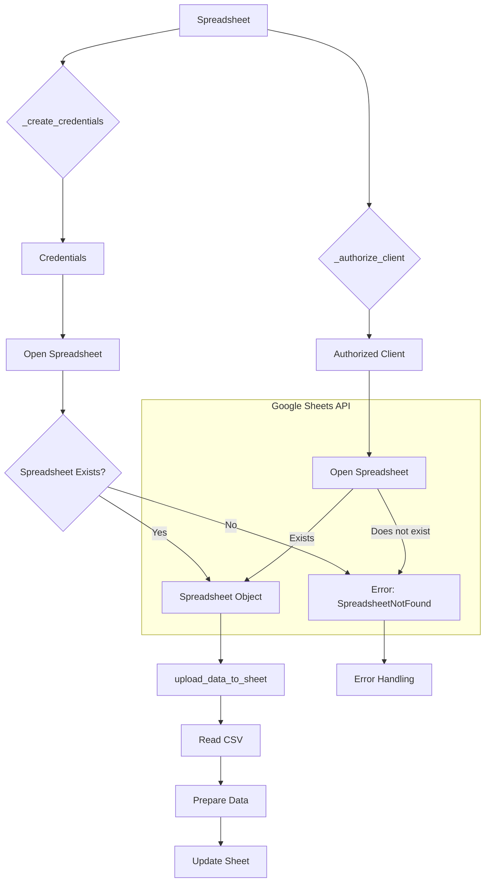

```MD
# <input code>

```python
## \file hypotez/src/goog/spreadsheet/spreadsheet.py
# -*- coding: utf-8 -*-\
#! venv/Scripts/python.exe
#! venv/bin/python/python3.12

"""
.. module:: src.goog.spreadsheet 
	:platform: Windows, Unix
	:synopsis: Minimal library for working with Google Sheets.

```python
# Example usage of the class
if __name__ == "__main__":
    from pathlib import Path

    data_file = Path(\'/mnt/data/google_extracted/your_data_file.csv\')  # Replace with actual data file
    sheet_name = \'Sheet1\'  # Replace with actual sheet name in Google Sheets

    # Create a new Spreadsheet if spreadsheet_id is not specified
    google_sheet_handler = SpreadSheet(
        spreadsheet_id=None,  # Specify None to create a new Spreadsheet
        sheet_name=sheet_name,
        spreadsheet_name=\'My New Spreadsheet\'  # Name of the new Spreadsheet if spreadsheet_id is not specified
    )
    google_sheet_handler.upload_data_to_sheet()
```
"""
MODE = 'dev'


from pathlib import Path
import gspread
from gspread import Spreadsheet, Worksheet
from oauth2client.service_account import ServiceAccountCredentials
import pandas as pd
from src.logger import logger
from src import gs
from src.utils.printer import pprint


class SpreadSheet:
    """ Class for working with Google Sheets.

    This class provides basic methods for accessing the Google Sheets API, creating and managing spreadsheets,
    and uploading data from a CSV file to Google Sheets.
    """

    # Path to the credentials file for accessing Google Sheets.
    #creds_file = gs.path.root / 'secrets' / 'hypo69-c32c8736ca62.json'

    """ оригинал файла хранится в базе данных вместе с паролями
    @todo организовать копирование файла в прогамно созаданом `tmp`,чтобы не хранить файл в физической директории
    """


    spreadsheet_id: str | None
    spreadsheet_name: str | None
    spreadsheet: Spreadsheet
    data_file: Path
    sheet_name: str
    credentials: ServiceAccountCredentials
    client: gspread.Client
    worksheet: Worksheet
    create_sheet: bool

    def __init__(self, 
                 spreadsheet_id: str, *args, **kwards):  # Name of the sheet in Google Sheets
        """ Initialize GoogleSheetHandler with specified credentials and data file.

        @param spreadsheet_id ID of the Google Sheets spreadsheet. Specify None to create a new Spreadsheet.
        @param spreadsheet_name Name of the new Spreadsheet if spreadsheet_id is not specified.
        @param sheet_name Name of the sheet in Google Sheets.
        """
        self.spreadsheet_id = spreadsheet_id
        self.credentials = self._create_credentials()
        self.client = self._authorize_client()

        try:
            self.spreadsheet = self.client.open_by_key(self.spreadsheet_id)
            #logger.debug(f"Opened existing spreadsheet with ID: {self.spreadsheet_id}")
        except gspread.exceptions.SpreadsheetNotFound:
            logger.error(f"Spreadsheet with ID '{self.spreadsheet_id}' does not exist.")
            raise


    # ... (rest of the code)
```

# <algorithm>

**Шаг 1: Инициализация SpreadSheet**
    - Принимает `spreadsheet_id`, `spreadsheet_name` и `sheet_name` в качестве аргументов.
    - Вызывает `_create_credentials()` для получения учетных данных.
    - Вызывает `_authorize_client()` для авторизации клиента Google Sheets.
    - Пытается открыть существующий лист по `spreadsheet_id` с помощью `client.open_by_key()`.
    - Если лист не найден, генерирует ошибку `SpreadsheetNotFound`.
    - Если лист найден, сохраняет его в `self.spreadsheet`.

**Шаг 2: `_create_credentials`**
    - Получает путь к файлу с учетными данными из `gs.path.secrets`.
    - Создает `ServiceAccountCredentials` на основе файла с учетными данными.
    - Возвращает созданные учетные данные.

**Шаг 3: `_authorize_client`**
    - Авторизует клиент Google Sheets с помощью созданных учетных данных.
    - Возвращает авторизованного клиента.

**Шаг 4: `upload_data_to_sheet`**
    - Проверяет, что `data_file` существует. Если нет, генерирует ошибку.
    - Читает данные из CSV-файла в Pandas DataFrame.
    - Преобразует данные в список списков для записи в Google Sheets.
    - Записывает данные в лист Google Sheets, начиная с ячейки A1.

**Пример данных:**
  - data_file: /mnt/data/google_extracted/your_data_file.csv
  - sheet_name: Sheet1
  - spreadsheet_id:  (пусто) - создается новый лист
  - data_file: содержит данные из csv:
     Col1,Col2
     1,2
     3,4

**Пример данных внутри кода:**
 - `data` - pandas DataFrame с содержимым csv.
 - `data_list` - список списков [["Col1", "Col2"], [1, 2], [3, 4]].


# <mermaid>



**Объяснение зависимости:**

- `gspread`:  Библиотека для работы с Google Sheets API.
- `oauth2client`: Для авторизации с использованием учетных данных сервисного аккаунта.
- `pandas`: Для работы с данными в формате CSV.
- `src.logger`: Вероятно, собственная логгирующая библиотека проекта.
- `src.utils.printer`:  Возможно, собственная утилита для красивого вывода данных.
- `src.gs`:  Вероятно, содержит конфигурационные данные, такие как пути к файлам с ключами доступа.

# <explanation>

**Импорты:**

- `pathlib`: для работы с путями к файлам.
- `gspread`: для работы с Google Sheets API.
- `gspread.Spreadsheet`, `gspread.Worksheet`:  классы для взаимодействия со списками и листами Google Sheets.
- `oauth2client.service_account`: для работы с учетными данными сервисного аккаунта Google.
- `pandas`: для работы с данными в формате CSV.
- `src.logger`: собственная логгирующая система.
- `src.gs`: вероятно содержит константы (например, пути к файлам) для доступа к API Google.
- `src.utils.printer`:  для вывода данных.

**Классы:**

- `SpreadSheet`:
    - `spreadsheet_id`, `spreadsheet_name`, `sheet_name`: атрибуты для хранения идентификатора и имени листа Google Sheets.
    - `credentials`: хранит учетные данные для доступа к API.
    - `client`: авторизованный клиент для взаимодействия с API.
    - `_create_credentials()`: создает объект `ServiceAccountCredentials` для доступа к Google Sheets.
    - `_authorize_client()`: авторизует `gspread` клиент с помощью учетных данных.
    - `get_worksheet()`:  получает лист по имени. Важно, что `create_if_not_present` (очевидно) отсутствует.
    - `upload_data_to_sheet()`: загружает данные из CSV в лист.
    - `__init__()`: инициализирует класс, загружает учетные данные и открывает лист Google Sheets.

**Функции:**

- `_create_credentials()`:  создает учетные данные доступа к Google Sheets.
- `_authorize_client()`: авторизует клиент для взаимодействия с API Google Sheets.
- `upload_data_to_sheet()`: загрузка данных в Google Sheets.  Важно, что используется pandas для чтения данных из CSV.

**Переменные:**

- `MODE`: вероятно, для настройки режима работы (например, 'dev' или 'prod').
- `data_file`: путь к файлу CSV.
- `sheet_name`: имя листа в Google Sheets.

**Возможные ошибки и улучшения:**

- Отсутствие обработки ошибок при чтении CSV-файла.
- Отсутствие проверки на существование файла.
- `create_worksheet()` - лучшее решение, т.к. позволяет создать лист с нужными размерностями.
- Обработка ошибок при открытии файла `e-cat-346312-137284f4419e.json`.
- Нет проверки на корректность данных в CSV-файле.
- Отсутствует функция проверки существования листа.
- Отсутствует обработка ошибок при обновлении листа.

**Взаимосвязь с другими частями проекта:**

- `gs.path`: Вероятно, содержит конфигурационные пути, такие как `secrets`.
- `src.logger`:  Для регистрации действий и ошибок.

Код выглядит достаточно хорошо структурированным и поддерживает минимальную функциональность. Достаточно добавить проверку существования файла и корректности данных, а также улучшить обработку ошибок.